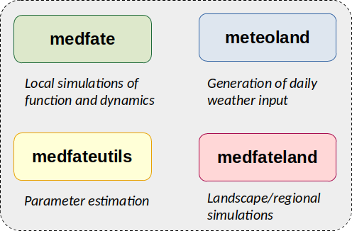
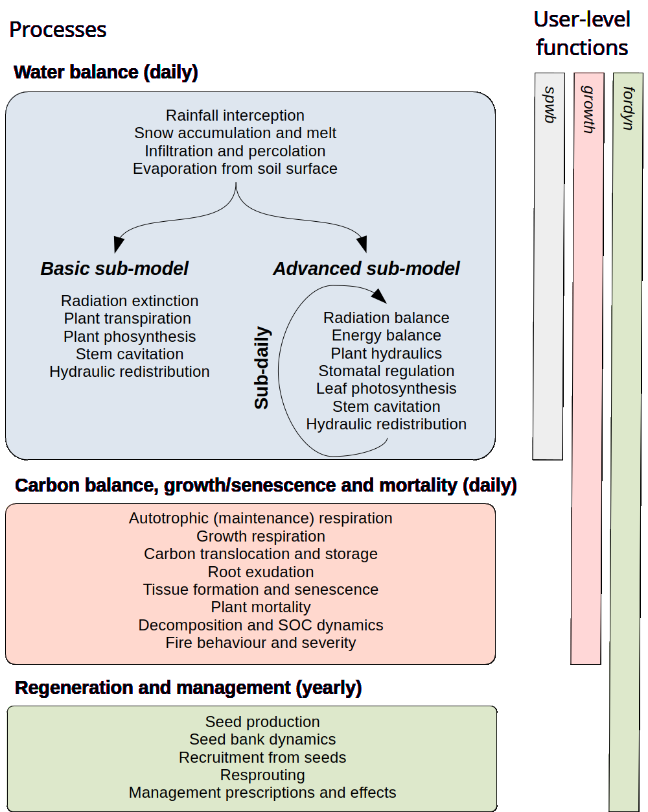

# (PART) Preliminaries {-}

# Introduction {#intro}

This chapter provides an overview of the purpose of developing the **medfate** an **medfateland** R packages, their main simulation functions and expected applications. 

## Purpose

Being able to anticipate the impact of global change on forest function and dynamics is one of the major environmental challenges in contemporary societies. However, uncertainties in the mechanisms underpinning forest function and practical constraints in how to integrate available information still hinder the availability of robust and reliable predictive models. Despite the amount of knowledge accumulated about the function and dynamics of forest ecosystems and the plethora of observations and modelling tools already available, further efforts are necessary to achieve the challenge of integrating different global change drivers into simulation frameworks useful for research and applications.

### Package medfate

The R package **medfate** has been designed as a platform to simulate the function and dynamics of individual forest stands at temporal scales from days to years. Climate is the main environmental driver forcing model predictions, and the ecological, biophysical, hydrological and physiological processes surrounding these are fundamental for the simulation models included in the package. In particular, the package allows the simulation of daily energy, water and carbon balances within forest stands. It also allows simulating the growth, mortality and regeneration processes of a set of woody plant cohorts competing for light and water within a forest stand. Finally, additional package functions allow relating the amount of plant biomass and the water status of plant live and dead tissues to fuel characteristics and, hence, fire hazard.

The version of the reference manual that you are reading is intended to reflect **version `r packageVersion("medfate")`** of the package.

### Package medfateland

The R package **medfateland** has been designed to extend the capabilities of **medfate** to a spatial context, most usually at the landscape or regional level. It allows running the stand-level models available in **medfate** on a set of spatial units (normally points or cells) within a target area. The package allows coordinating the dynamics of multiple stands via the evaluation of demand-based management scenarios. Additionally, the package allows considering lateral water transfer processes of forested watersheds. Hence, **medfateland** can also be used as a tool for eco-hydrological applications.   

The version of the reference manual that you are reading is intended to reflect **version `r packageVersion("medfateland")`** of the package.

### Companion packages

Packages **medfate** and **medfateland** are more easily used in conjunction with three other packages, called **meteoland**, **traits4models** and **forestables**. Package **meteoland** assists the estimation of weather variables over landscapes, whereas **traits4models** provides functions to assist the harmonization of plant trait data bases with the aim to create species parameter tables for simulation models, and **forestables** allows reading and harmonizing forest inventory data. Together the five R packages conform a modelling framework designed to help simulating the function and dynamics of forest ecosystems, with a particular focus on drought impacts under Mediterranean conditions (Fig. \@ref(fig:packages)). 

```{r packages, out.width='100%', fig.align="center", fig.cap="Set of packages conforming the medfate modelling framework. Black arrows indicate library requirements, whereas gray arrows indicate model parameter or data provision.", echo=FALSE}

```

Although **meteoland** and **forestables** are part of the forest modelling framework, they can be used independently for many other purposes. Similarly, package **traits4models** can be used to generate parameter inputs for other models or frameworks.

## Installation

### Requirements

Both **medfate** and **medfateland** have a user interface in R, but models have been coded in **C++ language**, and the resulting simulation functions are linked to R via the **Rcpp** package. This means that whenever installation is done from sources you will need a C++ compiler (i.e. Rtools in Windows). Note that compilers will always be a requirement when installing packages from GitHub. 

### Installing medfate

Package **medfate** can be found at [CRAN](https://CRAN.R-project.org/package=medfate), where it is updated every few months. Hence, it can be installed as any other R package using:
```{r eval=FALSE}
install.packages("medfate")
```

Users can also download and install the latest stable versions GitHub as follows (required package [**remotes**](https://CRAN.R-project.org/package=remotes) should be installed/updated first):

```{r installation, eval = FALSE}
remotes::install_github("emf-creaf/medfate")
```

Among other dependencies, installing **medfate** requires package **meteoland**, as it links to some of its C++ functions. Note that some package dependencies are only *suggested*, so that they are not automatically installed when installing **medfate**.

### Installing medfateland

Since both packages evolve together, installing **medfateland** normally requires an up-to-date version of **medfate**. The package **medfateland** is currently only available at GitHub, and can be installed using: 

```{r installation medfateland, eval = FALSE}
remotes::install_github("emf-creaf/medfateland")
```

Among other dependencies, installing **medfateland** requires packages **medfate** and **meteoland**, as it links to some of their C++ functions.

## Main functions in medfate

### Dynamic simulation functions

Dynamic simulation functions in **medfate** include three nested simulation levels (Fig. \@ref(fig:designmedfate)):

  1. Forest water and energy balance can be studied for a given forest stand using function `spwb()` (soil-plant-water-balance). The same function is used to run three different models (`Granier`, `Sperry` or `Sureau`), that correspond to two levels of complexity (*basic* or *advanced*; see Fig. \@ref(fig:designmedfate)). The user should choose one model or another depending on the intended application and data availability. Water balance simulations include hydrological processes (rainfall interception, soil infiltration, percolation and evapotranspiration) and plant physiological processes related to transpiration (hydraulics, photosynthesis and stomatal regulation). Most processes are implemented at the daily scale, although some operate at subdaily time steps for *advanced* models. Function `spwb()` has a closely related function `spwb_day()` that allows focusing on sub-daily processes. Finally, one can simulate plant physiological processes only, while having soil moisture as a prescribed dynamic input like weather, using function `pwb()` (plant-water-balance).
  2. Changes in primary (leaf area) and secondary (sapwood) growth are key to evaluate the influence of climatic conditions on plant and forest structure and function. Function `growth()` extends the previous models because it allows simulating carbon balance, tissue growth and mortality of a set of plant cohorts competing for light and water in a given forest stand. Analogously to the simulation of water balance, `growth()` has a closely related function `growth_day()` that allows focusing on sub-daily processes (i.e. carbon balance). 
  3. Finally, function `fordyn()` complements growth and mortality processes with recruitment (from seeds) and resprouting, thus completing the minimum set of demographic processes needed to simulate Mediterranean forest dynamics. The function splits the period to be simulated by years and makes internal calls to `growth()` for the simulation of growth and mortality. `fordyn()` is suited to simulate the inter-annual variation in forest structure and composition, while accounting for the biophysical and physiological processes provided by the former models. In addition, in allows simulating human interventions (i.e. tree or shrub cuts) on forest stands.
  
```{r designmedfate, out.width='100%', fig.align="center", fig.cap="Nested relationships between medfate simulation functions and processes included in each model", echo=FALSE}


```


### Sub-model functions

Many of the sub-models included in **medfate** are implemented as C++ functions and internally called by the simulation functions implementing top-level models. Most sub-models have, however, their corresponding R function to made them directly available to the user. This facilitates understanding the different sub-models and a more creative use of the package. However, most users will not normally use them in their simulation workflows. Sub-model functions are grouped by *subject*, which is included in the name of the function. The different sub-model functions are (by subject):

|  Group    | Description                 |
| --------- | --------------------------- |
|  `biophysics_*` | Physics and biophysics |
|  `carbon_*` | Carbon balance |
|  `fuel_*`  | Fuel properties |
|  `fire_*`  | Fire behaviour and severity |
|  `hydraulics_*` | Plant hydraulics |
|  `hydrology_*` | Canopy and soil hydrology |
|  `light_*` | Light extinction and absortion |
|  `moisture_*` | Live tissue moisture  |
|  `pheno_*` | Leaf phenology  |
|  `photo_*` | Leaf photosynthesis  |
|  `root_*` | Root distribution and conductance calculations  |
|  `soil_*` | Soil hydraulics and thermodynamics  |
|  `transp_*` | Stomatal regulation, transpiration and photosynthesis  |
|  `wind_*` | Canopy turbulence |


### Static functions

Package **medfate** includes a number of functions to examine static properties of plants conforming forest stands, summary functions at the stand level or vertical profiles of several physical properties:

* `plant_*`: Cohort-level information (species name, id, leaf area, height...).
* `species_*`: Cohort-level attributes aggregated by species (e.g. basal area).
* `herb_*`: Attributes of the herbaceous layer (e.g. fuel density or leaf area index).
* `stand_*`: Stand-level attributes (e.g. basal area).
* `vprofile_*`: Vertical profiles (light, wind, fuel density, leaf area density).

Vegetation functioning and dynamics have strong, but complex, effects on fire hazard. On one hand, growth and death of organs and individuals changes the amount of standing live and dead fuels, as well as downed dead fuels. On the other, day-to-day changes in soil and plant water content changes the physical properties of fuel, notably moisture content of live and dead fuels. Package **medfate** provides functions to estimate fuel properties and potential fire behaviour in forest stands. Specifically, `fuel_FCCS()` calculates fuel characteristics for a set of fuel strata; and a fire behaviour model is implemented in function `fire_FCCS()` to calculate the intensity of surface fire reaction and the rate of fire spread of surface fires assuming a steady-state fire. Fuel and fire behavior functions allow obtaining the following: 

1. Fuel characteristics by stratum.
2. Surface fire behavior (i.e. reaction intensity, rate of spread, fireline intensity and flame length).
3. Crown fire behavior.
4. Fire potential ratings of surface fire behavior and crown fire behavior.


## Main functions in medfateland

Package **medfateland** allows simulating forest functioning and dynamics on sets forests stands distributed across space, with or without spatial processes  (Fig. \@ref(fig:designmedfateland)). 

When spatial processes are omitted, the package offers a set of simulation functions that are analogous to those of package **medfate** but allow processing multiple forest stands sequentially or in parallel:

+ Forest water and energy balance can be studied for a set of forest stands using functions `spwb_spatial()` or `spwb_spatial_day()`.
+ Growth and mortality of a set of plant cohorts competing for light and water can be simulated for a set of forest stands using functions `growth_spatial()` or `growth_spatial_day()`.
+ Forest dynamics arising from competition for light and water can be simulated for a set of forest stands using function `fordyn_spatial()`.

The package offers a simulation function where the dynamics of forest stands are related by management decisions:

+ Function `fordyn_scenario()` allows simulating `fordyn()` on forest stands, while applying a demand-based forest management scenario. Simulations with this function also include seed dispersal among forest stands.

Finally, there are three functions that are meant to simulate watersheds, including spatial processes:

+ Functions `spwb_land()` and `growth_land()` include distributed hydrological models that allow simulating daily water balance or growth processes on the cells of a watershed while accounting for overland runoff, subsurface flow and groundwater flow between cells.
+ Forest dynamics arising from competition for light and water can be simulated in a watershed using function `fordyn_land()`. Simulations with this function also include seed dispersal among grid cells.


```{r designmedfateland, out.width='100%', fig.align="center", fig.cap="Overview of simulation functions in medfateland and the processes available for each of them. Colored squares below each simulation function indicate the processes included", echo=FALSE}
knitr::include_graphics("figures/Package_design_medfateland.png")

```


