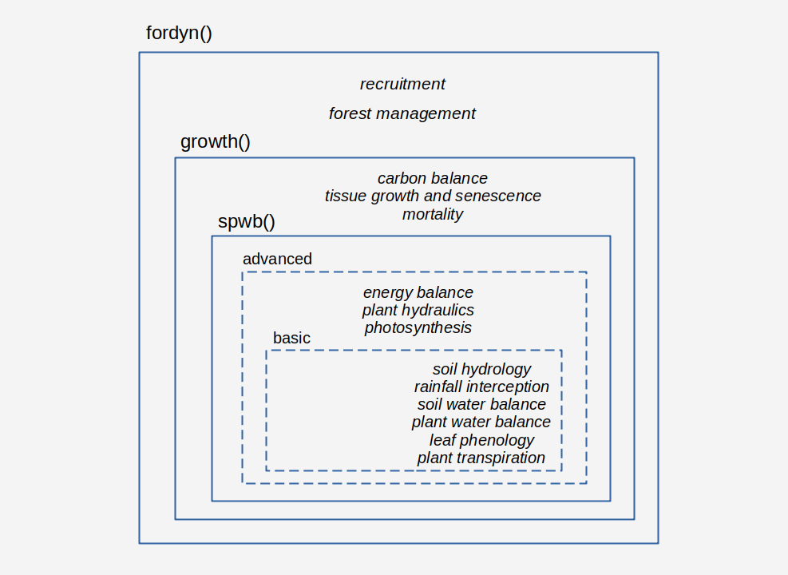

# (PART) Preliminaries {-}

# Introduction {#intro}

This chapter provides an overview of the purpose of developing the **medfate** an **medfateland** R packages, their main simulation functions and expected applications. 

## Purpose

Being able to anticipate the impact of global change on forests is one of the major environmental challenges in contemporary societies. However, uncertainties in how forest ecosystems function and practical constraints in how to integrate available information still hinder the availability of robust and reliable predictive models. Despite the amount of knowledge accumulated about the functioning and dynamics of forest ecosystems and the plethora of modelling tools already available, further efforts are necessary to achieve the challenge of integrating different global change drivers into simulation tools useful for research and applications.

### Package medfate

The R package **medfate** has been designed as a platform to simulate the functioning and dynamics of individual forest stands at temporal scales from days to years. Climate is the main environmental driver covered by the package and the ecological, hydrological and physiological processes surrounding these are fundamental for the simulation models included in the package. In particular, the package allows the simulation of water balance of soils and plants within forest stands. It also allows simulating plant growth, mortality and recruitment processes of a set of cohorts competing for light and water within a forest stand. Finally, additional package functions allow relating the amount of plant biomass and the water status of plant tissues to fuel characteristics and, hence, fire hazard.

The version of the reference manual that you are reading is intended to reflect **version `r packageVersion("medfate")`** of the package.

### Package medfateland

The R package **medfateland** has been designed to extend the capabilities of **medfate** to the landscape level. It allows running the stand-level models available in **medfate** on points and cells within landscape. More importantly, the package allows considering spatial hydrological processes in forested watersheds. Hence, **medfateland** can be used as a tool for eco-hydrological applications.   

The version of the reference manual that you are reading is intended to reflect **version `r packageVersion("medfateland")`** of the package.

## Package installation

### medfate

Package **medfate** can be found at [CRAN](https://CRAN.R-project.org/package=medfate), where it is updated every few months. Hence, it can be installed using:
```{r eval=FALSE}
install.packages("medfate")
```

Users can also download and install the latest stable versions GitHub as follows (required package `devtools` should be installed/updated first):

```{r installation, eval = FALSE}
devtools::install_github("emf-creaf/medfate")
```

When installing from GitHub, one may force the installation of package vignettes by using: 

```{r installation vignettes, eval = FALSE}
devtools::install_github("emf-creaf/medfate", 
                         build_opts = c("--no-resave-data", "--no-manual"),
                         build_vignettes = TRUE)
```

Among other dependencies, installing **medfate** requires package **meteoland**, as it links to some of its C++ functions. Note that some package dependencies are only *suggested*, so that they are not automatically installed when installing **medfate**.

### medfateland

Since both packages evolve together, installing **medfateland** normally requires an up-to-date version of **medfate**. The package **medfateland** is currently only available at GitHub, and can be installed using: 

```{r installation medfateland, eval = FALSE}
devtools::install_github("emf-creaf/medfateland")
```

As with **medfate**, one may force the installation of package vignettes for **medfateland**, by using: 

```{r medfateland installation vignettes, eval = FALSE}
devtools::install_github("emf-creaf/medfateland", 
                         build_opts = c("--no-resave-data", "--no-manual"),
                         build_vignettes = TRUE)
```


### Installation from sources

Both packages have a user interface in R, but actual calculations have been implemented as C++ functions and linked to R via the **Rcpp** package. This means that you will need a compiler to install **medfate** and **medfateland** packages from sources (i.e. Rtools in Windows).

## Data structures and functions in medfate

### Data structures

Package **medfate** deals with simulations at stand level and, hence, the data structures defined in the package are meant to encapsulate information about a target forest stands and the properties of the soil where it grows:

+ S3 class `soil` is a list of soil physical and hydraulic properties, including both parameters and state variables. Soil objects are described in subsection \@ref(soilinitialization).
+ S3 class `forest` is a list of forest inventory data (i.e. mainly tree and shrub measurements) corresponding to a single forest stand. Forest plot objects are described in subsection \@ref(forestobjects). 
+ S3 classes `spwbInput` and `growthInput` are lists containing all the vegetation parameters and state variables necessary to run water-balance simulations (function `spwb()` and alike) and forest growth simulations (function `growth()` and alike). Objects of classes `spwbInput` and `growthInput`  can be created using functions whose input includes a `forest` object and a `soil` object. 

### Dynamic simulation functions

Dynamic simulation functions in **medfate** include three nested simulation levels (Fig. \@ref(fig:models)):

  1. Forest water and energy balance can be studied for a given forest stand using function `spwb()` (soil-plant-water-balance). The same function is used to run two models of different degree of complexity (*basic* or *advanced*; see Fig. \@ref(fig:models)), from which the user should choose depending on the intended application and data availability. Water balance simulations include hydrological processes (rainfall interception, soil infiltration, percolation and evapotranspiration) and plant physiological processes related to transpiration (hydraulics, photosynthesis and stomatal regulation). Most processes are implemented at the daily scale, although some operate at subdaily time steps. Function `spwb()` has a closely related function `spwb.day()` that allows focusing on subdaily processes. Finally, one can simulate plant physiological processes only, while having soil moisture as a dynamic input like weather, using function `pwb()` (plant-water-balance).
  2. Changes in primary (leaf area) and secondary (wood) growth are key to evaluate the influence of climatic conditions on plant and forest structure and function. Function `growth()` extends the previous models because it allows simulating carbon balance, growth and mortality of a set of plant cohorts competing for light and water in a given forest stand. Analogously to the simulation of water balance, `growth()` has a closely related function `growth.day()` that allows focusing on subdaily processes (i.e. carbon balance). 
  3. Finally, function `fordyn()` complements growth and mortality processes with recruitment (from seeds), thus completing the minimum set of demographic processes needed to simulate forest dynamics. The function splits the period to be simulated by years and makes internal calls to `growth()` for the simulation of growth and mortality. `fordyn()` is suited to simulate the interannual variation in forest structure and composition, while accounting for the biophysical and ecophysiological processes provided by the former models.
  
  ```{r models, out.width='100%', fig.align="center", fig.cap="Nested relationships between simulation functions and  processes included in each model", echo=FALSE}


```

Importantly, `growth()` and `fordyn()` functions and the processes that they implements are still **under development**.

### Sub-model functions

Many of the sub-models included in **medfate** are implemented as C++ functions and internally called by the simulation functions implementing top-level models. Most sub-models have, however, their corresponding R function to made them directly available to the user. This facilitates understanding the different sub-models and a more creative use of the package. Sub-model functions are grouped by *subject*, which is included in the name of the function. The different sub-model functions are (by subject):

* `biophysics_*`: Physical and biophysical utility functions.
* `carbon_*`: Structural and non-structural carbon compartments and flows.
* `hydraulics_*`: Plant hydraulics.
* `hydrology_*`: Canopy and soil hydrology.
* `light_*`: Light extinction and absortion.
* `moisture_*`: Tissue water relations and live tissue moisture.
* `pheno_*`: Leaf phenology.
* `photo_*`: Leaf photosynthesis.
* `root_*`: Root distribution and root/rhizosphere conductance estimation.
* `soil_*`: Soil hydraulics and thermodynamics.
* `spwb_*`: Soil water balance routines.
* `transp_*`: Stomatal regulation and plant transpiration.
* `wind_*`: Canopy turbulence.

### Static functions

Package **medfate** includes a number of functions to examine static properties of plants conforming forest stands, summary functions at the stand level or vertical profiles of several physical properties:

* `plant_*`: Cohort-level information (species name, id, leaf area, height...).
* `species_*`: Cohort-level attributes aggregated by species (e.g. basal area).
* `stand_*`: Stand-level attributes (e.g. basal area).
* `vprofile_*`: Vertical profiles (light, wind, fuel density, leaf area density).

Vegetation functioning and dynamics have strong, but complex, effects on fire hazard. On one hand, growth and death of organs and individuals changes the amount of standing live and dead fuels, as well as downed dead fuels. On the other, day-to-day changes in soil and plant water content changes the physical properties of fuel, notably fuel moisture content. Package **medfate** provides functions to estimate fuel properties and potential fire behaviour in forest inventory plots. Specifically, function `fuel_stratification()` provides a stratification of the stand into understory and canopy strata; and `fuel_FCCS()` calculates fuel characteristics. A fire behaviour model is implemented in function `fire_FCCS()` to calculate the intensity of surface fire reaction and the rate of fire spread of surface fires assuming a steady-state fire. Fuel and fire behaviour functions allow obtaining the following: 

1. Fuel characteristics by stratum.
2. Surface fire behavior (i.e. reaction intensity, rate of spread, fireline intensity and flame length).
3. Crown fire behavior.
4. Fire potential ratings of surface fire behavior and crown fire behavior.

## Data structures and functions in medfateland

### Data structures

Package **medfateland** allows simulating forest functioning and dynamics on sets forests stands distributed across space. Three S4 classes have been defined to facilitate simulations on particular locations and over grids. They extend spatial classes from package **meteoland**

+ S4 class `SpatialPointsLandscape` contains a list of soil and forest stand descriptions along with the spatial location of stands. It extends class `SpatialPointsTopography`.
+ S4 class `SpatialPixelsLandscape` contains a set of soil and forest stand descriptions along with the location over a grid of the corresponding set of pixels. It extends class `SpatialPixelsTopography`.
+ S4 class `SpatialGridLandscape` contains a set of soil and forest stand descriptions along with the location over a full grid. It extends class `SpatialGridTopography`.

While simulation functions in the package can be run sequentially on individual forest stands of the former classes, the package has been designed so that it could be part of a broader modelling infrastructure including *spatial hydrological processes*, notably surface and sub-surface lateral water flows. An additional S4 class has been defined for this purpose.

+ S4 class `DistributedWatershed` contains a set of soil and forest stand descriptions along with the location over a grid of the corresponding set of pixels, because it extends class `SpatialPixelsLandscape`. In addition, however, `DistributedWatershed` includes many other spatial layers, such as list of discharge values to neighbors, an integer vector of cell processing order or the water content of the underlying aquifer. 

### Dynamic simulation functions

Package **medfateland** offers sets of simulation functions for the first three S4 classes presented above. Simulations available are analogous to those of package **medfate**:

+ Forest water and energy balance can be studied for a set of forest stands using functions `spwbpoints()`, `spwbpixels()` and  `spwbgrid()` .
+ Growth and mortality of a set of plant cohorts competing for light and water can be simulated for a set of forest stands using functions `growthpoints()`, `growthpixels()` and `growthgrid()` .
+ Forest dynamics arising from competition for light and water can be simulated for a set of forest stands using functions `fordynpoints()`, `fordynpixels()` and `fordyngrid()` .

In addition, the package offers a simulation function tailored to be used with objects of class `DistributedWatershed`:

+ Function `wswb()` is distributed hydrological model that simulates daily water balance on the cells of a watershed while accounting for overland runoff, subsurface flow and groundwater flow between cells.

