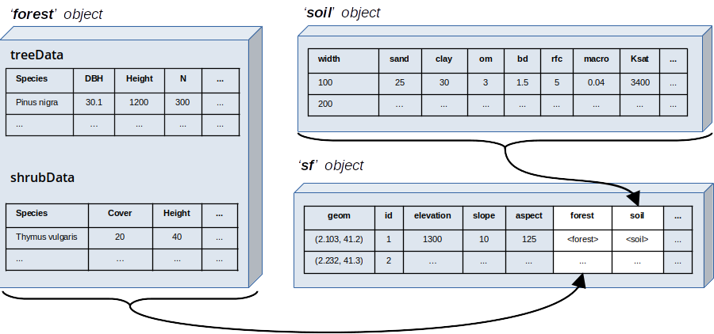

# Model inputs

This chapter describes the inputs required by simulation models of **medfate** and **medfateland** packages. First, we describe the R structures required for the two packages. Then, we provide the details for four different kinds of inputs:

  (1) *Vegetation existing in the forest stand*. Information of the living plants includes not only species composition and/or structure, but also functional parameters of a set of plant cohorts. Vegetation can include information about dead plant elements (e.g. snags, leaf litter, large wood) or soil carbon pools. Vegetation is considered static in `spwb()` calls, except for leaf area variation, but becomes dynamic in calls to `growth()` or `fordyn()`. Hence, in these functions the input vegetation describes the starting point. 
  (2) *Information on the physical structure of soil*. Soil information is also required but, unlike vegetation, the soil physical structure and its hydraulic properties are considered static in the current version. 
  (3) *Climatic forcing*. Daily weather series are always required, defining the temporal extent of the simulation and the temporal variation of environmental conditions in which physical and biological processes occur. 
  (4) *Topographic information and geographic location*. Topography and latitude are also required, because internal calculations of some physical variables require them. 

The last section (\@ref(controlparameters)) describes additional input parameters that are used to specify global options of simulation functions.

Since preparing inputs for simulations can be daunting for most users, package [**medfateland**](https://github.com/emf-creaf/medfateland) provides a set of utility functions aimed at facilitating the preparation of vegetation and soil inputs, whereas package [**meteoland**](https://github.com/emf-creaf/meteoland) provides functions to assess daily weather over landscapes.


## Input structures
### Input structures in medfate {#inputstructuresmedfate}

Package **medfate** deals with simulations at stand level and, hence, the data structures defined in the package are meant to encapsulate information about a target forest stands and the properties of the soil where it grows:

+ S3 class `soil` is a *data frame* that is initialized using a data frame of soil physical properties, but the table includes also soil hydraulic parameters and state variables. Soil objects are described in subsection \@ref(soilinitialization).
+ S3 class `forest` is a *list* of forest inventory data corresponding to a single forest stand. It mainly refers to tree and shrub measurements, but can include many other information such as herbaceous vegetation, seedling bank, seed bank, tree snags or litter. Forest plot objects are described in subsection \@ref(forestobjects). 
+ S3 classes `spwbInput` and `growthInput` are lists containing all the vegetation parameters and state variables necessary to run water-balance simulations (function `spwb()` and alike) and forest growth simulations (function `growth()` and alike). Objects of classes `spwbInput` and `growthInput` are created using functions whose input includes a `forest` object and a `soil` object. 

The figure below (Fig. \@ref(fig:inputworkflow)) can be used to illustrate the workflow of soil/forest input creation for the main simulation functions in **medfate**. Note the different inputs in the case of `fordyn()`.

```{r inputworkflow, out.width='100%', fig.align="center", fig.cap="Schematic workflow of input creation for simulation functions in medfate", echo=FALSE}
knitr::include_graphics("figures/input_workflow.png")

```

### Input structures in medfateland {#medfatelandstructures}

Spatial information for **medfateland** needs to be provided in `sf` objects (i.e. data frames with geometry, see package [**sf**](https://cran.r-project.org/package=sf)). For each forest stand to be simulated, these object must include a geometry, topographic features as well as a `forest` object and `soil` object, as illustrated in the figure below:


```{r datastructures, out.width='100%', fig.align="center", fig.cap="Relationship between data structures in medfate and medfateland", echo=FALSE}


```

Non-forest (i.e. croplands or urban areas) patches may be also described, and then `forest` or `soil` objects may not be required. The actual columns required in a `sf` depend on the simulation function to be used, as described in the following table: 

|  Column | Description         | Use                           |
| ------- | ------------------- | ----------------------------- |
|  `geom`      | Spatial geometries (points, polygons, ...) |  Always required | 
|  `id`      | Stand identifiers |  Required for `*_spatial()`, `*_spatial_day()` and `fordyn_scenario()` | 
|  `elevation`      | Elevation values above sea level (in m) |  Always required | 
|  `slope`      | Slope values (in degrees) |  Always required | 
|  `aspect`      |  Aspect values (in degrees) |  Always required | 
|  `land_cover_type` | Land cover type: *wildland*, *agriculture*, *rock*, *artificial* or *water* | Required for `*_land()`, optional for `*_spatial()` and `*_spatial_day()` |
|  `forest`      |  Objects of class `forest` |  Always required | 
|  `soil`      |  Objects of class `soil` |  Always required | 
|  `state`      |  Objects of class `spwbInput` or `growthInput` |  Optional to recover the final state of a previous simulation | 
|  `meteo`      |  Weather data frames (see \@ref(meteoinput)) |  Optional |
|  `crop_factor` | Crop evapo-transpiration factor | Only required for *agriculture* land cover type |
|  `management_arguments`      |  Management arguments for each stand |  Optional for `fordyn_spatial()` | 
|  `management_unit`      |  Management unit corresponding to each stand |  Required for `fordyn_scenario()` | 
|  `represented_area_ha`      |  Area represented by each stand, in hectares |  Required for `fordyn_scenario()` | 
| `depth_to_bedrock` | Depth to bedrock (mm). | Required for `*_land()` | 
| `bedrock_conductivity` | Bedrock (saturated) conductivity (in m·day-1). | Required for `*_land()` | 
| `bedrock_porosity` | Bedrock porosity ([0-1]). | Required for `*_land()` | 
| `snowpack` | Snow water equivalent content of the snowpack (mm). | Required for `*_land()` | 
| `aquifer` | Water content of the aquifer in each cell. | Required for `*_land()` | 
| `deep_aquifer_loss` | A numeric vector with the maximum daily loss to a deeper aquifer (in mm·day-1). If missing all cells take their value from watershed control. | Optional for `*_land()` | 
| `channel` | A logical (or binary) vector indicating overland channel routing. | Optional for `*_land()` | 
| `outlet_backlog` |  A list vector indicating channel backlog of outlet cells from a previous simulation. | Optional for `*_land()` | 

## Latitude and topography {#topoinput}

Topography has a relatively small direct influence in **medfate** simulations, because most topographic effects are assumed to be taken into account in the estimation of weather inputs. Nonetheless, *elevation* (in meters) is needed to estimate atmospheric pressure and air density (see \@ref(meteoinput)), whereas *aspect* (in degrees from North) and *slope* (also in degrees) are needed in addition to *latitude* (also in degrees North) to estimate sunrise/sunset hours and potential radiation. Topographic variables should be readily accessible for users having access to a digital elevation model of the target area.

## Soil description  {#soilinput}

Soils are described in **medfate** using $S > 1$ discrete soil layers ($s \in \{1, 2, ..., S\}$). Here the word *soil* refers to the volume comprised between between forest floor and the depth that plant rooting systems can reach (i.e., the critical zone), including cracks within the bedrock. The number and size of soil layers may correspond to changes in soil properties along depth, but also can be chosen to reflect differences in plant rooting depths. The physical properties of the soil are needed to estimate soil hydraulic properties and are considered **static soil parameters** in simulations. In contrast, soil moisture content, other variables that depend on moisture (e.g. soil water potential and soil conductivity) and soil temperature, if the soil energy balance is considered, are all **soil state variables**.

### Soil physico-chemical properties

Soil physico-chemical properties, such as *texture* (i.e. volume percent of sand, silt and clay), *organic matter content*, *bulk density* or *rock fragment content*, can differ between soil layers, and this has important consequences for soil water retention capacity and soil hydraulics. Specifying layers with an elevated rock fragment content (e.g. layers of weathered rock where soil particles are scarce) may be important in arid or seasonally-dry climates like the Mediterranean, because plants often extend their roots into cracks existing in the parent rock to access water during summer [@Ruffault2013]. 

For each soil layer $s$, the following physico-chemical parameters are accepted (some of them are only optional):

| Symbol | Units | R  | Description                         | Required |
|--------|-------|----| ------------------------------------|----------|
| $d_{s}$ | mm | `widths` | Width of soil layer $s$ | Yes |
| $P_{clay,s}$ | % | `clay` | Percent volume of clay (within soil particles fraction) in layer $s$  | Yes |
| $P_{sand,s}$ | % | `sand` | Percent volume of sand (within soil particles fraction) in layer $s$ | Yes |
| $OM_s$ | % | `om` | Percentage of organic mater per dry weight (can be missing) in layer $s$ | No |
| $N_s$ | $g/kg$  | `nitrogen` | Sum of total nitrogen (ammonia, organic and reduced nitrogen) in layer $s$ | No |
| $pH_s$ | [0-14] | `ph` | pH in water of layer $s$ | No |
| $BD_{s}$ | $g \cdot cm^{-3}$ |`bd` | Bulk density in layer $s$| Yes |
| $P_{rocks,s}$ | % | `rfc` | Rock fragment content as percent volume (within whole soil) in layer $s$ | Yes |

The percent volume of silt is 100\% minus the percent volume of clay and sand. Whenever possible, soil physico-chemical properties should be measured in soil profiles conducted at the target forest plot (although soil profiles rarely reach rooting depths of deeply-rooted plants). Soil input data should be arranged in a `data.frame` with soil layers in rows and physico-chemicl variables in columns (see function `defaultSoilParams()`). The following is an example with four soil layers:

```{r}
soildf <- defaultSoilParams()
soildf
```


Package **medfateland** includes a function `add_soilgrids()` to fetch soil information from [SoilGrids.org](https://soilgrids.org/), a global soil database currently providing soil data at 250m scale. This can be helpful to users lacking local soil measurements, but the uncertainty of SoilGrids estimates can be high for some areas and soil properties, especially soil depth and rock fragment content.

The depth of a given soil layer $s$ ($Z_s$; in mm) is defined as the sum of layer widths from the surface to the target layer:
\begin{equation}
Z_s = \sum_{i=1}^s{d_s}
\end{equation}
And the overall *soil depth*  ($Z_{soil}$; in mm) is the sum of widths across all soil layers. As the soil may include deep rocky layers, the value of $Z_{soil}$ may be larger than the soil depth reported in soil profiles. 

### Water retention curves {#waterretentioncurves}

The **water retention curve** of a soil is the relationship between *volumetric soil moisture content* ($\theta$, in $m^3 \cdot m^{-3}$ of soil, excluding rock fragments) and the corresponding *soil water potential* ($\Psi$, in MPa), i.e. the amount of work that must be done per unit quantity of pure water in order to transport reversibly and isothermally an infinitesimal quantity of water from a reference pool. The shape of the water retention curve (also called the *soil moisture characteristic curve*) depends on physical properties (mainly texture and bulk density, but also organic matter content). Since soil layers usually differ in their physical properties they also normally have different water retention curves.

Two water retention curve models are available in **medfate** (fig. \@ref(fig:retention-curves)):

1. *Saxton model*: In this model, volumetric soil moisture $\theta(\Psi)$ corresponding to a given water potential $\Psi$ (in MPa) below field capacity (i.e., $\Psi < \Psi_{fc}$) is calculated using: 
\begin{equation}\theta(\Psi) = (\Psi/A)^{(1/B)}\end{equation}
where $A$ and $B$ depend on the texture and, if available, organic matter in the soil. If organic matter is available, $A$ and $B$ are calculated from $P_{clay}$, $P_{sand}$ and $OM$ following @Saxton2006. Otherwise, they are calculated from $P_{clay}$ and $P_{sand}$ as indicated in @Saxton1986. Volumetric changes between field capacity and saturation (i.e., $\Psi_{fc} \leq \Psi < 0$) are estimated using a linear function.
2. *Van Genuchten model*: The well known van Genuchten [-@Genuchten1980] model is:
\begin{equation}\theta(\Psi) = \theta_{res}+\frac{\theta_{sat}-\theta_{res}}{\left[1+ (\alpha \cdot \Psi)^n \right]^{1-1/n}}\end{equation}
where $\theta(\psi)$ is the water retention, $\theta_{sat}$ is the saturated water content, $\theta_{res}$ is the residual water content, $\alpha$ is related to the inverse of the air entry pressure, and $n$ is a measure of the pore-size distribution. 

(ref:retention-curves-cap) Water retention curves under the Saxton and Van Genuchten models, for the same physical attributes (25% sand, 25% clay, 50% silt and bulk density of $1.5 g \cdot cm^{-3}$). Parameters of the Van Genuchten curve have been estimated using pedotransfer functions given in @Toth2015.

```{r retention-curves, fig.align='center', fig.width=4, fig.height=3.5, echo = FALSE, fig.cap='(ref:retention-curves-cap)'}
soil_retentionCurvePlot(soil(soildf), model="both")+
  theme(legend.position =c(0.7,0.8))
```

Hydraulic conductivity governs the rate of water flow for a unit gradient in potential. It decreases sharply as soil becomes dry, and the relationship also depends on soil texture. The Saxton and Van Genuchten models also describe and parameterize the relationship between conductivity and soil water potential.

### Soil initialization  {#soilinitialization}
Soil initialization is needed to estimate hydraulic parameters for each soil layer $s$ from its physico-chemical attributes. Soil initialization can be done using function `soil()`, which returns a data frame of a S3 class with the same name (see \@ref(inputstructuresmedfate)), but most often is performed implicitly when calling functions `spwbInput()` or `growthInput()` with a data frame of physical properties. 

Soil initialization adds the following information to the physico-chemical soil description: 

| Symbol | Units | R  | Description                               | 
|--------|-------|----| ------------------------------------------|
| $P_{macro}$ | % | `macro` | Percentage of macroporosity corresponding to each soil layers | 
| $K_{sat}$ | $mmol \cdot s^{-1} \cdot m^{-2} \cdot MPa^{-1}$ | `Ksat` | Saturated soil conductivity for each soil layer |
| $\alpha$ | $MPa^{-1}$ | `VG_alpha`| Parameter $\alpha$ of the Van Genuchten [-@Genuchten1980] model for each soil layer |
| $n$ | | `VG_n` | Parameter $n$ of the Van Genuchten [-@Genuchten1980] model for each soil layer|
| $\theta_{sat}$ |$m^3 \cdot m^{-3}$ | `VG_theta_sat`| Volumetric soil moisture at saturation for each soil layer |
| $\theta_{res}$ |$m^3 \cdot m^{-3}$ | `VG_theta_res` | Residual volumetric soil moisture for each soil layer |

Macroporosity values are calculated using the equations given in @Stolf2011, while $\gamma_{soil}$ is derived from texture. Parameters of the van Genuchten model for each layer are estimated from the physical description of the layer using one of two pedotransfer functions (see help for `soil()`): 

1. Using the USDA texture classification and the average texture class parameters given by @Carsel1988.
2. Directly from the soil texture, organic matter and bulk density, using the pedotransfer functions in @Toth2015.

Parameter $\alpha$ of the Van Genuchten model is given in $MPa^{-1}$, but it can be transformed to $cm^{-1}$ using the relationship: 

\begin{equation}
1\, cm = 0.00009804139432\,\,MPa,
\end{equation}

which can also be applied to water potential units. Soil layer saturated conductivity ($K_{sat}$) is estimated using @Saxton2006 or @Saxton1986, depending on whether an estimate of organic mater is available. $K_{sat}$ is given in physiological units $mmol \cdot s^{-1} \cdot m^{-2} \cdot MPa^{-1}$, but they can be transformed into $cm\cdot day^{-1}$ using:

\begin{equation}
1\, cm\cdot day^{-1} = 655.2934\,\,mmol \cdot s^{-1} \cdot m^{-2} \cdot MPa^{-1}
\end{equation}

Saturated conductivity ($K_{sat}$) is corrected for bulk density ($BD$) of the soil layer, because compact soils have lower conductivity [@rahimi_evaluation_2011]:

\begin{equation}
K_{sat} = K_{sat,ref} \cdot \left( \frac{\rho_{s} - BD}{\rho_{s} - BD_{ref}} \right)^3
\end{equation}
where $K_{sat,ref}$ is the reference conductivity according to soil texture, $\rho_{s} = 2.73 \,g\cdot cm^{-3}$ is density of soil particles, $BD_{ref} = 1.2\,g\cdot cm^{-3}$ is the reference bulk density.

Below is an example of soil initialization:

```{r}
soilinit <- soil(soildf)
soilinit
```

Besides defining soil parameters, function `soil()` also initializes *soil state variables* for each soil layer: 

| Symbol | Units | R  | Description                               | Initial value |
|--------|-------|----| ------------------------------------------|--------|
| $\theta(\Psi_s)/\theta(\Psi_{fc,s})$ |  | `W` | Soil moisture content with respect to field capacity for layer $s$ | `1` |
| $T_{soil,s}$ | Celsius | `Temp` | Soil temperature for layer $s$ | `NA` |

Users can edit the `soil` object manually (it is actually a `list`) before simulations, for example to provide specific parameters of the Van Genuchten retention curve calibrated from soil measurements or to modify the initial values of state variables. 

### Water content and depth to saturation {#watercontent}

The *volume of water* ($V_s$ in $mm = l \cdot m^{-2}$ of ground area) in a soil layer $s$ is calculated from its water potential ($\Psi_s$) and water retention curve using:
\begin{equation}
V_s(\Psi_s) = d_s\cdot ((100-P_{rocks,s})/100)\cdot\theta_{s}(\Psi_s)
\end{equation}
where $d_s$ is the depth of the soil layer (in mm) and $P_{rocks,s}$ is the percentage of rock fragments. The overall volume of water in the soil (accessible by roots) is simply the sum of water content over soil layers:
\begin{equation}
V_{soil} = \sum_{s=1}^S{V_s(\Psi_s)}
\end{equation}

A number of fixed water volumes (and their corresponding moisture) are important to remember: 

  + *Water holding capacity* ($V_{fc, s}$, in mm) of the soil layer $s$ is defined as the volume of water at *field capacity*, i.e. at $\Psi_{fc} = -0.033$ MPa, the amount of water held in the soil after gravitational water has drained away:
\begin{equation}
V_{fc,s} = V_{s}(-0.033) = d_s\cdot ((100-P_{rocks,s})/100)\cdot\theta_{fc,s}
\end{equation}
where $\theta_{fc,s} = \theta_s(-0.033)$ is the corresponding moisture at field capacity. 
  + *Water content at saturation* ($V_{sat, s}$, in mm) is calculated anagolously, but replacing $\theta_{fc,s}$ by $\theta_{sat, s} = \theta_s(0)$, the moisture at *saturation*, the amount of soil moisture when all easily drained spaces between soil particles (i.e. macropores) are also filled with water. 
  + *Water content at wilting point* ($V_{wp, s}$, in mm) is calculated replacing $\theta_{fc,s}$ by $\theta_{wp,s} = \theta_s(-1.5)$, the moisture at *wilting point*, i.e. at $\Psi_{wp} = -1.5$ MPa, a conventional amount of soil moisture beyond which plants are assumed have problems extracting water and start to wilt. However, plants can often extract water from much drier soils.
  + The *amount of extractable water* (in mm) is the difference between water content at field capacity and the water content at a conventional minimum water potential, which can be set at wilting point or lower values (by default at -5 MPa in **medfate**).

The *saturated water depth* ($Z_{sat}$, in mm) is not defined (i.e. missing) when all soil layers are below field capacity. When some layers are between field capacity and saturation, depth of the saturated water is calculated as:
\begin{equation}
Z_{sat} = \sum_{s}{d_s \cdot \min\left[1,(\theta_{sat,s} - \theta(\Psi_s))/(\theta_{sat,s}-\theta_{fc,s})\right]}
\end{equation}

Function `summary.soil()` can be used to describe the properties and water content of the different soil layers, after initialization:

```{r}
summary(soilinit)
```


## Vegetation description {#vegetationinput}

The representation of vegetation in a target forest stand is done primarily by means of **cohorts of living plants** (i.e. trees, shrubs or herbs). This representation was chosen so that package functions can be easily applied to **forest inventory data**, for example from national forest surveys. Note that one limitation of the representation of vegetation in **medfate** is that it is not spatially-explicit (i.e. plants cannot have explicit coordinates within forest stands) and hence spatial (horizontal) interactions between plant cannot be taken into account explicitly (but see \@ref(plantwaterpools)).

Apart from its living plant cohorts, vegetation description can also include other elements, such as **cohorts of standing dead wood** (i.e. snags), or **leaf/branch/root litter** lying on the ground or found below the surface, or even the **seedling and seed banks**. All vegetation elements are grouped into a single structure, the `forest` object, which is described in section \@ref(forestobjects). 

### Cohorts of living plants

A living plant cohort represents a set of plants that belong to the same species (or functional group) and are more or less of the same *size*. For example, trees in a stand may be grouped by species and diameter class, whereas shrubs or herbs may be grouped by species and height. In practice, however, plant cohorts are entities that are treated separately when modeling the forest stand. The description of plant cohorts includes a measure of *abundance* of the cohort in the stand, which in the case of trees is *density* as stems per hectare and for shrubs or herbs is *percent cover*. The difference in the kind of measurements made for abundance is the main motivation for distinguishing between tree cohorts and shrub/herbs cohorts, rather than their size or growth form. Herbaceous cohorts are different from shrub cohorts for functional reasons. While shrubs are woody (often multi-stemmed) plants with secondary growth, herbs are non-woody, lacking secondary growth and with crowns starting at the ground level. Although herbs can be described as plant cohorts, similar to shrubs, the description of vegetation in the forest stand may include the cover and mean height of a *herbaceous layer* defined collectively, for practical reasons. 

#### Structural attributes of living plant cohorts

A plant cohort $i$ is either a *tree cohort*, a *shrub cohort* or a *herb cohort*; and is formally defined using a set of structural attributes shown in the following table, where columns **spwb**, **growth** and **fordyn** indicate whether attributes are required by simulation functions `spwb()`, `growth()` and `fordyn()`, respectively:

| Symbol | Units | R  | Description                        | spwb | growth | fordyn |
|--------|-------|----| ------------------------------------|-----|-----|-----|
| $SP_i$  |  | `Species` | Species identity |  Y  |  Y  |  Y  |
| $H_i$  | $cm$  | `Height` | Average plant height |  Y  |  Y  |  Y  |
| $CR_i$ |       | `CR`| Crown ratio (i.e. ratio between crown length and plant height) | Y | Y |  N  |
| $N_i$ | $ind · ha^{-1}$ | `N` | Density of individuals | N | Y |  Y  |
| $DBH_i$ | $cm$ | `DBH` | Tree diameter at breast height | N | Y |  Y  |
| $Cover_i$ | % | `Cover` | Projected percent cover | N | Y |  Y  |
| $LAI^{live}_i$ | $m^2 \cdot m^{-2}$ | `LAI_live` | (Maximum) leaf area index | Y | Y | N |
| $LAI^{dead}_i$ | $m^2 \cdot m^{-2}$ | `LAI_dead` | (Standing) dead leaf area index | Y | Y |  N  |
| $LAI^{\phi}_i$ | $m^2 \cdot m^{-2}$ | `LAI_expanded` | Current expanded leaf area index | Y | Y |  N  |
| $LAI^{NC}_i$ |$m^2 \cdot m^{-2}$ | `LAI_nocomp` | Leaf area index assuming no competition with other plants | N | Y |  N  |
| $Z_{50,i}$ | mm | `Z50` | Depth above which 50% of the fine root mass is located | Y | Y | Y |
| $Z_{95,i}$ | mm | `Z95` | Depth above which 95% of the fine root mass is located | Y | Y | Y |

Height ($H$) values refer to average height of individuals included in the cohort, and the same for crown ratio ($CR$) and diameter at breast height ($DBH$). While plant size (i.e. height or diameter) is relatively easy to tally, other measurements are not usually made in the field. Package **medfate** includes utility functions that provide estimates $CR$ and $LAI$ from forest inventory data (e.g. heights, DBH and density for measured trees), using allometric relationships calibrated for Catalonia, Spain (see chapter \@ref(allometricmodels)). As mentioned above, herbaceous cohorts are assumed to have $CR = 1$.

#### Collective herbaceous layer

As stated above, the herbaceous layer of the stand can be described collectively, without distinguishing among plant cohorts. Two attributes, cover and height, are required in this case:

| Symbol | Units | R  | Description                        | 
|--------|-------|----| ------------------------------------|
| $H_{herb}$  | $cm$  | `herbHeight` | Average height of herbaceous vegetation |
| $Cover_{herb}$ | % | `herbCover` | Percent cover of herbaceous vegetation |
| $LAI_{herb}$ | $m^2 \cdot m^{-2}$ | `LAI_herb` | Leaf area index of herbaceous vegetation |

Leaf area index of herbaceous layer ($LAI_{herb}$), is normally estimated from $H_{herb}$ and $Cover_{herb}$, but could be directly prescribed by the user. Rooting depth parameters are not needed for herbaceous vegetation, which is assumed to extract water from the topmost soil layer. Note that neither phenology or growth/senescence processes are modelled when herbaceous vegetation described in this way.

### Forest objects {#forestobjects}

Forest data input in the **medfate** package is facilitated through the adoption of a data structure that follows closely forest inventory plot descriptions. Each forest stand is represented in an object of class `forest`, a *list* that contains several elements. Here we display an example of forest stand provided with the package:
```{r}
data(exampleforest)
exampleforest
```

The most important items of `forest` are the two data frames describing woody plants: `treeData` (for trees) and `shrubData` for shrubs. While not required, an additional `herbData` item can be used to describe the herbs, with the same structure as for shrubs. With the aim to help users in the task of constructing `forest` objects, package **medfate** includes functions to map user data in into tables `treeData` and `shrubData`.

`forest` objects are a convenient format to start calculations with **medfate**, because there are many static functions that take forest objects as input. For example, a `summary.forest()` function provides the basal area, density, cover and leaf area index of the forest stand, and its different components:

```{r}
summary(exampleforest, SpParamsMED)
```

#### Single-cohort forests

Although **medfate** has been designed to perform simulations on multi-cohort forests, it can also handle simulations where vegetation is described using a single cohort. Functions `tree2forest()` and `shrub2forest()` allow defining single-cohort forests from attributes. For example a holm oak (*Quercus ilex*) forest of 4-m height and having a leaf area index of $2\, m^2\cdot m^{-2}$ can be defined using:

```{r}
oak_forest <-tree2forest("Quercus ilex", Height= 400, LAI = 2)
```

The function will return a `forest` object where most attributes are empty:
```{r}
oak_forest
```

Nevertheless, the object is well defined, for example we can summarize it using: 

```{r}
summary(oak_forest, SpParamsMED)
```

Since density and diameter have not been provided, simulations in this case will be restricted to function `spwb()`. Moreover, note that when defining single-cohort forests all possible interactions with functionally distinct plants are neglected.

#### Optional variables for living plant cohorts in forest objects

The structure presented above for `forest` objects corresponds to the required data elements. A forest object can contain additional information when this is available. In particular, data frames `treeData`, `shrubData` and `herbData` can contain additional columns:

+ `LAI`: Leaf area index ($m^2 \cdot m^{-2}$), corresponding to $LAI^{live}$, avoiding the use of allometric relationships for leaf biomass in water balance simulations.
+ `FoliarBiomass`: Standing dry biomass of leaves ($kg \cdot m^{-2}$), which together with $SLA$ will be used to estimate $LAI^{live}$, avoiding the use of allometric relationships for leaf biomass in water balance simulations.
+ `FuelLoading`: Fine fuel loading ($kg \cdot m^{-2}$), to avoid its calculation from allometric relationships.
+ `CrownRatio`: The ratio between crown length and total height (between 0 and 1), avoiding the use of allometric relationships for crown ratio in water balance simulations.
+ `Z100`: Depth (in $mm$) corresponding to 100% of fine roots (to specify a truncated root distribution).
+ `Age`: A numeric vector indicating age of cohorts in years. Used to track the age of plant cohorts in simulations of forest dynamics. 
+ `ObsID`: A string identifying plant cohorts at the stage of forest sampling. Used to track the fate of particular plant cohorts in simulations of forest dynamics. 

#### Dead plant elements {#deadplantelements}

Forest objects can include the description of dead vegetation elements of forest stands. Dead elements are grouped into *standing dead wood* (e.g. tree snags), *downed litter* (e.g. branches, logs or leaf litter) and *belowground litter* (i.e. fine roots or coarse roots). They are used to model organic matter decomposition of standing or downed plant organs (see chapter \@ref(decomposition)) in simulations with functions `growth()` or `fordyn()`.

The optional data frame `snagData` contains information about the **standing dead wood** of dead plant cohorts, with the following columns:

| R column  | Description                        | 
|--------|------------------------------------|
| `Species` | String with species (taxon) name |
| `DBH` | Diameter at breast height (in cm) of the original living cohort, for tree snags only |
| `Height` | Height of the original living cohort (tree or shrub) (in cm) |
| `DeathAge` |  Years passed since plant death (in yrs) |
| `SmallBranches` | Necromass of (standing) small dead branches (in g C/m2) |
| `LargeWood` | Necromass of (standing) large dead wood (in g C/m2). |

Dead plant cohorts are characterized by species, diameter (for trees), height and age since death. Note that the description of dead cohorts quantifies the abundance of branches and large wood (i.e. stems), but not leaves (or twigs), which are assumed to become litter before or soon after plant death. 

Elements corresponding to **downed litter** or **belowground litter** are described in an additional data frame called `litterData`, which contains the following columns:

| R column  | Description                        | 
|--------|------------------------------------|
| `Species` | String with species (taxon) name. |
| `Leaves` | Necromass of leaf litter (in g C/m2). |
| `Twigs` | Necromass of twig litter (in g C/m2). |
| `SmallBranches` | Necromass of (downed) small dead branches (in g C/m2). |
| `LargeWood` | Necromass of (downed) large dead wood (in g C/m2). |
| `CoarseRoots` | Necromass of dead coarse roots (in g C/m2). |
| `FineRoots` | Necromass of fine root litter (in g C/m2). |

Note that litter elements are characterized by species, so that the model can decompose litter elements at different rates depending on species identity (see chapter \@ref(decomposition)).

#### Seedling and seed banks {#seedlingseedbanks}

Forest objects can include the description of the seed bank and the seedling bank in forest stands, which are used to model regeneration from seeds in simulations with function `fordyn()` (see chapter \@ref(regeneration)). 

The optional data frame `seedBank` contains information about the **seed bank**, with the following columns:

| R column  | Description                        | 
|--------|------------------------------------|
| `Species` | String with species (taxon) name |
| `Percent` | Amount of seeds in relation to a full seed bank (%) |


Similarly, the optional data frame `seedlingBank` contains information about the **seedling bank**, with the following columns:

| R column  | Description                        | 
|--------|------------------------------------|
| `Species` | String with species (taxon) name |
| `Percent` | Amount of seedling in relation to a full seedling bank (%) |
| `Age` | The age of seedlings/saplings in years |
| `Z50` | Depth (in mm) corresponding to 50% of fine roots |
| `Z95` | Depth (in mm) corresponding to 95% of fine roots. |


### Leaf and root distribution

#### Leaf area index of a plant cohort

$LAI$ variables refer to *one-sided leaf area* of plants per surface area of the stand. Only living plant cohorts (or the collective herbaceous layer) contribute to the leaf area of the forest stand (i.e. seedlings or dead snags are assumed to not contribute significantly to leaf area). Leaves standing on branches of living plant cohorts can be alive or dead. We will call *total leaf area index* of a plant cohort $i$ ($LAI^{all}_{i}$) to the sum of its dead and live (and unfolded) leaf area:
\begin{equation}
LAI^{all}_{i} = LAI^{\phi}_{i}+LAI^{dead}_{i}
\end{equation}

For simulations not involving growth, winter-deciduous phenology is a prognosed variable, and the current level of leaves unfolded may be lower than the maximum (live) amount of leaves. In simulations involving growth, both $LAI^{\phi}$ and $LAI^{live}$ can change, the former due to leaf phenology (unfolding is simulated explicitly and has carbon costs) and the latter due to leaf allocation limits during plant development.

#### Leaf area index of the forest stand

If there are $c$ living plant cohorts, the leaf area index corresponding to living leaves, unfolded leaves and dead leaves can be aggregated across cohorts using:

\begin{eqnarray}
LAI^{live} &=& \sum_{i=1}^c{LAI_{i}^{live}} \\
LAI^{\phi} &=& \sum_{i=1}^c{LAI_{i}^{\phi}} \\
LAI^{dead} &=& \sum_{i=1}^c{LAI_{i}^{dead}}
\end{eqnarray}

We can also estimate the overall leaf area index of living plant cohorts ($LAI^{all}$), including dead leaves:

\begin{eqnarray}
LAI^{all} &=& \sum_{i=1}^{c}{\left[LAI^{\phi}_{i}+LAI^{dead}_{i}\right]} = LAI^{\phi}+LAI^{dead}
\end{eqnarray}

Finally, we can also estimate the overall leaf area index of the whole stand ($LAI^{all}_{stand}$), which also takes into account the collective herbaceous layer ($LAI_{herb}$), if defined:

\begin{eqnarray}
LAI^{all}_{stand} &=& LAI^{all} + LAI_{herb} = LAI^{\phi}+LAI^{dead} + LAI_{herb} 
\end{eqnarray}

#### Vertical leaf distribution {#leafdistribution}

The vegetation input structures allow the package to determine the vertical distribution of leaves in the stand. The leaf area of any woody plant cohort is assumed to be distributed vertically following a **truncated Gaussian function** whose standardized values -1.5 and 1.5 correspond to crown base height ($H_{crown,i}$; in $cm$) and total plant height ($H_i$), respectively. Crown base height is defined as the height corresponding to the first living branch. It is calculated from the crown ratio of the cohort ($CR_i$; a proportion between 0 and 1), which in turn can be estimated as explained in \@ref(eq:CrownHeight). 

Simulation models in **medfate** divide the vertical dimension into vertical layers (by default are 100 cm width, but see control parameter `verticalLayerSize`). Let us define $LAI_{i,j}^{all} = LAI_{i,j}^{\phi}+LAI_{i,j}^{dead}$ as the leaf area index of cohort $i$ in layer $j$ including both functional leaves and dead leaves standing on branches. The truncated Gaussian distribution defines the $LAI_{i,j}^{\phi}$ and $LAI_{i,j}^{dead}$ for all plant cohorts and vertical layers.

Dividing the leaf area of a given layer by its width, one obtains the *leaf area density* ($LAD$ in $m^2 \cdot m^{-3}$). Figure \@ref(fig:leafareadensity) illustrates the leaf area density profile (see function `plot.forest()`) corresponding to the forest stand described in the example `forest` object that we showed above. 

```{r leafareadensity, fig.width=8, fig.height=4, fig.align='center', echo=FALSE, fig.cap="Leaf area density distribution of woody vegetation in a forest stand. The left panel shows the distribution for each plant cohort separately, whereas the right panel shows the overall density distribution."}
g1<-plot(exampleforest, SpParamsMED, type = "LeafAreaDensity", byCohorts = TRUE, 
         z = seq(0,1000, by=1))
g1 <- g1 + theme(legend.background = element_blank(), legend.position = c(0.8,0.8))
g2<-plot(exampleforest, SpParamsMED, type = "LeafAreaDensity", z = seq(0,1000, by=1))
plot_grid(g1, g2, nrow=1, ncol=2)
```

The leaf area density profile determines the light extinction rates through the forest canopy. The same truncated Gaussian distribution is used to distribute leaf and small branch biomass along the vertical dimension.

#### Vertical root distribution {#rootdistribution}
Roots can be distinguished functionally into two different organs: **coarse roots** are responsible for mechanical support and transport of water and nutrients towards the stem, whereas **fine roots** are responsible for absorbing water and nutrients. 

Analogously to the aboveground vegetation parameters, inputs describing depths corresponding to 50\% and 95\% of fine roots ($Z_{50,i}$ and $Z_{95,i}$) are used to completely specify the distribution of roots across soil layers. The root system of each plant cohort $i$ is described using $FRP_{i,s}$, the proportion of fine roots (with respect to the whole plant) in each soil layer $s$. $FRP_{i,s}$ values are normally defined using the linear dose response model [@Schenk2002; @Collins2007]: 
\begin{eqnarray}
FRP_{i,s} &=& Y_i(Z_s) - Y_i(Z_{s-1}) \\
Y_i(z) &=& \frac{1}{1+(z/Z_{50,i})^{c_i}}
\end{eqnarray}
where $Y_i(z)$ is the cumulative fraction of fine root mass located between surface and depth $z$; $Z_{50,i}$ is the depth (in mm) above which 50\% of the root mass is located; and $c_i$ is a shape parameter related to $Z_{50,i}$ and $Z_{95,i}$ as $c_i  = 2.94 / \ln(Z_{50,i} / Z_{95,i})$. 

The linear dose response model is quite flexible with respect to fine root distribution (see internal function `root_ldrDistribution()`). The following figure shows the fine root distribution profile of the same cohorts as in fig. \@ref(fig:leafareadensity) (see function `plot.forest()`):

```{r root-distribution, echo = FALSE, fig.width=5, fig.height=4, fig.align = 'center', fig.cap = "Examples of root density profile according to the linear dose response model."}
plot(exampleforest, SpParamsMED, type = "RootDistribution")
```

The vertical distribution of fine roots can be effectively truncated to a maximum depth by specifying a value for $Z_{100}$ (or by allowing the model to estimate it using `truncateRootDistribution = TRUE` in control parameters). 

The actual input to simulation functions `spwb()`, `growth()` and alike, describes fine root distribution using the matrix of $FRP_{i,s}$ values - not $Z_{50,i}$ and $Z_{95,i}$ -, which means that the proportions of fine roots can be modified manually or be defined by another model. In fact, **medfate** also allows calculating $FRP_{i,s}$ values assuming a conic distribution of fine roots (see internal function `root_conicDistribution()`). 


#### Water pools and root horizontal distribution {#plantwaterpools}

By default, models in **medfate** assume that soil moisture under all plant cohorts is the same (i.e. water sources corresponding to vertical soil layers are shared among cohorts). Therefore, it neglects spatial variation in soil moisture, against moisture variation patterns observed in mixed stands [@Schume2004]. However, variations in soil moisture beneath plant cohorts (and, implicitly, horizontal variation of soil moisture) can also be simulated if required by the user (see parameter `rhizosphereOverlap` in \@ref(controlparameters)). This involves considering that a given plant cohort will perform water uptake from the **water pool** surrounding its roots, whereas it may not have access to the water beneath other plants. However, there can exist some degree of horizontal overlap between water pools exploited by different plants.

Considering water pools involves partitioning the stand area into fractions corresponding to the abundance of each plant cohort. More specifically, the model defines as many water pools as plant cohorts, with proportions defined by their LAI values:
\begin{equation}
f_{pool,i} = \frac{LAI^{live}_i}{LAI^{live}_{stand}}
\end{equation}
Models assume that the rhizosphere of each plant cohort occupies its own water pool but may extend into the water pools under other plant cohorts. In other words, the root systems of different cohorts may overlap horizontally. Moreover, the horizontal overlap of root systems will vary across soil layers. A given plant cohort $i$ will have its roots in layer $s$ partitioned among different water pools. We thus need to define $fr_{i,s,j}$, the (horizontal) proportion of fine roots of cohort $i$ in layer $s$ of the water pool $j$, with the restriction that: 
\begin{equation}
\sum_{j}{fr_{i,s,j}} = 1 \,\, \forall i,s
\end{equation}

A simplifying assumption is to force a complete independence of water pools, which is equal to say that $fr_{i,s,j} = 1$  for $i = j$ and $fr_{i,s,j} = 0$  when $i \neq j$ (this is the simplification adopted when using `rhizosphereOverlap = "none"`). In the general case of partial overlap (`rhizosphereOverlap = "partial"`), it is important to realize that proper estimation of $fr_{i,s,j}$ is challenging when we do not have explicit plant coordinates, root lateral widths, etc. At this point, let us assume we have a reasonable estimate of $Vol_{i}$, the **soil volume explored by coarse roots** of an individual of cohort $i$. Assuming that the proportion of fine roots in each layer is proportional to the proportion of total soil volume explored by coarse roots that corresponds to the same layer we have that $Vol_{i,s}$, the soil volume explored by coarse roots in layer $s$ is:
\begin{equation}
Vol_{i,s} = FRP_{i,s}\cdot Vol_{i}
\end{equation}
In **medfate**, coarse roots are represented by *axial* and *radial* components. The length of axial component of a given layer ($L_{axial, i, s}$) is simply equivalent to its bottom depth, whereas the radial component ($L_{radial, i, s}$) is unknown. However, we can assume that the soil volume explored by coarse roots corresponds to a cylinder:  
\begin{equation}
Vol_{i,s} = \pi \cdot L_{radial,i,s}^2 \cdot L_{axial, i, s}
\end{equation}
and substituting the soil volume $Vol_{i,s}$ in the equation above we can isolate $L_{radial,i,s}$ (see internal function `root_coarseRootLengthsFromVolume()`). Once we have the radial component we can estimate the area ($m^2$) covered by coarse roots of an individual of the cohort in a given layer $s$:
\begin{equation}
Area_{i,s} = \pi \cdot L_{radial,i,s}^2
\end{equation}
We can then compare $Area_{i,s}$ to the area of the water pool for an individual of cohort $i$, which in $m^2$ is:
\begin{equation}
AreaPool_{i} = 10000 \cdot f_{pool,i}/N_{i}
\end{equation}
If $Area_{i,s} \leq AreaPool_{i}$, then the roots of the individual do not exceed the area of the pool, in other words $fr_{i,s,i} = 1$ and $fr_{i,s,j} = 0$ for all $j \neq i$. If
$Area_{i,s} > AreaPool_{i}$ then the excess should be counted as overlap with the other pools. Assuming that plants are randomly distributed (i.e. no clumping) the probability of finding the pool of a cohort is equal to the proportion of its water pool (see internal function `root_horizontalProportions()`). All these calculations were done assuming $Vol_{i}$ were known. Estimation of $Vol_{i}$ depends on the complexity of the water balance model and is explained in \@ref(horizontalrootoverlap).


### Functional traits and vegetation initialization {#functionaltraits}

Besides the physical representation of vegetation, forest ecosystem models require information regarding plant functional traits, because this influences the outcome of physical, physiological and hydrological processes. In the following chapters, we will indicate for each simulated process its required plant functional parameters. A description of all parameters is provided in data frame `SpParamsDefinition` included in the package.

Normally, functional traits are described at the species level because infra-specific parameters are hard to get. Even at the species level, many functional (e.g. physiological) traits are hard to obtain, so in **medfate** we provide a default species parameter table for tree/shrub species found in Spain, with many of them occurring elsewhere in the Mediterranean Basin (`SpParamsMED`). User can modify this data frame to account for intra-specific trait variation (see function `modifySpParams()`). 

The package provides functions `spwbInput()` and `growthInput()` that prepare the `forest` vegetation input for simulation functions `spwb()` and `growth()`, respectively (see \@ref(inputstructuresmedfate)). This initialization mostly consists in compiling the necessary functional traits from the species parameter table, following the $SP_i$ attribute of plant cohorts. Some new model parameters are estimated from the initial ones, while taking into account the structural attributes of cohorts (an example of these derived quantities is stem conductance, which estimated from stem xylem conductivity, Huber value and plant height). Users can take the output of these initialization functions and replace parameter values for specific plant cohorts (see function `modifyCohortParams()`). 


### Update of vegetation during simulations

Vegetation characteristics stay constant during simulations using function `spwb()`, although the actual (unfolded) leaf area and dead leaf area may vary depending on leaf phenology.

In contrast, growth simulation requires updating the structure of vegetation, i.e. plant heights, tree diameters, tree density and shrub cover. Function `growth()` can modify any of the vegetation attributes. Finally, function `fordyn()` modifies not only structural variables of the initial cohorts but also involves the removal of dead (or cut) cohorts and recruitment of new cohorts during simulations.


## Metereological input {#meteoinput}

Weather input data must include variables calculated at the **daily** scale. Weather data should be arranged in a data frame with days in **rows** and variables in **columns**. 

Since it allows producing data frames with appropriate variable units and row/column names, we recommend meteorological input to be generated using package **meteoland** [@DeCaceres2018], but other sources are possible.
 
### Date format
Dates are needed in **medfate** to estimate parameters like solar declination or the day of the year ($DOY$). Dates can be specified in the input data frame either:

  + As data frame **row names** (in string format *year-month-day*)
  + As `Date` elements in a column called `"dates"`.

### Required weather variables

The following table indicates the symbols, units, definitions and the variable name in R of input weather variables that are always **required** in the input data frame: 

| Symbol | Units | R param | Description                        | Optional | Missing allowed |
|--------|-------|---------|------------------------------------|----------|----------|
| $T_{min}$ | $^{\circ} \mathrm{C}$ | `MinTemperature` | Minimum temperature | No | No |
| $T_{max}$ | $^{\circ} \mathrm{C}$ | `MaxTemperature` | Maximum temperature | No | No |
| $RH_{min}$ | % | `MinRelativeHumidity` | Minimum relative humidity | No | Yes |
| $RH_{max}$ | % | `MaxRelativeHumidity` | Maximum relative humidity | No | Yes |
| $P$ | $L \cdot m^{-2} = mm$ | `Precipitation` | Precipitation (either rainfall or snow). | No | No |
| $Rad$ | $MJ \cdot m^{-2}$ | `Radiation` | Solar radiation after accounting for clouds | No | Yes |

Some weather variables (temperature, precipitation) cannot contain missing values, whereas for others (radiation, relative humidity) the package can impute values when missing, thanks to its dependency with package **meteoland**.

### Optional weather variables

The following table lists the same attributes for input weather variables that are **optional**:

| Symbol | Units | R param | Description                        | Optional |
|--------|-------|---------|------------------------------------|----------|
| $u$ | $m \cdot s^{-1}$ | `WindSpeed` | Wind speed | Yes |
| $R_{int}$ | $mm \cdot  h^{-1}$ | `RainfallIntensity` | Rainfall intensity | Yes |
| $C_{atm}$ | $ppm$ | `CO2` | Atmospheric (above-canopy) $CO_2$ concentration | Yes |
| $P_{atm}$ | $kPa$ | `Patm` | Surface atmospheric pressure | Yes |
| $P_{fire}$ | [0-1] | `FireProbability` | Probability of wildfire occurrence | Yes |


Missing wind speed ($u$) and $CO_2$ values will be replaced by defaults defined in control parameters. As an alternative to providing daily atmospheric $CO_2$ concentration values, simulation functions allow the user to provide $CO_2$ concentration values in **annual** time steps using a separate vector. 

When missing, atmospheric pressure ($P_{atm}$) is also derived from elevation using an [utility function](http://emf-creaf.github.io/meteolandbook/miscellaneous.html#physicalutils) available in **meteoland**. 

Missing rainfall intensity ($R_{int}$) values will be estimated from the current month using function `hydrology_rainfallIntensity()` and the seasonality of rainfall intensity given in control parameters (see `defaultRainfallIntensityPerMonth` in \@ref(basicwaterbalancecontrol)). 

### Derived weather variables

While the weather variables listed in the tables above are provided as inputs, **medfate** derives other atmospheric variables from them, using also topographic information (see [utility functions](http://emf-creaf.github.io/meteolandbook/miscellaneous.html#physicalutils) of the **meteoland** reference manual):

| Symbol | Units | R param | Description                        |
|--------|-------|---------|------------------------------------|
| $\rho_{air}$ | $kg \cdot m^{-3}$ |  | Air density |
| $e_{atm}$ | $kPa$ | | Atmospheric water vapor pressure |
| $T_{mean}$ | $^{\circ} \mathrm{C}$ | `MeanTemperature` | Mean daily temperature |
| $PET$ | $L \cdot m^{-2} = mm$ | `PET` | Potential evapotranspiration, calculated using Penman's (1948) equation |


## Simulation control {#controlparameters}

Simulation control parameters are a list of global parameter values, initialized using function `defaultControl()`, that the user can modify to change the general behavior of simulation functions. Here is the set of global control parameters currently accepted in **medfate**:
```{r}
names(defaultControl())
```


Control parameters are employed when initializing vegetation inputs and state variables using functions `spwbInput()` and `growthInput()`, since they are needed also to make decisions at the point of initialization. Control parameters are also stored in the result of these functions, so the user does not need to specify again control parameters when calling simulation functions such as `spwb()` or `growth()`. Function `fordyn()` is different than the other simulation functions, because the list control parameters is directly passed to the function (see \@ref(inputstructuresmedfate)).

Even if the list of control parameters is long, not all control parameters are relevant to all simulation functions (this will be indicated in the following chapters), and most of them should not be altered from their default values. However, there are a set of parameters that are worth learning:

+ `verbose [=TRUE]`: Whether extra console output is desired during simulations.
+ `transpirationMode [="Granier"]` is an important control parameter, because it allows the user to switch between the *basic* (i.e. `"Granier"`) and *advanced* (i.e., either `"Sperry"` or `"Sureau"`) water balance models, corresponding to chapters \@ref(basicwaterbalance) and \@ref(advancedwaterbalance), respectively. 
+ `soilDomains [="buckets"]` is an important control parameter, because it specifies how water moves between soil layers. Accepted values are `"buckets"` (for multi-bucket model), `"single"` (for single-domain Richards model) and `"dual"` (for dual-permeability model). See \@ref(soilflows).
+ `rhizosphereOverlap [="total"]` is also a relevant parameter, since changing its default value allows considering that plants extract soil water from partially or totally unrelated water pools, as explained in \@ref(plantwaterpools).

Some parameters are only relevant for parameter estimation at the stage of initialization:

+ `fillMissingRootParams [= TRUE]`: Boolean flag to indicate that initialization functions should provide estimates for `Z50` and `Z95` if these are lacking in the forest data. Note that if `fillMissingRootParams` is set to `FALSE` then simulations may fail if the user does not provide values for `Z50` and `Z95` in tree or shrub data.
+ `fillMissingSpParams [=TRUE]`: Boolean flag to indicate that initialization functions should provide estimates for functional parameters if these are lacking in the species parameter table `SpParams`. Note that if `fillMissingSpParams` is set to `FALSE` then simulations may fail if the user does not provide values for required parameters.
+ `fillMissingWithGenusParams [=TRUE]`: Boolean flag to indicate that initializing functions should provide estimates from genus value, if species-level values are missing in the species parameter table `SpParams` but genus-level ones are not.

