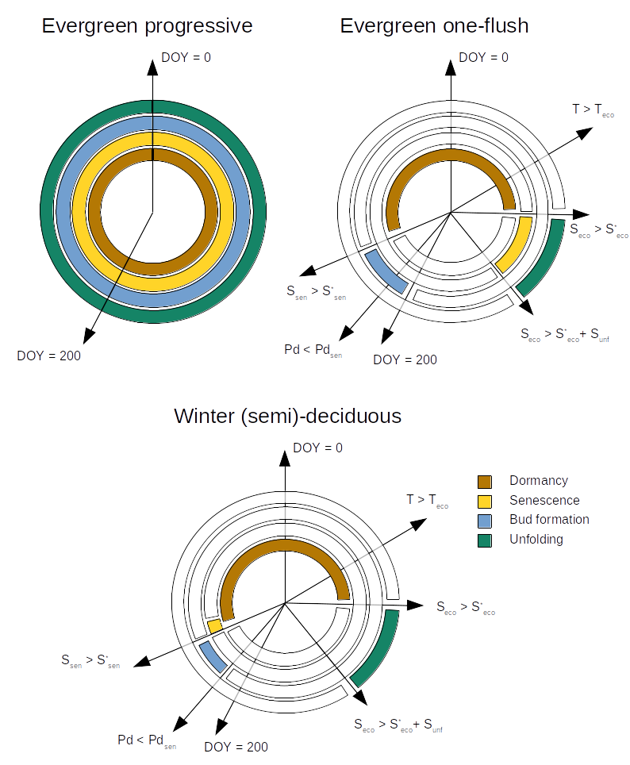

# Leaf phenology and light extinction {#leafphenologylight}

Leaf phenology determines seasonal variations in the surface area of leaves, hence influencing the energy and water exchange between plants and the atmosphere. Light extinction is an important process to consider in a model where plants have different heights.  

## Leaf phenology  {#leafphenology}

### Phenological types and leaf expanded area

Plant species can have either *progressive evergreen*, *one-flush evergreen*, *winter-deciduous*, *winter semi-deciduous* or *drought-deciduous* leaf phenology (see Fig. 4.1). Progressive evergreen plants are assumed to shed old leaves at the same time as new leaves appear, so that the leaf area remains constant throughout the year. One-flush evergreen plants concentrate leaf unfolding and leaf senescence during similar periods, so that leaf area is also approximately constant year-round. In winter-deciduous plants, leaf shedding and leaf bud formation occurs in autumn. Buds remain under dormancy until spring, when budburst and unfolding occurs. The difference between semi-deciduous and deciduous plants is that the former retain dead leaves in the plant until next season unfolding period, so that leaf fall is retarded. Finally, drought-deciduous plants behave like progressive-evergreen plants except that they can shed their leaves in response to drought.

```{r, out.width='80%', fig.align="center", fig.cap="Schematic representation of leaf phenology types", echo=FALSE}

```

Evergreen plants thus maintain constant leaf area over the year, whereas in deciduous plants leaf-expanded status is updated daily, represented by $\phi_i$, the fraction of maximum leaf area:

\begin{equation}
LAI_{i}^{\phi}=LAI^{live}_i\,\cdot\phi_i
\end{equation}
whereas for evergreen species $LAI_{i}^{\phi}=LAI^{live}_i$ (or equivalently $\phi_i = 1$ at all times).

The general structure of process based phenological models explained in @Chuine2013. These models aim determine, for a given phenological phase $n$ (endodormancy, ecodormancy, maturation, etc), the day of its finalisation $d_n$, such that the following equation holds:
\begin{equation} 
S_{n,d} = \sum_{d_{n-1}}^{d_n} R_{n,d} = S_n^*
\end{equation}
where $S_{n,d}$ is the state of development on day $d$ in phase $n$, and $d_{n-1}$ is the end of the previous phase. $R_{n,d}$ is the rate of development during phase $n$ on day $d$, which depends on environmental variables (temperature, photoperiod,...) and $S_n^*$ is the critical threshold to achieve the change of phase. 

In the water balance model leaf area index ($LAI$) values of winter (semi-)deciduous plants are adjusted for leaf phenology following a leaf development model in spring and a leaf senescence model in autumn. Function `pheno_updateLeaves()` updates the status of expanded leaves and dead leaves in a simulation object.

### Bud burst and leaf unfolding {#leafphenobudburst}
Transition from ecodormancy to bud burst is estimated using a very simple one-phase ecodormancy model (also called the spring warming model) implemented in function `pheno_leafDevelopmentStatus()`. Given a base temperature ($T_{eco}$, in $^{\circ}\mathrm{C}$), the rate of development during the ecodormancy phase ($R_{eco}$, in $^{\circ} \mathrm{C}$) is zero for those days where mean temperature $T_{mean}$ is below $T_{eco}$ and  $T_{mean} - T_{eco})$ for those days where temperatures become warmer than this threshold:
\begin{equation}
R_{eco,d}(T_d) = \begin{cases} 
                      0  & T_d \leq T_{eco} \\
                      T_d - T_{eco}  & T_d > T_{eco}
                 \end{cases}
\end{equation}
Degree accumulation starts after the year date surpasses parameter $t_{0,eco}$. If $DOY > t_{0,eco}$, daily $R_{eco,d}$ values are added to the cumulative sum $S_{eco,d}$ and budburst occurs when $S_{eco,d} > S_{eco}^*$. Both $T_{eco}$ and $S_{eco}^*$ are plant-specific parameters in `spwbInput`. 

After budburst, we model progressive leaf unfolding in a similar manner, by accumulating degree days using the same definition as for $R_{eco,d}$:
\begin{equation}
R_{unf,d} = R_{eco,d}
\end{equation}
and then defining an unfolding development status $S_{unf,d} = \sum_{d,eco}^{d} R_{unf,d}$, which we use to determine $\phi_{i,d}$, the degree of leaf expansion of cohort $i$ at day $d$:
\begin{equation}
\phi_{i,d} = S_{unf,d}/S_{unf}^*
\end{equation}
until $S_{unf,d} \geq S_{unf}^*$ and the unfolding process ends, where $S_{unf}^*$ is a simulation control parameter `unfoldingDD`.

### Leaf senescence {#leafphenosenescence}
Leaf senescence follows the models developed by @Delpierre2009. The daily rate of development of senescence $R_{sen,d}$ is defined on the basis of daily photoperiod ($Ph_{d}$, in hours) and temperature ($T_d$, in $^{\circ} \mathrm{C}$):
\begin{equation}
R_{sen,d}(Ph_d, T_d) = \begin{cases} 
                            0  & T_d \geq T_{sen} \,\, or \,\, Ph_d>Ph_{sen} \\
                           (T_d - T_{sen})^{x_{sen}} \cdot (Ph_d/Ph_{sen})^{y_{sen}}  & T_d < T_{sen} \,\,and \,\, Ph_d<Ph_{sen}
                       \end{cases}
\end{equation}
where $Ph_{sen}$ is the maximum photoperiod to start counting the senescence; ${x_{sen}}$ and ${y_{sen}}$ are exponents regulating the importance of temperature and photoperiod on leaf senescence. The state of development of senescence $S_{sen,d}$ is defined
\begin{equation} 
S_{sen,d} = \sum R_{sen,d}
\end{equation}
and when $S_{sen,d}  \geq  S_{sen}^*$ then expanded leaves are assumed to suddenly die. This model is implemented in function `pheno_leafSenescenceStatus()` and returns $\phi_{i,d}=1$ for all days until $S_{sen,d}  \geq  S_{sen}^*$ when it returns $\phi_{i,d}=0$. Parameters $T_{sen}$, $Ph_{sen}$ and $S_{sen}^*$ are plant-specific parameters in `spwbInput`.  

### Leaf abscission
The drop of $\phi_i$ causes live expanded leaves to become dead leaves. To avoid a sudden decrease of leaf area, dead leaves are kept in the canopy and they are reduced daily using a negative exponential function of wind speed:
\begin{equation}
LAI^{dead}_i=LAI^{dead}_i\,\cdot e^{- u/10}
\end{equation}
where $u$ is wind speed in ($m \cdot s^{-1}$).


## Light extinction {#basiclightextinction}
The proportion of photosynthetically active radiation (PAR) and short-wave radiation (SWR; 400-3000 nm) decreases through the canopy following the Beer-Lambert’s light extinction equation. 
$L^{PAR}_{ground}$, the proportion of PAR that reaches the ground, is calculated as:
\begin{equation}
L^{PAR}_{ground}=e^{-\sum_{i=1}^{c}{k_{PAR,i} \cdot LAI_{i}^{all}}}
\end{equation}
where $k_{PAR,i}$ is the PAR extinction coefficient of cohort $i$. 

The proportion of short-wave radiation (SWR) energy absorbed by each plant cohort needs to be calculated to divide the transpiration of the stand among cohorts (chapter \@ref(transpirationgranier)), and the radiation absorbed by the soil is needed to calculate soil evaporation (section \@ref(soilevaporation)). Foliage absorbs a higher proportion of PAR than SWR; thus, the extinction coefficient is higher for PAR than for SWR. However, values for the ratio of extinction coefficients are rather constant. Following Friend et al. [-@Friend1997] it is assumed that the extinction coefficient for PAR is 1.35 times larger than that for SWR (i.e.
$k_{SWR,i} = k_{PAR,i}/1.35$). Figure \@ref(fig:lightextinction) shows the PAR and SWR extinction profiles (see functions `vprofile_PARExtinction()` and `vprofile_SWRExtinction()`) corresponding to the leaf area density distribution of Fig. \@ref(fig:leafareadensity). 

```{r lightextinction, fig.width=8, fig.height=4, fig.align='center', echo=FALSE, fig.cap="Light extinction in a forest stand. Note the sharper decrease of PAR (left panel) in comparison to SWR (right panel)"}
g1<-vprofile_PARExtinction(exampleforestMED, SpParamsMED, z = seq(0,1000, by=1))
g2<-vprofile_SWRExtinction(exampleforestMED, SpParamsMED, z = seq(0,1000, by=1))
plot_grid(g1, g2, nrow=1, ncol=2)
```

To calculate radiation absorption, where the vertical dimension of the plot is divided into layers (as explained in \@ref(leafdistribution)), and the SWR absorbed is calculated for each plant cohort in each layer. Let $l$ be the number of vertical layers. The fraction of radiation incident on layer $j$ that is absorbed in the same layer is:
\begin{equation}
f_j=1 - e^{-\sum_{i=1}^{c}{k_{SWR,i} \cdot LAI_{i,j}^{all}}}
\end{equation}
where $LAI_{i,j}^{all}$ is the leaf area index of cohort $i$ in layer $j$. Hence, the fraction transmitted is $(1-f_j)$. The fraction of radiation incident on layer $j$ that is absorbed by expanded leaves of plant cohort $i$ in that layer ($f_{ij}$) is calculated from the relative
contribution of these leaves to the total absorption in the layer:
\begin{equation}
f_{ij} = f_j \cdot \frac{k_{SWR,i}\cdot LAI_{i,j}^{\phi}}{\sum_{h=1}^{c}{k_{SWR,h} \cdot LAI_{h,j}^{all}}}
\end{equation}
The fraction of canopy radiation absorbed by a plant cohort $i$ across all layers is found by adding the fraction absorbed in each layer:
\begin{equation}
f_i = \sum_{j=1}^{l}{f_{ij}\cdot \prod_{h>j}^{l}{(1-f_h)}}
\end{equation}
where for each layer the fraction of the radiation incident in the canopy that
reaches the layer is found by multiplying the transmitted fractions across the
layers above it. For example, the fraction of SWR absorbed by each of the three cohorts of the example in Fig. \@ref(fig:leafareadensity) would be (see function `light_cohortAbsorbedSWRFraction()`):
```{r, echo=FALSE}
caswrf = light_cohortAbsorbedSWRFraction(seq(0,1000, by=10), exampleforestMED, SpParamsMED)
caswrf
```

The proportion of (shortwave) net radiation absorbed by the
ground is simply:
\begin{equation}
L^{SWR}_{ground} = 1 - \sum_{j}^{l}{f_j}
\end{equation}
which in our example would be:
```{r, echo=FALSE}
1-sum(caswrf)
```
as also shown in Fig. \@ref(fig:lightextinction).