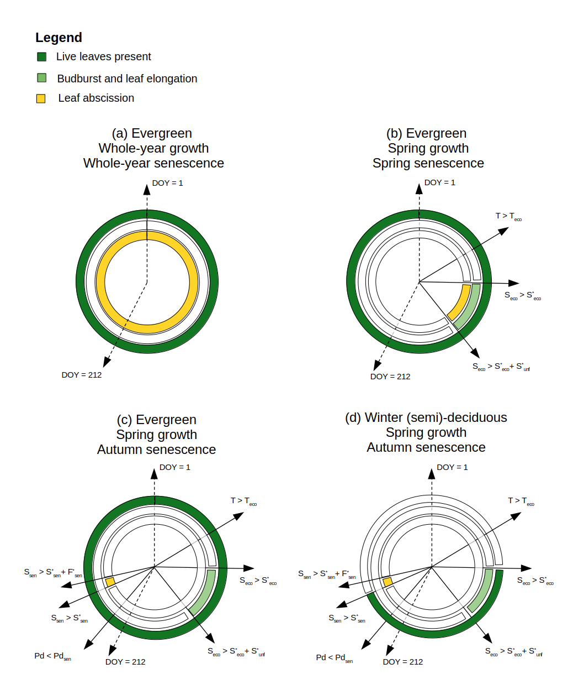

# Leaf phenology and radiation extinction {#leafphenologylight}

Leaf phenology determines seasonal variations in the surface area of leaves, hence influencing the energy and water exchange between plants and the atmosphere. Radiation extinction is an important process to consider in a model where plants have different heights.  

## Leaf phenology  {#leafphenology}


### Leaf phenology and phenological models

The following three phenological types are currently distinguished (see parameter `PhenologyType`):

  + *Evergreen*: Evergreen plants involve continuous presence of leaves throughout the year, although the the amount of leaves can vary seasonally.
  + *Winter-deciduous*: In winter-deciduous plants, all leaves are shed in autumn and buds remain under dormancy until spring, when budburst and elongation occurs. Therefore, the plant has a non-zero leaf area during the period limited by leaf elongation and leaf shedding events. 
  + *Winter semi-deciduous*: Winter semi-deciduous plants are like deciduous ones, with the difference that they retain dead leaves in the plant until next season elongation period, so that leaf abscission is retarded. 

Whereas leaves of deciduous plants always undergo senescence in autumn and new leaves are flushed in spring, different strategies can be distinguished with respect to seasonality in evergreen plants. In particular, we distinguish two possibilities for leaf growth period (parameter `GrowthPeriod`) - i.e. *whole-year growth* vs. *spring growth* -  and three possibilities for leaf senescence period (parameter `SenescencePeriod`)  - i.e. *whole-year senescence* vs *autumn senescence* or *spring senescence* - . 

The most usual combinations of phenology type and growth/senescence periods are shown in Fig. \@ref(fig:leafphenology) (see also primary growth phenology in \@ref(growthdesign)):

```{r leafphenology, out.width='100%', fig.align="center", fig.cap="Schematic representation of processes and timings for different leaf phenology types", echo=FALSE}

```

Evergreen plants with whole-year leaf senescence and growth are typical of tropical regions and they keep the same amount of leaves constant throughout the year (unless there is cavitation-induced defoliation). Evergreen plants with spring senescence and spring growth result also in the same amount of leaves more or less constant throughout the year. In contrast, evergreen plants with spring growth and autumn senescence result in lower amount of leaves during winter, determined from their leaf lifespan.

### Leaf phenological models

In winter-deciduous leaf phenology (or evergreens with autumn leaf senescence and spring growth), leaf-expanded status is updated daily, represented by $\phi_i$, the fraction of maximum leaf area for cohort $i$:

\begin{equation}
LAI_{act,i}=LAI_{live,i}\,\cdot\phi_i
\end{equation}
whereas for evergreen species $LAI_{act,i}=LAI_{live,i}$ (or equivalently $\phi_i = 1$ at all times).

The general structure of process based phenological models explained in @Chuine2013. These models aim to determine, for a given phenological phase $n$ (endodormancy, ecodormancy, maturation, etc), the day of its finalisation $d_n$, such that the following equation holds:
\begin{equation} 
S_{n,d} = \sum_{d_{n-1}}^{d_n} R_{n,d} = S_n^*
\end{equation}
where $S_{n,d}$ is the state of development on day $d$ in phase $n$, and $d_{n-1}$ is the end of the previous phase. $R_{n,d}$ is the rate of development during phase $n$ on day $d$, which depends on environmental variables (temperature, photoperiod,...) and $S_n^*$ is the critical threshold to achieve the change of phase. 

In the water balance model, leaf area index ($LAI$) values of winter (semi-)deciduous plants are adjusted for leaf phenology following a leaf development model in spring and a leaf senescence model in autumn. Similarly, evergreen species whose leaf growth period is in spring but leaf senescence occurs in autumn also have a $LAI$ that varies according to those models. Function `pheno_updateLeaves()` updates the status of expanded leaves and dead leaves in a simulation object. Regardless of leaf phenology type, when control parameter `cavitationInducedDefoliation = TRUE` the function `pheno_updateLeaves()` will take into account the degree of cavitation (i.e. using $PLC_{leaf}$) to determine the degree of defoliation (see \@ref(cavitationinduceddefoliationbasic)).


### Bud burst and leaf unfolding {#leafphenobudburst}
Transition from ecodormancy to bud burst is estimated using a very simple one-phase ecodormancy model (also called the spring warming model) implemented in function `pheno_leafDevelopmentStatus()`. Given a base temperature ($T_{eco}$, in $^{\circ}\mathrm{C}$), the rate of development during the ecodormancy phase ($R_{eco}$, in $^{\circ} \mathrm{C}$) is zero for those days where mean temperature $T_{mean}$ is below $T_{eco}$ and  $T_{mean} - T_{eco})$ for those days where temperatures become warmer than this threshold:
\begin{equation}
R_{eco,d}(T_d) = \begin{cases} 
                      0  & T_d \leq T_{eco} \\
                      T_d - T_{eco}  & T_d > T_{eco}
                 \end{cases}
\end{equation}
Degree accumulation starts after the year date surpasses parameter $t_{0,eco}$. If $DOY > t_{0,eco}$, daily $R_{eco,d}$ values are added to the cumulative sum $S_{eco}$ and budburst occurs the first day that $S_{eco} \geq S_{eco}^*$  (see Fig. \@ref(fig:leafphenology)). Both $T_{eco}$ and $S_{eco}^*$ are plant-specific parameters in `spwbInput`. 

After budburst, we model progressive leaf unfolding and elongation in a similar manner, by accumulating degree days using the same definition as for $R_{eco,d}$ and then defining an unfolding development status $S_{unf} = S_{eco} - S_{eco}^*$, which we use to determine $\phi_{i}$, the degree of leaf elongation of cohort $i$:
\begin{equation}
\phi_{i} = S_{unf}/S_{unf}^* = ( S_{eco} - S_{eco}^* )/S_{unf}^*
\end{equation}
where $S_{unf}^*$ is another plant-specific parameter of `spwbInput`. The leaf elongation process continues until $S_{unf} \geq S_{unf}^*$ (equivalently, when $S_{eco} \geq S_{eco}^* + S_{unf}^*$, see Fig. \@ref(fig:leafphenology)). By design, leaf elongation cannot extend beyond $DOY = 212$ (corresponding to 31st July in the northern hemisphere), i.e. the phenology submodel forces $\phi_{i} = 1$ at this date.

### Leaf senescence {#leafphenosenescence}
Leaf senescence for deciduous or evergreen plants with autumn senescence extends the design of the models developed by @Delpierre2009 for leaf colouring. The daily rate of senescence forcing $R_{sen,d}$ is defined on the basis of daily photoperiod ($Ph_{d}$, in hours) and temperature ($T_d$, in $^{\circ} \mathrm{C}$):
\begin{equation}
R_{sen,d}(Ph_d, T_d) = \begin{cases} 
                            0  & T_d \geq T_{sen} \,\, \mathrm{or} \,\, Ph_d>Ph_{sen} \\
                           (T_{sen} - T_d)^{x_{sen}} \cdot (Ph_d/Ph_{sen})^{y_{sen}} & T_d < T_{sen} \,\, \mathrm{and} \,\, Ph_d<Ph_{sen}
                       \end{cases}
\end{equation}
where $Ph_{sen}$ is the maximum photoperiod to start counting the senescence; $T_{sen}$ is the base temperature for the calculation of degrees of forcing senescence; ${x_{sen}}$ and ${y_{sen}}$ are exponents regulating the importance of temperature and photoperiod on leaf senescence. The state of development of senescence $S_{sen}$ is defined as the sum of senescence forcing:
\begin{equation} 
S_{sen} = \sum R_{sen,d}
\end{equation}
The ratio $S_{sen}/S_{sen}^*$ can be conceptually understood as the proportion of chlorophyll degradation and nutrient translocation in crown leaves (but at present it is not used to downregulate transpiration nor photosynthesis). When $S_{sen}  \geq  S_{sen}^*$ then leaves are assumed to have lost their green color (i.e. turned yellow or brown) and be ready for the terminal senescence phase (see Fig. \@ref(fig:leafphenology)), which involves cell death and separation in the abscission zone. From this point on, the fraction of crown leaves that are considered ready to abscission and fall increases due to further forcing accumulation, until $S_{sen}  \geq  S_{sen}^* + F_{sen}^*$ (see Fig. \@ref(fig:leafphenology)). The senescence submodel is implemented in function `pheno_leafSenescenceStatus()` and returns $\phi_{i,d}=1$ for all days until $S_{sen}  \geq  S_{sen}^*$. After that, the function returns progressively lower values, dictated by $\phi_{i,d}=(S_{sen} - S_{sen}^*)/F_{sen}$. Parameters $Ph_{sen}$, $T_{sen}$, $x_{sen}$, $y_{sen}$, $S_{sen}^*$ and $F_{sen}^*$ are plant-specific parameters in `spwbInput`.  

### Leaf abscission and fall {#leafabscission}
The decrease in $\phi_i$ causes live expanded leaves to become dead leaves, still attached to branches but ready to be detached by wind action. Dead leaves are kept in the canopy and they are reduced daily using a negative exponential function of wind speed:
\begin{equation}
LAI_{dead,i, d}=LAI_{dead,i,d-1}\,\cdot e^{- u/10}
\end{equation}
where $u$ is wind speed in ($m \cdot s^{-1}$), $LAI_{dead,i,d-1}$ is the dead leaf area index of the previous day and $LAI_{dead,i,d}$ is the dead leaf area index of the current day.


## Radiation extinction {#basiclightextinction}
The proportion of photosynthetically active radiation (PAR) and short-wave radiation (SWR; 400-3000 nm) decreases through the canopy following the Beer-Lambert’s light extinction equation. 
$L^{PAR}_{herb}$, the proportion of PAR that reaches the herbaceous layer, is calculated as:
\begin{equation}
L^{PAR}_{herb}=\exp \left(-\sum_{i=1}^{c}{k_{PAR,i} \cdot LAI_{all,i} + k_{PAR, mistletoe} \cdot LAI_{mistletoe,i}} \right)
\end{equation}
where $k_{PAR,i}$ is the PAR extinction coefficient of plant cohort $i$ and $k_{PAR,mistletoe}$ is the PAR extinction coefficient of mistletoe. If we add the extinction caused by the herbaceous layer, we have that $L^{PAR}_{ground}$, the proportion of PAR that reaches the ground, is calculated as:
\begin{equation}
L^{PAR}_{ground}=L^{PAR}_{herb}e^{-0.5 \cdot LAI_{herb}}
\end{equation}
Where herbaceous vegetation is assumed to have a fixed extinction coefficient. 

We can also define $L^{PAR}$ as the proportion of PAR available for a given plant cohort, which we associate to the PAR available at a height corresponding to half of the cohort's crown. This height will include some self-shading of the target cohort.

The proportion of short-wave radiation (SWR) energy absorbed by each plant cohort needs to be calculated to divide the transpiration of the stand among cohorts (chapter \@ref(transpirationgranier)), and the radiation absorbed by the soil is needed to calculate soil evaporation (section \@ref(soilevaporation)). Foliage absorbs a higher proportion of PAR than SWR; thus, the extinction coefficient is higher for PAR than for SWR. However, values for the ratio of extinction coefficients are rather constant. Following Friend et al. [-@Friend1997] it is assumed that the extinction coefficient for PAR is 1.35 times larger than that for SWR (i.e.
$k_{SWR,i} = k_{PAR,i}/1.35$). Figure \@ref(fig:lightextinction) shows the PAR and SWR extinction profiles (see functions `vprofile_PARExtinction()` and `vprofile_SWRExtinction()`) corresponding to the leaf area density distribution of Fig. \@ref(fig:leafareadensity). 

```{r lightextinction, fig.width=8, fig.height=4, fig.align='center', echo=FALSE, fig.cap="Light extinction in a forest stand. Note the sharper decrease of PAR (left panel) in comparison to SWR (right panel)"}
g1<-vprofile_PARExtinction(exampleforest, SpParamsMED, z = seq(0,1000, by=1), includeHerbs = TRUE)
g2<-vprofile_SWRExtinction(exampleforest, SpParamsMED, z = seq(0,1000, by=1), includeHerbs = TRUE)
plot_grid(g1, g2, nrow=1, ncol=2)
```

To calculate radiation absorption, where the vertical dimension of the plot is divided into layers (as explained in \@ref(leafdistribution)), and the SWR absorbed is calculated for each plant cohort in each layer. Let $l$ be the number of vertical layers. The fraction of radiation incident on layer $j$ that is absorbed in the same layer is:
\begin{equation}
f_j=1 - \exp \left(-\sum_{i=1}^{c}{k_{SWR,i} \cdot LAI_{all, i,j} + k_{SWR, mistletoe} \cdot LAI_{mistletoe,i,j}} \right)
\end{equation}
where $LAI_{all,i,j}$ is the leaf area index of cohort $i$ in layer $j$ and $LAI_{mistletoe,i,j}$ is the leaf area index of mistletoe of cohort $i$ in layer $j$. Hence, the fraction transmitted is $(1-f_j)$. The fraction of radiation incident on layer $j$ that is absorbed by expanded leaves of plant cohort $i$ in that layer ($f_{ij}$) is calculated from the relative contribution of these leaves to the total absorption in the layer:
\begin{equation}
f_{ij} = f_j \cdot \frac{k_{SWR,i}\cdot LAI_{act, i,j}}{\sum_{h=1}^{c}{k_{SWR,h} \cdot LAI_{all, h,j} + k_{SWR, mistletoe} \cdot LAI_{mistletoe,h,j}}}
\end{equation}
The fraction of canopy radiation absorbed by a plant cohort $i$ across all layers is found by adding the fraction absorbed in each layer:
\begin{equation}
f_i = \sum_{j=1}^{l}{f_{ij}\cdot \prod_{h>j}^{l}{(1-f_h)}}
\end{equation}
where for each layer the fraction of the radiation incident in the canopy that
reaches the layer is found by multiplying the transmitted fractions across the
layers above it. For example, the fraction of SWR absorbed by each of the three cohorts of the example in Fig. \@ref(fig:leafareadensity) would be (see function `light_cohortAbsorbedSWRFraction()`):
```{r, echo=FALSE}
caswrf = light_cohortAbsorbedSWRFraction(seq(0,1000, by=10), exampleforest, SpParamsMED)
caswrf
```
