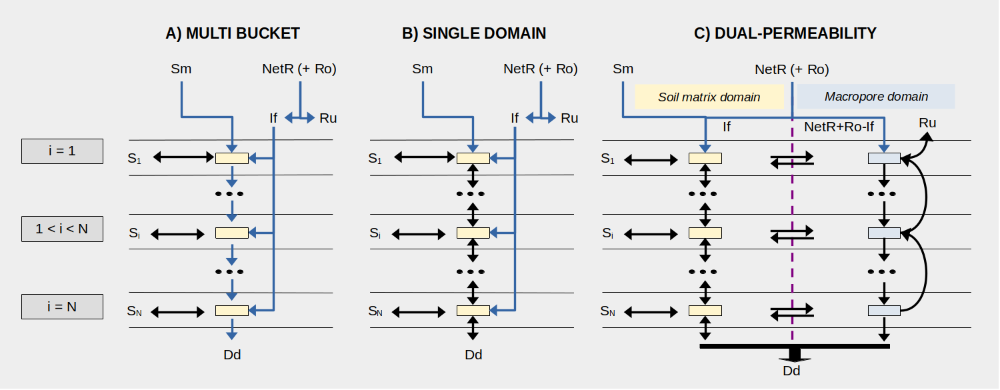

# Forest hydrology {#hydrology}

Forest hydrological processes are key for soil and plant water balances. This chapter details the design and implementation of most of the vertical hydrological processes included in package **medfate**. These processes determine the value of the water flows mentioned in eq. \@ref(eq:basicwaterbalanceequation). The only process that is not described here is woody plant transpiration ($Tr_w$), as it will be covered in detail in chapter \@ref(transpirationgranier).

Although each process can be simulated in specific sub-model functions, function `hydrology_verticalInputs()` allows simulating soil water input processes altogether, including canopy water interception, snow accumulation/melt, soil infiltration and percolation.

## Snow and rainfall {#precipitation}

Precipitation ($P$) is considered be snow precipitation ($Ps$) when $T_{mean}<0$, and is considered rainfall ($Pr$) otherwise. Thus, we have:
\begin{equation}
P = Pr + Ps
\end{equation}

Interception of snow by the canopy is neglected, and all snow is assumed to accumulate in a single storage compartment $S_{snow}$ over the soil (i.e. canopy snow storage capacity is neglected). Rainfall interception is described in section \@ref(interception).

## Snow pack dynamics {#snowpack}

 A very simple snow submodel is used for snow pack dynamics (accumulation and melt), taken from @Kergoat1998. When mean air temperature is above 0 Celsius ($T_{mean}>0$), a simple energy budget relates snow melt, $Sm$ (mm), to air temperature and soil-level radiation (see function `hydrology_snowMelt()`):
\begin{equation}
Sm = \frac{Rad\cdot L^{SWR}_{ground}\cdot (1-\alpha_{ice}) + \tau_{day} \cdot T_{mean} \cdot \rho_{air} \cdot C_p/r_{s}}{\lambda_{ice}}
\end{equation}
where $Rad$ is solar radiation ($MJ \cdot m^{-2}$), $L^{SWR}_{ground}$ is the fraction of (short-wave) radiation reaching the ground, $\alpha_{ice} = 0.9$ is the albedo of snow, $\tau_{day} = 86400$ is the day duration in seconds, $\rho_{air}$ is the air density ($kg \cdot m^{-3}$), depending on temperature and elevation (see [utility functions](http://emf-creaf.github.io/meteolandbook/miscellaneous.html#physicalutils)  of the **meteoland** reference manual), $C_{p} = 1013.86 \cdot 10^{-6}\, MJ \cdot kg^{-1} \cdot C^{-1}$ is the specific heat capacity of the air and $r_{s} = 100\,s \cdot m^{-1}$ is the snow aerodynamic resistance and $\lambda_{ice} = 0.33355\, MJ \cdot kg^{-1}$ is the (latent) heat of fusion of snow. 

## Rainfall interception loss {#interception}

As mentioned above, interception loss is only modelled for liquid precipitation (i.e. snow interception is not modelled). Rainfall interception loss, $In$, is estimated using either the @Gash1995 or @liu_evaluation_2001 models. 

### Gash (1995) model

In the @Gash1995 analytical interception model for sparse canopies, rain is assumed to fall in a single event during the day. First, the amount of rainfall needed to saturate the canopy is calculated: 
\begin{equation}
P_G = - \frac{S_{canopy}/C_{canopy}}{ER_{ratio}} \cdot \ln(1-ER_{ratio})
\end{equation}
where $S_{canopy}$ is the canopy water storage capacity (in mm) –  i.e. the minimum amount of water needed to saturate the canopy –, $C_{canopy}$ is the canopy cover and $ER_{ratio}$ is the ratio of evaporation rate to rainfall intensity during the rainfall event ($R_{int}$; in $mm \cdot h^{-1}$). Although interception models are normally applied to single-canopy stands, we apply the sparse Gash model to the whole stand (including shrubs and the herbaceous layer). Moreover, in our implementation stem interception is lumped with crown interception, so that $S_{canopy}$ represents both. 

Following @Watanabe1996 we estimate $S_{canopy}$, the canopy water storage capacity, from adjusted LAI values:
\begin{equation}
S_{canopy}=LAI_{herb}+\sum_{i}{s_{water,i}\cdot LAI_{i}^{\phi}}
\end{equation}
where $s_{water,i}$ is the depth of water that can be retained by leaves, branches and stems of cohort $i$ per unit of leaf area index ($mm \cdot LAI^{-1}$). To estimate the stand cover, $C_{canopy}$, we use the complement of the percentage of PAR that reaches the ground, i.e. $C_{canopy} = 1 - L^{PAR}_{ground}$ [@Deguchi2006].


The amount of water evaporated from interception ($In$, in mm), is calculated as:
\begin{eqnarray}
In = C_{canopy}\cdot P_G+C_{canopy}\cdot ER_{ratio}\cdot(Pr-P_G) \: {if}\: Pr > P_G \\
In = C_{canopy}\cdot Pr\: {if}\: Pr \leq P_G
\end{eqnarray}
where $Pr$ is the daily gross rainfall (in mm). Net rainfall ($Pr_{net}$, also in mm) includes throughfall and stemflow, and is calculated as the difference between gross rainfall and interception loss. Fig. \@ref(fig:interceptionGash) below shows examples of relative throughfall (including stemflow), calculated according to the Gash et al [-@Gash1995]  interception model, under different situations (see function `hydrology_rainInterception()`). 

(ref:interceptionGash-cap) Examples of canopy interception with different $S_{canopy}$ (canopy water storage capacity), $ER_{ratio}$ (ratio between evaporation and rainfall rates) and $p$ (throughfall coefficient; $p = 1 - C_{canopy}$), using the Gash (1995) model.

```{r interceptionGash, echo=FALSE, fig.width=8, fig.height=8,  fig.align='center', fig.cap='(ref:interceptionGash-cap)'}
par(mfrow=c(2,2), mar=c(5,5,5,1))
throughfallMatrixGash<-function(P = seq(1,50, by=1), Cm = seq(1,5, by=1), ER = 0.08,p=0.8) {
  m2<-P-hydrology_rainInterception(P,Cm[1],p,ER=ER)
  for(i in 2:length(Cm)) {
    m2<-rbind(m2,P-hydrology_rainInterception(P,Cm[i],p,ER=ER))
  }
  colnames(m2)<-P
  rownames(m2)<-Cm
  return(m2)
}

Cm = c(0.5,seq(1,4, by=1))
P = seq(1,50, by=1)

m2 = throughfallMatrixGash(P=P, p=0.2, Cm=Cm,ER = 0.05)
rt = sweep(m2,2,P,"/")*100
matplot(t(rt), type="l", axes=TRUE, ylab="Relative throughfall (%)", 
        xlab="Gross rainfall (mm)", xlim=c(0,length(P)), 
        lty=1:length(Cm), col="black", ylim=c(0,100))
title(main="p = 0.2 E/R = 0.05")
m2 = throughfallMatrixGash(P=P, p=0.8, Cm=Cm,ER = 0.05)
rt = sweep(m2,2,P,"/")*100
matplot(t(rt), type="l", axes=TRUE, ylab="Relative throughfall (%)", 
        xlab="Gross rainfall (mm)", xlim=c(0,length(P)), 
        lty=1:length(Cm), col="black", ylim=c(0,100))
title(main="p = 0.8 E/R = 0.05")
m2 = throughfallMatrixGash(P=P, p=0.2, Cm=Cm,ER = 0.2)
rt = sweep(m2,2,P,"/")*100
matplot(t(rt), type="l", axes=TRUE, ylab="Relative throughfall (%)", 
        xlab="Gross rainfall (mm)", xlim=c(0,length(P)), 
        lty=1:length(Cm), col="black", ylim=c(0,100))
title(main="p = 0.2 E/R = 0.2")
m2 = throughfallMatrixGash(P=P, p=0.8, Cm=Cm,ER = 0.2)
rt = sweep(m2,2,P,"/")*100
matplot(t(rt), type="l", axes=TRUE, ylab="Relative throughfall (%)", 
        xlab="Gross rainfall (mm)", xlim=c(0,length(P)), 
        lty=1:length(Cm), col="black", ylim=c(0,100))
title(main="p = 0.8 E/R = 0.2")

legend("bottomright",lty=1:length(Cm), legend=paste("S =",Cm), bty="n")
```


### Liu (2001) model

In the single-storm form of the @liu_evaluation_2001 model is similar to the @Gash1995 model in terms of its inputs. Rainfall interception during a single storm can be predicted by gross rainfall amount $P_G$, the ratio of evaporation rate to rainfall rate during the rainfall event, $ER_{ratio}$, canopy gap fraction ($C_{canopy}$) and storage capacity ($S_{canopy}$):

\begin{equation}
In = S_{canopy} \cdot \left[ 1.0 - \exp\left(-P_G \cdot \left( \frac{C_{canopy}} {S_{canopy}} \right) \right) \right] \cdot (1.0 - (ER/C_{canopy})) + (ER\cdot P_G)
\end{equation}

Fig. \@ref(fig:interceptionLiu) below shows examples of relative throughfall (including stemflow), calculated according to the Liu et al [-@liu_evaluation_2001]  interception model, under different situations (see function `hydrology_rainInterception()`). 

(ref:interceptionLiu-cap) Examples of canopy interception with different $S_{canopy}$ (canopy water storage capacity), $ER_{ratio}$ (ratio between evaporation and rainfall rates) and $p$ (throughfall coefficient; $p = 1 - C_{canopy}$), using the Liu (2001) model.

```{r interceptionLiu, echo=FALSE, fig.width=8, fig.height=8,  fig.align='center', fig.cap='(ref:interceptionLiu-cap)'}
par(mfrow=c(2,2), mar=c(5,5,5,1))
throughfallMatrixLiu<-function(P = seq(1,50, by=1), Cm = seq(1,5, by=1), ER = 0.08,p=0.8) {
  m2<-P-hydrology_rainInterception(P,Cm[1],p,ER=ER, model = "Liu2001")
  for(i in 2:length(Cm)) {
    m2<-rbind(m2,P-hydrology_rainInterception(P,Cm[i],p,ER=ER, model = "Liu2001"))
  }
  colnames(m2)<-P
  rownames(m2)<-Cm
  return(m2)
}

Cm = c(0.5,seq(1,4, by=1))
P = seq(1,50, by=1)

m2 = throughfallMatrixLiu(P=P, p=0.2, Cm=Cm,ER = 0.05)
rt = sweep(m2,2,P,"/")*100
matplot(t(rt), type="l", axes=TRUE, ylab="Relative throughfall (%)", 
        xlab="Gross rainfall (mm)", xlim=c(0,length(P)), 
        lty=1:length(Cm), col="black", ylim=c(0,100))
title(main="p = 0.2 E/R = 0.05")
m2 = throughfallMatrixLiu(P=P, p=0.8, Cm=Cm,ER = 0.05)
rt = sweep(m2,2,P,"/")*100
matplot(t(rt), type="l", axes=TRUE, ylab="Relative throughfall (%)", 
        xlab="Gross rainfall (mm)", xlim=c(0,length(P)), 
        lty=1:length(Cm), col="black", ylim=c(0,100))
title(main="p = 0.8 E/R = 0.05")
m2 = throughfallMatrixLiu(P=P, p=0.2, Cm=Cm,ER = 0.2)
rt = sweep(m2,2,P,"/")*100
matplot(t(rt), type="l", axes=TRUE, ylab="Relative throughfall (%)", 
        xlab="Gross rainfall (mm)", xlim=c(0,length(P)), 
        lty=1:length(Cm), col="black", ylim=c(0,100))
title(main="p = 0.2 E/R = 0.2")
m2 = throughfallMatrixLiu(P=P, p=0.8, Cm=Cm,ER = 0.2)
rt = sweep(m2,2,P,"/")*100
matplot(t(rt), type="l", axes=TRUE, ylab="Relative throughfall (%)", 
        xlab="Gross rainfall (mm)", xlim=c(0,length(P)), 
        lty=1:length(Cm), col="black", ylim=c(0,100))
title(main="p = 0.8 E/R = 0.2")

legend("bottomright",lty=1:length(Cm), legend=paste("S =",Cm), bty="n")
```


## Bare soil evaporation {#soilevaporation}

Evaporation from the soil surface is the last component of the soil water balance to be calculated before calculating plant transpiration. Bare soil evaporation cannot happen if there is snow over the soil surface (i.e., if $S_{snow}>0$). 

Potential evaporation from the soil ($PE_{soil}$; in $mm \cdot day^{-1}$) is defined as the product between $PET$ and $L^{SWR}_{ground}$, the proportion of SWR absorbed by the ground:
\begin{equation}
PE_{soil} =  PET \cdot L^{SWR}_{ground}
\end{equation}

Actual evaporation from the soil surface is modeled as in @Mouillot2001, who in turn followed @Ritchie1972.  First, the model determines $t_{soil}$, the time needed to evaporate the current water deficit (difference between field capacity and current moisture) in the surface soil layer:
\begin{equation}
t_{soil} = \left \{ \frac{V_{fc,1}\cdot(1- W_1)}{\gamma_{soil}} \right \}
\end{equation}
where $V_{fc,1}$  is the water retention capacity of layer 1, $W_1$ is the proportion of moisture in relation to field capacity of layer 1 and $\gamma_{soil}$ is the maximum daily evaporation ($mm \cdot day^{-1}$). The calculated time is used to determine the ‘supplied’ evaporation, $SE_{soil}$:
\begin{equation}
SE_{soil} = \gamma_{soil} \cdot (\sqrt{t_{soil}+1}-\sqrt{1})
\end{equation}
The amount of water actually evaporated from the soil, $Es$, is then calculated as the minimum between supply, $SE_{soil}$, and demand [@Federer1982], i.e. $PE_{soil}$ (see function `hydrology_soilEvaporationAmount`): 

\begin{equation}
Es = \min(PE_{soil}, SE_{soil})
\end{equation}

Figure \@ref(fig:soilevaporation) shows the cumulative evaporation from soils for different values of maximum evaporation rate.

(ref:soilevaporation-cap) Cumulative bare soil evaporation for different values of maximum evaporation rate ($\gamma_{soil}$). Topsoil layer (0 – 30 cm) is initialized at field capacity ($V_1 = 50 mm$). $PE_{soil}$ was assumed not to be limiting. 

```{r soilevaporation, fig.width=5, fig.height=4, echo=FALSE, fig.align='center', fig.cap='(ref:soilevaporation-cap)'}

TS_clay=10
TS_silt=65
TS_sand=25
TS_gravel=40
SS_clay=10
SS_silt=65
SS_sand = 25
SS_gravel=40
TS_macro=0.25
TS_micro = 0.75
SS_macro=0.10
SS_micro=0.90
#Rock layer is like subsoil but with 95% of rocks
RL_clay = SS_clay
RL_sand = SS_sand
RL_macro = SS_macro
RL_micro = SS_micro
RL_gravel = 95


RunEvaporation<-function(Gsoil, d1,d2,d3, numDays = 15){
  PET = 100 #Not limited by PET
  Lground = 1
  
  Theta_FC1=soil_psi2thetaSX(TS_clay, TS_sand, -33) #in m3/m3
  pcTS_gravel = 1-(TS_gravel/100)
  MaxVol1 = (d1*Theta_FC1*pcTS_gravel)

  W1=rep(0, numDays)
  W1[1] = 1
  Esoil = rep(NA,numDays)
  EsoilCum = rep(NA,numDays)
  t = rep(NA, numDays)
  for(i in 1:numDays){
    #Evaporation from bare soil
    Esoil[i] = hydrology_soilEvaporationAmount(DEF=(MaxVol1*(1 - W1[i])), PETs = PET*Lground, Gsoil = Gsoil)
    if(i==1) EsoilCum[i] = Esoil[i]
    else EsoilCum[i] = EsoilCum[i-1]+Esoil[i]
    if(i<numDays){
      W1[i+1] = max(W1[i]-(Esoil[i])/MaxVol1,0)
    }  
  }
  return(list(Esoil = Esoil, EsoilCum = EsoilCum))  
}

E11=RunEvaporation(Gsoil=1, d1=300, d2=1200, d3= 2500)
E12=RunEvaporation(Gsoil=2, d1=300, d2=1200, d3= 2500)
E13=RunEvaporation(Gsoil=3, d1=300, d2=1200, d3= 2500)


par(mar=c(4,4,1,1))
plot(x=1:length(E11$EsoilCum), y=E11$EsoilCum, ylim=c(0,15), ylab="Cummulative soil evaporation (mm)", xlab="day", type="l", axes=FALSE)
axis(1, at=1:length(E11$EsoilCum), cex.axis=0.7)
axis(2)
points(x=1:length(E11$EsoilCum), y=E11$EsoilCum, pch=1)
lines(x=1:length(E12$EsoilCum), y=E12$EsoilCum, lty=2)
points(x=1:length(E12$EsoilCum), y=E12$EsoilCum, pch=1)
lines(x=1:length(E13$EsoilCum), y=E13$EsoilCum, lty=3)
points(x=1:length(E13$EsoilCum), y=E13$EsoilCum, pch=1)
legend("topleft", lty=1:3, legend=c("Gsoil = 1", 
                                    "Gsoil = 2", 
                                    "Gsoil = 3"), cex = 0.7, bty="n")
```

## Transpiration of the herbaceous layer {#herbaceoustranspiration}

Transpiration of herbaceous layer is modelled analogously to the transpiration of woody plants. First, potential evapotranspiration from the herbaceous layer ($PET_{herb}$; in $mm \cdot day^{-1}$) is defined as the product between $PET$ and $L^{SWR}_{herb}$, the proportion of SWR reaching the herbaceous layer:
\begin{equation}
PET_{herb} =  PET \cdot L^{SWR}_{herb}
\end{equation}
Thus, the more dense the woody plant canopy, the lower herbaceous transpiration will be. Maximum herbaceous transpiration $Tr_{herb, \max}$ depends on both $PET_{herb}$ and the amount of transpiring surface, i.e. $LAI_{herb}$. To estimate $Tr_{\max}$ the model uses the empirical equation of @Granier1999, as in section \@ref(maximumtranspiration):
\begin{equation}
\frac{Tr_{herb,\max}}{PET}= -0.006\cdot (LAI_{herb})^2+0.134\cdot LAI_{herb}
\end{equation}

Finally, actual herbaceous transpiration for a given soil layer $s$ ($Tr_{herb,s}$) is reduced according to the soil water potential ($\Psi_s$), assuming that transpiration reduction follows Weibull function with fixed coefficients:

\begin{equation}
Tr_{herb, s}= FRP_{herb,s} \cdot Tr_{herb,\max} \cdot \exp \left \{\ln{(0.5)}\cdot \left[ \frac{\Psi_i}{-1.5} \right] ^2 \right \} 
(\#eq:herbaceoustranspiration)
\end{equation}
where $FRP_{herb,s}$ is the proportion of fine roots in layer $s$, defined using $Z_{50} = 50 mm$ and $Z_{95} = 500 mm$ (see \@ref(rootdistribution)). 

## Infiltration {#infiltration}

The amount of rainfall event water that reaches the soil is the sum of net rainfall ($Pr_{net}$) and runon ($Ro$, in mm), if any. The amount of rainfall event water infiltrating into the soil matrix ($If$) is estimated using either the @Boughton1989 or the @green_studies_1911 models.

### Boughton (1989) model

Surface runoff $Ru$ can be estimated using the USDA SCS curve number method, following @Boughton1989:
\begin{equation}
Ru=\frac{(Pr_{net} + Ro - 0.2 \cdot V_{fc, soil})^2}{(Pr_{net} + Ro - 0.8 \cdot V_{fc, soil})}
\end{equation}
where $V_{fc, soil}$ (in mm) is the overall soil water retention capacity. The @Boughton1989 model is available in function `hydrology_infiltrationBoughton()` and examples of its behavior are given in the figure below.

(ref:infiltrationBoughton-cap) Examples of infiltration/runoff calculation using the Boughton (1989) model for different values of net rainfall and overall retention capacity, $V_{soil}$, calculated from different soil depths (topsoil+subsoil) and assuming that soil texture is 15% clay and 25% sand. Rock fragment content was 25% and 40% for the topsoil and subsoil, respectively.

```{r infiltrationBoughton, fig.width=8, fig.height=4, fig.align='center', echo=FALSE, fig.cap='(ref:infiltrationBoughton-cap)'}
par(mfrow=c(1,2), mar=c(5,5,5,1))

SoilDepth = c(200,400,800,1200,1500)

#TOPSOIL LAYERS
d1 = pmin(SoilDepth, 300) #<300
#SUBSOIL LAYERS
d2 = pmax(0, pmin(SoilDepth-300,1200)) #300-1500 mm
#ROCK LAYER
d3 = 4000-(d1+d2) #From SoilDepth down to 4.0 m

TS_clay = 15
TS_sand = 25
SS_clay = 15
SS_sand = 25
RL_clay = 15
RL_sand = 25
TS_gravel = 20
SS_gravel = 40
RL_gravel = 95

Theta_FC1=soil_psi2thetaSX(TS_clay, TS_sand, -33) #in m3/m3
Theta_FC2=soil_psi2thetaSX(SS_clay, SS_sand, -33) #in m3/m3
Theta_FC3=soil_psi2thetaSX(RL_clay, RL_sand, -33) #in m3/m3
pcTS_gravel = 1-(TS_gravel/100)
pcSS_gravel = 1-(SS_gravel/100)
pcRL_gravel = 1-(RL_gravel/100)
MaxVol1 = (d1*Theta_FC1*pcTS_gravel)
MaxVol2 = (d2*Theta_FC2*pcSS_gravel)
MaxVol3 = (d3*Theta_FC3*pcRL_gravel)
V = MaxVol1+MaxVol2+MaxVol3

infiltration <- function(NP, V) {
  res <- rep(NA, length(NP))
  for(i in 1:length(NP)) {
    res[i] <- hydrology_infiltrationBoughton(NP[i], V)
  }
  return(res)
}
par(mar=c(5,5,1,1), mfrow=c(1,2))
NP = seq(0,60, by=1)
plot(NP,infiltration(NP, V[1]), type="l", xlim=c(0,60), ylim=c(0,60), 
     ylab="Infiltration (mm)", xlab="Net rainfall (mm)", frame=FALSE)
lines(NP,infiltration(NP, V[2]), lty=2)
lines(NP,infiltration(NP, V[3]), lty=3)
lines(NP,infiltration(NP, V[4]), lty=4)
lines(NP,infiltration(NP, V[5]), lty=5)
legend("topleft", bty="n", lty=1:5, legend=c(paste("d =", SoilDepth, "Vsoil =",round(V),"mm")))
plot(NP,NP-infiltration(NP, V[1]), type="l", xlim=c(0,60), ylim=c(0,60), 
     ylab="Runoff (mm)", xlab="Net rainfall (mm)", frame=FALSE)
lines(NP,NP-infiltration(NP, V[2]), lty=2)
lines(NP,NP-infiltration(NP, V[3]), lty=3)
lines(NP,NP-infiltration(NP, V[4]), lty=4)
lines(NP,NP-infiltration(NP, V[5]), lty=5)
legend("topleft", bty="n", lty=1:5, legend=c(paste("d =", SoilDepth,"Vsoil =",round(V),"mm")))
```

### Green-Ampt (1911) model
The description of the  @green_studies_1911 model has been adapted from chapter 9 of @bonan_climate_2019. The Green-Ampt equation uses the concept of a horizontal wetting front at some distance $L_w$ into the soil. The soil above $L_w$ is saturated (i.e. $\theta_{sat}$), whreas soil below the wetting front has a uniform content $\theta_{dry}$ corresponding to conditions prior to the rainfall event. Darcy's law provides the flux of water $i_c$ infiltrating into the soil from the surface to the wetting front at depth $z = -L_w$:

\begin{equation}
i_c = K_{sat} \left[\frac{|\Psi_w| }{L_w} + 1  \right]
\end{equation}
where $\Psi_w$ is the matric potential at the wetting front. The total cumulative infiltrated water $I_c$ at time $t$ is the time integral of $i_c$, and is also equal to the $L_w$ multiplied by the change in water, i.e. $\Delta \theta = \theta_{sat} - \theta_{dry}$:
\begin{equation}
I_c = \Delta \theta L_w
\end{equation}
The infiltration rate can also be expressed as the time derivative of $I_c$, i.e.:
\begin{equation}
i_c = \frac{dI_c}{dt} = \Delta \theta \frac{dL_w}{dt}
\end{equation}
Combining the two equations for $i_c$ we obtain:
\begin{equation}
\Delta \theta \frac{dL_w}{dt} =  K_{sat} \left[\frac{|\Psi_w| }{L_w} + 1  \right]
\end{equation}
and substituting $I_c/\Delta \theta$ for $L_w$ gives:
\begin{equation}
\frac{dI_c}{dt} =  K_{sat} \left[\frac{|\Psi_w| \Delta \theta}{I_c} + 1  \right]
\end{equation}
By rearranging terms and integrating we obtain an expression for $I_c(t)$:
\begin{equation}
I_c(t) =  K_{sat}t  + |\Psi_w| \Delta \theta \ln\left[1 + \frac{I_c(t)}{|\Psi_w| \Delta \theta} \right]
\end{equation}
This equation defines the cumulative infiltration to time $t$ as a function of $K_{sat}$, $\Psi_{w}$, $\theta_{sat}$ and $\theta_{dry}$. Because $I_c$ appears on both sides of the equation, it must be found using numerical root-finding (the Newton-Raphson method in our case). To estimate $\Psi_{w}$ the following equation is used:
\begin{equation}
\Psi_{w} = \left(\frac{2b + 3}{2b + 6} \right)\Psi_{sat}
\end{equation}

Parameter $\theta_{dry}$ is the volumetric content of the topmost soil layer (antecendent soil conditions), and parameters $\theta_{sat}$, $\Psi_{sat}$, $K_{sat}$ and $b$ are estimated using Campbell's water retention curves from the texture of the topmost layer. The infiltration time $t$ (in $h$) is estimated from the sum of net rainfall ($Pr_{net}$) and runon ($Ro$) (both in $mm$) using rainfall intensity of the rainfall event ($R_{int}$; in $mm/h$). The @green_studies_1911 model is available in function `hydrology_infiltrationGreenAmpt()` and examples of its behavior are given in the figure below.


(ref:infiltrationGreenAmpt-cap) Examples of infiltration using the Green-Ampt (1911) model for different values of net rainfall. The left panel shows the infiltration for different soil textural types, assuming a $\theta_{dry} = 0.3$. The right panel shows the infiltration for different values of $\theta_{dry}$, assuming a silt loam soil. In both cases rainfall intensity is assumed $R_{int} = 6\,mm/h$.

```{r infiltrationGreenAmpt, fig.width=8, fig.height=4, fig.align='center', echo=FALSE, fig.cap='(ref:infiltrationGreenAmpt-cap)'}
par(mfrow=c(1,2), mar=c(5,5,5,1))

df <- defaultSoilParams()
df$clay <- 15
df$sand <- 25

s <- soil(df)

infiltration <- function(NP, usda, theta_dry) {
  t = pmin(NP/6, 24)
  cp = soil_campbellParamsClappHornberger(usda)
  b = cp["b"]
  psi_w = cp["psi_sat_cm"]*((2.0*b + 3.0)/(2*b + 6.0))
  theta_sat = cp["theta_sat"]
  K_sat = cp["K_sat_cm_h"]
  res <- rep(NA, length(NP))
  for(i in 1:length(NP)) {
    res[i] <- hydrology_infiltrationGreenAmpt(t[i], 
                                              psi_w = psi_w, 
                                              Ksat = K_sat, 
                                              theta_sat = theta_sat,
                                              theta_dry = theta_dry)
  }
  res <- pmin(res, NP)
  return(res)
}

usdaTypes = c("Loamy sand", "Silt loam", "Sandy clay loam", "Silty clay", "Sandy clay")
par(mar=c(5,5,1,1), mfrow=c(1,2))
NP = seq(0,60, by=1)
plot(NP,infiltration(NP, usdaTypes[1], 0.3), type="l", xlim=c(0,60), ylim=c(0,60), 
     ylab="Infiltration (mm)", xlab="Net rainfall (mm)", frame=FALSE)
lines(NP,infiltration(NP, usdaTypes[2], 0.3), lty=2)
lines(NP,infiltration(NP, usdaTypes[3], 0.3), lty=3)
lines(NP,infiltration(NP, usdaTypes[4], 0.3), lty=4)
lines(NP,infiltration(NP, usdaTypes[5], 0.3), lty=5)
legend("topleft", bty="n", lty=1:5, legend=usdaTypes)
plot(NP,infiltration(NP, usdaTypes[2], 0.1), type="l", xlim=c(0,60), ylim=c(0,60), 
     ylab="Infiltration (mm)", xlab="Net rainfall (mm)", frame=FALSE)
lines(NP,infiltration(NP, usdaTypes[2], 0.2), lty=2)
lines(NP,infiltration(NP, usdaTypes[2], 0.3), lty=3)
lines(NP,infiltration(NP, usdaTypes[2], 0.4), lty=4)
lines(NP,infiltration(NP, usdaTypes[2], 0.5), lty=5)
legend("topleft", bty="n", lty=1:5, legend=paste0("theta_dry = ", seq(0.1, 0.5, by=0.1)))
```

## Soil water flows {#soilflows}

### Design of soil water flows

In this chapter we describe water movement into, out of, and within the soil. The water input to the soil is the sum of net rainfall ($Pr_{net}$, i.e. rainfall minus interception), snow melt ($Sm$) and (if simulations are done in a spatially-explicit context) runon from an adjacent location ($Ro$). Water movement can be performed using either the common single domain model (`soilDomains = "single"`) or the dual permeability model (`soilDomains = "dual"`), which follows with some modifications the MACRO model [@jarvis_modelling_1991; @larsbo_improved_2005]. 

In the **single-domain model** (panel A in Fig. \@ref(fig:soilflowdesign)), the water coming from rainfall events - i.e. sum of net rainfall ($Pr_{net}$) and run-on ($Ro$) - is divided between infiltration into the soil ($If$) and runoff ($Ru$), following the models explained in \@ref(infiltration). Rainfall infiltrating into the soil is divided among soil layers, in a crude attempt to emulate the effect of preferential flows (but without accounting for the increase in infiltration caused by macropores). The amount of water reaching each soil layer is modelled using an extinction function that depends on macroporosity (see function `hydrology_infiltrationRepartition`). In contrast to water from rainfall events, water from snow melt ($Sm$) is assumed to infiltrate slowly and completely into the first layer. Water flows within the soil according to the Richards equation, assuming an homogenous porous media and where fluxes are driven by both gravitational and matric potentials. Root water uptake/redistribution is taken into account as source/sinks from/to the soil layers along with bare soil evaporation. Water leaving the bottom layer (as well as departures from the water balance) is assumed to drain beyond the soil limits (i.e. deep drainage ($Dd$)). Saturation excess in the topmost layer leads to an increase in runoff ($Ru$) and a corresponding decrease in infiltration ($If$).

In the **dual-permeability model** (panel B in Fig. \@ref(fig:soilflowdesign)), total porosity is partitioned into two separate flow regions (matrix and macropores), each with its own degree of saturation, conductivity and flow rate. The water coming from rainfall events - i.e. sum of net rainfall ($Pr_{net}$) and run-on ($Ro$) - is divided between infiltration into the soil matrix ($If$; following models in \@ref(infiltration)) and water infiltrating into the macropore domain. Water from snow melt ($Sm$) is assumed to infiltrate slowly and completely into the soil matrix. Fluxes within the soil matrix follow the Richards equation and is driven by both gravity and matric potentials, as in the single-domain model. In contrast, fluxes in the macropore region are gravity-driven only. Saturation of micropores of a given soil matrix layer leads to instantaneous flux into the corresponding macropore layer, whereas water uptake by the soil matrix from the corresponding macropore layer follows a diffusion equation. Root water uptake/redistribution is taken into account as source/sinks in the soil matrix along with bare soil evaporation. Deep drainage ($Dd$) can occur from both the soil matrix or the macropore domain. Finally, saturation excess in the macropore domain leads to accumulation of water in the above layer and, eventually, to surface runoff ($Ru$).  

```{r soilflowdesign, out.width='100%', fig.align="center", fig.cap="Schematic representation of the (A) single domain and (B) dual-permeability models of flows into, out of and within the soil. Symbols are defined in the main text.", echo=FALSE}

```


Function `hydrology_soilWaterBalance()` performs infiltration and vertical water movement flows, given a soil, net rainfall, snowmelt and source/sink vector for each layer. Source/sink terms are defined as follows for the first layer ($i=1$):
\begin{equation}
S_1 = - Es - Tr_{herb,1} - Ex_{woody,1}
\end{equation}
and for $1 < i \leq N$:
\begin{equation}
S_i = - Tr_{herb,i} - Ex_{woody,i}
\end{equation}
where $Es$ is bare soil evaporation, $Tr_{herb, i}$ is herbaceous uptake from layer $i$ and $Ex_{woody}$ is woody plant uptake/redistribution from/to layer $i$. All right-hand terms are converted from $mm/day$ to instantaneous rates ($m/s$) for proper units in $S$. By default, **24 time steps** of 1 hour are used for vertical water simulation of each day, but the time step is modified if required to close the water balance of the matrix or micropore domain. The function updates soil moisture and returns daily fluxes corresponding to infiltration, runoff and deep drainage.

The following sections detail the formulation and numerical solving of soil flows, both under the single-domain and the dual-permeability models.

### Darcian flow and Richards equation

 Water flows in the soil **from high to low potential** as described by Darcy's law. In the soil matrix, the **total potential** is used, i.e. the sum of the **matric** potential ($\Psi_{s}$, here expressed in $m$, see \@ref(soilinitialization)) and vertical **depth** $z$ (also in $m$). The vertical depth $z$ is taken as positive in the upward direction, so that $z = 0$ is the ground surface. In the vertical dimension the **flux** $Q$, i.e. rate of water movement (in $m s^{-1}$), according to Darcy's law is:
\begin{equation}
Q = -K(\theta)\cdot \frac{\delta (\Psi + z)}{\delta z} = -K(\theta)\cdot \frac{\delta \Psi}{\delta z} - K(\theta)
\end{equation}
where $K(\theta)$ is the hydraulic conductivity (in $m s^{-1}$) that describes the ease with which water can move through the porous media space, and depends on soil moisture ($\theta$). In the macropore domain, only the vertical depth (i.e. gravity potential) is considered, which leads to a **unit gradient**, and hence the flux $Q$ is simply:
\begin{equation}
Q = -K_{ma}(\theta_{ma})
\end{equation}
where $K_{ma}$ is the macropore hydraulic conductivity (in $m s^{-1}$), depending on the macropore water content $\theta_{ma}$ (in $m^3\cdot m^{-3}$).

Consider a volume of soil with horizontal area $\Delta x \Delta y$, thickness $\Delta z$ and with non-rock proportion $\lambda = 1 - P_{rocks}$. The mass flux entering the parcel from above is $\rho_{w} Q_{in} \Delta x \Delta y$ and the flux out of it is $\rho_{w} Q_{out} \Delta x \Delta y$. Conservation requires that the difference between fluxes and source/sinks equals the rate of change in water storage. The mass of water in the soil volume is  $\rho_{w} \theta \Delta x \Delta y \Delta z \lambda$ so the change in water over a time interval $\Delta t$ is: 

\begin{equation}
\rho_{w} \frac{\Delta \theta}{\Delta t} \Delta x \Delta y \Delta z \lambda  = - \rho_{w} (Q_{in} - Q_{out}) \Delta x \Delta y 
\end{equation}

and gives the continuity equation:

\begin{equation}
\frac{\Delta \theta}{\Delta t} \lambda  = - \frac{(Q_{in} - Q_{out})}{\Delta z} 
\end{equation}

which expressed in the notation of calculus is:

\begin{equation}
\frac{\delta \theta}{\delta t} \lambda  = - \frac{\delta Q}{\delta z}
\end{equation}


Substituting Darcy's law for $Q$, and accounting for (lateral) sources/sinks $S$, gives the Richards equation:

\begin{equation}
\frac{\delta \theta}{\delta t} \lambda = \frac{\delta}{\delta z} \left[ K(\theta) \frac{\delta \Psi}{\delta z} + K(\theta) \right] \pm S = K(\theta) \frac{\delta^2 \Psi}{\delta^2 z} + \frac{\delta K}{\delta z} \frac{\delta \Psi}{\delta z}  \frac{\delta K}{\delta z} \pm S
\end{equation}

The former is known as the *mixed-form* Richards equation, because it includes $\theta$ on the left hand and the vertical gradient in matric potential $\Psi$ on the right hand. The *head-based* or $\Psi$-*based form* expresses the left hand term using $\Psi$ as dependent variable:

\begin{equation}
C(\Psi) \frac{\delta \Psi}{\delta t} \lambda =  K(\Psi) \frac{\delta^2 \Psi}{\delta^2 z} + \frac{\delta K}{\delta z} \frac{\delta \Psi}{\delta z} + \frac{\delta K}{\delta z} \pm S
\end{equation}

where $C(\Psi) = \delta \theta / \delta \Psi$ is known as the **specific moisture capacity**, in $m^{-1}$. In the macropore domain, the use of the former equation is problematic; a major reason being the lack of information concerning the relationship between $\Psi$ and $\theta$ close to saturation. If we assume capillarity to be negligible in the macropore domain, then $\delta \Psi / \delta z = 0$ and the corresponding governing equation becomes:

\begin{equation}
\frac{\delta \theta_{ma}}{\delta t} \lambda =  \frac{\delta K_{ma}}{\delta z} \pm S
\end{equation}

where $\theta_{ma}$ and $K_{ma}$ are the soil moisture and soil conductivity, respectively, in the macropore domain.

### Hydraulic properties in the single-domain model

In single-domain simulations, the Van Genuchten [-@Genuchten1980] model is used to represent the water retention curve:

\begin{equation}
S_e = \frac{\theta(\Psi) - \theta_{res}}{\theta_{sat}-\theta_{res}} = \left(1+ |\alpha \cdot \Psi|^n \right)^{-m}
\end{equation}

where $S_e$ is the degree of saturation and $m = 1-1/n$ is a shape parameter. The conductivity for a given water potential $\Psi$ is determined in the Van Genuchten model as a function of $S$ using:

\begin{equation}
K(\Psi) = K_{sat} \cdot S_e^{l} \cdot \left[ 1 - (1 -  S_e^{1/m})^m \right]^2
\end{equation}
where $K_{sat}$ is the saturated hydraulic conductivity and $l = 0.5$ is the tortuosity factor.

### Hydraulic properties in the dual-permeability model

In MACRO [@jarvis_modelling_1991; @larsbo_improved_2005], a "cut and join" approach is used to define the hydraulic functions. A water potential $\Psi_{b} = -0.1\,m =  -0.98 \,kPa$ partitions the total porosity into matrix pores and macropores, while the corresponding water content, $\theta_{b}$ and hydraulic conductivity $K_b$ represent the saturated state of the soil matrix.

**Matrix domain**

Soil water retention in the matrix is calculated using a modified form of Van Genuchten's  [-@Genuchten1980] equation:
\begin{equation}
S_{mi} = \frac{\theta_{mi}(\Psi) - \theta_{res}}{\theta^{fict}_{sat}-\theta_{res}} = \left(1+ |\alpha \cdot \Psi|^n \right)^{-m}
\end{equation}
where $\theta^{fict}_{sat} = \theta_{sat} - P_{macro}$ is a fictious saturated content obtained subtracting the proportion of macropores. $\theta_{b}$ is estimated as $\theta_{mi}(\Psi_b)$, whereas $K_b$ is estimated with van Genuchten's $K$ equation but using $S_{mi}(\Psi_b)$ instead of $S_e$. The capacitance in the matrix domain ($C_{mi}$) is estimated using the same equation as the single domain model, but replacing $\theta_{sat}$ by $\theta^{fict}_{sat}$. Finally, the following form is used to describe the unsaturated hydraulic conductivity function in the matrix, using $K_b$ as the matching point:

\begin{equation}
K_{mi} = K_b \cdot \left( \frac{S_{mi}}{S_{mi}(\Psi_b)} \right)^{l} \cdot \left[ \frac{1 - (1 -  S_{mi}^{1/m})^m}{1 - (1 -  S_{mi}(\Psi_b)^{1/m})^m} \right]^2
\end{equation}
where $l = 0.5$ is the tortuosity factor. For water potentials less negative that $\Psi_b$ the hydraulic conductivity is set to $K_b$.

**Macropore domain**

In the macropore domain, the water potential is not defined and flow equations are expressed in $\theta$-*based form*. The degree of saturation in the macropores ($S_{ma}$) is related to soil moisture in the macropores ($\theta_{ma}$) via:
\begin{equation}
S_{ma} = \frac{\theta_{ma}}{e_{ma}}
\end{equation}
where $e_{ma} = \theta_{sat} - \theta_{b}$. The hydraulic conductivity function in the macropores ($K_{ma}$) is given as a simple power law of the degree of saturation:

\begin{equation}
K_{ma} = (K_{sat} - K_{b}) \cdot S_{ma}^{n_{ma}}
\end{equation}
where $n_{ma} = 2.23$ is a kinematic exponent reflecting macropore size distribution and tortuosity. Unlike in MACRO [@jarvis_modelling_1991], the fact that macroporosity and macropore maximum hydraulic conductivity may not be constant but vary due to swelling and shrinkage is not taken into account.

**Lateral flows**

In the beginning, or at any given step, if $\theta_{mi} > \theta_{b}$, the excess of water is transferred from the matrix to the macropore domain, i.e. it will be used as a source to increase $\theta_{ma}$. However, the macropores have a finite storage capacity for water, $C_{ma}$, equal to:
\begin{equation}
C_{ma} = (1 - S_{ma}) \cdot (\theta_{sat} - \theta_b)
\end{equation}
Hence, the flow to the macropore domain is limited by $C_{ma}$. The reverse flow, i.e the water uptake by the unsaturated matrix is treated as a first-order approximation to a diffusion equation, assuming a rectangular-slab geometry for the aggregates:

\begin{equation}
U_w = \left( \frac{G_w\cdot D_w \cdot \gamma_w}{d^2} \right) \cdot (\theta_{b} - \theta_{mi})
\end{equation}
where $d$ (in $m$) is an effective diffusion path length, $D_w$ (in $m^2s^{-1}$) is an effective water diffusivity that depends on $S_{ma}$, $G_w = 3$ is a geometry factor and $\gamma_w = 1.0$ is a scaling factor. See details in [@larsbo_improved_2005]. Water uptake by the unsaturated matrix is treated as a source for the matrix domain and as a sink for the macropore domain.


### Finite approximation to flows in the soil matrix

Water movement in the soil matrix was taken from chapter 8 of @bonan_climate_2019, and much of the present text has been summarized and adapted from this source, with modifications for the exchange with macropore moisture. The finite difference approximation for the Richards equation represents the soil as a network of $N$ discrete nodal points that vary in space and time. The network is presented in Fig. \@ref(fig:soilmatrixflows). 

```{r soilmatrixflows, out.width='80%', fig.align="center", fig.cap="Schematic representation of network of soil nodes", echo=FALSE}

```

For reasons of numerical stability, Richards equation is solved using an implicit time discretization win which the spatial derivatives $\delta K / \delta z$, $\delta \Psi / \delta z$ and  $\delta^2 \Psi / \delta ^2 z$ are written numerically using a central difference approximation at time $n+1$, and the time derivative uses a backward difference approximation at $n+1$. 

Soil layer $i$ has a thickness $\Delta z_i$. Water content $\theta_i$, matric potential $\Psi_i$ and hydraulic conductivity $K_i$ are defined at the center of the layer at depth $z_i$ and are uniform over the layer. Here $K_i$ values have been corrected by $\lambda_i$, to account for the fact that the amount of stones in the soil reduce the conductivity, which is expressed per soil area unit (so, in fact, all terms in the mass balance equations are multiplied by $\lambda_i$, except the source/sinks). Water inputs/outputs from other processes (i.e. infiltration, snow melt, bare soil evaporation, herbaceous transpiration and woody plant uptake/redistribution) are represented as a source/sink term $S_i$ for each node $i$. If simulations are done in the dual-permeability model, $S_i$ can include positive or negative terms due to saturation excess flow into the macropore domain or capillary imbibition from the macropore domain. 

For a given intermediate layer $1 < i < N$, the outward flux $Q_i$ between layers $i$ and $i+1$ is defined using:

\begin{equation}
Q_i =  -\frac{K_{i+1/2}}{\Delta z_{i+1/2}} (\Psi_i - \Psi_{i+1}) - K_{i+1/2}
\end{equation}

where $z_{i+1/2} = z_i - z_{i+1}$ and $K_{i+1/2} = 0.5(K_i + K_{i+1})$ replaces the vertically varying hydraulic conductivity within the two layers with an effective conductivity for an equivalent homogeneous medium. The inward flux $Q_{i-1}$ between layers $i-1$ and $i$ is defined similarly:

\begin{equation}
Q_{i-1} =  -\frac{K_{i-1/2}}{\Delta z_{i-1/2}} (\Psi_{i-1} - \Psi_{i}) - K_{i-1/2}
\end{equation}

where $z_{i-1/2} = z_{i-1} - z_{i}$ and $K_{i-1/2} = 0.5(K_{i-1} + K_{i})$. If we apply the fluxes to the water balance equation, with fluxes and capacitance expressed for time $n+1$, and considering the $S_i$ source/sink term (in $m s^{-1}$), we obtain the following $\Psi$-based form:

\begin{equation}
\frac{\Delta z_i}{\Delta t} C_i^{n+1} (\Psi_i^{n+1} - \Psi_i^n) \lambda_i =  \frac{K_{i-1/2}^{n+1}}{\Delta z_{i-1/2}} (\Psi_{i-1}^{n+1} - \Psi_i^{n+1}) - \frac{K_{i+1/2}^{n+1}}{\Delta z_{i+1/2}} (\Psi_i^{n+1} - \Psi_{i+1}^{n+1}) \\ + K_{i-1/2}^{n+1} - K_{i+1/2}^{n+1} + S^{n+1}_i
\end{equation}

For the first layer ($i=1$) the boundary condition is defined so that there is no inward flux (but a source/sink term is added), which yields the following $\Psi$-based form:

\begin{equation}
\frac{\Delta z_1}{\Delta t} C_1^{n+1} (\Psi_1^{n+1} - \Psi_1^n) \lambda_1 =  - \frac{K_{1+1/2}^{n+1}}{\Delta z_{1+1/2}} (\Psi_1^{n+1} - \Psi_{2}^{n+1}) - K_{1+1/2}^{n+1} + S^{n+1}_1
\end{equation}

Finally, for the last layer ($i=N$) a free drainage condition is specified as boundary condition, where $Q_N = K_N$, which yields the following $\Psi$-based form:

\begin{equation}
\frac{\Delta z_N}{\Delta t} C_N^{n+1} (\Psi_N^{n+1} - \Psi_N^n) \lambda_N =  \frac{K_{N-1/2}^{n+1}}{\Delta z_{N-1/2}} (\Psi_{N-1}^{n+1} - \Psi_{N}^{n+1}) +  K_{N-1/2}^{n+1} - K_{N}^{n+1} + S^{n+1}_N
\end{equation}

The numerical form of the $\Psi$-based Richards equation for a soil with $N$ layers is a tridiagonal system of $N$ equations with $N$ unknown values $\Psi$ at time $n+1$. An additional complexity is that $\Psi$ at $n+1$ also appears through $K$ and $C$. The solution requires linearizing with respect to $\Psi$ through various methods. Here the **predictor-corrector** method is employed, a two-step solution that solves the equation twice [@haverkamp_comparison_1977]. The predictor step uses explicit linearization to solve for $\Psi$ over one-half of a full time step ($\Delta t/2$) at time $n +1/2$ with $K$ and $C$ from time $n$. The resulting values for $\Psi$ are used to evaluate $K$ and $C$ at $n+1/2$. The corrector step uses these to obtain $\Psi$ over the full time step ($\Delta t$) at $n+1$. An implicit solution is used for the predictor step and the Crank-Nicolson method is used for the corrector step.

### Finite approximation to flows in the macropore domain

An implicit solution is used to discretize the local water balance in the macropores of a layer $i$, using:
\begin{equation}
\frac{\theta_{ma,i}^{n+1} -\theta_{ma,i}^{n}}{\Delta t} \cdot \lambda_i = \frac{K_{ma, i-1}^{n+1} - K_{ma, i}^{n+1}}{\Delta z_i} + S^{n+1}_{i} 
\end{equation}
since $\theta_{ma}$ is related to $S_{ma}$, we can re-express the previous equation into:

\begin{equation}
S_{ma,i}^{n+1} = S_{ma,i}^{n} + \frac{\Delta t}{\lambda_i \cdot e_{ma, i}} \cdot \left( \frac{K_{ma, i-1}^{n+1} - K_{ma, i}^{n+1}}{\Delta z_i} + S^{n+1}_{i} \right) 
\end{equation}

In this equation, $K_{ma, i-1}^{n+1}$ represents the conductivity of the layer above for the time step $n+1$, whereas the $K_{ma, i}^{n+1}$ is the conductivity of the current layer for the same time step, hence depending on $S_{ma,i}^{n+1}$. The local water balance is solved for each layer, in turn, from the soil surface downward, assuming a zero flow from the surface $K_{ma, 0}^{n+1} = 0$ (infiltration into macropores is given by $S_{1}^{n+1}$). Then for any given layer $i$, $K_{ma, i-1}^{n+1}$ is already defined and a solution for $S_{ma,i}^{n+1}$ can be found using a bisection method (i.e. internal halving). After solving for all layers, if the capacity of macropores is exceeded in any given layer, the excess is added to the macropore storage of the layer above. Excess of the topmost layer results in runoff via saturation excess.