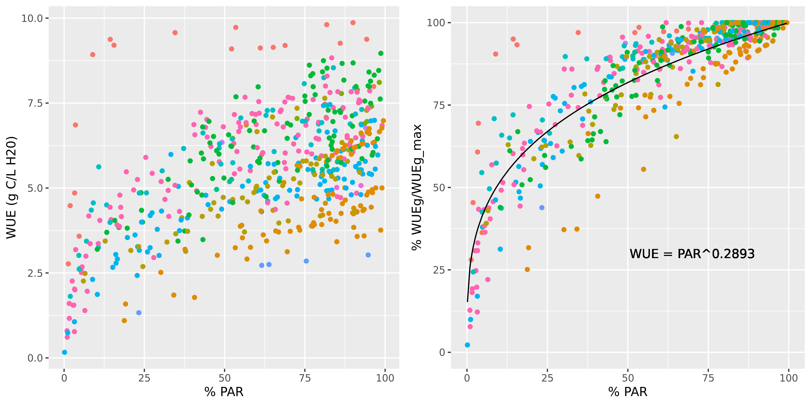

# Plant cohort transpiration, photosynthesis and water status {#transpirationgranier}

This chapter describes how daily plant cohort transpiration ($Tr_{cohorts}$) is modelled in the basic water balance model, completing the flows needed to evaluate eq. \@ref(eq:basicwaterbalanceequation). The model uses the approach of BILJOU [@Granier1999] to estimate plant cohort maximum transpiration, and then divides this value among the contribution of plant cohorts and estimate actual transpiration depending on soil moisture and cohort functional parameters, which determine plant drought. The chapter also describes how is daily photosynthesis estimated, a process that in this model does not influence transpiration but is necessary for growth calculations (chapter \@ref(growthmodelling)). 

## Plant transpiration and photosynthesis
### Maximum transpiration {#maximumtranspiration}

Potential evapotranspiration ($PET$, in mm) is assumed to represent open water evaporation potential. Maximum canopy transpiration $Tr_{cohorts, \max}$ depends on both $PET$ and the amount of transpirating surface, i.e. the current cumulative $LAI$ of the vegetation, $LAI_{\phi}$. To estimate $Tr_{cohorts, \max}$ the model uses the empirical equation of @Granier1999, where $Tr_{cohorts, \max}/PET$ is a function of $LAI_{\phi}$:

\begin{equation}
\frac{Tr_{cohorts, \max}}{PET}= -0.006\cdot (LAI_{\phi})^2+0.134\cdot LAI_{\phi}+0.036
\end{equation}
This equation has already been adopted for Mediterranean biomes [@Fyllas2009; @Ruffault2013]. 

(ref:tmaxpet-cap) Empirical relationship between $Tr_{cohorts, \max}/PET$ and $LAI_{\phi}$

```{r tmaxpet, fig.width=4, fig.height=4, fig.align = "center", echo=FALSE, fig.cap='(ref:tmaxpet-cap)'}
par(mar=c(4,4,1,1))
LAIc = seq(0,10, by=0.01)
TmaxPET = -0.006*(LAIc^2) + 0.134*LAIc + 0.036
plot(LAIc, TmaxPET, type="l", ylab="Tr_cohorts_max/PET", xlab="LAI", ylim=c(0,1))
```

Since medfate's **ver. 2.1**, empirical coefficients can be species-specific and @Granier1999 empirical equation has been generalized to:
\begin{equation}
\frac{Tr_{cohorts, \max}}{PET}=  T_{max,LAI} \cdot LAI_{\phi} + T_{max,sqLAI} \cdot (LAI_{\phi})^2 
\end{equation}
where $T_{max,LAI}$ and $T_{max,sqLAI}$ are species-specific parameters (if missing, they are given default values 0.134 and -0.006, respectively). 

The maximum transpiration for a given plant cohort $i$ is calculated using the portion of $Tr_{\max}$ defined by $f_i$ the fraction of total absorbed SWR that is due
to cohort $i$ (see section \@ref(basiclightextinction)):
\begin{equation}
Tr_{\max, i} = Tr_{cohorts, \max} \cdot \frac{f_i^{0.75}}{\sum_{j}{f_j^{0.75}}}
(\#eq:maximumcohorttranspiration)
\end{equation} 
Before **ver 2.5.0** $Tr_{\max, i}$ was linearly related to $f_i$, but an exponent 0.75 is now used to decrease *ad hoc* the proportion of transpiration corresponding to cohorts absorbing high SWR fractions with respect to those absorbing low amounts of SWR, which has been found to better match the transpiration predicted using the advanced transpiration model. Note that the actual amount of radiation energy absorbed by plants is much more difficult to determine, involving diffuse and direct radiation, as well as net long-wave radiation (see chapter \@ref(radiationbalance)). 


### Actual plant transpiration and plant water potential {#actualtranspiration}

Actual plant transpiration depends on soil moisture and is calculated for each plant cohort and each soil layer separately. $Tr_{i,s}$ (in mm) represents the transpiration made by cohort $i$ from layer $s$. Actual plant transpiration from a given layer is regulated by soil moisture and the resistance to water flow through the plant. For each plant cohort $i$ and soil layer $s$, the model first estimates the a whole-plant relative water transpiration, $K_{i,s}$, which varies between 0 and 1 depending on $\Psi_{extract,i}$, the potential at which transpiration is 50% of maximum, and $\Psi_s$, the water potential in layer $s$. This relationship is modelled using a Weibull function (see function `hydraulics_psi2K()`):
\begin{equation}
K_{i,s}=K_{i}(\Psi_s) = \exp \left \{\ln{(0.5)}\cdot \left[ \frac{\Psi_s}{\Psi_{extract,i}} \right] ^{c_{extract,i}} \right \} 
(\#eq:relativewholeplantconductance)
\end{equation}
where $c_{extract,i}$ is an exponent that modulates the steepness of the decrease in relative
conductance when soil potential becomes negative and $\ln(0.5)$
is used to ensure that $K_{i}(\Psi_{extract,i}) = 0.5$ (Fig. \@ref(fig:wholeplantconductance)).

(ref:wholeplantconductance-cap) Whole-plant relative water conductance functions for different water potential values ($c_{extract} = 3$ in all cases)

```{r wholeplantconductance, fig.width=4, fig.height=4, fig.align="center", echo=FALSE, fig.cap='(ref:wholeplantconductance-cap)'}
par(mar=c(4,4,1,1))
x = seq(-10, 0, by=0.01)
plot(-x ,unlist(lapply(x,hydraulics_psi2K,-2.0,3.0)), type="l", ylab="K (relative conductance)", xlim=c(0,10), ylim=c(0,1),xlab="Soil water potential (-MPa)", frame=FALSE)
lines(-x, unlist(lapply(x,hydraulics_psi2K,-3.0,3.0)), lty=2)
lines(-x, unlist(lapply(x,hydraulics_psi2K,-4.0,3.0)), lty=3)
lines(-x, unlist(lapply(x,hydraulics_psi2K,-5.0,3.0)), lty=4)
legend("topright", lty=1:4, col=c(rep("black",4)), 
       legend = paste("Psi_extract = ", c(-2.0,-3.0,-4.0, -5.0), "MPa"), bty="n", cex=0.8)
abline(h=50, col="gray", lwd=2)
```

If cavitation has occurred in previous steps then the capacity of the plant to transport water is impaired. Hence $K_{i,s}$ from eq. \@ref(eq:relativewholeplantconductance) cannot be larger than the one-complement of the degree of conductance loss in the stem ($PLC_{stem, i}$), so that:
\begin{equation}
K^{PLC}_{i,s} = \min \{K_{i,s}, 1.0 - PLC_{stem, i} \}
\end{equation}
where $PLC_{stem, i}$ is the proportion of stem conductance lost for cohort $i$ (see \@ref(irreversiblecavitation)). 

Until **ver 2.5.0**, actual transpiration of plant cohort $i$ from a given soil layer $s$, $Tr_{i,s}$, was defined as the product of [@Mouillot2001]: the maximum transpiration of the plant cohort ($Tr_{\max,i}$), the relative whole-plant transpiration ($K^{PLC}_{i,s}$) corresponding to the species and water potential in layer $s$, and the proportion of plant fine roots in layer $s$, $FRP_{i,s}$:
\begin{equation}
Tr_{i,s} =  Tr_{\max,i} \cdot K^{PLC}_{i,s} \cdot FRP_{i,s}
\end{equation}
Since **ver 2.5.0**, this equation has been slightly modified and is now:
\begin{equation}
Tr_{i,s} =  Tr_{\max,i} \cdot K^{PLC}_{i,s} \cdot \frac{K_{unsat,s}^{0.5} \cdot FRP_{i,s}}{\sum_r{K_{unsat,r}^{0.5} \cdot FRP_{i,r}}}
(\#eq:actualcohorttranspiration)
\end{equation}
where $K_{unsat,s}$ is the unsaturated soil conductivity of layer $s$. This modification was introduced to allow the plant to increase the amount of water drawn from layers with higher levels of moisture in seasons where the usual water pools are depleted. This formulation decreases the differences in soil moisture between soil layers, which in the advanced model is achieved thanks to hydraulic redistribution process.  

The total amount of water transpired by plant cohort $i$, $Tr_i$ (in mm) is the sum of $Tr_{i,s}$ values over all soil layers:
\begin{equation}
Tr_i =\sum_{s}{Tr_{i,s}}
\end{equation}

Analogously, the total amount of water transpired by plant cohorts, $Tr_{cohorts}$ (in mm), is the sum of $Tr_{i}$ values over all plant cohorts:
\begin{equation}
Tr_{cohorts} =\sum_{i}{Tr_{i}} =\sum_{s}\sum_{i}{Tr_{i,s}}
\end{equation}
Assuming no water limitations (i.e. $K_{i,s} = 1$), we have that $Tr_{cohorts} = Tr_{cohorts, \max}$ and $Tr_i = Tr_{\max,i}$. Cohort transpiration and stand transpiration will be lower than maximum values if soil water potential in any layer is negative enough to cause a significant reduction in whole-plant conductance. At the plant level, the transpiration of a given plant cohort will be lower than that of others if: 

  a. The cohort is under the shade (it reduces $f_i$ and hence $Tr_{\max,i}$)
  b. The cohort has a lower amount of leaf area (it reduces $f_i$ and hence $Tr_{\max,i}$)
  c. The soil layers exploited by the cohort have more negative water potentials (it reduces $K_{i,s}$ and $K^{PLC}_{i,s}$). 

### Plant water potential

The basic water balance model does not allow estimating a water potential drop from soil to the leaf. Moreover, in a multilayered soil it is difficult to know what would be the water potential of the plant. Despite these limitations, a gross surrogate of  'plant' water potential ($\Psi_{plant, i}$; in MPa) may be obtained averaging whole-plant relative conductance values across soil layers and inverting the whole-plant relative transpiration function:
\begin{equation}
\Psi_{plant, i}= K_i^{-1}\left(\sum_{s}{K_{i,s}\cdot FRP_{i,s}}\right)
(\#eq:psiplant)
\end{equation}
where $K_i^{-1}$ is the inverse of the relative whole-plant transpiration eq. \@ref(eq:relativewholeplantconductance). The plant water potential is used to determine plant stress levels and cavitation, as explained in \@ref(dailystressbasicwater) and \@ref(irreversiblecavitation). 

Importantly, changes in $\Psi_{plant, i}$ induce changes in plant water content (see section \@ref(plantwatercontent)), which may induce a release of water in the transpiration stream or an absorption of water from it, which leads to the cohort transpiration, $Tr_i$, being different from its water extraction from the soil, $Ex_i$.

### Minimum transpiration
The description of actual transpiration in the previous section incorporates the assumption that plants can regulate water losses up to zero transpiration, neglecting water leaks through the leaf cuticule and/or incomplete stomatal closure [@Duursma2018]. To avoid this assumption we can estimate minimum transpiration for a given plant cohort, $Tr_{\min,i}$ (in mm), and prevent $Tr_i < Tr_{\min,i}$.  

Minimum transpiration flow per leaf area $E_{\min}$ in $mol\, H_2O \cdot s^{-1} \cdot m^{-2}$) can be calculated if we know (1) the minimum leaf conductance to water vapor ($g_{sw, \min}$; in $mol\, H_2O \cdot s^{-1} \cdot m^{-2}$); (2) the leaf vapor pressure deficit ($VPD_{leaf}$; in $kPa$); and (3) atmospheric pressure ($P_{atm}$; also in $kPa$):
\begin{equation}
E_{\min} =  g_{sw,\min}  \cdot \frac{VPD_{leaf}}{P_{atm}}
\end{equation}
In turn, the vapor pressure deficit in the leaf ($VPD_{leaf}$) is calculated as:
\begin{equation}
VPD_{leaf} = e_{leaf} - e_{air}
\end{equation}
Where $e_{air}$ is the water vapor pressure of the air surrounding the leaf (but beyond the leaf boundary layer) and $e_{leaf}$ is the vapor pressure inside the leaf. While $e_{air}$ can be derived from the weather input, $e_{leaf}$ should be calculated from leaf temperature ($T_{leaf}$) and leaf water potential ($\Psi_{leaf}$):
\begin{equation}
e_{leaf}(T_{leaf}, \Psi_{leaf}) = e_{sat}(T_{leaf}) \cdot \exp\left\{\frac{2.17 \cdot \Psi_{leaf}}{T_{leaf}+273.15}\right\}
\end{equation}
where $e_{sat}(T)$ is a function giving the saturated vapor pressure for temperature $T$ (see [utility functions](http://emf-creaf.github.io/meteolandbook/miscellaneous.html#physicalutils) of the **meteoland** reference manual). Given the simplicity of the basic water balance model, here we make the assumption that $\Psi_{leaf} = \Psi_{plant}$ (from the previous time step). Furthermore, we assume that leaf temperature is coupled with the temperature of the surrounding air. Given the non-linearity of $e_{leaf}$ we average the wapor pressure values provided by $e_{leaf}(T_{\min}, \Psi_{plant})$ and $e_{leaf}(T_{\max}, \Psi_{plant})$. 

Once the leaf level $E_{\min}$ is known for a give cohort $i$, we can scale this instantaneous rate to daily transpiration (in mm) at the cohort level using:
\begin{equation}
Tr_{\min,i} = E_{\min,i} \cdot 24 \cdot 3600 \cdot LAI_{\phi,i} \cdot 0.018
\end{equation}


### Transpiration with water pools {#transpirationpools}
Considering water pools (i.e. setting `rhizosphereOverlap = "partial"` or `rhizosphereOverlap = "total"` in the control parameters) involves partitioning the stand area into fractions corresponding to the abundance of each plant cohort. More specifically, the model defines as many plant water pools as plant cohorts, with proportions defined by their LAI values. For example, the fraction corresponding to plant cohort $j$ would be:
\begin{equation}
f_{pool,j} = \frac{LAI_{live,j}}{LAI_{live}}
\end{equation}
Overall soil moisture is then related to moisture of plant water pools by the following equation, that is fulfilled for each soil layer $s$:
\begin{equation}
W_{s} = \sum_{j}{f_{pool,j} \cdot W_{j,s}}
\end{equation}
where $W_{j,s}$ is the soil moisture (relative to field capacity) of layer $s$ in the water pool of cohort $j$, i.e. under the area of the stand attributed to cohort $j$.

When transpiration occurs and water pools are considered, the model assumes that the rhizosphere of each plant cohort occupies its own water pool, but may enter into the water pools under other plant cohorts if the overlap is partial. In other words, the root systems of different cohorts may overlap horizontally. A given plant cohort $i$ will have its roots in layer $s$ partitioned among different water pools. Let us assume that we know $fr_{i,s,j}$, the (horizontal) proportion of fine roots of cohort $i$ in layer $s$ of the water pool $j$ (see section \@ref(plantwaterpools)). These proportions sum one when summed across water pools:
\begin{equation}
\sum_{j}{fr_{i,s,j}} = 1 \,\, \forall i,s
\end{equation}
The proportion of fine roots in a given water pool, with respect to the whole root system, will then be equal to:
\begin{equation}
FRP_{i,s,j} = fr_{i,s,j} \cdot FRP_{i,s}
\end{equation}
Estimating transpiration with water pools is analogous to estimating transpiration without them, but replacing the role of $FRP_{i,s}$ by $FRP_{i,s,j}$, and $K_{i,s}$ by $K_{i,s,j}$, in eq. \@ref(eq:actualcohorttranspiration), which leads to the estimation of $Tr_{i,s,j}$. Analogous replacements have to be made when estimating the plant water potential in eq. \@ref(eq:psiplant).

Finally, note that the amount of water extracted from the soil layer $s$ of given water pool $j$ (i.e. from $W_{j,s}$) will not be $Tr_{i,s,j}$ (whose units are referred to the overall stand) but $Tr_{i,s,j}/f_{pool,j}$.

### Plant photosynthesis {#basicphotosynthesis}

Because it is useful for growth, and for compatibility with the 'Sperry' transpiration mode (chapter \@ref(advancedwaterbalance)), the water balance model using 'Granier' transpiration mode also calculates gross assimilated carbon. Gross photosynthesis for a given plant cohort $i$ (in $g\,C \cdot m^{-2}$) is estimated as a function of transpiration:
\begin{equation}
A_{g,i} = Tr_i \cdot WUE_{\max,i} \cdot (L^{PAR}_i)^{WUE_{PAR,i}} \cdot (1 - e^{WUE_{CO2,i} \cdot C_{air}}) \cdot VPD^{WUE_{VPD}}
(\#eq:Agbasic)
\end{equation}
where $Tr_i$ is the transpiration of plant cohort $i$, $WUE_{\max,i}$ is the maximum water use efficiency of the cohort (in $g\,C \cdot mm^{-1}$) - a species-specific parameter where WUE assumed to be estimated under conditions of $VPD = 1kPa$, no atmospheric CO2 limitations and maximum light availability -; $L^{PAR}_i$ is the proportion of photosynthetically-active radiation available at the mid-crown of cohort $i$, according to the Beer-Lambert extinction model; $C_{air}$ is the atmospheric CO2 concentration (in ppm); $VPD$ is the vapor pressure deficit (in kPa); $WUE_{CO2,i}$ and $WUE_{VPD,i}$ are species-specific coefficients regulating the influence of CO2 concentration and VPD on WUE, respectively; and $WUE_{PAR,i}$ is a species-specific exponent indicating how relative WUE decreases with lower light levels. 

Different effects are taken into account in the estimation of gross photosynthesis (eq. \@ref(eq:Agbasic)). The dependency of photosynthesis on drought stress is represented in the $Tr_i$ term, whereas the dependency on $CO_2$ concentration is given by the negative exponential term and the progressive reduction of photosynthesis under higher $VPD$ (assuming a reduction of stomatal conductance but the same water flow) is modelled using negative $WUE_{VPD,i}$ exponents. Finally, the reduction of photosynthesis due to low light availability (for cohorts in the understory) is represented by the reduction of relative WUE given by low values of $L^{PAR}_i$:

```{r WUErelationship, out.width='100%', fig.align="center", fig.cap="Relationship between the percentage of PAR available to a cohort and the water use efficiency (left) or the water use efficiency relative to the maximum value observed in the stand for the same species (right). WUE values were estimated using the advanced water balance model and a non-linear regression was fitted.", echo=FALSE}

```

## Plant drought stress and cavitation

### Daily drought stress {#dailystressbasicwater}

Similarly to @Mouillot2002, daily drought stress of a given plant cohort $i$, $DDS_i$, is defined as the one-complement of relative whole-plant transpiration (see eq. \@ref(eq:relativewholeplantconductance)) estimated from its plant water potential ($\Psi_{plant,i}$):
\begin{equation}
DDS_i=\phi_i \cdot (1-K_{i}(\Psi_{plant,i}))
\end{equation}
Leaf-phenological status is included to prevent winter deciduous plants from suffering drought stress during winter. Daily drought stress values can be later used to define other drought stress indices for larger temporal scales.
 
### Cavitation and hydraulic recovery {#irreversiblecavitation}
The water balance model is normally run assuming that although soil drought may reduce transpiration, embolized xylem conduits are automatically refilled when soil moisture recovers (in other words, cavitation is reversible and `stemCavitationRecovery = "total"`). It is possible to simulate irreversible cavitation by setting `stemCavitationRecovery = "none"`, `stemCavitationRecovery = "rate"` or `stemCavitationRecovery = "annual"` in the control parameters. Any of these options cause the model to keep track of the maximum value of cavitation so far experienced using the proportion of of lost conductance for leaves and the stem the plant cohort $i$ ($PLC_{leaf, i}$ and $PLC_{stem, i}$), which are modelled from $\Psi_{plant}$ using Weibull functions:
\begin{eqnarray}
PLC_{leaf, i} &=& \max \left \{PLC_{leaf, i}, 1 - \exp \left \{ \left[ \frac{\Psi_{plant,i}}{d_{leaf}} \right] ^{c_{leaf}} \right \} \right \} \\
PLC_{stem, i} &=& \max \left \{PLC_{stem, i}, 1 - \exp \left \{ \left[ \frac{\Psi_{plant,i}}{d_{stem}} \right] ^{c_{stem}} \right \} \right \}
\end{eqnarray}

For simulations of less than one year one can use `stemCavitationRecovery = "none"` to keep track of the maximum cavitation. However, for simulations of several years, it is normally advisable to allow recovery. If `stemCavitationRecovery = "annual"`, $PLC_{leaf, i}$ and $PLC_{stem, i}$ values are set to zero at the beginning of each year, assuming that embolized plants overcome the conductance loss by creating new xylem tissue. Finally, if `stemCavitationRecovery = "rate"` the model simulates stem refilling at daily steps as a function of symplasmic water potential. First, a daily recovery rate ($r_{refill}$; in $cm^2 \cdot m^{-2} \cdot day^{-1}$) is estimated as a function of $\Psi_{plant,i}$:
\begin{equation}
r_{refill}(\Psi_{plant,i}) = r_{\max,refill} \cdot \max \{0.0, (\Psi_{plant,i} + 1.5)/1.5\}
\end{equation}
Where $r_{\max,refill}$ is the control parameter `cavitationRecoveryMaximumRate` indicating a maximum refill rate. The right part of the equation normalizes the water potential, so that $r_{refill} = r_{refill,\max}$ if $\Psi_{plant,i} = 0$ and $r_{refill} = 0$ if $\Psi_{plant,i} <= -1.5MPa$. The proportion of conductance lost in stems and leaves is then updated using:
\begin{eqnarray}
PLC_{leaf, i} &=& \max \{0.0, PLC_{leaf, i} - (r_{refill}/H_v) \} \\
PLC_{stem, i} &=& \max \{0.0, PLC_{stem, i} - (r_{refill}/H_v) \}
\end{eqnarray}
where $H_v$ is the Huber value (sapwood area to leaf area ratio) in units of $cm^2 \cdot m^{-2}$.


