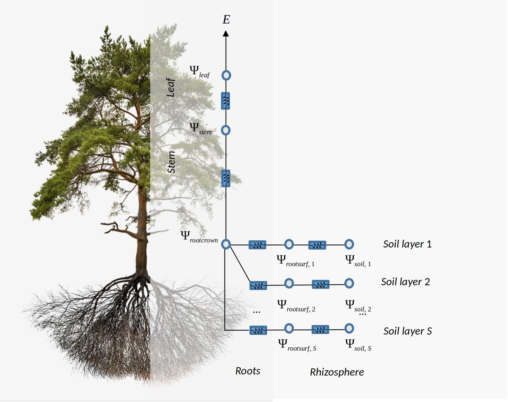
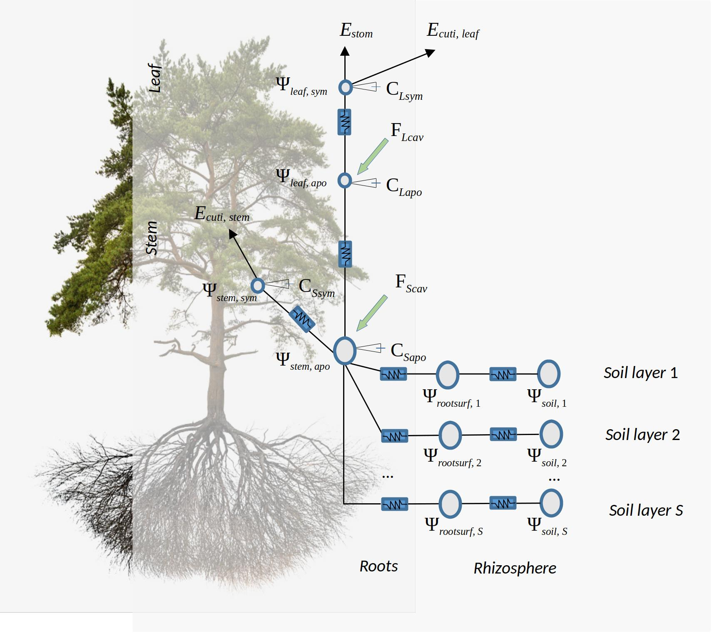
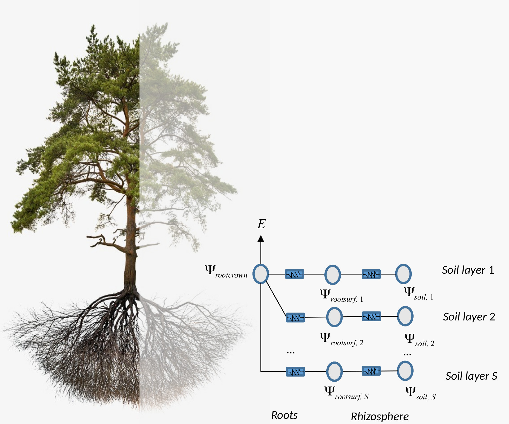

# Plant hydraulics {#planthydraulics}


```{r, echo=FALSE}
col1 = "black"
col2 = "red"
col3 = "blue"
col4 = "dark green"
col1pale = "gray"
col2pale = "orange"
col3pale = "light blue"
col4pale = "green"
```

We devote this chapter to describe the background necessary to understand how plant hydraulics is implemented in the advanced water balance model of **medfate**. Section \@ref(hydraulicnetworks) introduces the hydraulic networks from which to choose, depending on the sub-model of plant hydraulics employed (i.e. either `transpirationMode = "Sperry"` or `transpirationMode = "Cochard"`). After that, in sections \@ref(vulnerabilitycurves) and  \@ref(plantwatercontent) we present the building blocks of models of plant hydraulics, i.e. how to represent in a model the water content of plant tissues and the water flow through vascular elements. In section \@ref(supplyfunctions) we describe in detail the plant hydraulic sub-model presented in @DeCaceres2021 (without water compartments), and in  \@ref(hydraulicscochard) we describe the sub-model of plant hydraulics that was presented in @ruffault_sureau-ecos_2022 and was added to **medfate**.


## Hydraulic architecture {#hydraulicnetworks}

The advanced water balance model of **medfate** implements different hydraulic architectures depending on the transpiration sub-model:

+ If `transpirationMode = "Sperry"`, the hydraulic network is described using $(S \times 2 + 1 + 1)$ resistance elements, with soil being represented in $S$ different soil layers. For each soil layer there is a rhizosphere element in series with a root xylem element. The $S$ soil layers are in parallel up to the root crown. From there there is one stem xylem segment and a final leaf xylem segment in series (Fig. \@ref(fig:hydraulicsnetwork)). Stem cavitation affects the resistance between the root crown ($\Psi_{rootcrown}$) and the stem ($\Psi_{stem}$), whereas leaf cavitation affects the resistance between the stem ($\Psi_{stem}$) and the leaf ($\Psi_{leaf}$)


```{r hydraulicsnetwork, out.width='80%', fig.align="center", fig.cap="Schematic representation of hydraulics in a whole-plant network", echo=FALSE}

```


+ If `transpirationMode = "Cochard"`, the soil–plant system in SurEau-ECOS [@ruffault_sureau-ecos_2022] is discretized into three soil layers and two plant compartments  (Fig. \@ref(fig:hydraulicssureau)): a leaf and a stem. Each of the two plant organs contains an apoplasm and a symplasm. The stem apoplasm and symplasm include water volumes of all non-leaf compartments, i.e., trunk, root and branches. Symplasmic capacitances (i.e. $C_{LSym}$ and $C_{SSym}$) mostly buffer water fluxes during well-watered conditions, whereas apoplasm capacitances  (i.e. $C_{LApo}$ and $C_{SApo}$) come into play when cavitation occurs. Water can leaf the plant via three flows, through stomata ($E_{stom}$), leaf cuticules ($E_{cuti,leaf}$) and stem cuticules ($E_{cuti,stem}$). The architecture is completed with nodes for the fine root surface of each soil layer ($\Psi_{rootsurf}$) and for the root crown ($\Psi_{rootcrown}$), but these elements do not correspond to water compartments. Stem cavitation affects the conductances of the pathways between root surfaces ($\Psi_{rootsurf}$) and the root crown ($\Psi_{rootcrown}$), as well as the conductance between the root crown and the stem apoplasm ($\Psi_{stem, apo}$). Leaf cavitation affects the conductance between the stem apoplasm ($\Psi_{stem, apo}$) and the leaf apoplasms ($\Psi_{leaf, apo}$).

```{r hydraulicssureau, out.width='80%', fig.align="center", fig.cap="Schematic representation of hydraulics in a network with water storage compartments according to the design of SurEau-ECOS", echo=FALSE}

```


## Vulnerability curves {#vulnerabilitycurves}

Vulnerability curves form the basis of hydraulic calculations. Let us use $k$ to denote hydraulic conductance, i.e. instantaneous flow rate per leaf surface unit and per pressure drop (in $mmol \cdot s^{-1} \cdot m^{-2} \cdot MPa^{-1}$). Each element of the hydraulic network has a vulnerability curve $k(\Psi)$ that starts at maximum hydraulic conductance ($k_{max} = k(0)$) and declines as water pressure ($\Psi$) becomes more negative. 

### Xylem vulnerability curves

Xylem vulnerability curves are modelled using different functions, depending on the transpiration sub-model. 

#### Weibull vulnerability curves

When `transpirationMode = "Sperry"`, xylem tissues are assigned a two-parameter Weibull function as the vulnerability curve $k(\Psi)$:
\begin{equation}
k(\Psi) = k_{max}\cdot e^{-((\Psi/d)^c)}
(\#eq:xylemvulnerability)
\end{equation}
where $k_{max}$ is the maximum hydraulic conductance, and $c$ and $d$ are species-specific and tissue-specific parameters. Note that parameter $d$ is the water potential (in MPa) at which $k(\Psi)/k_{max} = e^{-1} = 0.367$, i.e. the water potential at which hydraulic conductance is 36.7% of its maximum value. Parameter $c$ controls the shape of the vulnerability curve (*exponential* shape with no threshold has $c \leq 1$; and *sigmoidal* shape with threshold occurs when $c > 1$). 

The concept of vulnerability curve can be used to specify the relationship between pressure and conductance in any portion of the flow path. For example, we define the following parameter values for a stem xylem ($k_{stem,max}$ and parameters $c_{stem}$ and $d_{stem}$ of the vulnerability curve):
```{r}
kstemmax = 5.0 # mmol·m-2·s-1·MPa-1
stemc = 3 
stemd = -3.0 # MPa
```

For root xylem ($k_{root,max}$), we may assume a higher conductance (i.e. higher efficiency) but also higher vulnerability to cavitation (defined by parameters $c_{root}$ and $d_{root}$):

```{r}
krootmax = 6.6 # mmol·m-2·s-1·MPa-1
rootc = 2
rootd = -2.5 #MPa
```

```{r, echo=FALSE}
dE =0.01
Emax = 20
psiVec = seq(-0.1, -7.0, by =-0.01)
```

For leaf xylem $k_{leaf}(\Psi)$, we may specify higher conductance than in stems but also higher vulnerability:
```{r}
kleafmax = 10
leafc = 2
leafd = -2
```


With these parameter values, the vulnerability curves for root, stem and leaf are (see `hydraulics_xylemConductance()` and `hydraulics_vulnerabilityCurvePlot()`):
```{r, fig.width=5, fig.height=5, fig.align = "center", echo=FALSE, fig.cap="Example vulnerability curves corresponding to the parameters defined above for stem, root and leaf segments."}
psiCav = -2.5
plcCav = 1 -moisture_apoplasticRWC(psiCav, stemc, stemd)
par(mar=c(4,4,1,1), mfrow=c(1,1))
kleaf = unlist(lapply(psiVec,hydraulics_xylemConductance, kleafmax, leafc, leafd))
kstem = unlist(lapply(psiVec,hydraulics_xylemConductance, kstemmax, stemc, stemd))
kroot = unlist(lapply(psiVec,hydraulics_xylemConductance, krootmax, rootc, rootd))
plot(-psiVec, kstem, type="l",ylab="Xylem K (mmol·m-2·s-1·MPa-1)", xlab="Canopy pressure (-MPa)", 
     lwd=2,ylim=c(0,max(kstemmax, krootmax, kleafmax)))
lines(-psiVec, kroot, lty=2, lwd=2)
lines(-psiVec, kleaf, lty=3, lwd=2)
# abline(v=-psiCav, col="gray", lwd=1.5)
lines(x=c(0,-psiCav), y=rep(hydraulics_xylemConductance(psiCav, kstemmax, stemc, stemd),2), lty=4, lwd=2)
legend("topright", legend =c("leaf", "stem xylem (original)","stem xylem (cavitated)", "root xylem"), 
       lty=c(3,1,4,2), bty="n", cex=0.8, lwd=2)
```


The dash-dot line between 0 and $\Psi_{cav} = -2.5$ MPa indicates the modification of the stem xylem vulnerability curve when cavitation has occurred (i.e., previous embolism limits the maximum conductance value), as indicated in @Sperry2016. The corresponding proportion of stem conductance loss ($PLC_{stem}$) can be found using the stem vulnerability curve. Similarly, $PLC_{leaf}$ can limit conductance in leaves. Although root xylem are more vulnerable to the formation of emboli for a given potential, it is generally accepted that the less negative potentials of root xylem compared to the stem lead to cavitation occurring more often in the stem. The constrain created by cavitation has an effect on the calculation of the flow rates and derived quantities (see below).


#### Sigmoid vulnerability curves

When `transpirationMode = "Cochard"`, xylem tissues are assigned a two-parameter sigmoid function as the vulnerability curve $k(\Psi)$:
\begin{equation}
k(\Psi) = \frac{k_{max}}{1 + e^{(slope/25) \cdot (\Psi - \Psi_{50})}}
(\#eq:xylemvulnerabilitysigmoid)
\end{equation}
where $\Psi_{50}$ is the water potential corresponding to 50% of conductance, and $slope$ is the slope of the curve in percent at that point. The two parameters need to be specified for each plant segment under consideration, analogously to the Weibull functions.

### Rhizosphere vulnerability curve
The rhizosphere conductance function $k_{rhizo}(\Psi)$ is modelled as a van Genuchten function [@Genuchten1980] (this choice is the reason why the water retention curve also needs to be modelled with van Genuchten):
\begin{eqnarray}
k_{rhizo}(\Psi) &=& k_{rhizo,max} \cdot v^{(n-1)/(2\cdot n)} \cdot ((1-v)^{(n-1)/n}-1)^2 \\
v &=& [(\alpha \Psi)^{n}+1]^{-1}
(\#eq:rhizovulnerability)
\end{eqnarray}
where $k_{rhizo,max}$ is the maximum rhizosphere conductance, and $n$ and $\alpha$ are texture-specific parameters [@Leij1996; @Carsel1988]. These are automatically set by function `soil()` when initializing soil objects (see section \@ref(soilinitialization)), but we can use function `soil_vanGenuchtenParamsCarsel()` to derive them from texture types:

```{r}
textures = c("Sandy loam","Silt loam", "Clay")
#Textural parameters
#Sandy clay loam 
p1 = soil_vanGenuchtenParamsCarsel(textures[1])
p1
alpha1 = p1[1]  
n1 = p1[2]
#Silt loam
p2 = soil_vanGenuchtenParamsCarsel(textures[2])
p2
alpha2 =  p2[1]
n2 = p2[2]
#Silty clay
p3 = soil_vanGenuchtenParamsCarsel(textures[3])
p3
alpha3 =  p3[1]
n3 = p3[2]
```


We can estimate maximum rhizosphere conductance values assuming that they account for an average percentage of the resistance (e.g. 15%) across the continuum (see functions `hydraulics_averageRhizosphereResistancePercent()` and `hydraulics_findRhizosphereMaximumConductance()`):

```{r}
percentResistance = 15
#Sandy clay loam 
krmax1 =hydraulics_findRhizosphereMaximumConductance(percentResistance, 
                      n1,alpha1, krootmax, rootc,rootd, kstemmax, stemc, stemd,
                      kleafmax, leafc, leafd)
krmax1
#Silt loam
krmax2 =hydraulics_findRhizosphereMaximumConductance(percentResistance, 
                      n2,alpha2, krootmax, rootc,rootd, kstemmax, stemc, stemd,
                      kleafmax, leafc, leafd)
krmax2
#Silty clay
krmax3 =hydraulics_findRhizosphereMaximumConductance(percentResistance, 
                      n3,alpha3, krootmax, rootc,rootd, kstemmax, stemc, stemd,
                      kleafmax, leafc, leafd)
krmax3
```
With these parameters, the resulting $k_{rhizo}(\Psi)$ functions can be displayed using the function `hydraulics_vanGenuchtenConductance()`:
```{r,  fig.width=4, fig.height=3.5, echo=FALSE, fig.align = "center", fig.cap="Example rhizosphere vulnerability curves (i.e. Van Genuchten functions) for three different soil textures."}
par(mar=c(4,4,1,1), mfrow=c(1,1))
k1 = unlist(lapply(psiVec,hydraulics_vanGenuchtenConductance, krmax1, n1, alpha1))
k2 = unlist(lapply(psiVec,hydraulics_vanGenuchtenConductance, krmax2, n2, alpha2))
k3 = unlist(lapply(psiVec,hydraulics_vanGenuchtenConductance, krmax3, n3, alpha3))
plot(-psiVec, k1, type="l", col="black", ylab="Rhizosphere K (mmol·m-2·s-1·MPa-1)", xlab = "Soil hydraulic pressure (-MPa)",  xlim=c(0, max(-psiVec)), ylim=c(0, 100))
lines(-psiVec, k2, lty=2, lwd=1.5)
lines(-psiVec, k3, lty=3, lwd=1.5)
legend("topright", bty="n", legend=textures, lty=1:3, cex=0.8, lwd=1.5)
```

### Xylem sap viscosity

The ease of water flow (i.e. hydraulic conductance or resistance) is dependent on water viscosity, which fluctuates as a function of temperature and dissolved substances. Xylem sap can be considered to have negligible amounts of solutes, but temperature is still rellevant factor of viscosity. The dynamic viscosity of water $V_w$ varies with temperature (relative to its viscosity at 20ºC) according to the Vogel equation:
\begin{equation}
V_w(T) = \exp \left[-3.7188+ \frac{578.919}{-137.546 + T} \right]
\end{equation}
where $T$ is the temperature of the medium in Kelvin. Temperature of segments (roots, stem, leaves) is used to correct maximum conductances simply as follows:
\begin{equation}
k_{max, T} = \frac{k_{max}}{V_w(T)}
\end{equation}
where $k_{max}$ is the maximum conductance describing the vulnerability curve, assumed to be determined at 20ºC.

## Water content of plant tissues {#plantwatercontent}

Following @Martin-StPaul2017, we consider two kind of tissues in (leaf and stem) plant segments [@Tyree1990]. The first are conduits (tracheids or vessels), which will release water due to cavitation and may be refilled with water from adjacent living tissue or upstream segments. The second source of water is formed by more elastic living cells (i.e. parenchyma) and can potentially be a large source of water. This source can be described using the relative water content of a symplasmic tissue.


### Relative water content of symplasmic tissues {#pressurevolumecurves}

A pressure-volume curve of a tissue relates its water potential against its *relative water content* ($RWC$; $kg\,H_2O \cdot kg^{-1}\,H_2O$ at saturation). Pressure-volume theory is usually applied to leaf tissues [@Bartlett2012], but it can also be applied to other tissues such as sapwood or cambium cells. 

For living cells, the relationship between $\Psi$ and $RWC$ of the symplasmic fraction ($RWC_{sym}$) is achieved by separating $\Psi$ into osmotic (solute) potential ($\Psi_{S}$) and the turgor potential ($\Psi_{P}$):
\begin{equation}
\Psi = \Psi_{S} + \Psi_{P}
\end{equation}
The relationship for $\Psi_{P}$ is:
\begin{equation}
\Psi_{P} = -\pi_0 -\epsilon\cdot (1.0 - RWC_{sym})
\end{equation}
where $\pi_0$ (MPa) is the osmotic potential at full turgor (i.e. when $RWC_{sym} = 1$), and $\epsilon$ is the modulus of elasticity (i.e. the slope of the relationship). Assuming constant solute content, the relationship for $\Psi_{S}$ is:
\begin{equation}
\Psi_{S} = \frac{-\pi_0}{RWC_{sym}} 
\end{equation}
When $\Psi \leq \Psi_{tlp}$, the water potential at turgor loss point, then $\Psi_{P} = 0$ and $\Psi = \Psi_{S}$. If $\Psi > \Psi_{tlp}$ then the two components are needed. The water potential at turgor loss point ($\Psi_{tlp}$) can be found by [@Bartlett2012]:
\begin{equation}
\Psi_{tlp} = \frac{\pi_0 \cdot \epsilon}{\pi_0 + \epsilon}
(\#eq:turgorlosspoint)
\end{equation}
As an example, the following figure draws the pressure-volume curve for a tissue with $\epsilon = 12$ and $\pi_0 = -3.0$MPa:
```{r, fig.width=4, fig.height=4, echo=FALSE, fig.align="center"}
psi = seq(-10,0, by=0.1)
rwc_s = rep(NA, length(psi))
for(i in 1:length(psi)) rwc_s[i] =moisture_symplasticRWC(psi[i],-3,12)
plot(psi, rwc_s, type="l", xlab="Water potential (MPa)", ylab = "Symplasmic RWC")
```

To calculate $RWC_{sym}$ from the water potential of a tissue, the previous equations need to be combined and, after isolating $RWC_{sym}$, a quadratic relationship is obtained [@Martin-StPaul2017]. 
  

### Relative water content of apoplastic tissues 

In **medfate** it is assumed that apoplastic water fraction of an organ corresponds to the water in its xylem conduits. Xylem conduits consist of inelastic cells that have very small changes of water volume in relation to changes in water potential. However, xylem conduits release their water to the transpiration stream following the formation of emboli. As in @Holtta2009, we equate the relative water content of the apoplastic reservoir of a segment (leaves or stem) to the proportion of conductance lost (relative to the maximum conductance) for a given water potential (see \@ref(eq:xylemvulnerability)):
\begin{equation}
RWC_{apo}(\Psi_{apo}) = \frac{k(\Psi_{apo})}{k_{max}} = e^{-((\Psi_{apo}/d)^c)}
\end{equation}
Hence we assume that the relationship between $\Psi_{apo}$ and the relative water content follows the same function as the relationship between $\Psi_{apo}$ and the proportion of conductance loss (i.e. the hydraulic vulnerability curve, see @ref(vulnerabilitycurves)).
```{r, fig.width=4, fig.height=4, echo=FALSE, fig.align="center"}
psi = seq(-7,0, by=0.1)
rwc_a = rep(NA, length(psi))
for(i in 1:length(psi)) rwc_a[i] =moisture_apoplasticRWC(psi[i], 3, -4)
plot(psi, rwc_a, type="l", xlab="Water potential (MPa)", ylab = "Apoplastic RWC")
```

Since cavitation in leaves is assumed reversible we have that the relative water content of the apoplastic fraction in leaves ($RWC_{leaf,apo}$) will follow the leaf xylem water potential as indicated above. In stems, however, cavitation may be non-reversible, so $RWC_{stem,apo}$ will be dictated by the current level of embolisation, which is represented by $PLC_{stem}$ and not by the current xylem water potential: 
\begin{equation}
RWC_{stem,apo} = 1 - PLC_{stem}
\end{equation}
If water compartments are not considered, $PLC_{stem}$ is determined by $\Psi_{stem, cav}$, the minimum stem water potential experienced so far. When water comparments are considered, increases in  $PLC_{stem}$ follow decreases in stem water content and the water released can contribute to the transpirational stream [@Martin-StPaul2017]. This will be treated in the next section. 


### Average relative water content of a segment {#averagerelativewatercontent}

The average relative water content in a given segment or organ ($RWC$) can be obtained by calculating  $RWC_{apo}$ and $RWC_{sym}$ followed by assuming a constant apoplastic fraction $f_{apo}$:

\begin{equation}
RWC = RWC_{apo} \cdot f_{apo} + RWC_{sym} \cdot (1 - f_{apo})
\end{equation}

Normally the apoplastic fraction is large (~80%) in the stem and small (~15%) in leaves. Hence, the relative water content in stems will be mostly dictated by the level of cavitation, whereas that of leaves will mostly follow leaf symplastic water potential and the symplastic pressure-volume curve.

### Live fuel moisture content

Given an average relative water content ($RWC$) of a plant organ, its live fuel moisture content ($LFMC$ in $g H_2O \cdot g^{-1}$ of dry tissue) can be calculated using:
\begin{equation}
LFMC = RWC \cdot \Theta \cdot \frac{\rho_{H_2O}}{\rho} = RWC \cdot LFMC_{max}
\end{equation}
where $\Theta$ is the tissue porosity ($cm^3$ of water per $cm^3$ of tissue), $\rho$ is the density of the tissue and $\rho_{H_2O}$ is the density of water. In practice estimates of maximum fuel moisture content $LFMC_{max}$ are easier to obtain than porosity estimates, so it is more straightforward to estimate $LFMC$ as the product of $RWC$ and $LFMC_{max}$. 

In medfate, $LFMC$ estimates are assumed to correspond to fine fuels (i.e. leaves and twigs of < 6.5 mm) but are estimated from leaf water content. The relative water content of leaves, and hence its $LFMC$, are estimated using (see \@ref(averagerelativewatercontent)):
\begin{equation}
LFMC = (RWC_{apo, leaf} \cdot f_{apo, leaf} + RWC_{sym,leaf} \cdot (1 - f_{apo,leaf})) \cdot LFMC_{max}
\end{equation}
where $RWC_{apo,leaf}$ and $RWC_{sym,leaf}$ are the relative water content of apoplastic and symplastic leaf tissue and $f_{apo,leaf}$ is the fraction of apoplastic tissue in leaves.

The package allows estimating $LFMC$ from the output of `spwb()` or `growth()` using function `moisture_cohortFMC()`, but the post-processing function performs slightly different calculations depending on the complexity of the water balance. Basic soil water balance produces, among other outputs, the daily water potential of each plant cohort, $\Psi_{plant}$ (representing an weighted average of soil layer water potentials using fine root distribution as weights) and an estimate of the level of stem cavitation, $PLC_{stem}$. Daily $LFMC$ estimates can be obtained from this output if we use $RWC_{apo, leaf} = 1 - PLC_{stem}$ and calculate  $RWC_{sym, leaf}$ from $\Psi_{plant}$ using symplasmic leaf pressure-volume curves (see \@ref(pressurevolumecurves)).
When using basic water balance, function `moisture_cohortFMC()` takes daily values $\Psi_{plant}$ and $PLC_{stem}$ from the simulation output, but parameters $\pi_{0,leaf}$, $\epsilon_{leaf}$ (i.e. pressure-volume curve parameters), $f_{apo,leaf}$ and $LFMC_{max}$ are drawn from the data frame `SpParams` of species parameter values. Unlike the basic water balance, the advanced water balance explicitly tracks the water potential in different plant segments and distinguishes between apoplastic and symplastic tissues. In this case, $RWC_{apo,leaf}$ and $RWC_{sym,leaf}$ are obtained directly from the plant water balance, and only $LFMC_{max}$ is drawn from the data frame `SpParams`.


## Sperry's sub-model of plant hydraulics {#supplyfunctions}

The supply-loss theory of plant hydraulics, presented by @Sperry2015 and used in @Sperry2016, uses the physics of flow through soil and xylem to quantify how steady-state canopy water supply declines with drought and ceases by hydraulic failure. The theory builds on the  hydraulic model of @Sperry1998 and can be applied to different segmentations of the soil-plant continuum. 

The supply function describes the steady-state rate of water supply (i.e. flow) for transpiration ($E$) as a function of water potential drop. The steady-state flow rate $E_i$ through any $i$ element of the continuum is related to the flow-induced drop in pressure across that element ($\Delta \Psi_i  = \Psi_{down} - \Psi_{up}$) by the integral transform of the element's vulnerability curve $k_i(\Psi)$ [@Sperry2015]:
\begin{equation}
E_i = \int_{\Psi_{up}}^{\Psi_{down}}{k_i(\Psi) d\Psi}
(\#eq:generalsupply)
\end{equation}
where $\Psi_{up}$ and $\Psi_{down}$ are the upstream and downstream water potential values, respectively. The integral transform assumes infinite discretization of the flow path. 

The supply function can be defined for individual elements of the continuum or for the whole soil-plant continuum using different hydraulic networks. Supply functions are used in the Sperry's sub-model to determine photosynthesis, stomatal conductance and transpiration (see chapters  \@ref(plantphotosynthesis) and \@ref(transpirationsperrycochard)).

In the following subsections we illustrate the supply function for different cases.


### Supply function for a single xylem element

In the case of a single xylem element, the supply function describes the steady-state flow rate as a function of  pressure at the stem top ($\Psi_{canopy}$). It can be calculated by numerical integration or aproximated using an *incomplete gamma function*. The shape of the supply function starting at different root crown water potential values ($\Psi_{rootcrown}$) is (see function `hydraulics_EXylem()`):


(ref:supplysinglestem-cap) Supply function of a single xylem element starting at different root crown water potential values. Left pane shows the uncavitated supply functions and right pane shows the supply functions that are obtained in the case of a cavitated xylem (i.e. without refilling), assuming that the minimum water potential experienced so far was -2.5 MPa. Note the linear part of the flow rate between $\Psi_{rootcrown}$ and this limit.

```{r, fig.width=8, fig.height=3.5, fig.align = "center", fig.cap='(ref:supplysinglestem-cap)', echo=FALSE}
par(mar=c(4,4,2,1), mfrow=c(1,2))
psiSoil1 = -0.1
psiSoil2 = -1.0
psiSoil3 = -2.0
psiSoil4 = -3.0
E1 = unlist(lapply(psiVec,hydraulics_EXylem, psiSoil1, kstemmax, stemc, stemd))
E2 = unlist(lapply(psiVec,hydraulics_EXylem, psiSoil2, kstemmax, stemc, stemd))
E3 = unlist(lapply(psiVec,hydraulics_EXylem, psiSoil3, kstemmax, stemc, stemd))
E4 = unlist(lapply(psiVec,hydraulics_EXylem, psiSoil4, kstemmax, stemc, stemd))
E1emb = unlist(lapply(psiVec,hydraulics_EXylem, psiSoil1, kstemmax, stemc, stemd, psiCav = psiCav))
E2emb = unlist(lapply(psiVec,hydraulics_EXylem, psiSoil2, kstemmax, stemc, stemd, psiCav = psiCav))
E3emb = unlist(lapply(psiVec,hydraulics_EXylem, psiSoil3, kstemmax, stemc, stemd, psiCav = psiCav))
E4emb = unlist(lapply(psiVec,hydraulics_EXylem, psiSoil4, kstemmax, stemc, stemd, psiCav = psiCav))
E1[E1<0] = NA
E2[E2<0] = NA
E3[E3<0] = NA
E4[E4<0] = NA
E1emb[E1emb<0] = NA
E2emb[E2emb<0] = NA
E3emb[E3emb<0] = NA
E4emb[E4emb<0] = NA
Psic =hydraulics_psiCrit(stemc,stemd)
plot(-psiVec, E1, type="l", ylab="Xylem flow rate (mmol·m-2·s-1)", xlab="Canopy pressure (-MPa)", ylim=c(0,max(c(E1,E2,E3,E4), na.rm=TRUE)), lwd=1.5, col=col1, main="original")
lines(-psiVec, E2, lty=1, lwd=1.5, col=col2)
lines(-psiVec, E3, lty=1, lwd=1.5, col=col3)
lines(-psiVec, E4, lty=1, lwd=1.5, col=col4)

plot(-psiVec, E1emb, type="l", ylab="Xylem flow rate (mmol·m-2·s-1)", xlab="Canopy pressure (-MPa)", ylim=c(0,max(c(E1,E2,E3,E4), na.rm=TRUE)), lwd=1.5, col=col1, main="after cavitation")
lines(-psiVec, E2emb, lty=1, lwd=1.5, col=col2)
lines(-psiVec, E3emb, lty=1, lwd=1.5, col=col3)
lines(-psiVec, E4emb, lty=1, lwd=1.5, col=col4)
abline(v=-psiCav, col="gray", lwd=1.5)
```


The supply function of a *rhizosphere* element relates the steady-state flow rate to the pressure inside the roots ($\Psi_{root}$). It is calculated by numerical integration of the van Genuchten function, for which we use the analytical approximation of @VanLier2009 (see function `hydraulics_EVanGenuchten()`). In the figure below, we draw examples of the supply function for the rhizosphere. The nearly vertical lines indicate that for many values of $E_i$ the corresponding drop in water potential through the rhizosphere will be negligible. Only for increasingly negative soil water potential values the decrease in water potential through the rhizosphere becomes relevant. Both in the case of a xylem element or a rhyzosphere element the derivative $dE_i/d\Psi$ of the supply function is equal to the corresponding vulnerability curve.


(ref:supplyrhizo-cap) Supply functions of the rhizosphere starting at the four different values of bulk soil pressure ($\Psi_{soil}$) and for the same three texture types used for vulnerability curves. 

```{r, fig.width=4, fig.height=4, fig.align = "center", fig.cap='(ref:supplyrhizo-cap)',echo=FALSE}
par(mar=c(4,4,1,1))
psiVec1 = psiSoil1+c(0,psiVec)
psiVec2 = psiSoil2+c(0,psiVec)
psiVec3 = psiSoil3+c(0,psiVec)
psiVec4 = psiSoil4+c(0,psiVec)
EVG11 = unlist(lapply(psiVec1,hydraulics_EVanGenuchten, psiSoil1, krmax1, n1, alpha1))
EVG12 = unlist(lapply(psiVec2,hydraulics_EVanGenuchten, psiSoil2, krmax1, n1, alpha1))
EVG13 = unlist(lapply(psiVec3,hydraulics_EVanGenuchten, psiSoil3, krmax1, n1, alpha1))
EVG14 = unlist(lapply(psiVec4,hydraulics_EVanGenuchten, psiSoil4, krmax1, n1, alpha1))
EVG21 = unlist(lapply(psiVec1,hydraulics_EVanGenuchten, psiSoil1, krmax2, n2, alpha2))
EVG22 = unlist(lapply(psiVec2,hydraulics_EVanGenuchten, psiSoil2, krmax2, n2, alpha2))
EVG23 = unlist(lapply(psiVec3,hydraulics_EVanGenuchten, psiSoil3, krmax2, n2, alpha2))
EVG24 = unlist(lapply(psiVec4, hydraulics_EVanGenuchten, psiSoil4, krmax2, n2, alpha2))
EVG31 = unlist(lapply(psiVec1, hydraulics_EVanGenuchten, psiSoil1, krmax3, n3, alpha3))
EVG32 = unlist(lapply(psiVec2, hydraulics_EVanGenuchten, psiSoil2, krmax3, n3, alpha3))
EVG33 = unlist(lapply(psiVec3, hydraulics_EVanGenuchten, psiSoil3, krmax3, n3, alpha3))
EVG34 = unlist(lapply(psiVec4, hydraulics_EVanGenuchten, psiSoil4, krmax3, n3, alpha3))
plot(-psiVec1, EVG11, type="l", ylab="Rhizosphere flow rate (mmol·m-2·s-1)", xlab = "Root pressure (-MPa)",  xlim=c(0, 7), ylim=c(0,2), col=col1)
lines(-psiVec1, EVG21, lty=2, lwd=1.5, col=col1)
lines(-psiVec1, EVG31, lty=3, lwd=1.5, col=col1)
lines(-psiVec2, EVG12, lty=1, lwd=1.5, col=col2)
lines(-psiVec2, EVG22, lty=2, lwd=1.5, col=col2)
lines(-psiVec2, EVG32, lty=3, lwd=1.5, col=col2)
lines(-psiVec3, EVG13, lty=1, lwd=1.5, col=col3)
lines(-psiVec3, EVG23, lty=2, lwd=1.5, col=col3)
lines(-psiVec3, EVG33, lty=3, lwd=1.5, col=col3)
lines(-psiVec4, EVG14, lty=1, lwd=1.5, col=col4)
lines(-psiVec4, EVG24, lty=2, lwd=1.5, col=col4)
lines(-psiVec4, EVG34, lty=3, lwd=1.5, col=col4)
legend("topright", bty="n", legend=textures, lty=1:3, lwd=1.5, cex=0.8)
```


### Supply function of two elements in series

Let us describe the soil-plant continuum is represented using *two* elements in series (rhizosphere + stem xylem). In this case, the supply function has to be calculated by using the previous supply functions sequentially. The $E_i$ is identical for each element and equal to the canopy $E$. Since $\Psi_{soil}$ is known, one first inverts the supply function of the rhizosphere to find $\Psi_{root}$ (see function `hydraulics_E2psiVanGenuchten()`) and then inverts the supply function of the xylem to find $\Psi_{canopy}$ (see function `hydraulics_E2psiXylem()`). The two operations can be summarized in a single supply function describing the potential rate of water supply for transpiration ($E$) as function of the canopy xylem pressure ($\Psi_{canopy}$), starting from different bulk soil ($\Psi_{soil}$) values (see function `hydraulics_supplyFunctionTwoElements()`): 


(ref:supplytwo-cap) Example of two-element supply functions describing the potential rate of water supply for transpiration ($E$) as function of the canopy xylem pressure ($\Psi_{canopy}$), starting from different bulk soil ($\Psi_{soil}$) values and for different soil textures. Left/right panel shows uncavitated/cavitated supply functions. 

```{r supplytwo, fig.width=8, fig.height=4.5, fig.align = "center", fig.cap='(ref:supplytwo-cap)',echo=FALSE}
par(mar=c(4,4,2,1), mfrow=c(1,2))
psi2E11 = hydraulics_supplyFunctionTwoElements(Emax, psiSoil1, krmax1, kstemmax, n1, alpha1, stemc,stemd, 0.0, dE)
psi2E12 = hydraulics_supplyFunctionTwoElements(Emax, psiSoil2, krmax1, kstemmax, n1, alpha1, stemc,stemd, 0.0, dE)
psi2E13 = hydraulics_supplyFunctionTwoElements(Emax, psiSoil3, krmax1, kstemmax, n1, alpha1, stemc,stemd, 0.0, dE)
psi2E14 = hydraulics_supplyFunctionTwoElements(Emax, psiSoil4, krmax1, kstemmax, n1, alpha1, stemc,stemd, 0.0, dE)
psi2E21 = hydraulics_supplyFunctionTwoElements(Emax, psiSoil1, krmax2, kstemmax, n2, alpha2, stemc,stemd, 0.0, dE)
psi2E22 = hydraulics_supplyFunctionTwoElements(Emax, psiSoil2, krmax2, kstemmax, n2, alpha2, stemc,stemd, 0.0, dE)
psi2E23 = hydraulics_supplyFunctionTwoElements(Emax, psiSoil3, krmax2, kstemmax, n2, alpha2, stemc,stemd, 0.0, dE)
psi2E24 = hydraulics_supplyFunctionTwoElements(Emax, psiSoil4, krmax2, kstemmax, n2, alpha2, stemc,stemd, 0.0, dE)
psi2E31 = hydraulics_supplyFunctionTwoElements(Emax, psiSoil1, krmax3, kstemmax, n3, alpha3, stemc,stemd, 0.0, dE)
psi2E32 = hydraulics_supplyFunctionTwoElements(Emax, psiSoil2, krmax3, kstemmax, n3, alpha3, stemc,stemd, 0.0, dE)
psi2E33 = hydraulics_supplyFunctionTwoElements(Emax, psiSoil3, krmax3, kstemmax, n3, alpha3, stemc,stemd, 0.0, dE)
psi2E34 = hydraulics_supplyFunctionTwoElements(Emax, psiSoil4, krmax3, kstemmax, n3, alpha3, stemc,stemd, 0.0, dE)
mm = max(psi2E11$FittedE)
plot(-psi2E11$psiPlant, psi2E11$FittedE, type="l", col=col1, ylab="Flow rate (mmol·m-2·s-1)", xlab = "Canopy pressure (-MPa)",  xlim=c(0, 7), ylim=c(0,mm), lwd=1, main="original")
lines(-psi2E12$psiPlant, psi2E12$FittedE, lty=1, lwd=1, col=col2)
lines(-psi2E13$psiPlant, psi2E13$FittedE, lty=1, lwd=1, col=col3)
lines(-psi2E14$psiPlant, psi2E14$FittedE, lty=1, lwd=1, col=col4)
lines(-psi2E21$psiPlant, psi2E21$FittedE, lty=2, lwd=1, col=col1)
lines(-psi2E22$psiPlant, psi2E22$FittedE, lty=2, lwd=1, col=col2)
lines(-psi2E23$psiPlant, psi2E23$FittedE, lty=2, lwd=1, col=col3)
lines(-psi2E24$psiPlant, psi2E24$FittedE, lty=2, lwd=1, col=col4)
lines(-psi2E31$psiPlant, psi2E31$FittedE, lty=3, lwd=1, col=col1)
lines(-psi2E32$psiPlant, psi2E32$FittedE, lty=3, lwd=1, col=col2)
lines(-psi2E33$psiPlant, psi2E33$FittedE, lty=3, lwd=1, col=col3)
lines(-psi2E34$psiPlant, psi2E34$FittedE, lty=3, lwd=1, col=col4)
legend("topleft", bty="n", legend=textures, lwd=1, lty=1:3, cex=0.8)

psi2E11emb = hydraulics_supplyFunctionTwoElements(Emax, psiSoil1, krmax1, kstemmax, n1, alpha1, stemc,stemd,psiCav, dE)
psi2E12emb = hydraulics_supplyFunctionTwoElements(Emax, psiSoil2, krmax1, kstemmax, n1, alpha1, stemc,stemd, psiCav, dE)
psi2E13emb = hydraulics_supplyFunctionTwoElements(Emax, psiSoil3, krmax1, kstemmax, n1, alpha1, stemc,stemd, psiCav, dE)
psi2E14emb = hydraulics_supplyFunctionTwoElements(Emax, psiSoil4, krmax1, kstemmax, n1, alpha1, stemc,stemd, psiCav, dE)
psi2E21emb = hydraulics_supplyFunctionTwoElements(Emax, psiSoil1, krmax2, kstemmax, n2, alpha2, stemc,stemd, psiCav, dE)
psi2E22emb = hydraulics_supplyFunctionTwoElements(Emax, psiSoil2, krmax2, kstemmax, n2, alpha2, stemc,stemd, psiCav, dE)
psi2E23emb = hydraulics_supplyFunctionTwoElements(Emax, psiSoil3, krmax2, kstemmax, n2, alpha2, stemc,stemd, psiCav, dE)
psi2E24emb = hydraulics_supplyFunctionTwoElements(Emax, psiSoil4, krmax2, kstemmax, n2, alpha2, stemc,stemd, psiCav, dE)
psi2E31emb = hydraulics_supplyFunctionTwoElements(Emax, psiSoil1, krmax3, kstemmax, n3, alpha3, stemc,stemd, psiCav, dE)
psi2E32emb = hydraulics_supplyFunctionTwoElements(Emax, psiSoil2, krmax3, kstemmax, n3, alpha3, stemc,stemd, psiCav, dE)
psi2E33emb = hydraulics_supplyFunctionTwoElements(Emax, psiSoil3, krmax3, kstemmax, n3, alpha3, stemc,stemd, psiCav, dE)
psi2E34emb = hydraulics_supplyFunctionTwoElements(Emax, psiSoil4, krmax3, kstemmax, n3, alpha3, stemc,stemd, psiCav, dE)

plot(-psi2E11emb$psiPlant, psi2E11emb$FittedE, type="l", col=col1, ylab="Flow rate (mmol·m-2·s-1)", xlab = "Canopy pressure (-MPa)",  xlim=c(0, 7), ylim=c(0,mm), lwd=1, main="after cavitation")
lines(-psi2E12emb$psiPlant, psi2E12$FittedE, lty=1, lwd=1, col=col2)
lines(-psi2E13emb$psiPlant, psi2E13$FittedE, lty=1, lwd=1, col=col3)
lines(-psi2E14emb$psiPlant, psi2E14emb$FittedE, lty=1, lwd=1, col=col4)
lines(-psi2E21emb$psiPlant, psi2E21emb$FittedE, lty=2, lwd=1, col=col1)
lines(-psi2E22emb$psiPlant, psi2E22emb$FittedE, lty=2, lwd=1, col=col2)
lines(-psi2E23emb$psiPlant, psi2E23emb$FittedE, lty=2, lwd=1, col=col3)
lines(-psi2E24emb$psiPlant, psi2E24emb$FittedE, lty=2, lwd=1, col=col4)
lines(-psi2E31emb$psiPlant, psi2E31emb$FittedE, lty=3, lwd=1, col=col1)
lines(-psi2E32emb$psiPlant, psi2E32emb$FittedE, lty=3, lwd=1, col=col2)
lines(-psi2E33emb$psiPlant, psi2E33emb$FittedE, lty=3, lwd=1, col=col3)
lines(-psi2E34emb$psiPlant, psi2E34emb$FittedE, lty=3, lwd=1, col=col4)
abline(v=-psiCav, col="gray", lwd=1.5)
legend("topleft", bty="n", legend=textures, lwd=1, lty=1:3, cex=0.8)
```

The supply function for the whole continuum contains much information. The $\Psi$ intercept at $E=0$ represents the (predawn) canopy sap pressure which integrates the rooted soil moisture profile. As $E$ increments from zero, the disproportionately greater drop in $\Psi_{canopy}$ results from the loss of conductance. As the soil dries the differences in flow due to soil texture become more apparent. 

The derivative of the whole continuum supply function, $dE/d\Psi$, is not equal to either of the vulnerability curves and it has to be obtained numerically. The derivative functions corresponding to the supply functions shown in the previous figure are:

(ref:supplytwoderivative-cap) Derivatives of two-element supply functions corresponding to figure \@ref(fig:supplytwo). Left/right panel shows the derivatives of uncavitated/cavitated supply functions. 

```{r supplytwoderivative, fig.width=8, fig.height=4.5, fig.align = "center", fig.cap='(ref:supplytwoderivative-cap)', echo=FALSE}
par(mar=c(4,4,2,1), mfrow=c(1,2))
plot(-psi2E11$psiPlant, psi2E11$dEdP, type="l", col=col1, ylab="dE/dP (mmol·m-2·s-1·MPa-1)", xlab = "Canopy pressure (-MPa)",  xlim=c(0, 7), ylim=c(0,max(psi2E11$dEdP)), lwd=1 , main="original")
lines(-psi2E12$psiPlant, psi2E12$dEdP, lty=1, lwd=1, col=col2)
lines(-psi2E13$psiPlant, psi2E13$dEdP, lty=1, lwd=1, col=col3)
lines(-psi2E14$psiPlant, psi2E14$dEdP, lty=1, lwd=1, col=col4)
lines(-psi2E21$psiPlant, psi2E21$dEdP, lty=2, lwd=1, col=col1)
lines(-psi2E22$psiPlant, psi2E22$dEdP, lty=2, lwd=1, col=col2)
lines(-psi2E23$psiPlant, psi2E23$dEdP, lty=2, lwd=1, col=col3)
lines(-psi2E24$psiPlant, psi2E24$dEdP, lty=2, lwd=1, col=col4)
lines(-psi2E31$psiPlant, psi2E31$dEdP, lty=3, lwd=1, col=col1)
lines(-psi2E32$psiPlant, psi2E32$dEdP, lty=3, lwd=1, col=col2)
lines(-psi2E33$psiPlant, psi2E33$dEdP, lty=3, lwd=1, col=col3)
lines(-psi2E34$psiPlant, psi2E34$dEdP, lty=3, lwd=1, col=col4)
legend("topright", bty="n", legend=textures, lwd=1, lty=1:3, cex=0.8)

plot(-psi2E11emb$psiPlant, psi2E11emb$dEdP, type="l", col=col1, ylab="dE/dP (mmol·m-2·s-1·MPa-1)", xlab = "Canopy pressure (-MPa)",  xlim=c(0, 7), ylim=c(0,max(psi2E11$dEdP)), lwd=1, main="after cavitation")
lines(-psi2E12emb$psiPlant, psi2E12emb$dEdP, lty=1, lwd=1, col=col2)
lines(-psi2E13emb$psiPlant, psi2E13emb$dEdP, lty=1, lwd=1, col=col3)
lines(-psi2E14emb$psiPlant, psi2E14emb$dEdP, lty=1, lwd=1, col=col4)
lines(-psi2E21emb$psiPlant, psi2E21emb$dEdP, lty=2, lwd=1, col=col1)
lines(-psi2E22emb$psiPlant, psi2E22emb$dEdP, lty=2, lwd=1, col=col2)
lines(-psi2E23emb$psiPlant, psi2E23emb$dEdP, lty=2, lwd=1, col=col3)
lines(-psi2E24emb$psiPlant, psi2E24emb$dEdP, lty=2, lwd=1, col=col4)
lines(-psi2E31emb$psiPlant, psi2E31emb$dEdP, lty=3, lwd=1, col=col1)
lines(-psi2E32emb$psiPlant, psi2E32emb$dEdP, lty=3, lwd=1, col=col2)
lines(-psi2E33emb$psiPlant, psi2E33emb$dEdP, lty=3, lwd=1, col=col3)
lines(-psi2E34emb$psiPlant, psi2E34emb$dEdP, lty=3, lwd=1, col=col4)
abline(v=-psiCav, col="gray", lwd=1.5)
legend("topright", bty="n", legend=textures, lwd=1, lty=1:3, cex=0.8)
```

The derivative $dE/d\Psi_{canopy}$ is the conductance if the entire continuum was exposed to $\Psi_{canopy}$ [@Sperry2015]. It corresponds to the local loss of hydraulic conductance at the downstream end of the flow path. It falls towards zero for asymptotic critical values ($E_{crit}$). For a cavitated system $dE/d\Psi_{canopy}$ can be rather flat, in accordance with the close to linear part of the supply function.

### Supply function of three elements in series
If the soil-plant continuum is represented using \emph{three} elements in series (rhizosphere + stem xylem + leaf), the resulting overall conductance and resistance fractions (under wet conditions) are:

```{r}
rstemmin = 1/kstemmax
rleafmin = 1/kleafmax

#Percentages of minimum resistance
rvec = c(rstemmin,rleafmin)
100*rvec/sum(rvec)

#Maximum overall conductance
1/sum(rvec)

```

As before, the supply function has to be calculated *sequentially*, knowing that $E_i$ is identical through each element. Since $\Psi_{soil}$ is known, one first inverts the supply function of the rhizosphere to find $\Psi_{root}$ and then inverts the supply function of the xylem to find $\Psi_{stem}$. Finally, one inverts the supply function of the leaf element to find $\Psi_{leaf}$. As before, the three operations can be summarized in a single supply function describing the potential rate of water supply for transpiration ($E$) as function of the leaf pressure ($\Psi_{leaf}$), starting from different bulk soil ($\Psi_{soil}$) values (see function `hydraulics_supplyFunctionThreeElements()`):


(ref:supplythree-cap) Example of three-element supply functions describing the potential rate of water supply for transpiration ($E$) as function of the leaf pressure ($\Psi_{leaf}$), starting from different bulk soil ($\Psi_{soil}$) values and for different soil textures. Left/right panel shows uncavitated/cavitated supply functions. 

```{r supplythree, fig.width=8, fig.height=4.5, fig.align = "center", fig.cap='(ref:supplythree-cap)', echo=FALSE}
par(mar=c(4,4,2,1), mfrow=c(1,2))
psi2E11 = hydraulics_supplyFunctionThreeElements(Emax, psiSoil1, krmax1, kstemmax, kleafmax, n1, alpha1, stemc,stemd, leafc,leafd, 0.0, dE)
psi2E12 = hydraulics_supplyFunctionThreeElements(Emax, psiSoil2, krmax1, kstemmax, kleafmax, n1, alpha1, stemc,stemd, leafc,leafd, 0.0, dE)
psi2E13 = hydraulics_supplyFunctionThreeElements(Emax, psiSoil3, krmax1, kstemmax, kleafmax, n1, alpha1, stemc,stemd, leafc,leafd, 0.0, dE)
psi2E14 = hydraulics_supplyFunctionThreeElements(Emax, psiSoil4, krmax1, kstemmax, kleafmax, n1, alpha1, stemc,stemd, leafc,leafd, 0.0, dE)
psi2E21 = hydraulics_supplyFunctionThreeElements(Emax, psiSoil1, krmax2, kstemmax, kleafmax,n2, alpha2, stemc,stemd, leafc,leafd, 0.0, dE)
psi2E22 = hydraulics_supplyFunctionThreeElements(Emax, psiSoil2, krmax2, kstemmax, kleafmax,n2, alpha2, stemc,stemd, leafc,leafd, 0.0, dE)
psi2E23 = hydraulics_supplyFunctionThreeElements(Emax, psiSoil3, krmax2, kstemmax, kleafmax,n2, alpha2, stemc,stemd, leafc,leafd, 0.0, dE)
psi2E24 = hydraulics_supplyFunctionThreeElements(Emax, psiSoil4, krmax2, kstemmax, kleafmax,n2, alpha2, stemc,stemd, leafc,leafd, 0.0, dE)
psi2E31 = hydraulics_supplyFunctionThreeElements(Emax, psiSoil1, krmax3, kstemmax, kleafmax,n3, alpha3, stemc,stemd, leafc,leafd, 0.0, dE)
psi2E32 = hydraulics_supplyFunctionThreeElements(Emax, psiSoil2, krmax3, kstemmax, kleafmax,n3, alpha3, stemc,stemd, leafc,leafd, 0.0, dE)
psi2E33 = hydraulics_supplyFunctionThreeElements(Emax, psiSoil3, krmax3, kstemmax, kleafmax,n3, alpha3, stemc,stemd, leafc,leafd, 0.0, dE)
psi2E34 = hydraulics_supplyFunctionThreeElements(Emax, psiSoil4, krmax3, kstemmax, kleafmax,n3, alpha3, stemc,stemd, leafc,leafd, 0.0, dE)
mm = max(psi2E11$FittedE)
plot(-psi2E11$psiLeaf, psi2E11$FittedE, type="l", col=col1, ylab="Flow rate (mmol·m-2·s-1)", xlab = "Leaf pressure (-MPa)",  xlim=c(0, 7), ylim=c(0,mm), lwd=1, main="original")
lines(-psi2E12$psiLeaf, psi2E12$FittedE, lty=1, lwd=1, col=col2)
lines(-psi2E13$psiLeaf, psi2E13$FittedE, lty=1, lwd=1, col=col3)
lines(-psi2E14$psiLeaf, psi2E14$FittedE, lty=1, lwd=1, col=col4)
lines(-psi2E21$psiLeaf, psi2E21$FittedE, lty=2, lwd=1, col=col1)
lines(-psi2E22$psiLeaf, psi2E22$FittedE, lty=2, lwd=1, col=col2)
lines(-psi2E23$psiLeaf, psi2E23$FittedE, lty=2, lwd=1, col=col3)
lines(-psi2E24$psiLeaf, psi2E24$FittedE, lty=2, lwd=1, col=col4)
lines(-psi2E31$psiLeaf, psi2E31$FittedE, lty=3, lwd=1, col=col1)
lines(-psi2E32$psiLeaf, psi2E32$FittedE, lty=3, lwd=1, col=col2)
lines(-psi2E33$psiLeaf, psi2E33$FittedE, lty=3, lwd=1, col=col3)
lines(-psi2E34$psiLeaf, psi2E34$FittedE, lty=3, lwd=1, col=col4)
legend("topleft", bty="n", legend=textures, lwd=1, lty=1:3, cex=0.8)

psi2E11emb = hydraulics_supplyFunctionThreeElements(Emax, psiSoil1, krmax1, kstemmax, kleafmax,n1, alpha1, stemc,stemd, leafc,leafd,psiCav, dE)
psi2E12emb = hydraulics_supplyFunctionThreeElements(Emax, psiSoil2, krmax1, kstemmax, kleafmax,n1, alpha1, stemc,stemd, leafc,leafd, psiCav, dE)
psi2E13emb = hydraulics_supplyFunctionThreeElements(Emax, psiSoil3, krmax1, kstemmax, kleafmax,n1, alpha1, stemc,stemd, leafc,leafd, psiCav, dE)
psi2E14emb = hydraulics_supplyFunctionThreeElements(Emax, psiSoil4, krmax1, kstemmax, kleafmax,n1, alpha1, stemc,stemd, leafc,leafd, psiCav, dE)
psi2E21emb = hydraulics_supplyFunctionThreeElements(Emax, psiSoil1, krmax2, kstemmax, kleafmax,n2, alpha2, stemc,stemd, leafc,leafd, psiCav, dE)
psi2E22emb = hydraulics_supplyFunctionThreeElements(Emax, psiSoil2, krmax2, kstemmax, kleafmax,n2, alpha2, stemc,stemd, leafc,leafd, psiCav, dE)
psi2E23emb = hydraulics_supplyFunctionThreeElements(Emax, psiSoil3, krmax2, kstemmax, kleafmax,n2, alpha2, stemc,stemd, leafc,leafd, psiCav, dE)
psi2E24emb = hydraulics_supplyFunctionThreeElements(Emax, psiSoil4, krmax2, kstemmax, kleafmax,n2, alpha2, stemc,stemd, leafc,leafd, psiCav, dE)
psi2E31emb = hydraulics_supplyFunctionThreeElements(Emax, psiSoil1, krmax3, kstemmax, kleafmax,n3, alpha3, stemc,stemd, leafc,leafd, psiCav, dE)
psi2E32emb = hydraulics_supplyFunctionThreeElements(Emax, psiSoil2, krmax3, kstemmax, kleafmax,n3, alpha3, stemc,stemd, leafc,leafd, psiCav, dE)
psi2E33emb = hydraulics_supplyFunctionThreeElements(Emax, psiSoil3, krmax3, kstemmax, kleafmax,n3, alpha3, stemc,stemd, leafc,leafd, psiCav, dE)
psi2E34emb = hydraulics_supplyFunctionThreeElements(Emax, psiSoil4, krmax3, kstemmax, kleafmax,n3, alpha3, stemc,stemd, leafc,leafd, psiCav, dE)

plot(-psi2E11emb$psiLeaf, psi2E11emb$FittedE, type="l", col=col1, ylab="Flow rate (mmol·m-2·s-1)", xlab = "Leaf pressure (-MPa)",  xlim=c(0, 7), ylim=c(0,mm), lwd=1, main="after cavitation")
lines(-psi2E12emb$psiLeaf, psi2E12$FittedE, lty=1, lwd=1, col=col2)
lines(-psi2E13emb$psiLeaf, psi2E13$FittedE, lty=1, lwd=1, col=col3)
lines(-psi2E14emb$psiLeaf, psi2E14emb$FittedE, lty=1, lwd=1, col=col4)
lines(-psi2E21emb$psiLeaf, psi2E21emb$FittedE, lty=2, lwd=1, col=col1)
lines(-psi2E22emb$psiLeaf, psi2E22emb$FittedE, lty=2, lwd=1, col=col2)
lines(-psi2E23emb$psiLeaf, psi2E23emb$FittedE, lty=2, lwd=1, col=col3)
lines(-psi2E24emb$psiLeaf, psi2E24emb$FittedE, lty=2, lwd=1, col=col4)
lines(-psi2E31emb$psiLeaf, psi2E31emb$FittedE, lty=3, lwd=1, col=col1)
lines(-psi2E32emb$psiLeaf, psi2E32emb$FittedE, lty=3, lwd=1, col=col2)
lines(-psi2E33emb$psiLeaf, psi2E33emb$FittedE, lty=3, lwd=1, col=col3)
lines(-psi2E34emb$psiLeaf, psi2E34emb$FittedE, lty=3, lwd=1, col=col4)
abline(v=-psiCav, col="gray", lwd=1.5)
legend("topleft", bty="n", legend=textures, lwd=1, lty=1:3, cex=0.8)
```

Note that overall conductance and the maximum flow of the supply function are smaller in this case than in the representation using two elements in series, because we added a new resistance (leaves). While the rhizosphere component only adds a significant resistance when the soil dries, considering the leaf segment (or a root xylem segment) substantially increases the overall resistance of the continuum. Higher vulnerability of leaves also makes the curve to saturate for less negative soil water potentials. The derivative functions corresponding to the supply functions shown in the previous figure are (note the highest value being equal to the overall maximum conductance):


(ref:supplythtreederivative-cap) Derivatives of three-element supply functions corresponding to figure \@ref(fig:supplythree). Left/right panel shows the derivatives of uncavitated/cavitated supply functions. 

```{r supplythtreederivative, fig.width=8, fig.height=4.5, fig.align = "center", fig.cap='(ref:supplythtreederivative-cap)',echo=FALSE}
par(mar=c(4,4,2,1), mfrow=c(1,2))
plot(-psi2E11$psiLeaf, psi2E11$dEdP, type="l", col=col1, ylab="dE/dP (mmol·m-2·s-1·MPa-1)", xlab = "Leaf pressure (-MPa)",  xlim=c(0, 7), ylim=c(0,max(psi2E11$dEdP)), lwd=1 , main="original")
lines(-psi2E12$psiLeaf, psi2E12$dEdP, lty=1, lwd=1, col=col2)
lines(-psi2E13$psiLeaf, psi2E13$dEdP, lty=1, lwd=1, col=col3)
lines(-psi2E14$psiLeaf, psi2E14$dEdP, lty=1, lwd=1, col=col4)
lines(-psi2E21$psiLeaf, psi2E21$dEdP, lty=2, lwd=1, col=col1)
lines(-psi2E22$psiLeaf, psi2E22$dEdP, lty=2, lwd=1, col=col2)
lines(-psi2E23$psiLeaf, psi2E23$dEdP, lty=2, lwd=1, col=col3)
lines(-psi2E24$psiLeaf, psi2E24$dEdP, lty=2, lwd=1, col=col4)
lines(-psi2E31$psiLeaf, psi2E31$dEdP, lty=3, lwd=1, col=col1)
lines(-psi2E32$psiLeaf, psi2E32$dEdP, lty=3, lwd=1, col=col2)
lines(-psi2E33$psiLeaf, psi2E33$dEdP, lty=3, lwd=1, col=col3)
lines(-psi2E34$psiLeaf, psi2E34$dEdP, lty=3, lwd=1, col=col4)
legend("topright", bty="n", legend=textures, lwd=1, lty=1:3, cex=0.8)

plot(-psi2E11emb$psiLeaf, psi2E11emb$dEdP, type="l", col=col1, ylab="dE/dP (mmol·m-2·s-1·MPa-1)", xlab = "Leaf pressure (-MPa)",  xlim=c(0, 7), ylim=c(0,max(psi2E11$dEdP)), lwd=1, main="after cavitation")
lines(-psi2E12emb$psiLeaf, psi2E12emb$dEdP, lty=1, lwd=1, col=col2)
lines(-psi2E13emb$psiLeaf, psi2E13emb$dEdP, lty=1, lwd=1, col=col3)
lines(-psi2E14emb$psiLeaf, psi2E14emb$dEdP, lty=1, lwd=1, col=col4)
lines(-psi2E21emb$psiLeaf, psi2E21emb$dEdP, lty=2, lwd=1, col=col1)
lines(-psi2E22emb$psiLeaf, psi2E22emb$dEdP, lty=2, lwd=1, col=col2)
lines(-psi2E23emb$psiLeaf, psi2E23emb$dEdP, lty=2, lwd=1, col=col3)
lines(-psi2E24emb$psiLeaf, psi2E24emb$dEdP, lty=2, lwd=1, col=col4)
lines(-psi2E31emb$psiLeaf, psi2E31emb$dEdP, lty=3, lwd=1, col=col1)
lines(-psi2E32emb$psiLeaf, psi2E32emb$dEdP, lty=3, lwd=1, col=col2)
lines(-psi2E33emb$psiLeaf, psi2E33emb$dEdP, lty=3, lwd=1, col=col3)
lines(-psi2E34emb$psiLeaf, psi2E34emb$dEdP, lty=3, lwd=1, col=col4)
abline(v=-psiCav, col="gray", lwd=1.5)
legend("topright", bty="n", legend=textures, lwd=1, lty=1:3, cex=0.8)
```


### Supply function of a root system

So far we considered supply functions of elements in series, but resistance elements will be in parallel if the soil is represented using $S>1$ different layers. For each soil layer there is a rhizosphere element in series with a root xylem element. The $S$ soil layers are in parallel up to the root crown. 

Network of $S$ rhizosphere components and root layers in parallel there are $S+1$ unknown pressures: the $S$ root surface pressures ($\Psi_{rootsurf,1},\dots,\Psi_{rootsurf,S}$) and the root crown pressure at the downstream junction for all root components ($\Psi_{rootcrown}$). The unknown pressures are solved, for each specified total flow value $E$, using multidimensional Newton-Raphson on a set of equations for steady-state flow [@Sperry2016a]:
\begin{eqnarray}
   E_{rhizo,s}-E_{root,s} &=& 0 \\
   \sum_{s=1}^{S}{E_{root,s}}-E &=& 0
\end{eqnarray}
where $E_{rhizo,s}$ and $E_{root,s}$ are steady-state supply flows calculated using the integrals of either van Genuchten or Weibull function as vulnerability curves, respectively. In the case of rhizosphere elements, $\Psi_{up}=\Psi_{soil,s}$ and in the case of root elements $\Psi_{up}=\Psi_{rootsurf,s}$. Solving the steady-state equations also provides values for flow across each of the parallel paths $E_{rhizo,s} = E_{root,s}$. 

```{r rootsystem, out.width='80%', fig.align="center", fig.cap="Schematic representation of hydraulics in a root network", echo=FALSE}

```

As an example, we start by defining the water potential of three soil layers corresponding to four situations (analogously with the soil water potentials defined above): 
```{r}
 psiSoilLayers1 = c(-0.3,-0.2,-0.1)
 psiSoilLayers2 = c(-1.3,-1.2,-1.1)
 psiSoilLayers3 = c(-2.3,-2.2,-2.1)
 psiSoilLayers4 = c(-3.3,-3.2,-3.1)
```

In a network of several soil layers, one has to divide the total rhizosphere and root xylem conductances among layers. Let layer widths ($d_s$) be:
```{r}
d = c(300,700,3000) #Soil layer widths in mm
```

Now let $FRP_1$, $FRP_2$ and $FRP_3$ be the proportion of fine root biomass in each soil layer (see section \@ref(rootdistribution)), which can be calculated using:
```{r}
Z50 = 200 #Parameter of LDR root distribution
Z95 = 1200 #Parameter of LDR root distribution
FRP = root_ldrDistribution(Z50, Z95, d)
FRP
```

In the case of the rhizosphere conductances, we can simply define them (for each soil texture type) as:
```{r}
krhizomaxvec1 = krmax1*FRP
krhizomaxvec2 = krmax2*FRP
krhizomaxvec3 = krmax3*FRP
```

To divide maximum root xylem conductance among soil layers we need weights inversely proportional to the length of transport distances [@Sperry2016a]. Vertical transport lengths can be calculated from soil depths and radial spread can be calculated assuming cylinders with volume that has to be in accordance with the xylem root conductance (TO BE DESCRIBED). The whole process can be done using functions `root_coarseRootSoilVolumeFromConductance()` and `root_coarseRootLengthsFromVolume()`:
```{r}
rfc = c(20,50,70)
Vol = root_coarseRootSoilVolumeFromConductance(1.0, 2500,krootmax,
                                               FRP,d, rfc)
lengths = root_coarseRootLengthsFromVolume(Vol, FRP, d, rfc)
lengths

weights = lengths/sum(lengths)
```

Transport weights are quite different than the fine root biomass proportions. This is because radial lengths are largest for the first (top) layer and vertical lengths are largest for the third (bottom) layer. The root xylem conductances are (in this case they do not depend on soil texture):
```{r}
krootmaxvec = krootmax*weights
krootmaxvec
```

Having all these maximum conductances, we can now build the supply functions for each soil texture and starting from the different soil water potential configurations (see function `hydraulics_supplyFunctionBelowground()`):

(ref:supplyrootsystem-cap) Example of supply function for a root system (left) and its derivative (right) under different soil textures and starting from different soil water potential vectors. 

```{r supplyrootsystem, fig.width=8, fig.height=4.5, fig.align = "center", fig.cap = '(ref:supplyrootsystem-cap)', echo=FALSE}
par(mar=c(4,4,2,1), mfrow=c(1,2))
psiMax = -7.0
control <- defaultControl("Sperry")
numericParams <- control$numericParams
hn11 <- list("numericParams" = numericParams, "psisoil" = psiSoilLayers1,
             "krhizomax" = krhizomaxvec1,"nsoil" = rep(n1,3), "alphasoil" = rep(alpha1,3),
             "krootmax" = krootmaxvec,"rootc" = rootc, "rootd" = rootd)
supplyRS11 = hydraulics_supplyFunctionBelowground(hn11)
hn12 <- list("numericParams" = numericParams, "psisoil" = psiSoilLayers2,
             "krhizomax" = krhizomaxvec1,"nsoil" = rep(n1,3), "alphasoil" = rep(alpha1,3),
             "krootmax" = krootmaxvec,"rootc" = rootc, "rootd" = rootd)
supplyRS12 = hydraulics_supplyFunctionBelowground(hn12)
hn13 <- list("numericParams" = numericParams, "psisoil" = psiSoilLayers3,
             "krhizomax" = krhizomaxvec1,"nsoil" = rep(n1,3), "alphasoil" = rep(alpha1,3),
             "krootmax" = krootmaxvec,"rootc" = rootc, "rootd" = rootd)
supplyRS13 = hydraulics_supplyFunctionBelowground(hn13)
hn14 <- list("numericParams" = numericParams, "psisoil" = psiSoilLayers4,
             "krhizomax" = krhizomaxvec1,"nsoil" = rep(n1,3), "alphasoil" = rep(alpha1,3),
             "krootmax" = krootmaxvec,"rootc" = rootc, "rootd" = rootd)
supplyRS14 = hydraulics_supplyFunctionBelowground(hn14)
hn21 <- list("numericParams" = numericParams, "psisoil" = psiSoilLayers1,
             "krhizomax" = krhizomaxvec2,"nsoil" = rep(n2,3), "alphasoil" = rep(alpha2,3),
             "krootmax" = krootmaxvec,"rootc" = rootc, "rootd" = rootd)
supplyRS21 = hydraulics_supplyFunctionBelowground(hn21)
hn22 <- list("numericParams" = numericParams, "psisoil" = psiSoilLayers2,
             "krhizomax" = krhizomaxvec2,"nsoil" = rep(n2,3), "alphasoil" = rep(alpha2,3),
             "krootmax" = krootmaxvec,"rootc" = rootc, "rootd" = rootd)
supplyRS22 = hydraulics_supplyFunctionBelowground(hn22)
hn23 <- list("numericParams" = numericParams, "psisoil" = psiSoilLayers3,
             "krhizomax" = krhizomaxvec2,"nsoil" = rep(n2,3), "alphasoil" = rep(alpha2,3),
             "krootmax" = krootmaxvec,"rootc" = rootc, "rootd" = rootd)
supplyRS23 = hydraulics_supplyFunctionBelowground(hn23)
hn24 <- list("numericParams" = numericParams, "psisoil" = psiSoilLayers4,
             "krhizomax" = krhizomaxvec2,"nsoil" = rep(n2,3), "alphasoil" = rep(alpha2,3),
             "krootmax" = krootmaxvec,"rootc" = rootc, "rootd" = rootd)
supplyRS24 = hydraulics_supplyFunctionBelowground(hn24)
hn31 <- list("numericParams" = numericParams, "psisoil" = psiSoilLayers1,
             "krhizomax" = krhizomaxvec3,"nsoil" = rep(n3,3), "alphasoil" = rep(alpha3,3),
             "krootmax" = krootmaxvec,"rootc" = rootc, "rootd" = rootd)
supplyRS31 = hydraulics_supplyFunctionBelowground(hn31)
hn32 <- list("numericParams" = numericParams, "psisoil" = psiSoilLayers2,
             "krhizomax" = krhizomaxvec3,"nsoil" = rep(n3,3), "alphasoil" = rep(alpha3,3),
             "krootmax" = krootmaxvec,"rootc" = rootc, "rootd" = rootd)
supplyRS32 = hydraulics_supplyFunctionBelowground(hn32)
hn33 <- list("numericParams" = numericParams, "psisoil" = psiSoilLayers3,
             "krhizomax" = krhizomaxvec3,"nsoil" = rep(n3,3), "alphasoil" = rep(alpha3,3),
             "krootmax" = krootmaxvec,"rootc" = rootc, "rootd" = rootd)
supplyRS33 = hydraulics_supplyFunctionBelowground(hn33)
hn34 <- list("numericParams" = numericParams, "psisoil" = psiSoilLayers4,
             "krhizomax" = krhizomaxvec3,"nsoil" = rep(n3,3), "alphasoil" = rep(alpha3,3),
             "krootmax" = krootmaxvec,"rootc" = rootc, "rootd" = rootd)
supplyRS34 = hydraulics_supplyFunctionBelowground(hn34)
plot(-supplyRS11$psiRoot, supplyRS11$E, type="l", col=col1, ylab="Flow rate  (mmol·m-2·s-1)", 
     xlab = "Root crown pressure (-MPa)",  xlim=c(0, 7), ylim=c(0,max(supplyRS11$E)), lwd=1, main  = "E")
lines(-supplyRS12$psiRoot, supplyRS12$E, lty=1, col=col2)
lines(-supplyRS13$psiRoot, supplyRS13$E, lty=1, col=col3)
lines(-supplyRS14$psiRoot, supplyRS14$E, lty=1, col=col4)
lines(-supplyRS21$psiRoot, supplyRS21$E, lty=2, col=col1)
lines(-supplyRS22$psiRoot, supplyRS22$E, lty=2, col=col2)
lines(-supplyRS23$psiRoot, supplyRS23$E, lty=2, col=col3)
lines(-supplyRS24$psiRoot, supplyRS24$E, lty=2, col=col4)
lines(-supplyRS32$psiRoot, supplyRS32$E, lty=3, col=col1)
lines(-supplyRS32$psiRoot, supplyRS32$E, lty=3, col=col2)
lines(-supplyRS33$psiRoot, supplyRS33$E, lty=3, col=col3)
lines(-supplyRS34$psiRoot, supplyRS34$E, lty=3, col=col4)
legend("topleft", bty="n", legend=textures, lwd=1, lty=1:3, cex=0.8)

plot(-supplyRS11$psiRoot, supplyRS11$dEdP, type="l", col=col1, ylab="dE/dP  (mmol·m-2·s-1·MPa-1)", 
     xlab = "Root crown pressure (-MPa)",  xlim=c(0, 7), ylim=c(0,max(supplyRS11$dEdP)), lwd=1, main="dE/dP")
lines(-supplyRS12$psiRoot, supplyRS12$dEdP, lty=1, col=col2)
lines(-supplyRS13$psiRoot, supplyRS13$dEdP, lty=1, col=col3)
lines(-supplyRS14$psiRoot, supplyRS14$dEdP, lty=1, col=col4)
lines(-supplyRS21$psiRoot, supplyRS21$dEdP, lty=2, col=col1)
lines(-supplyRS22$psiRoot, supplyRS22$dEdP, lty=2, col=col2)
lines(-supplyRS23$psiRoot, supplyRS23$dEdP, lty=2, col=col3)
lines(-supplyRS24$psiRoot, supplyRS24$dEdP, lty=2, col=col4)
lines(-supplyRS31$psiRoot, supplyRS31$dEdP, lty=3, col=col1)
lines(-supplyRS32$psiRoot, supplyRS32$dEdP, lty=3, col=col2)
lines(-supplyRS33$psiRoot, supplyRS33$dEdP, lty=3, col=col3)
lines(-supplyRS34$psiRoot, supplyRS34$dEdP, lty=3, col=col4)
legend("topright", bty="n", legend=textures, lwd=1, lty=1:3, cex=0.8)
```

The derivative of $dE/d\Psi_{rootcrown}$ for the supply function of the root system is again obtained numerically. 

Solving the previous system of equations provides the water potentials in different points of the root system. Here we plot them for the results of silt loam texture and the first and last soil potential vectors defined above:

(ref:supplyrootelements-cap) Water potentials inside fine roots and at the root crown, for overall flow rates corresponding to fig. \@ref(fig:supplyrootsystem). 

```{r supplyrootelements, fig.width=8, fig.height=10, fig.align = "center", fig.cap='(ref:supplyrootelements-cap)', echo=FALSE}
par(mar=c(4,4,4,1), mfrow=c(2,2))
plot(supplyRS21$E, -supplyRS21$psiRoot, type="l", col="black", xlab="Total flow rate", 
     ylab = "Pressure (-MPa)",  main="Soil potentials 1 (original)", ylim=c(0, 5), xlim=c(0,max(supplyRS21$E)), lwd=2)
lines(supplyRS21$E,-supplyRS21$psiRhizo[,1], lty=4, col="black", lwd=2)
lines(supplyRS21$E,-supplyRS21$psiRhizo[,2],  lty=4, col="red", lwd=2)
lines(supplyRS21$E,-supplyRS21$psiRhizo[,3], lty=4, col="blue", lwd=2)
legend("topleft", bty="n", legend=c("Root crown", "Rhizo 1", "Rhizo 2", "Rhizo 3"), 
       lwd=2, lty=c(1,2,3,4,4,4), col=c(rep("black",4), "red","blue"), cex=0.8)

plot(supplyRS22$E, -supplyRS22$psiRoot, type="l", col="black", xlab="Total flow rate", 
     ylab = "Pressure (-MPa)",  main="Soil potentials 2 (original)", ylim=c(0, 5), xlim=c(0,max(supplyRS22$E)), lwd=2)
lines(supplyRS22$E,-supplyRS22$psiRhizo[,1], lty=4, col="black", lwd=2)
lines(supplyRS22$E,-supplyRS22$psiRhizo[,2],  lty=4, col="red", lwd=2)
lines(supplyRS22$E,-supplyRS22$psiRhizo[,3], lty=4, col="blue", lwd=2)
legend("topleft", bty="n", legend=c("Root crown", "Rhizo 1", "Rhizo 2", "Rhizo 3"), 
       lwd=2, lty=c(1,2,3,4,4,4), col=c(rep("black",4), "red","blue"), cex=0.8)

plot(supplyRS23$E, -supplyRS23$psiRoot, type="l", col="black", xlab="Total flow rate", 
     ylab = "Pressure (-MPa)",  main="Soil potentials 3 (original)", ylim=c(0, 5), xlim=c(0,max(supplyRS23$E)), lwd=2)
lines(supplyRS23$E,-supplyRS23$psiRhizo[,1], lty=4, col="black", lwd=2)
lines(supplyRS23$E,-supplyRS23$psiRhizo[,2],  lty=4, col="red", lwd=2)
lines(supplyRS23$E,-supplyRS23$psiRhizo[,3], lty=4, col="blue", lwd=2)
legend("topleft", bty="n", legend=c("Root crown", "Rhizo 1", "Rhizo 2", "Rhizo 3"), 
       lwd=2, lty=c(1,2,3,4,4,4), col=c(rep("black",4), "red","blue"), cex=0.8)
plot(supplyRS24$E, -supplyRS24$psiRoot, type="l", col="black", xlab="Total flow rate", 
     ylab = "Pressure (-MPa)",  main="Soil potentials 4 (original)", ylim=c(0, 5), xlim=c(0,max(supplyRS24$E)), lwd=2)
lines(supplyRS24$E,-supplyRS24$psiRhizo[,1], lty=4, col="black", lwd=2)
lines(supplyRS24$E,-supplyRS24$psiRhizo[,2],  lty=4, col="red", lwd=2)
lines(supplyRS24$E,-supplyRS24$psiRhizo[,3], lty=4, col="blue", lwd=2)
legend("topleft", bty="n", legend=c("Root crown", "Rhizo 1", "Rhizo 2", "Rhizo 3"), 
       lwd=2, lty=c(1,2,3,4,4,4), col=c(rep("black",4), "red","blue"), cex=0.8)
```

Note that when soil is not dry (first situation) pressure drop in the rhizosphere is negligible, but not the pressure drop in the root xylem. For drier soils rhizosphere becomes more relevant. 

We can also plot the flow rates across each of the parallel paths (again corresponding to the results of silt loam texture and for the four soil potential vectors):


(ref:supplyrootelements2-cap) Flow rates inside roots corresponding to each soil layer, for overall flow rates corresponding to fig. \@ref(fig:supplyrootsystem). 

```{r supplyrootelements2, fig.width=8, fig.height=8, fig.align = "center", fig.cap='(ref:supplyrootelements2-cap)',echo=FALSE}
par(mar=c(4,4,5,1), mfrow=c(2,2))
plot(supplyRS21$E, supplyRS21$ERhizo[,1], type="l", col="black", xlab="Total flow rate", 
     ylab = "Path flow rate",  main="Soil potentials 1",  xlim=c(0, 4), ylim=c(-1,4), lwd=1)
lines(supplyRS21$E, supplyRS21$ERhizo[,2], lty=2)
lines(supplyRS21$E, supplyRS21$ERhizo[,3], lty=3)
abline(h=0, col="gray")
legend("topleft", legend=c("Layer 1", "Layer 2", "Layer 3"), bty="n", lty=c(1,2,3))
plot(supplyRS22$E, supplyRS22$ERhizo[,1], type="l", col="black", xlab="Total flow rate", 
     ylab = "Path flow rate",  main="Soil potentials 2",  xlim=c(0, 2), ylim=c(-0.5,2), lwd=1)
lines(supplyRS22$E, supplyRS22$ERhizo[,2], lty=2)
lines(supplyRS22$E, supplyRS22$ERhizo[,3], lty=3)
abline(h=0, col="gray")
legend("topleft", legend=c("Layer 1", "Layer 2", "Layer 3"), bty="n", lty=c(1,2,3))
plot(supplyRS23$E, supplyRS23$ERhizo[,1], type="l", col="black", xlab="Total flow rate", 
     ylab = "Path flow rate",  main="Soil potentials 3",  xlim=c(0, 0.4), ylim=c(-0.2,0.4), lwd=1)
lines(supplyRS23$E, supplyRS23$ERhizo[,2], lty=2)
lines(supplyRS23$E, supplyRS23$ERhizo[,3], lty=3)
abline(h=0, col="gray")
legend("topleft", legend=c("Layer 1", "Layer 2", "Layer 3"), bty="n", lty=c(1,2,3))
plot(supplyRS24$E, supplyRS24$ERhizo[,1], type="l", col="black", xlab="Total flow rate", 
     ylab = "Path flow rate",  main="Soil potentials 4",  xlim=c(0, 0.05), ylim=c(-0.05,0.05), lwd=1)
lines(supplyRS24$E, supplyRS24$ERhizo[,2], lty=2)
lines(supplyRS24$E, supplyRS24$ERhizo[,3], lty=3)
abline(h=0, col="gray")
legend("topleft", legend=c("Layer 1", "Layer 2", "Layer 3"), bty="n", lty=c(1,2,3))
```

Note that the contribution of each soil layer depends on the soil conditions and the total amount of flow. For a low total flow rate some layers may have negative flows if their potential is lower than others, which in a dynamic context will cause *hydraulic redistribution* of water among soil layers.


### Supply function of the soil-plant continuum {#supplycontinuum}

As mentioned above, **medfate** uses a hydraulic network of $(S \times 2 + 2 + 1)$ resistance elements to represent the soil-plant continuum, with soil being represented in $S$ different layers. As before, the $S$ soil layers are in parallel up to the root crown and each soil layer requires at least a rhizosphere and a root segment. From the root crown there are two stem xylem elements in series and a final leaf element (Fig. \@ref(fig:hydraulicsnetwork)).

To build the supply function for the whole hydraulic network, we proceed by calculating water potentials in the network for each value of flow. For any given $E$ value we start by calculating flows and potentials within the root system. After that, the water potential at the mid of the stem ($\Psi_{stem,1}$) is obtained using the inverse of the stem supply function and setting $\Psi_{up}=\Psi_{rootcrown}$, and the water potential at the upper end of the stem, $\Psi_{stem, 2}$, is obtained similarly but setting $\Psi_{up}=\Psi_{stem,1}$. In both cases the maximum conductance for segments equal to $2 \cdot k_{stem,\max,i}$. Leaf water potential ($\Psi_{leaf}$) is finaly obtained using the inverse of the leaf supply function and setting $\Psi_{up}=\Psi_{stem, 2}$ and assuming a steady-state flow $E$. The whole supply function $E(\Psi_{leaf}$) is obtained repeating these operations from $E=0$ to a critical value $E_{crit}$. 


The following figure shows network supply functions for each soil texture and starting from the different soil water potential configurations (see function `hydraulics_supplyFunctionNetwork()`): 

(ref:supplynetwork-cap) Examples of supply functions for a hydraulic network describing the potential rate of water supply for transpiration ($E$) as function of the leaf pressure ($\Psi_{leaf}$), starting from different bulk soil ($\Psi_{soil}$) values and for different soil textures. Left/right panel shows uncavitated/cavitated supply functions. 

```{r supplynetwork, fig.width=8, fig.height=4, fig.align = "center", fig.cap = '(ref:supplynetwork-cap)', echo=FALSE}
par(mar=c(4,4,2,1), mfrow=c(1,2))
psiMax = -7.0
hn11 <- list("numericParams" = numericParams,
             "psisoil" = psiSoilLayers1,
             "krhizomax" = krhizomaxvec1, "nsoil" = rep(n1,3), "alphasoil" = rep(alpha1,3),
             "krootmax" = krootmaxvec, "rootc" = rootc, "rootd" = rootd,
             "kstemmax" = kstemmax, "stemc" = stemc, "stemd" = stemd,
             "kleafmax" = kleafmax, "leafc" = leafc, "leafd" = leafd,
             "PLCstem" =0.0, "PLCleaf" = 0.0)
supplyNetwork11 = hydraulics_supplyFunctionNetwork(hn11)
hn12 <- hn11
hn12$psisoil <- psiSoilLayers2
supplyNetwork12 = hydraulics_supplyFunctionNetwork(hn12)
hn13 <- hn11
hn13$psisoil <- psiSoilLayers3
supplyNetwork13 = hydraulics_supplyFunctionNetwork(hn13)
hn14 <- hn11
hn14$psisoil <- psiSoilLayers4
supplyNetwork14 = hydraulics_supplyFunctionNetwork(hn14)
hn21 <- list("numericParams" = numericParams,
             "psisoil" = psiSoilLayers1,
             "krhizomax" = krhizomaxvec2, "nsoil" = rep(n2,3), "alphasoil" = rep(alpha2,3),
             "krootmax" = krootmaxvec, "rootc" = rootc, "rootd" = rootd,
             "kstemmax" = kstemmax, "stemc" = stemc, "stemd" = stemd,
             "kleafmax" = kleafmax, "leafc" = leafc, "leafd" = leafd,
             "PLCstem" =0.0, "PLCleaf" = 0.0)
supplyNetwork21 = hydraulics_supplyFunctionNetwork(hn21)
hn22 <- hn21
hn22$psisoil <- psiSoilLayers2
supplyNetwork22 = hydraulics_supplyFunctionNetwork(hn22)
hn23 <- hn21
hn23$psisoil <- psiSoilLayers3
supplyNetwork23 = hydraulics_supplyFunctionNetwork(hn23)
hn24 <- hn21
hn24$psisoil <- psiSoilLayers4
supplyNetwork24 = hydraulics_supplyFunctionNetwork(hn24)
hn31 <- list("numericParams" = numericParams,
             "psisoil" = psiSoilLayers1,
             "krhizomax" = krhizomaxvec3, "nsoil" = rep(n3,3), "alphasoil" = rep(alpha3,3),
             "krootmax" = krootmaxvec, "rootc" = rootc, "rootd" = rootd,
             "kstemmax" = kstemmax, "stemc" = stemc, "stemd" = stemd,
             "kleafmax" = kleafmax, "leafc" = leafc, "leafd" = leafd,
             "PLCstem" =0.0, "PLCleaf" = 0.0)
supplyNetwork31 = hydraulics_supplyFunctionNetwork(hn31)
hn32 <- hn31
hn32$psisoil <- psiSoilLayers2
supplyNetwork32 = hydraulics_supplyFunctionNetwork(hn32)
hn33 <- hn31
hn33$psisoil <- psiSoilLayers3
supplyNetwork33 = hydraulics_supplyFunctionNetwork(hn33)
hn34 <- hn31
hn34$psisoil <- psiSoilLayers4
supplyNetwork34 = hydraulics_supplyFunctionNetwork(hn34)
plot(-supplyNetwork11$psiLeaf, supplyNetwork11$E, type="l", col=col1, ylab="Flow rate  (mmol·m-2·s-1)", 
     xlab = "Leaf pressure (-MPa)",  xlim=c(0, 7), ylim=c(0,max(supplyNetwork11$E)), lwd=1, main="original")
lines(-supplyNetwork12$psiLeaf, supplyNetwork12$E, lty=1, col=col2)
lines(-supplyNetwork13$psiLeaf, supplyNetwork13$E, lty=1, col=col3)
lines(-supplyNetwork14$psiLeaf, supplyNetwork14$E, lty=1, col=col4)
lines(-supplyNetwork21$psiLeaf, supplyNetwork21$E, lty=2, col=col1)
lines(-supplyNetwork22$psiLeaf, supplyNetwork22$E, lty=2, col=col2)
lines(-supplyNetwork23$psiLeaf, supplyNetwork23$E, lty=2, col=col3)
lines(-supplyNetwork24$psiLeaf, supplyNetwork24$E, lty=2, col=col4)
lines(-supplyNetwork32$psiLeaf, supplyNetwork32$E, lty=3, col=col1)
lines(-supplyNetwork32$psiLeaf, supplyNetwork32$E, lty=3, col=col2)
lines(-supplyNetwork33$psiLeaf, supplyNetwork33$E, lty=3, col=col3)
lines(-supplyNetwork34$psiLeaf, supplyNetwork34$E, lty=3, col=col4)
legend("topleft", bty="n", legend=textures, lwd=1, lty=1:3, cex=0.8)

hn11emb <- hn11
hn11emb$PLCstem <- plcCav
hn11emb$PLCleaf <- plcCav
supplyNetwork11emb = hydraulics_supplyFunctionNetwork(hn11emb)
hn12emb <- hn12
hn12emb$PLCstem <- plcCav
hn12emb$PLCleaf <- plcCav
supplyNetwork12emb = hydraulics_supplyFunctionNetwork(hn12emb)
hn13emb <- hn13
hn13emb$PLCstem <- plcCav
hn13emb$PLCleaf <- plcCav
supplyNetwork13emb = hydraulics_supplyFunctionNetwork(hn13emb)
hn14emb <- hn14
hn14emb$PLCstem <- plcCav
hn14emb$PLCleaf <- plcCav
supplyNetwork14emb = hydraulics_supplyFunctionNetwork(hn14emb)
hn21emb <- hn21
hn21emb$PLCstem <- plcCav
hn21emb$PLCleaf <- plcCav
supplyNetwork21emb = hydraulics_supplyFunctionNetwork(hn21emb)
hn22emb <- hn22
hn22emb$PLCstem <- plcCav
hn22emb$PLCleaf <- plcCav
supplyNetwork22emb = hydraulics_supplyFunctionNetwork(hn22emb)
hn23emb <- hn23
hn23emb$PLCstem <- plcCav
hn23emb$PLCleaf <- plcCav
supplyNetwork23emb = hydraulics_supplyFunctionNetwork(hn23emb)
hn24emb <- hn24
hn24emb$PLCstem <- plcCav
hn24emb$PLCleaf <- plcCav
supplyNetwork24emb = hydraulics_supplyFunctionNetwork(hn24emb)
hn31emb <- hn31
hn31emb$PLCstem <- plcCav
hn31emb$PLCleaf <- plcCav
supplyNetwork31emb = hydraulics_supplyFunctionNetwork(hn31emb)
hn32emb <- hn32
hn32emb$PLCstem <- plcCav
hn32emb$PLCleaf <- plcCav
supplyNetwork32emb = hydraulics_supplyFunctionNetwork(hn32emb)
hn33emb <- hn33
hn33emb$PLCstem <- plcCav
hn33emb$PLCleaf <- plcCav
supplyNetwork33emb = hydraulics_supplyFunctionNetwork(hn33emb)
hn34emb <- hn34
hn34emb$PLCstem <- plcCav
hn34emb$PLCleaf <- plcCav
supplyNetwork34emb = hydraulics_supplyFunctionNetwork(hn34emb)
plot(-supplyNetwork11emb$psiLeaf, supplyNetwork11emb$E, type="l", col=col1, ylab="Flow rate  (mmol·m-2·s-1)",
     xlab = "Leaf pressure (-MPa)",  xlim=c(0, 7), ylim=c(0,max(supplyNetwork11$E)), lwd=1, main="after cavitation")
lines(-supplyNetwork12emb$psiLeaf, supplyNetwork12emb$E, lty=1, col=col2)
lines(-supplyNetwork13emb$psiLeaf, supplyNetwork13emb$E, lty=1, col=col3)
lines(-supplyNetwork14emb$psiLeaf, supplyNetwork14emb$E, lty=1, col=col4)
lines(-supplyNetwork21emb$psiLeaf, supplyNetwork21emb$E, lty=2, col=col1)
lines(-supplyNetwork22emb$psiLeaf, supplyNetwork22emb$E, lty=2, col=col2)
lines(-supplyNetwork23emb$psiLeaf, supplyNetwork23emb$E, lty=2, col=col3)
lines(-supplyNetwork24emb$psiLeaf, supplyNetwork24emb$E, lty=2, col=col4)
lines(-supplyNetwork32emb$psiLeaf, supplyNetwork32emb$E, lty=3, col=col1)
lines(-supplyNetwork32emb$psiLeaf, supplyNetwork32emb$E, lty=3, col=col2)
lines(-supplyNetwork33emb$psiLeaf, supplyNetwork33emb$E, lty=3, col=col3)
lines(-supplyNetwork34emb$psiLeaf, supplyNetwork34emb$E, lty=3, col=col4)
legend("topleft", bty="n", legend=textures, lwd=1, lty=1:3, cex=0.8)
abline(v=-psiCav, col="gray", lwd=1.5)
```

As with previous representations of the soil-plant continuum, the derivative of $dE/d\Psi_{leaf}$ for the network topology is obtained numerically:

(ref:supplynetworkderivative-cap) Derivatives of supply functions corresponding to figure \@ref(fig:supplynetwork). Left/right panel shows the derivatives of uncavitated/cavitated supply functions. 

```{r, fig.width=8, fig.height=4, fig.align = "center", fig.cap = '(ref:supplynetworkderivative-cap)', echo=FALSE}
par(mar=c(4,4,2,1), mfrow=c(1,2))
plot(-supplyNetwork11$psiLeaf, supplyNetwork11$dEdP, type="l", col=col1, ylab="dE/dP  (mmol·m-2·s-1·MPa-1)", 
     xlab = "Leaf pressure (-MPa)",  xlim=c(0, 7), ylim=c(0,max(supplyNetwork11$dEdP)), lwd=1, main="original")
lines(-supplyNetwork12$psiLeaf, supplyNetwork12$dEdP, lty=1, col=col2)
lines(-supplyNetwork13$psiLeaf, supplyNetwork13$dEdP, lty=1, col=col3)
lines(-supplyNetwork14$psiLeaf, supplyNetwork14$dEdP, lty=1, col=col4)
lines(-supplyNetwork21$psiLeaf, supplyNetwork21$dEdP, lty=2, col=col1)
lines(-supplyNetwork22$psiLeaf, supplyNetwork22$dEdP, lty=2, col=col2)
lines(-supplyNetwork23$psiLeaf, supplyNetwork23$dEdP, lty=2, col=col3)
lines(-supplyNetwork24$psiLeaf, supplyNetwork24$dEdP, lty=2, col=col4)
lines(-supplyNetwork31$psiLeaf, supplyNetwork31$dEdP, lty=3, col=col1)
lines(-supplyNetwork32$psiLeaf, supplyNetwork32$dEdP, lty=3, col=col2)
lines(-supplyNetwork33$psiLeaf, supplyNetwork33$dEdP, lty=3, col=col3)
lines(-supplyNetwork34$psiLeaf, supplyNetwork34$dEdP, lty=3, col=col4)
legend("topright", bty="n", legend=textures, lwd=1, lty=1:3, cex=0.8)

plot(-supplyNetwork11emb$psiLeaf, supplyNetwork11emb$dEdP, type="l", col=col1, ylab="dE/dP  (mmol·m-2·s-1·MPa-1)", 
     xlab = "Leaf pressure (-MPa)",  xlim=c(0, 7), ylim=c(0,max(supplyNetwork11$dEdP)), lwd=1, main="after cavitation")
lines(-supplyNetwork12emb$psiLeaf, supplyNetwork12emb$dEdP, lty=1, col=col2)
lines(-supplyNetwork13emb$psiLeaf, supplyNetwork13emb$dEdP, lty=1, col=col3)
lines(-supplyNetwork14emb$psiLeaf, supplyNetwork14emb$dEdP, lty=1, col=col4)
lines(-supplyNetwork21emb$psiLeaf, supplyNetwork21emb$dEdP, lty=2, col=col1)
lines(-supplyNetwork22emb$psiLeaf, supplyNetwork22emb$dEdP, lty=2, col=col2)
lines(-supplyNetwork23emb$psiLeaf, supplyNetwork23emb$dEdP, lty=2, col=col3)
lines(-supplyNetwork24emb$psiLeaf, supplyNetwork24emb$dEdP, lty=2, col=col4)
lines(-supplyNetwork31emb$psiLeaf, supplyNetwork31emb$dEdP, lty=3, col=col1)
lines(-supplyNetwork32emb$psiLeaf, supplyNetwork32emb$dEdP, lty=3, col=col2)
lines(-supplyNetwork33emb$psiLeaf, supplyNetwork33emb$dEdP, lty=3, col=col3)
lines(-supplyNetwork34emb$psiLeaf, supplyNetwork34emb$dEdP, lty=3, col=col4)
abline(v=-psiCav, col="gray", lwd=1.5)
legend("topright", bty="n", legend=textures, lwd=1, lty=1:3, cex=0.8)
```

As with the root system, we can know the water potentials in different points of the continuum. Here we plot them for the results of silt loam texture and the first and last soil potential vectors defined above:

(ref:supplynetworkelements-cap) Water potential in network elements corresponding to overall flow rates of figure \@ref(fig:supplynetwork). Left/right panel shows the derivatives of uncavitated/cavitated supply functions. 

```{r supplynetworkelements, fig.width=8, fig.height=8, fig.align = "center", fig.cap = '(ref:supplynetworkelements-cap)', echo=FALSE}
par(mar=c(4,4,4,1), mfrow=c(2,2))
plot(supplyNetwork21$E, -supplyNetwork21$psiLeaf, type="l", col="black", xlab="Total flow rate", 
     ylab = "Pressure (-MPa)",  main="Soil potentials 1 (original)", ylim=c(0, 5), xlim=c(0,max(supplyNetwork21$E)), lwd=2)
lines(supplyNetwork21$E,-supplyNetwork21$psiStem[,1], lty=2, lwd=2)
lines(supplyNetwork21$E,-supplyNetwork21$psiRoot, lty=3, lwd=2)
lines(supplyNetwork21$E,-supplyNetwork21$psiRhizo[,1], lty=4, col="black", lwd=2)
lines(supplyNetwork21$E,-supplyNetwork21$psiRhizo[,2],  lty=4, col="red", lwd=2)
lines(supplyNetwork21$E,-supplyNetwork21$psiRhizo[,3], lty=4, col="blue", lwd=2)
legend("topleft", bty="n", legend=c("Leaf","Stem","Root crown", "Rhizo 1", "Rhizo 2", "Rhizo 3"), 
       lwd=2, lty=c(1,2,3,4,4,4), col=c(rep("black",4), "red","blue"), cex=0.8)
plot(supplyNetwork21emb$E, -supplyNetwork21emb$psiLeaf, type="l", col="black", xlab="Total flow rate", 
     ylab = "Pressure (-MPa)",  main="Soil potentials 1 (cavitation)", ylim=c(0, 5), xlim=c(0,max(supplyNetwork21$E)), lwd=2)
lines(supplyNetwork21emb$E,-supplyNetwork21emb$psiStem[,1], lty=2)
lines(supplyNetwork21emb$E,-supplyNetwork21emb$psiRoot, lty=3)
lines(supplyNetwork21emb$E,-supplyNetwork21emb$psiRhizo[,1], lty=4, col="black", lwd=2)
lines(supplyNetwork21emb$E,-supplyNetwork21emb$psiRhizo[,2], lty=4, col="red", lwd=2)
lines(supplyNetwork21emb$E,-supplyNetwork21emb$psiRhizo[,3], lty=4, col="blue", lwd=2)
legend("topleft", bty="n", legend=c("Leaf","Stem","Root crown", "Rhizo 1", "Rhizo 2", "Rhizo 3"), 
       lwd=2, lty=c(1,2,3,4,4,4), col=c(rep("black",4), "red","blue"), cex=0.8)

plot(supplyNetwork24$E, -supplyNetwork24$psiLeaf, type="l", col="black", xlab="Total flow rate", 
     ylab = "Pressure (-MPa)",  main="Soil potentials 4 (original)", ylim=c(0, 5), xlim=c(0,max(supplyNetwork24$E)), lwd=2)
lines(supplyNetwork24$E,-supplyNetwork24$psiStem[,1], lty=2, lwd=2)
lines(supplyNetwork24$E,-supplyNetwork24$psiRoot, lty=3, lwd=2)
lines(supplyNetwork24$E,-supplyNetwork24$psiRhizo[,1], lty=4, col="black", lwd=2)
lines(supplyNetwork24$E,-supplyNetwork24$psiRhizo[,2],  lty=4, col="red", lwd=2)
lines(supplyNetwork24$E,-supplyNetwork24$psiRhizo[,3], lty=4, col="blue", lwd=2)
legend("topleft", bty="n", legend=c("Leaf","Stem","Root crown", "Rhizo 1", "Rhizo 2", "Rhizo 3"), 
       lwd=2, lty=c(1,2,3,4,4,4), col=c(rep("black",4), "red","blue"), cex=0.8)
plot(supplyNetwork24emb$E, -supplyNetwork24emb$psiLeaf, type="l", col="black", xlab="Total flow rate", 
     ylab = "Pressure (-MPa)",  main="Soil potentials 4 (cavitation)", ylim=c(0, 5), xlim=c(0,max(supplyNetwork24$E)), lwd=2)
lines(supplyNetwork24emb$E,-supplyNetwork24emb$psiStem[,1], lty=2)
lines(supplyNetwork24emb$E,-supplyNetwork24emb$psiRoot, lty=3)
lines(supplyNetwork24emb$E,-supplyNetwork24emb$psiRhizo[,1], lty=4, col="black", lwd=2)
lines(supplyNetwork24emb$E,-supplyNetwork24emb$psiRhizo[,2], lty=4, col="red", lwd=2)
lines(supplyNetwork24emb$E,-supplyNetwork24emb$psiRhizo[,3], lty=4, col="blue", lwd=2)
legend("topleft", bty="n", legend=c("Leaf","Stem","Root crown", "Rhizo 1", "Rhizo 2", "Rhizo 3"), 
       lwd=2, lty=c(1,2,3,4,4,4), col=c(rep("black",4), "red","blue"), cex=0.8)

```

A supply function of the soil-plant hydraulic network defines a set steady-state flows and corresponding water potentials given fixed values of soil moisture. Hence, supply functions need to be updated whenever soil moisture is updated, i.e. once a day in the water balance model (see subsection \@ref(advancedwaterbalancescheduling)). This frequency should be enough in most cases, since soil water potentials change more slowly than plant water potentials.

## Cochard's sub-model of plant hydraulics {#hydraulicscochard}

### Constitutive equations

Water dynamics of the SPA system in SurEau-Ecos [@ruffault_sureau-ecos_2022] are governed by partial differential equations for water mass conservation. 

The water balance of each of the four plant compartments (symplasm and apoplasm for leaf and stem, respectively) is determined according to a generic equation. For a given compartment $i$, the water balance differential equation is:
\begin{equation}
C_i \cdot \frac{\mathrm{d}\Psi_i}{\mathrm{d}t} + \sum_{j}{K_{ij}\cdot (\Psi_i - \Psi_j)} - S = 0
\end{equation}
and solved at each time step. In the above equation $\Psi_i$ and $\Psi_j$ would be the water potential of compartments $i$ and $j$, respectively (i.e. $\Psi_{leaf,symp}$, $\Psi_{leaf, apo}$, $\Psi_{stem, symp}$ or $\Psi_{stem, apo}$; see Fig. \@ref(fig:hydraulicssureau)); $C_i$ is the capacitance associated to the compartment $i$ and defined generically as:
\begin{equation}
C_i = \frac{Q_i}{\Psi_i}
\end{equation}
where $Q_i$ is the water volume content of the compartment; $K_{ij}$ is the conductance between the two compartments and $S$ represents a flow outside the target compartment (i.e. cuticular or stomatal transpiration losses, or water released from cavitation).

### Plant and soil conductances

Overall plant conductance $k_{plant}$ is defined as the sum of resistances across the hydraulic network:
\begin{equation}
k_{plant} = \left(\frac{1}{\sum_{s=1}^{S}{k_{root2stem, s}}} + \frac{1}{k_{stem2leaf}} + \frac{1}{k_{leaf,symp}}\right)^{-1}
\end{equation}

### Capacitances

### Cavitation flux

### Numerical scheme

Three numerical schemes were presented and compared in @ruffault_sureau-ecos_2022 to solve the system of differential equations, but only the semi-implicit solving approach has been implemented in **medfate**.
