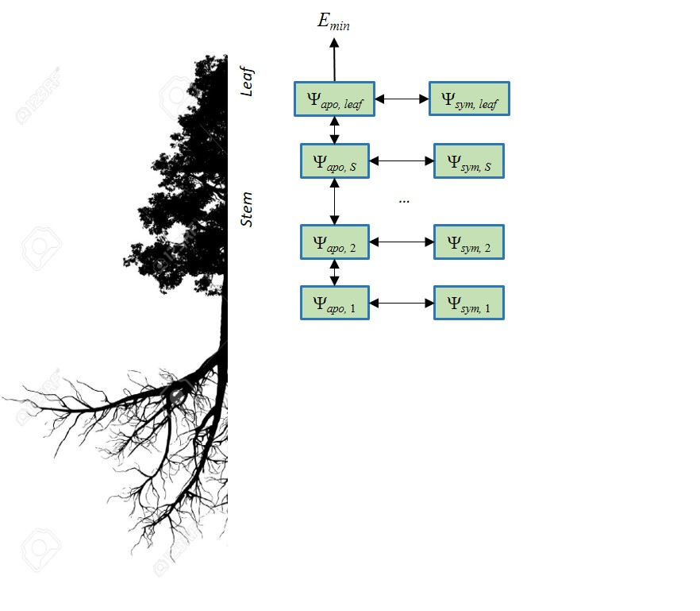

# Transpiration and photosynthesis under Sperry's model {#transpirationsperry}

The model determines transpiration and photosynthesis for each plant cohort separately as follows. First, it updates the hydraulic supply function depending on plant hydraulic characteristics and soil moisture status. Then, transpiration of the plant cohort is estimated for each of them following the framework of @Sperry2016, who suggest estimating stomatal conductance from the instantaneous maximization of profit, defined as the difference between photosynthesis gain and hydraulic cost (both normalized for comparability). Since the continuum representation implies several soil layers in parallel but joining at the root crown, the hydraulic submodel yields instantaneous water flow and carbon assimilation rates from (or to) each soil layer. Finally, the instantaneous transpiration and assimilation rates of each time step are scaled to the duration of the time step and to the leaf area of the plant cohort. The following provides details for these processes (see further details in Appendices).


## Water supply function

The supply-loss theory of plant hydraulics of @Sperry2015 uses the physics of flow through soil and xylem to quantify how canopy water supply declines with drought and ceases with hydraulic failure. The theory can be applied to different networks representing the soil-plant continuum, but in our case the continuum is represented using a network of $(N \times 2 + 2)$ resistance elements, with soil being represented in $N$ different layers. For each soil layer there is a rhizosphere element in series with a root xylem element. The $N$ different layers are in parallel up to the root crown. From there there is a stem xylem element and a final leaf element.

The *supply function* describes the rate of water supply (i.e. flow) for transpiration ($E$) as a function of the pressure drop between the soil and the leaf, and incorporates both soil, xylem and leaf hydraulic constrains [@Sperry1998; @Sperry2015; @Sperry2016a]. Assuming that maximum conductance values are in  mmol $H_2O \cdot s^{-1} \cdot m^{-2}$ per leaf area unit, transpiration rate ($E(\Psi_{leaf})$; in mmol $H_2O \cdot s^{-1} \cdot m^{-2}$ per leaf area unit) is a function of leaf water potential ($\Psi_{leaf}$; in MPa). The supply function for the whole continuum contains much information. The $\Psi$ intercept at $E=0$ represents the predawn canopy sap pressure which integrates the rooted soil moisture profile. As $E$ increments from zero, the disproportionately greater drop in $\Psi_{leaf}$ results from the loss of conductance. As the soil dries the differences in flow due to soil texture become more apparent. More details of the calculation of the supply function are given in chapter \@ref(planthydraulics).


## Leaf photosynthesis functions

Each water supply value implies an energy balance at the leaf level and a degree of stomatal openness, which ultimately leads to a particular value of leaf photosynthesis. At this point, the model has not decided the amount of water transpired. Therefore, it determines curves depending on leaf water potential for several parameters, as done for $E(\Psi_{leaf})$. More specifically, for each $\Psi_{leaf}$ value, the model calculates the corresponding leaf temperature ($T_{leaf}$; in ºC), leaf-to-air vapor pressure deficit ($VPD_{leaf}$; in kPa), leaf water vapor conductance ($g_{sw}$; in $mol H_2O·s^{-1}·m^{-2}$) and, finally the leaf gross and net (i.e. after accounting for autotrophic respiration) photosynthesis assimilation rates ($A_g$ and $A_n$; both in $\mu mol CO_2·s^{-1}·m^{-2}$). More details of the calculation of these functions are given in chapter \@ref(plantphotosynthesis).

Since the model deals with canopies and not single leaves, different parts of the crowns of plant cohorts may be in different canopy positions, which leads to differences in radiation and leaf energy balance. Moreover radiation, energy balance and photosynthesis of leaves vary through the day. Therefore, calculating photosynthesis at the canopy level requires dividing the canopy into $c$ layers, while differentiating between **sunlit** and **shade** leaves. Photosynthesis is calculated by separately for sunlit/shade leaves  (De Pury and Farquhar 1997). For each time step, the leaf temperature, leaf VPD and leaf water vapor conductance functions are determined separately for the different leaves.


## Stomatal regulation {#stomatalregulation}

@Sperry2016 presented a profit maximization approach where hydraulic costs of opening the stomata are compared against photosynthetic gain. Details of their approach, and two suggested variants, a given in the next two subsections. The final subsection explains how to scale stomatal regulation (and hence, transpiration and photosynthesis) from leaf to plant.

### Cost and gain functions

The hydraulic supply function is used to derive a transpirational *cost function* $\theta_1(\Psi_{leaf})$ that reflects the increasing damage from cavitation and the greater difficulty of moving water along the continuum [@Sperry2016a]:
\begin{equation}
\theta_1(\Psi_{leaf}) = \frac{k_{c,max}-k_{c}(\Psi_{leaf})}{k_{c,max}-k_{crit}}
\end{equation}
where $k_c(\Psi_{leaf}) = dE/d\Psi(\Psi_{leaf})$ is the slope of the supply function, $k_{c,max} = dE/d\Psi(\Psi_{soil})$ and $k_{crit} = dE/d\Psi(\Psi_{crit})$ is the slope of the supply function at $E = E_{crit}$ the critical flow beyond which hydraulic failure occurs. 

Alternatively, we considered a second cost function ($\theta_2(\Psi_{leaf})$) using the vulnerability curve of the leaf:
\begin{eqnarray}
\theta_2(\Psi_{leaf}) &=& \frac{k_{l, max}-k_l(\Psi_{leaf})}{k_{l,max} - k_{l,min}}\\
\end{eqnarray}
where $k_l$ is the leaf conductance function; and $k_{l,min}$ and $k_{l,max}$ are the minimum and maximum leaf conductance values found in the supply function. Using the leaf vulnerability curve for the cost function is grounded on the fact that stomatal regulation occurs at leaves, so that instantaneous regulation should respond to the loss of hydraulic conductance at this point, independently of what happens to the rest of the continuum. Hormonal signals from root to leaf are assumed to regulate stomatal aperture at longer time scales. Obviously, $\theta_2$ is the same before irreversible cavitation. The difference between them may be interpreted as the following. $\theta_2$ strictly follows the potential at the leaf level (and hence could be related to a loss of turgor). 
```{r, echo=FALSE}

PM11 =transp_profitMaximization(supplyNetwork11, psi2A11, type=1, Gmin, Gmax)
PM12 =transp_profitMaximization(supplyNetwork12, psi2A12, type=1, Gmin, Gmax)
PM13 =transp_profitMaximization(supplyNetwork13, psi2A13, type=1, Gmin, Gmax)
PM14 =transp_profitMaximization(supplyNetwork14, psi2A14, type=1, Gmin, Gmax)
PM21 =transp_profitMaximization(supplyNetwork21, psi2A21, type=1, Gmin, Gmax)
PM22 =transp_profitMaximization(supplyNetwork22, psi2A22, type=1, Gmin, Gmax)
PM23 =transp_profitMaximization(supplyNetwork23, psi2A23, type=1, Gmin, Gmax)
PM24 =transp_profitMaximization(supplyNetwork24, psi2A24, type=1, Gmin, Gmax)
PM31 =transp_profitMaximization(supplyNetwork31, psi2A31, type=1, Gmin, Gmax)
PM32 =transp_profitMaximization(supplyNetwork32, psi2A32, type=1, Gmin, Gmax)
PM33 =transp_profitMaximization(supplyNetwork33, psi2A33, type=1, Gmin, Gmax)
PM34 =transp_profitMaximization(supplyNetwork34, psi2A34, type=1, Gmin, Gmax)

PM11emb =transp_profitMaximization(supplyNetwork11emb, psi2A11emb, type=1, Gmin, Gmax)
PM12emb =transp_profitMaximization(supplyNetwork12emb, psi2A12emb, type=1, Gmin, Gmax)
PM13emb =transp_profitMaximization(supplyNetwork13emb, psi2A13emb, type=1, Gmin, Gmax)
PM14emb =transp_profitMaximization(supplyNetwork14emb, psi2A14emb, type=1, Gmin, Gmax)
PM21emb =transp_profitMaximization(supplyNetwork21emb, psi2A21emb, type=1, Gmin, Gmax)
PM22emb =transp_profitMaximization(supplyNetwork22emb, psi2A22emb, type=1, Gmin, Gmax)
PM23emb =transp_profitMaximization(supplyNetwork23emb, psi2A23emb, type=1, Gmin, Gmax)
PM24emb =transp_profitMaximization(supplyNetwork24emb, psi2A24emb, type=1, Gmin, Gmax)
PM31emb =transp_profitMaximization(supplyNetwork31emb, psi2A31emb, type=1, Gmin, Gmax)
PM32emb =transp_profitMaximization(supplyNetwork32emb, psi2A32emb, type=1, Gmin, Gmax)
PM33emb =transp_profitMaximization(supplyNetwork33emb, psi2A33emb, type=1, Gmin, Gmax)
PM34emb =transp_profitMaximization(supplyNetwork34emb, psi2A34emb, type=1, Gmin, Gmax)

PM11_s2 =transp_profitMaximization(supplyNetwork11, psi2A11, type=2, Gmin, Gmax, kleafmax)
PM12_s2 =transp_profitMaximization(supplyNetwork12, psi2A12,type=2, Gmin, Gmax, kleafmax)
PM13_s2 =transp_profitMaximization(supplyNetwork13, psi2A13, type=2, Gmin, Gmax, kleafmax)
PM14_s2 =transp_profitMaximization(supplyNetwork14, psi2A14,type=2, Gmin, Gmax, kleafmax)
PM21_s2 =transp_profitMaximization(supplyNetwork21, psi2A21,type=2, Gmin, Gmax, kleafmax)
PM22_s2 =transp_profitMaximization(supplyNetwork22, psi2A22,type=2, Gmin, Gmax, kleafmax)
PM23_s2 =transp_profitMaximization(supplyNetwork23, psi2A23,type=2, Gmin, Gmax, kleafmax)
PM24_s2 =transp_profitMaximization(supplyNetwork24, psi2A24,type=2, Gmin, Gmax, kleafmax)
PM31_s2 =transp_profitMaximization(supplyNetwork31, psi2A31, type=2, Gmin, Gmax, kleafmax)
PM32_s2 =transp_profitMaximization(supplyNetwork32, psi2A32,type=2, Gmin, Gmax, kleafmax)
PM33_s2 =transp_profitMaximization(supplyNetwork33, psi2A33, type=2, Gmin, Gmax, kleafmax)
PM34_s2 =transp_profitMaximization(supplyNetwork34, psi2A34, type=2, Gmin, Gmax, kleafmax)

PM11emb_s2 =transp_profitMaximization(supplyNetwork11emb, psi2A11emb, type=2, Gmin, Gmax, kleafmax)
PM12emb_s2 =transp_profitMaximization(supplyNetwork12emb, psi2A12emb, type=2, Gmin, Gmax, kleafmax)
PM13emb_s2 =transp_profitMaximization(supplyNetwork13emb, psi2A13emb, type=2, Gmin, Gmax, kleafmax)
PM14emb_s2 =transp_profitMaximization(supplyNetwork14emb, psi2A14emb, type=2, Gmin, Gmax, kleafmax)
PM21emb_s2 =transp_profitMaximization(supplyNetwork21emb, psi2A21emb, type=2, Gmin, Gmax, kleafmax)
PM22emb_s2 =transp_profitMaximization(supplyNetwork22emb, psi2A22emb, type=2, Gmin, Gmax, kleafmax)
PM23emb_s2 =transp_profitMaximization(supplyNetwork23emb, psi2A23emb, type=2, Gmin, Gmax, kleafmax)
PM24emb_s2 =transp_profitMaximization(supplyNetwork24emb, psi2A24emb, type=2, Gmin, Gmax, kleafmax)
PM31emb_s2 =transp_profitMaximization(supplyNetwork31emb, psi2A31emb, type=2, Gmin, Gmax, kleafmax)
PM32emb_s2 =transp_profitMaximization(supplyNetwork32emb, psi2A32emb, type=2, Gmin, Gmax, kleafmax)
PM33emb_s2 =transp_profitMaximization(supplyNetwork33emb, psi2A33emb, type=2, Gmin, Gmax, kleafmax)
PM34emb_s2 =transp_profitMaximization(supplyNetwork34emb, psi2A34emb, type=2, Gmin, Gmax, kleafmax)

```

The type of cost function can be specified by the user by setting parameter `hydraulicCostFunction` (see function `defaultControl()`). The following figures illustrate the $\theta_1$ and $\theta_2$ curves corresponding to the supply functions:

```{r, echo=FALSE, fig.width=8, fig.height=7, fig.align="center"}
par(mar=c(4,4,3,1), mfrow=c(2,2))
plot(-supplyNetwork11$psiLeaf, PM11$Cost, type="l", col=col1, ylab="Cost function 1", xlab = "Leaf sap pressure (-MPa)",  xlim=c(0, 7), ylim=c(0,1), lwd=1, main = "Cost 1 (original)")
lines(-supplyNetwork12$psiLeaf, PM12$Cost, lty=1, lwd=1, col=col2)
lines(-supplyNetwork13$psiLeaf, PM13$Cost, lty=1, lwd=1, col=col3)
lines(-supplyNetwork14$psiLeaf, PM14$Cost, lty=1, lwd=1, col=col4)
lines(-supplyNetwork21$psiLeaf, PM21$Cost, lty=2, lwd=1, col=col1)
lines(-supplyNetwork22$psiLeaf, PM22$Cost, lty=2, lwd=1, col=col2)
lines(-supplyNetwork23$psiLeaf, PM23$Cost, lty=2, lwd=1, col=col3)
lines(-supplyNetwork24$psiLeaf, PM24$Cost, lty=2, lwd=1, col=col4)
lines(-supplyNetwork31$psiLeaf, PM31$Cost, lty=3, lwd=1, col=col1)
lines(-supplyNetwork32$psiLeaf, PM32$Cost, lty=3, lwd=1, col=col2)
lines(-supplyNetwork33$psiLeaf, PM33$Cost, lty=3, lwd=1, col=col3)
lines(-supplyNetwork34$psiLeaf, PM34$Cost, lty=3, lwd=1, col=col4)
legend("topleft", bty="n", legend=textures, lwd=1, lty=1:3, cex=0.8)

plot(-supplyNetwork11emb$psiLeaf, PM11emb$Cost, type="l", col=col1, ylab="Cost function", xlab = "Leaf sap pressure (-MPa)",  xlim=c(0, 7), ylim=c(0,1), lwd=1, main = "Cost 1 (after cavitation)")
lines(-supplyNetwork12emb$psiLeaf, PM12emb$Cost, lty=1, lwd=1, col=col2)
lines(-supplyNetwork13emb$psiLeaf, PM13emb$Cost, lty=1, lwd=1, col=col3)
lines(-supplyNetwork14emb$psiLeaf, PM14emb$Cost, lty=1, lwd=1, col=col4)
lines(-supplyNetwork21emb$psiLeaf, PM21emb$Cost, lty=2, lwd=1, col=col1)
lines(-supplyNetwork22emb$psiLeaf, PM22emb$Cost, lty=2, lwd=1, col=col2)
lines(-supplyNetwork23emb$psiLeaf, PM23emb$Cost, lty=2, lwd=1, col=col3)
lines(-supplyNetwork24emb$psiLeaf, PM24emb$Cost, lty=2, lwd=1, col=col4)
lines(-supplyNetwork31emb$psiLeaf, PM31emb$Cost, lty=3, lwd=1, col=col1)
lines(-supplyNetwork32emb$psiLeaf, PM32emb$Cost, lty=3, lwd=1, col=col2)
lines(-supplyNetwork33emb$psiLeaf, PM33emb$Cost, lty=3, lwd=1, col=col3)
lines(-supplyNetwork34emb$psiLeaf, PM34emb$Cost, lty=3, lwd=1, col=col4)
abline(v=-psiCav, col="gray", lwd=1.5)
legend("topleft", bty="n", legend=textures, lwd=1, lty=1:3, cex=0.8)


plot(-supplyNetwork11$psiLeaf, PM11_s2$Cost, type="l", col=col1, ylab="Cost function 2", xlab = "Leaf sap pressure (-MPa)",  xlim=c(0, 7), ylim=c(0,1), lwd=1, main = "Cost 2 (original)")
lines(-supplyNetwork12$psiLeaf, PM12_s2$Cost, lty=1, lwd=1, col=col2)
lines(-supplyNetwork13$psiLeaf, PM13_s2$Cost, lty=1, lwd=1, col=col3)
lines(-supplyNetwork14$psiLeaf, PM14_s2$Cost, lty=1, lwd=1, col=col4)
lines(-supplyNetwork21$psiLeaf, PM21_s2$Cost, lty=2, lwd=1, col=col1)
lines(-supplyNetwork22$psiLeaf, PM22_s2$Cost, lty=2, lwd=1, col=col2)
lines(-supplyNetwork23$psiLeaf, PM23_s2$Cost, lty=2, lwd=1, col=col3)
lines(-supplyNetwork24$psiLeaf, PM24_s2$Cost, lty=2, lwd=1, col=col4)
lines(-supplyNetwork31$psiLeaf, PM31_s2$Cost, lty=3, lwd=1, col=col1)
lines(-supplyNetwork32$psiLeaf, PM32_s2$Cost, lty=3, lwd=1, col=col2)
lines(-supplyNetwork33$psiLeaf, PM33_s2$Cost, lty=3, lwd=1, col=col3)
lines(-supplyNetwork34$psiLeaf, PM34_s2$Cost, lty=3, lwd=1, col=col4)
legend("topleft", bty="n", legend=textures, lwd=1, lty=1:3, cex=0.8)

plot(-supplyNetwork11emb$psiLeaf, PM11emb_s2$Cost, type="l", col=col1, ylab="Cost function 2", xlab = "Leaf sap pressure (-MPa)",  xlim=c(0, 7), ylim=c(0,1), lwd=1, main = "Cost 2 (after cavitation)")
lines(-supplyNetwork12emb$psiLeaf, PM12emb_s2$Cost, lty=1, lwd=1, col=col2)
lines(-supplyNetwork13emb$psiLeaf, PM13emb_s2$Cost, lty=1, lwd=1, col=col3)
lines(-supplyNetwork14emb$psiLeaf, PM14emb_s2$Cost, lty=1, lwd=1, col=col4)
lines(-supplyNetwork21emb$psiLeaf, PM21emb_s2$Cost, lty=2, lwd=1, col=col1)
lines(-supplyNetwork22emb$psiLeaf, PM22emb_s2$Cost, lty=2, lwd=1, col=col2)
lines(-supplyNetwork23emb$psiLeaf, PM23emb_s2$Cost, lty=2, lwd=1, col=col3)
lines(-supplyNetwork24emb$psiLeaf, PM24emb_s2$Cost, lty=2, lwd=1, col=col4)
lines(-supplyNetwork31emb$psiLeaf, PM31emb_s2$Cost, lty=3, lwd=1, col=col1)
lines(-supplyNetwork32emb$psiLeaf, PM32emb_s2$Cost, lty=3, lwd=1, col=col2)
lines(-supplyNetwork33emb$psiLeaf, PM33emb_s2$Cost, lty=3, lwd=1, col=col3)
lines(-supplyNetwork34emb$psiLeaf, PM34emb_s2$Cost, lty=3, lwd=1, col=col4)
abline(v=-psiCav, col="gray", lwd=1.5)
legend("topleft", bty="n", legend=textures, lwd=1, lty=1:3, cex=0.8)
```

The normalized photosynthetic *gain function* $\beta(\Psi_{leaf})$ reflects the actual assimilation rate with respect to the maximum:
\begin{equation}
\beta(\Psi_{leaf}) = \frac{A(\Psi_{leaf})}{A_{max}}
\end{equation}
where $A_{max}$ is the instantaneous maximum assimilation rate estimated over the full $\Psi_{leaf}$ range. The following figures illustrate the $\theta(\Psi_{leaf})$ and $\beta(\Psi_{leaf})$ curves corresponding to the supply and assimilation functions:

```{r, echo=FALSE, fig.width=8, fig.height=3.5, fig.align="center"}
par(mar=c(4,4,3,1), mfrow=c(1,2))

plot(-supplyNetwork11$psiLeaf, PM11$Gain, type="l", col=col1, ylab="Gain function", xlab = "Canopy sap pressure (-MPa)",  xlim=c(0, 7), ylim=c(0,1), lwd=1, main = "Gain (original)")
lines(-supplyNetwork12$psiLeaf, PM12$Gain, lty=1, lwd=1, col=col2)
lines(-supplyNetwork13$psiLeaf, PM13$Gain, lty=1, lwd=1, col=col3)
lines(-supplyNetwork14$psiLeaf, PM14$Gain, lty=1, lwd=1, col=col4)
lines(-supplyNetwork21$psiLeaf, PM21$Gain, lty=2, lwd=1, col=col1)
lines(-supplyNetwork22$psiLeaf, PM22$Gain, lty=2, lwd=1, col=col2)
lines(-supplyNetwork23$psiLeaf, PM23$Gain, lty=2, lwd=1, col=col3)
lines(-supplyNetwork24$psiLeaf, PM24$Gain, lty=2, lwd=1, col=col4)
lines(-supplyNetwork31$psiLeaf, PM31$Gain, lty=3, lwd=1, col=col1)
lines(-supplyNetwork32$psiLeaf, PM32$Gain, lty=3, lwd=1, col=col2)
lines(-supplyNetwork33$psiLeaf, PM33$Gain, lty=3, lwd=1, col=col3)
lines(-supplyNetwork34$psiLeaf, PM34$Gain, lty=3, lwd=1, col=col4)
legend("bottomright", bty="n", legend=textures, lwd=1, lty=1:3, cex=0.8)


plot(-supplyNetwork11emb$psiLeaf, PM11emb$Gain, type="l", col=col1, ylab="Gain function", xlab = "Canopy sap pressure (-MPa)",  xlim=c(0, 7), ylim=c(0,1), lwd=1, main = "Gain (after cavitation)")
lines(-supplyNetwork12emb$psiLeaf, PM12emb$Gain, lty=1, lwd=1, col=col2)
lines(-supplyNetwork13emb$psiLeaf, PM13emb$Gain, lty=1, lwd=1, col=col3)
lines(-supplyNetwork14emb$psiLeaf, PM14emb$Gain, lty=1, lwd=1, col=col4)
lines(-supplyNetwork21emb$psiLeaf, PM21emb$Gain, lty=2, lwd=1, col=col1)
lines(-supplyNetwork22emb$psiLeaf, PM22emb$Gain, lty=2, lwd=1, col=col2)
lines(-supplyNetwork23emb$psiLeaf, PM23emb$Gain, lty=2, lwd=1, col=col3)
lines(-supplyNetwork24emb$psiLeaf, PM24emb$Gain, lty=2, lwd=1, col=col4)
lines(-supplyNetwork31emb$psiLeaf, PM31emb$Gain, lty=3, lwd=1, col=col1)
lines(-supplyNetwork32emb$psiLeaf, PM32emb$Gain, lty=3, lwd=1, col=col2)
lines(-supplyNetwork33emb$psiLeaf, PM33emb$Gain, lty=3, lwd=1, col=col3)
lines(-supplyNetwork34emb$psiLeaf, PM34emb$Gain, lty=3, lwd=1, col=col4)
abline(v=-psiCav, col="gray", lwd=1.5)
legend("bottomright", bty="n", legend=textures, lwd=1, lty=1:3, cex=0.8)
```


### Profit maximization at the leaf level

According to @Sperry2016, stomatal regulation can be effectively estimated by determining the maximum of the *profit function* ($Profit(\Psi_{leaf})$), for which we consider three alternatives corresponding to the two cost functions:
\begin{eqnarray}
Profit_1(\Psi_{leaf}) &=& \beta(\Psi_{leaf})-\theta_1(\Psi_{leaf})\\
Profit_2(\Psi_{leaf}) &=& \beta(\Psi_{leaf})-\theta_2(\Psi_{leaf})\\
\end{eqnarray}
Once $\Psi_{leaf}$ that maximizes profit is determined, the values of the remaining variables are also determined. At this point, it may happen that $g_{sw}(\Psi_{leaf})$ is lower than the minimum (i.e. cuticular) water vapor conductance ($g_{swmin}$) or larger than the maximum water vapor conductance ($g_{swmax}$). These thresholds need to be taken into account when determining the maximum of the profit function. The following figures illustrate the $Profit_1(\Psi_{leaf})$ and $Profit_2(\Psi_{leaf})$ curves of corresponding to the previous cost and gain curves:
\begin{center}

```{r, echo=FALSE, fig.width=8, fig.height=7, fig.align="center"}
par(mar=c(4,4,2,1), mfrow=c(2,2))
plot(-supplyNetwork11$psiLeaf, PM11$Profit, type="l", col=col1, ylab="Profit 1", xlab = "Leaf sap pressure (-MPa)",  xlim=c(0, 7), ylim=c(0,1), lwd=1, main="original")
points(-supplyNetwork11$psiLeaf[PM11$iMaxProfit+1],
         PM11$Profit[PM11$iMaxProfit+1], col=col1, pch = 0)
lines(-supplyNetwork12$psiLeaf, PM12$Profit, lty=1, lwd=1, col=col2)
points(-supplyNetwork12$psiLeaf[PM12$iMaxProfit+1],
         PM12$Profit[PM12$iMaxProfit+1], col=col2, pch = 0)
lines(-supplyNetwork13$psiLeaf, PM13$Profit, lty=1, lwd=1, col=col3)
points(-supplyNetwork13$psiLeaf[PM13$iMaxProfit+1],
         PM13$Profit[PM13$iMaxProfit+1], col=col3, pch = 0)
lines(-supplyNetwork14$psiLeaf, PM14$Profit, lty=1, lwd=1, col=col4)
points(-supplyNetwork14$psiLeaf[PM14$iMaxProfit+1],
         PM14$Profit[PM14$iMaxProfit+1], col=col4, pch = 0)
lines(-supplyNetwork21$psiLeaf, PM21$Profit, lty=2, lwd=1, col=col1)
points(-supplyNetwork21$psiLeaf[PM21$iMaxProfit+1],
         PM21$Profit[PM21$iMaxProfit+1], col=col1, pch = 0)
lines(-supplyNetwork22$psiLeaf, PM22$Profit, lty=2, lwd=1, col=col2)
points(-supplyNetwork22$psiLeaf[PM22$iMaxProfit+1],
         PM22$Profit[PM22$iMaxProfit+1], col=col2, pch = 0)
lines(-supplyNetwork23$psiLeaf, PM23$Profit, lty=2, lwd=1, col=col3)
points(-supplyNetwork23$psiLeaf[PM23$iMaxProfit+1],
         PM23$Profit[PM23$iMaxProfit+1], col=col3, pch = 0)
lines(-supplyNetwork24$psiLeaf, PM24$Profit, lty=2, lwd=1, col=col4)
points(-supplyNetwork24$psiLeaf[PM24$iMaxProfit+1],
         PM24$Profit[PM24$iMaxProfit+1], col=col4, pch = 0)
lines(-supplyNetwork31$psiLeaf, PM31$Profit, lty=3, lwd=1, col=col1)
points(-supplyNetwork31$psiLeaf[PM31$iMaxProfit+1],
         PM31$Profit[PM31$iMaxProfit+1], col=col1, pch = 0)
lines(-supplyNetwork32$psiLeaf, PM32$Profit, lty=3, lwd=1, col=col2)
points(-supplyNetwork32$psiLeaf[PM32$iMaxProfit+1],
         PM32$Profit[PM32$iMaxProfit+1], col=col2, pch = 0)
lines(-supplyNetwork33$psiLeaf, PM33$Profit, lty=3, lwd=1, col=col3)
points(-supplyNetwork33$psiLeaf[PM33$iMaxProfit+1],
         PM33$Profit[PM33$iMaxProfit+1], col=col3, pch = 0)
lines(-supplyNetwork34$psiLeaf, PM34$Profit, lty=3, lwd=1, col=col4)
points(-supplyNetwork34$psiLeaf[PM34$iMaxProfit+1],
         PM34$Profit[PM34$iMaxProfit+1], col=col4, pch = 0)
legend("topright", bty="n", legend=textures, lwd=1, lty=1:3, cex=0.8)
abline(h=0,col="gray")

plot(-supplyNetwork11emb$psiLeaf, PM11emb$Profit, type="l", col=col1, ylab="Profit 1", xlab = "Leaf sap pressure (-MPa)",  xlim=c(0, 7), ylim=c(0,1), lwd=1, main="after cavitation")
points(-supplyNetwork11emb$psiLeaf[PM11emb$iMaxProfit+1],
         PM11emb$Profit[PM11emb$iMaxProfit+1], col=col1, pch = 0)
lines(-supplyNetwork12emb$psiLeaf, PM12emb$Profit, lty=1, lwd=1, col=col2)
points(-supplyNetwork12emb$psiLeaf[PM12emb$iMaxProfit+1],
         PM12emb$Profit[PM12emb$iMaxProfit+1], col=col2, pch = 0)
lines(-supplyNetwork13emb$psiLeaf, PM13emb$Profit, lty=1, lwd=1, col=col3)
points(-supplyNetwork13emb$psiLeaf[PM13emb$iMaxProfit+1],
         PM13emb$Profit[PM13emb$iMaxProfit+1], col=col3, pch = 0)
lines(-supplyNetwork14emb$psiLeaf, PM14emb$Profit, lty=1, lwd=1, col=col4)
points(-supplyNetwork14emb$psiLeaf[PM14emb$iMaxProfit+1],
         PM14emb$Profit[PM14emb$iMaxProfit+1], col=col4, pch = 0)
lines(-supplyNetwork21emb$psiLeaf, PM21emb$Profit, lty=2, lwd=1, col=col1)
points(-supplyNetwork21emb$psiLeaf[PM21emb$iMaxProfit+1],
         PM21emb$Profit[PM21emb$iMaxProfit+1], col=col1, pch = 0)
lines(-supplyNetwork22emb$psiLeaf, PM22emb$Profit, lty=2, lwd=1, col=col2)
points(-supplyNetwork22emb$psiLeaf[PM22emb$iMaxProfit+1],
         PM22emb$Profit[PM22emb$iMaxProfit+1], col=col2, pch = 0)
lines(-supplyNetwork23emb$psiLeaf, PM23emb$Profit, lty=2, lwd=1, col=col3)
points(-supplyNetwork23emb$psiLeaf[PM23emb$iMaxProfit+1],
         PM23emb$Profit[PM23emb$iMaxProfit+1], col=col3, pch = 0)
lines(-supplyNetwork24emb$psiLeaf, PM24emb$Profit, lty=2, lwd=1, col=col4)
points(-supplyNetwork24emb$psiLeaf[PM24emb$iMaxProfit+1],
         PM24emb$Profit[PM24emb$iMaxProfit+1], col=col4, pch = 0)
lines(-supplyNetwork31emb$psiLeaf, PM31emb$Profit, lty=3, lwd=1, col=col1)
points(-supplyNetwork31emb$psiLeaf[PM31emb$iMaxProfit+1],
         PM31emb$Profit[PM31emb$iMaxProfit+1], col=col1, pch = 0)
lines(-supplyNetwork32emb$psiLeaf, PM32emb$Profit, lty=3, lwd=1, col=col2)
points(-supplyNetwork32emb$psiLeaf[PM32emb$iMaxProfit+1],
         PM32emb$Profit[PM32emb$iMaxProfit+1], col=col2, pch = 0)
lines(-supplyNetwork33emb$psiLeaf, PM33emb$Profit, lty=3, lwd=1, col=col3)
points(-supplyNetwork33emb$psiLeaf[PM33emb$iMaxProfit+1],
         PM33emb$Profit[PM33emb$iMaxProfit+1], col=col3, pch = 0)
lines(-supplyNetwork34emb$psiLeaf, PM34emb$Profit, lty=3, lwd=1, col=col4)
points(-supplyNetwork34emb$psiLeaf[PM34emb$iMaxProfit+1],
         PM34emb$Profit[PM34emb$iMaxProfit+1], col=col4, pch = 0)
legend("topright", bty="n", legend=textures, lwd=1, lty=1:3, cex=0.8)
abline(h=0,col="gray")
abline(v=-psiCav, col="gray", lwd=1.5)

plot(-supplyNetwork11$psiLeaf, PM11_s2$Profit, type="l", col=col1, ylab="Profit 2", xlab = "Leaf sap pressure (-MPa)",  xlim=c(0, 7), ylim=c(0,1), lwd=1, main="original")
points(-supplyNetwork11$psiLeaf[PM11_s2$iMaxProfit+1],
         PM11_s2$Profit[PM11_s2$iMaxProfit+1], col=col1, pch = 0)
lines(-supplyNetwork12$psiLeaf, PM12_s2$Profit, lty=1, lwd=1, col=col2)
points(-supplyNetwork12$psiLeaf[PM12_s2$iMaxProfit+1],
         PM12_s2$Profit[PM12_s2$iMaxProfit+1], col=col2, pch = 0)
lines(-supplyNetwork13$psiLeaf, PM13_s2$Profit, lty=1, lwd=1, col=col3)
points(-supplyNetwork13$psiLeaf[PM13_s2$iMaxProfit+1],
         PM13_s2$Profit[PM13_s2$iMaxProfit+1], col=col3, pch = 0)
lines(-supplyNetwork14$psiLeaf, PM14_s2$Profit, lty=1, lwd=1, col=col4)
points(-supplyNetwork14$psiLeaf[PM14_s2$iMaxProfit+1],
         PM14_s2$Profit[PM14_s2$iMaxProfit+1], col=col4, pch = 0)
lines(-supplyNetwork21$psiLeaf, PM21_s2$Profit, lty=2, lwd=1, col=col1)
points(-supplyNetwork21$psiLeaf[PM21_s2$iMaxProfit+1],
         PM21_s2$Profit[PM21_s2$iMaxProfit+1], col=col1, pch = 0)
lines(-supplyNetwork22$psiLeaf, PM22_s2$Profit, lty=2, lwd=1, col=col2)
points(-supplyNetwork22$psiLeaf[PM22_s2$iMaxProfit+1],
         PM22_s2$Profit[PM22_s2$iMaxProfit+1], col=col2, pch = 0)
lines(-supplyNetwork23$psiLeaf, PM23_s2$Profit, lty=2, lwd=1, col=col3)
points(-supplyNetwork23$psiLeaf[PM23_s2$iMaxProfit+1],
         PM23_s2$Profit[PM23_s2$iMaxProfit+1], col=col3, pch = 0)
lines(-supplyNetwork24$psiLeaf, PM24_s2$Profit, lty=2, lwd=1, col=col4)
points(-supplyNetwork24$psiLeaf[PM24_s2$iMaxProfit+1],
         PM24_s2$Profit[PM24_s2$iMaxProfit+1], col=col4, pch = 0)
lines(-supplyNetwork31$psiLeaf, PM31_s2$Profit, lty=3, lwd=1, col=col1)
points(-supplyNetwork31$psiLeaf[PM31_s2$iMaxProfit+1],
         PM31_s2$Profit[PM31_s2$iMaxProfit+1], col=col1, pch = 0)
lines(-supplyNetwork32$psiLeaf, PM32_s2$Profit, lty=3, lwd=1, col=col2)
points(-supplyNetwork32$psiLeaf[PM32_s2$iMaxProfit+1],
         PM32_s2$Profit[PM32_s2$iMaxProfit+1], col=col2, pch = 0)
lines(-supplyNetwork33$psiLeaf, PM33_s2$Profit, lty=3, lwd=1, col=col3)
points(-supplyNetwork33$psiLeaf[PM33_s2$iMaxProfit+1],
         PM33_s2$Profit[PM33_s2$iMaxProfit+1], col=col3, pch = 0)
lines(-supplyNetwork34$psiLeaf, PM34_s2$Profit, lty=3, lwd=1, col=col4)
points(-supplyNetwork34$psiLeaf[PM34_s2$iMaxProfit+1],
         PM34_s2$Profit[PM34_s2$iMaxProfit+1], col=col4, pch = 0)
legend("topright", bty="n", legend=textures, lwd=1, lty=1:3, cex=0.8)
abline(h=0,col="gray")

plot(-supplyNetwork11emb$psiLeaf, PM11emb_s2$Profit, type="l", col=col1, ylab="Profit 2", xlab = "Leaf sap pressure (-MPa)",  xlim=c(0, 7), ylim=c(0,1), lwd=1, main="after cavitation")
points(-supplyNetwork11emb$psiLeaf[PM11emb_s2$iMaxProfit+1],
         PM11emb_s2$Profit[PM11emb_s2$iMaxProfit+1], col=col1, pch = 0)
lines(-supplyNetwork12emb$psiLeaf, PM12emb_s2$Profit, lty=1, lwd=1, col=col2)
points(-supplyNetwork12emb$psiLeaf[PM12emb_s2$iMaxProfit+1],
         PM12emb_s2$Profit[PM12emb_s2$iMaxProfit+1], col=col2, pch = 0)
lines(-supplyNetwork13emb$psiLeaf, PM13emb_s2$Profit, lty=1, lwd=1, col=col3)
points(-supplyNetwork13emb$psiLeaf[PM13emb_s2$iMaxProfit+1],
         PM13emb_s2$Profit[PM13emb_s2$iMaxProfit+1], col=col3, pch = 0)
lines(-supplyNetwork14emb$psiLeaf, PM14emb_s2$Profit, lty=1, lwd=1, col=col4)
points(-supplyNetwork14emb$psiLeaf[PM14emb_s2$iMaxProfit+1],
         PM14emb_s2$Profit[PM14emb_s2$iMaxProfit+1], col=col4, pch = 0)
lines(-supplyNetwork21emb$psiLeaf, PM21emb_s2$Profit, lty=2, lwd=1, col=col1)
points(-supplyNetwork21emb$psiLeaf[PM21emb_s2$iMaxProfit+1],
         PM21emb_s2$Profit[PM21emb_s2$iMaxProfit+1], col=col1, pch = 0)
lines(-supplyNetwork22emb$psiLeaf, PM22emb_s2$Profit, lty=2, lwd=1, col=col2)
points(-supplyNetwork22emb$psiLeaf[PM22emb_s2$iMaxProfit+1],
         PM22emb_s2$Profit[PM22emb_s2$iMaxProfit+1], col=col2, pch = 0)
lines(-supplyNetwork23emb$psiLeaf, PM23emb_s2$Profit, lty=2, lwd=1, col=col3)
points(-supplyNetwork23emb$psiLeaf[PM23emb_s2$iMaxProfit+1],
         PM23emb_s2$Profit[PM23emb_s2$iMaxProfit+1], col=col3, pch = 0)
lines(-supplyNetwork24emb$psiLeaf, PM24emb_s2$Profit, lty=2, lwd=1, col=col4)
points(-supplyNetwork24emb$psiLeaf[PM24emb_s2$iMaxProfit+1],
         PM24emb_s2$Profit[PM24emb_s2$iMaxProfit+1], col=col4, pch = 0)
lines(-supplyNetwork31emb$psiLeaf, PM31emb_s2$Profit, lty=3, lwd=1, col=col1)
points(-supplyNetwork31emb$psiLeaf[PM31emb_s2$iMaxProfit+1],
         PM31emb_s2$Profit[PM31emb_s2$iMaxProfit+1], col=col1, pch = 0)
lines(-supplyNetwork32emb$psiLeaf, PM32emb_s2$Profit, lty=3, lwd=1, col=col2)
points(-supplyNetwork32emb$psiLeaf[PM32emb_s2$iMaxProfit+1],
         PM32emb_s2$Profit[PM32emb_s2$iMaxProfit+1], col=col2, pch = 0)
lines(-supplyNetwork33emb$psiLeaf, PM33emb_s2$Profit, lty=3, lwd=1, col=col3)
points(-supplyNetwork33emb$psiLeaf[PM33emb_s2$iMaxProfit+1],
         PM33emb_s2$Profit[PM33emb_s2$iMaxProfit+1], col=col3, pch = 0)
lines(-supplyNetwork34emb$psiLeaf, PM34emb_s2$Profit, lty=3, lwd=1, col=col4)
points(-supplyNetwork34emb$psiLeaf[PM34emb_s2$iMaxProfit+1],
         PM34emb_s2$Profit[PM34emb_s2$iMaxProfit+1], col=col4, pch = 0)
legend("topright", bty="n", legend=textures, lwd=1, lty=1:3, cex=0.8)
abline(h=0,col="gray")
abline(v=-psiCav, col="gray", lwd=1.5)
```

Squares in the previous figures indicate the maximum profit points in each situation. In the case of non-cavitated system (left panels), the drier the soil, the closer is the maximum profit $\Psi_{leaf}$ to soil water potential as one would expect intuitively. This occurs for all three profit functions. Unlike $\theta_1$ which is different for each soil texture (and soil potential), $\theta_2$ is the same for all soil textures. As a result, the regulation points do not differ much among textures in $Profit_2$ and $Profit_3$ because the only difference is in the gain function. For a system with xylem cavitation (right panel), the maximum $Profit_1$ curves behave strangely. In particular may get a more negative value for $\Psi_{canopy}$ for wet soils than for dry soils. This effect does not occur when using $Profit_2$. $Profit_2$ brings plant water potentials to more negative values after cavitation. Although cavitation did not change the $\theta_2$ function, the supply function is flatter and this affects the gain function, making it increase less steeply with lower potentials.

Differences between profit functions can be more easily seen when plotting the change from original (uncavitated) regulation to the cavitated one, in terms of both canopy sap pressure and flow rate:
```{r, echo=FALSE, fig.width=4, fig.height=3.5, fig.align="center"}
par(mar=c(4,4,2,1), mfrow=c(1,1))
plot(-supplyNetwork11$psiLeaf, supplyNetwork11$E, type="n", col=col1, ylab="Flow rate", xlab = "Leaf sap pressure (-MPa)",  xlim=c(0, 5), ylim=c(0,4), lwd=1, main="")
p11 = c(-supplyNetwork11$psiLeaf[PM11$iMaxProfit+1],
         supplyNetwork11$E[PM11$iMaxProfit+1])
p12 = c(-supplyNetwork12$psiLeaf[PM12$iMaxProfit+1],
         supplyNetwork12$E[PM12$iMaxProfit+1])
p13 = c(-supplyNetwork13$psiLeaf[PM13$iMaxProfit+1],
         supplyNetwork13$E[PM13$iMaxProfit+1])
p14=c(-supplyNetwork14$psiLeaf[PM14$iMaxProfit+1],
         supplyNetwork14$E[PM14$iMaxProfit+1])
p11_cav = c(-supplyNetwork11emb$psiLeaf[PM11emb$iMaxProfit+1],
         supplyNetwork11emb$E[PM11emb$iMaxProfit+1])
p12_cav = c(-supplyNetwork12emb$psiLeaf[PM12emb$iMaxProfit+1],
         supplyNetwork12emb$E[PM12emb$iMaxProfit+1])
p13_cav = c(-supplyNetwork13emb$psiLeaf[PM13emb$iMaxProfit+1],
         supplyNetwork13emb$E[PM13emb$iMaxProfit+1])
p14_cav = c(-supplyNetwork14emb$psiLeaf[PM14emb$iMaxProfit+1],
         supplyNetwork14emb$E[PM14emb$iMaxProfit+1])
points(rbind(p11,p12,p13,p14), col=c(col1, col2, col3,col4), pch = 0)
points(rbind(p11_cav,p12_cav,p13_cav,p14_cav), col=c(col1, col2, col3,col4), pch = 15)
lines(rbind(p11,p11_cav), col=col1)
lines(rbind(p12,p12_cav), col=col2)
lines(rbind(p13,p13_cav), col=col3)
lines(rbind(p14,p14_cav), col=col4)

p11_s2 = c(-supplyNetwork11$psiLeaf[PM11_s2$iMaxProfit+1],
         supplyNetwork11$E[PM11_s2$iMaxProfit+1])
p12_s2 = c(-supplyNetwork12$psiLeaf[PM12_s2$iMaxProfit+1],
         supplyNetwork12$E[PM12_s2$iMaxProfit+1])
p13_s2 = c(-supplyNetwork13$psiLeaf[PM13_s2$iMaxProfit+1],
         supplyNetwork13$E[PM13_s2$iMaxProfit+1])
p14_s2 = c(-supplyNetwork14$psiLeaf[PM14_s2$iMaxProfit+1],
         supplyNetwork14$E[PM14_s2$iMaxProfit+1])
p11_cav_s2 = c(-supplyNetwork11emb$psiLeaf[PM11emb_s2$iMaxProfit+1],
         supplyNetwork11emb$E[PM11emb_s2$iMaxProfit+1])
p12_cav_s2 = c(-supplyNetwork12emb$psiLeaf[PM12emb_s2$iMaxProfit+1],
         supplyNetwork12emb$E[PM12emb_s2$iMaxProfit+1])
p13_cav_s2 = c(-supplyNetwork13emb$psiLeaf[PM13emb_s2$iMaxProfit+1],
         supplyNetwork13emb$E[PM13emb_s2$iMaxProfit+1])
p14_cav_s2 = c(-supplyNetwork14emb$psiLeaf[PM14emb_s2$iMaxProfit+1],
         supplyNetwork14emb$E[PM14emb_s2$iMaxProfit+1])
points(rbind(p11_s2,p12_s2,p13_s2,p14_s2), col=c(col1, col2, col3,col4), pch = 1)
points(rbind(p11_cav_s2,p12_cav_s2,p13_cav_s2,p14_cav_s2), col=c(col1, col2, col3,col4), pch = 19)
lines(rbind(p11_s2,p11_cav_s2), col=col1)
lines(rbind(p12_s2,p12_cav_s2), col=col2)
lines(rbind(p13_s2,p13_cav_s2), col=col3)
lines(rbind(p14_s2,p14_cav_s2), col=col4)

legend("topleft", bty="n", legend=c("Profit 1 (original)", "Profit 1 (cavitated)", "Profit 2 (original)", "Profit 2 (cavitated)"), pch=c(0,15, 1,19), cex=0.6)
abline(v=-psiCav, col="gray")
legend("topright", bty="n", col=c(col1,col2,col3,col4), lty=1, legend=c("P_soil = -0.1/-0.2/-0.3","P_soil = -1.1/-1.2/-1.3","P_soil = -2.1/-2.2/-2.3","P_soil = -3.1/-3.2/-3.3"), cex=0.6)
```

In $Profit_1$ irreversible cavitation often brings, after soil rewetting, less conservative stomatal regulation that enables higher flow rates. This does not seem to happen in $Profit_2$, where despite irreversible cavitation leads to more negative water potentials, predicted flow rates after rewetting are not above those predicted before cavitation.


## Scaling to the plant level {#scalingtranspirationphotosynthesis}

So far, we have considered stomatal regulation by at the leaf level only. At the plant level, the gain function could be build from the crown photosynthesis function $A(\Psi_{leaf})$ that we defined in subsection 'Crown photosynthesis'. However, using the crown photosynthesis function would imply the assumption that the same stomatal aperture occurs in all leaves of the crown, independently of whether they are in shade or sunlit. A more realistic approach is to determine stomatal regulation by profit maximization for sunlit and shade leaves separately; and then determining the average photosynthesis and flow rate from the leaf area of each leaf type. The gain function and profit maximization calculations conducted for each leaf type yield instantaneous water potentials $\Psi_{sunlit}$ and $\Psi_{shade}$. They also yield flow values $E_{shade}$ and $E_{sunlit}$, in $mmol H_2O \cdot s^{-1} \cdot m^{-2}$ of leaf area unit. The average flow rate in $mmol H_2O \cdot s^{-1} \cdot m^{-2}$ per leaf area unit at the plant level is the weighed average:
\begin{equation}
 E_{plant} = \frac{E_{sunlit} \cdot LAI_{sunlit} + E_{shade} \cdot LAI_{shade}}{LAI_{sunlit} + LAI_{shade}}
\end{equation}
where $LAI_{sunlit}$ and $LAI_{shade}$ are the cohorts LAI values for sunlit and shade leaves, respectively. Net photosynthesis per leaf area of sunlit and shade leaves (i.e. $A_{n,sunlit}$ and $A_{n,shade}$) is aggregated similarly:
\begin{equation}
 A_{n, plant} = \frac{A_{n,sunlit} \cdot LAI_{sunlit} + A_{n,shade} \cdot LAI_{shade}}{LAI_{sunlit} + LAI_{shade}}
\end{equation}
Profit maximization calculations for shade and sunlit leaves imply different amount of water extracted from the soil layers and different plant water potentials. To overcome this issue, we must use the hydraulic supply function  to find the extraction flows from soil layers, the  water potential at the root crown and the 'average' water potential of the crown all corresponding to the average flow $E_{plant}$.

## Stomatal regulation
Plants must open their stomata to acquire $CO_2$ and perform photosynthesis, but doing so promotes water loss. This trade-off has resulted in a tight coordination between capacity to supply and transpire water (hydraulic conductance and diffusive conductance to water vapor) and the maximum capacity for photosynthesis (carboxylation rate and electron-transport rate). For modelling purposes, this carbon-for-water trade-off means that hydraulics, stomatal conductance, transpiration and photosynthesis need to be estimated simultaneously. Here we adopt the framework of @Sperry2016, who suggest estimating stomatal conductance from the instantaneous maximization of profit, defined as the difference between photosynthesis gain and hydraulic cost (both normalized for comparability).

Stomatal regulation and plant transpiration are determined for each time step separately. The model transforms the slope of the hydraulic supply function into a \textbf{cost function} and the cohort's gross photosynthesis function into a \textbf{gain function}. Then, it finds the $\Psi_{leaf}$ that maximizes the difference between gain and cost. This simultaneously determines $E$ and $A_n$ at the plant cohort level (and also $T_{leaf}$, $VPD_{leaf}$, $g_{sw}$ and $A_{n}$ for each sunlit/shade leaf in the canopy). The details of all these calculations can be found in section \@ref(stomatalregulation).

While the cost function is the same for the whole day, the gain function and profit maximization calculations are conducted for each of the time steps, yielding instantaneous flow values $E_{t, s}$ for each soil layer $s$, in mmol H$_2$O·s$^{-1}$·m$^{-2}$ of leaf area unit and instantaneous net assimilation values $A_{n,t}$ in $\mu$mol C·s$^{-1}$·m$^{-2}$ of ground area (i.e. at the cohort level). To obtain daily values of transpiration at the cohort level the instantaneous flow rates $E_{t, s}$ need to be scaled to $E_{step,s}$ using:
\begin{equation}
E_{step,s} = E_{t,s}\cdot 10^{-3} \cdot 0.01802 \cdot LAI_i^{\phi}\cdot \Delta t
\end{equation}
where $0.01802$ is the molar weight (in kg = L = mm) of water, $LAI_i^{\phi}$ is the leaf area index of plant cohort $i$ and $\Delta t_{step} = \tau_{day}/n_t$, being $n_t$ the number of time steps. The flow rates $E_{step,s}$ of all steps are added to yield $E_s$ (in mm H$_2$O·day$^{-1}$):
\begin{equation}
E_{s} = \sum_{n=1}^{n_t} {E_{step,s}}
\end{equation}
and substracted from the water content of the corresponding soil layer. Daily values of net carbon assimilation for plant cohorts are obtained similarly. The instantaneous rates $A_{n, t}$ are scaled to $A_{n,step}$ using:
\begin{equation}
A_{n,step} = A_{n, t} \cdot 10^{-6} \cdot 12.01017 \cdot \Delta t
\end{equation}
where $12.01017$ is the molar weight of carbon (in g). $A_{n, step}$ values of all steps are added to obtain $A_n$, the daily net assimilation at the cohort level (in g C·m$^{-2}$·day$^{-1}$):
\begin{equation}
A_{n,step} = \sum_{n=1}^{n_t} {A_{n,step}}
\end{equation}


## Plant drought stress and water potentials {#advanceddroughtstress}

Because the model determines optimum transpiration for each time step, this leads to a daily sequence of leaf water potential ($\Psi_{leaf,t}$) and root crown water potential ($\Psi_{rootcrown,t}$) values. The model chooses as the leaf water potential of the day for cohort $i$ ($\Psi_{leaf,i}$) the minimum of $\Psi_{leaf,t}$ values. Analogously, the model chooses as the root crown water potential of the day for cohort $i$ ($\Psi_{rootcrown,i}$) the minimum of $\Psi_{rootcrown,t}$ values. They represent water potential values that would occur at mid-day. Unlike under the simple transpiration mode, here there is no need to average water potentials under the Sperry transpiration mode, because the differences in potential of soil layers are already integrated in the hydraulic supply function. 

In order to have an estimate of daily drought stress for the plant cohort, the model uses the stem vulnerability curve of the plant to find the conductance relative to maximum stem conductance and turns it into its complement:

\begin{equation}
DDS_i = \phi_i \cdot \left( 1.0 - \frac{k_{stem, i}(\Psi_{rootcrown,i})}{k_{\max stem, i}}\right) = \phi_i \cdot \left(1.0 - e^{-(\Psi_{rootcrown,i}/d_{stem})^{c_{stem}}}\right)
\end{equation}
where $\phi_i$ is the leaf phenological status. Note the use of $\Psi_{rootcrown,i}$ (and not $\Psi_{leaf,i}$) to determine drought stress index. Thus the model tracks the degree of conductance decrease at the beginning of the stem as a measure of drought stress. This choice makes daily drought stress values of the Simple and Complex transpiration modes more comparable (because leaf mid-day water potentials are usually much more negative than soil water potentials) and is a sensible choice if one wants to run the model in irreversible cavitation mode (see below).


## Irreversible cavitation and hydraulic disconnection
Like with the 'Granier' transpiration mode, the water balance model with 'Sperry' transpiration mode is normally run assuming that although soil drought may reduce transpiration, embolized xylem conduits are automatically refilled when soil moisture recovers. When setting \texttt{cavitationRefill = FALSE} the model tracks the maximum value of drought stress as before:
\begin{equation}
P_{embolized,i}= \max \{P_{embolized,i}, DDS_i \}
\end{equation}
However, the way that previous cavitation levels are taken into account differs from the 'Simple' transpiration mode. In this mode, the stem xylem vulnerability curve is modified by specifying that the maximum conductance value is reduced and set to $k_{stem,i} \cdot (1.0 - P_{embolized,i})$. This effectively causes the supply function to reach lower flow values for the same water potential drop (see details in Appendices).

When running the model using the 'Complex' transpiration mode plants may be allowed to disconnect from the soil when its potential becomes too negative. Parameter $P_{rootdisc,i}$ can be used to specify the minimum relative conductance value that the plant will tolerate without disconnecting hydraulically from the soil (in normal simulations $P_{rootdisc,i} = 0$). Again, this affects the model in a way slightly different than when running the model in 'Simple' transpiration mode. Before building the supply function, the model checks if there are layers where the relative conductance of roots (i.e. $k_{root, i, s}(\Psi_{s})/k_{\max root, i, s}$) is lower than $P_{rootdisc,i}$. Those layers where this happens are not considered in the calculation of the supply function and do not contribute to transpiration or to the determination of plant water potentials. 


## Transpiration and photosynthesis after soil disconnection

Considering water compartments allows tracking leaf and stem (i.e. plant) *dessication*, either when the plant is connected to the soil or when transpiration flow comes from the plant itself. In **medfate**, disconnection from a given soil layer occurs when its water potential is too low with respect to the root xylem vulnerability curve. The user can control this behaviour by specifying a $p_{root}$ threshold for relative conductance, and the plant will be disconnected from a soil layer if $k_{r}(\Psi_{soil})/k_{r,max} < p_{root}$. An interesting situation arises when a plant is disconnected from all soil layers. In this case, the steady-state calculations cannot be used to determine flows, so one is forced to use a full discrete time approximation, with compartments and flows indicated in the figure below.

```{r, out.width='80%', fig.align="center", fig.cap="Schematic representation of hydraulics in a whole-plant network after disconnection from soil", echo=FALSE}

```

As before, each time step $\Delta t$ is divided into $m$ substeps and instantaneous lateral flows between symplastic and apoplastic compartments are calculated as before. In this case, however, one needs to calculate instantaneous flows between stem apoplastic compartments using:
\begin{equation}
F_{i, i+1} = k_{s}(\min(\Psi_{apo,i}, \Psi_{cav, i})) \cdot (\Psi_{apo, i} - \Psi_{apo, i+1})
\end{equation}
and between the last stem compartment and the leaf using:
\begin{equation}
F_{S, l} = k_{l}(\Psi_{apo, l}) \cdot (\Psi_{apo, S} - \Psi_{apo, l})
\end{equation}
The flow from the leaf to the atmosphere is dictated by the minimum stomatal conductance and the vapour pressure deficit. For each time substep all flows are calculated and water content of compartments is updated. Then the equations of relative water content are inversed to find the water potentials for the next time substep.


The instantaneous flow rate between symplastic and apoplastic compartments can be approximated using a lateral conductance $k_{lat}$ and the difference in water potentials. For the leaf we have:
\begin{equation}
F_{lat, l} = k_{lat} \cdot (\Psi_{sym, l} - \Psi_{apo,l})
\end{equation}
where $\Psi_{sym, l}$ is the water potential of the symplastic leaf compartment and $\Psi_{apo,l}$ is the water potential in the apoplastic leaf compartment. If $\Psi_{sym, l} > \Psi_l$ then the flow will be positive towards the leaf apoplasm and if $\Psi_{sym, l} < \Psi_l$ the flow will instead refill the leaf symplastic tissue. An analogous equation can be used to calculate the instantaneous lateral flow between symplastic and apoplastic compartments in any stem segment:
\begin{equation}
F_{lat, i} = k_{lat} \cdot (\Psi_{sym, i} - \Psi_{apo, i})
\end{equation}
