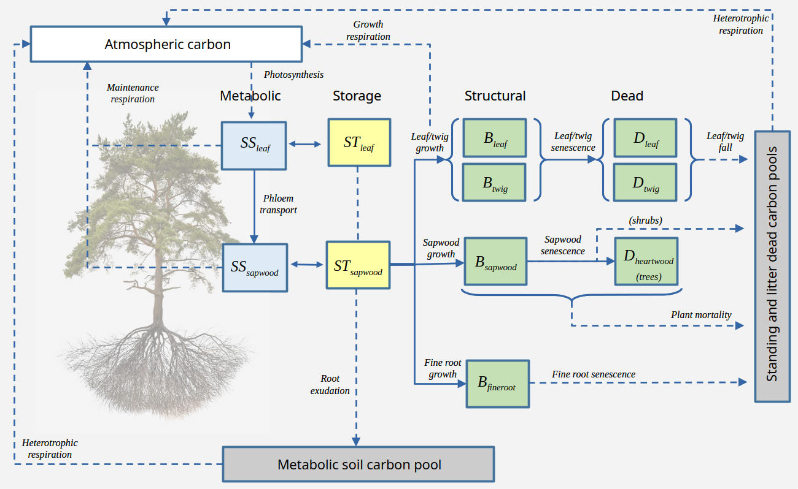
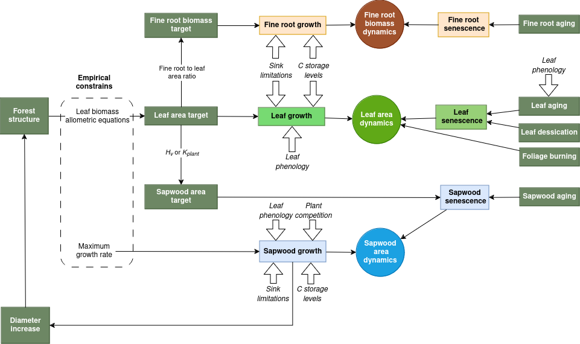
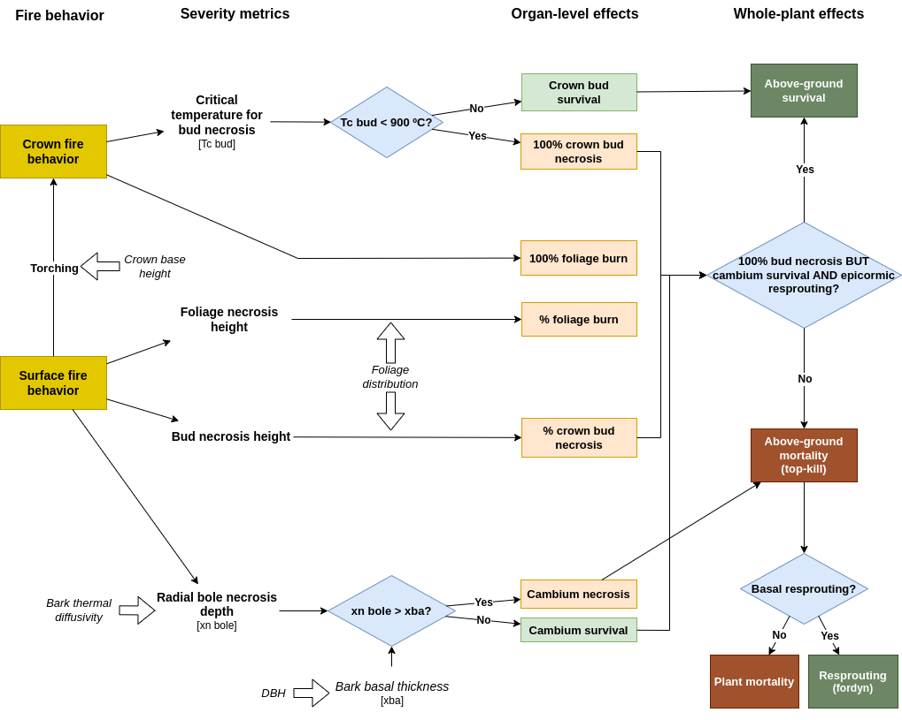
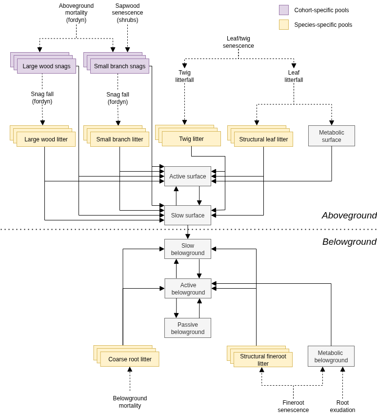

# (PART) Forest growth modelling {-}

# Forest growth model {#growthmodelling}

This chapter provides an overview of a forest growth model, which builds on the previous two models and allows simulating carbon and water balance as well as plant growth and mortality on a daily step basis for a given forest stand and for the period corresponding to input weather data. The initial version of the model was described in @de_caceres_medfate_2023 and is run using function `growth()`, for a set of days, or function `growth_day()`, for a single day. 

The forest growth model can be run in two different levels of complexity, depending on the water balance submodel employed (basic and advanced, corresponding to chapters \@ref(basicwaterbalance) and \@ref(advancedwaterbalance)). In this and the following chapters, we indicate those design and formulation elements where the forest growth model building on the basic water balance differs from that building on the advanced one.

The information provided in the current chapter should be enough to understand what the growth model does, but the reading previous chapters and the following ones should provide a more detailed understanding on how the different processes are designed and formulated.

## Design principles {#growthdesign}

### Overview

Like in the preceding models, the physical structure of the stand is represented in one (vertical) dimension (i.e. the horizontal coordinates of plants are not explicit). The model uses *cohort-based* representation of living plants, meaning that similar plant individuals are represented using a single entity with average characteristics (e.g. tree height and diameter at breast height) and a density variable is used to scale from **individual level** to the **cohort level**. Additionally, the model keeps track of carbon pools for **dead standing plants** (i.e. snags), **litter** (aboveground or belowground) and **soil organic matter**, represented at cohort-level (snags), species-level or aggregated level, respectively. Processes in the forest stand are modeled either at the cohort level (water balance, photosynthesis, or plant mortality) or at the individual level (carbon balance, tissue growth and senescence). Energy balance, water balance and plant photosynthesis processes follow the design of the previous models and will not be repeated here (see chapters \@ref(basicwaterbalance) and \@ref(advancedwaterbalance)). 

At the *individual level*, the growth model tries to reproduce the physical and physiological processes that modulate leaf area changes, sapwood area changes and fine root area changes (the latter only under the advanced water balance submodel) of an *average individual* of the plant cohort, while accounting for both source and sink limitations to tissue growth. Formation of new sapwood leads to diameter and height increases, so that physiological processes involve **plant structural changes**. Since the model does not implement all processes and drivers (such as nutrient availability) potentially affecting growth, user input parameters are used to empirically constrain growth rates and plant size, i.e. maximum relative sapwood area growth rates, maximum plant height and diameter-height ratios. 

At the *plant cohort level*, the forest growth model implements **plant mortality** for woody cohorts, which reduces cohort density, arising from different processes. A baseline mortality rate is incremented either because of exhaustion of carbon reserves (i.e. plant starvation) or dehydration of plant tissues (i.e. plant desiccation). Additionally, fire behavior and effects (i.e. fire severity) can be simulated. Fires can partially or totally burn crown leaves and buds. Fire heat can also induce necrosis in the cambium, leading to full above-ground mortality.

Finally, the model also simulates the **decomposition** of organic matter produced by previous processes (root exudation, litter fall and plant mortality). Plant litter (i.e. fine roots, leaves, branches, etc.) is allocated into different structural carbon pools depending on the species that produced it. Decomposition of organic matter in those structural pools leads to fluxes towards surface and soil carbon matter pools for further decomposition. Decomposition processes involve heterotrophic respiration, which releases CO2 back to the atmosphere. 

### Plant carbon pools and carbon flows

Different *plant carbon compartments (organs)* are considered separately: **leaves**, **twigs** (branchlets), **sapwood** (including stem, branches and coarse roots) and **fine roots**. Twigs are kept separated from the rest of woody organs because their biomass dynamics is assumed to be coupled with leaf biomass. Each compartment has one or more *carbon pools* where carbon is in different form. Carbon pools are differentiated between **structural** (live organs), **dead** (dead organs) and **labile**. In turn, labile carbon involves **metabolic** and **storage** [@Richardson2013; @Dietze2014], with a conversion rate regulated by the need to maintain, as much as possible, an equilibrium in the amount of metabolic carbon to sustain cell metabolism and for osmotic purposes. Similar designs of two non-structural carbon compartments have been implemented in other forest ecosystem models [@cho_modeling_2022].

Details of the carbon pools in different compartments are as follows (Fig. \@ref(fig:carbonpools)):

 + **Structural carbon** corresponds to the carbon forming cell membranes, cell walls and the cytosolic machinery of *living plant organs*. The amount of structural carbon in a given compartment is used to determine *maintenance respiration* costs (together with labile carbon), and the structural carbon per tissue unit determines *growth respiration* costs. Structural carbon occurs in *leaves*, *twigs*, *sapwood* and *fine roots* compartments, which have different maintenance respiration costs per dry biomass. Additionally, only live (parenchymatic) sapwood/twig cells, accounting for between 5 and 40% of volume [@Plavcova2015], contribute to estimate sapwood/twig maintenance respiration costs. The fraction of embolized conduits is also discounted from sapwood/twig respiratory biomass. Structural carbon is transformed into dead carbon or exported to litter via tissue senescence.
 + **Dead carbon** corresponds to dead organs that are still standing as part of living plants (as opposed to being litter or snags). This includes the mass of *dead leaves* and *dead twigs* corresponding to dead leaf area that has not yet fallen to become litter, as well as the mass of *heartwood*, in the case of tree cohorts.
 + **Metabolic carbon** is a labile carbon form assumed to correspond to **sugars** (e.g., glucose or fructose) used to sustain cell functioning (i.e. provide carbon for maintenance respiration). Moreover, changes in metabolic carbon are coupled to variations in osmotic potential. Metabolic carbon occurs in leaves and sapwood compartments only. *Leaf metabolic carbon* is generated from photosynthesis or leaf starch degradation and used in different functions, including leaf maintenance respiration and export to sapwood via phloem transport. An excess of leaf metabolic carbon can inhibit photosynthesis. Sugar concentration in the phloem is assumed to be (passively) in equilibrium with leaf metabolic sugar concentration. *Sapwood metabolic carbon* comes from phloem transport, or sapwood starch degradation, and is used to directly sustain maintenance respiration of sapwood and fine roots. 
+ **Storage carbon** is a labile carbon form assumed to loosely correspond to **starch**. Like metabolic carbon, storage carbon occurs in leaves and sapwood compartments only. *Leaf storage carbon* is intended to represent short-term storage (mainly starch within chloroplasts) and its inclusion in the model follows the need to buffer daily variations in leaf metabolic carbon as well as in the corresponding leaf osmotic potential. *Sapwood storage carbon* in parenchymatic tissues of branches, stems and coarse roots conforms a much larger carbon pool and is intended to serve as carbon source for growth and long-term (seasonal and inter-annual) storage [@Plavcova2015].


```{r carbonpools, out.width='100%', fig.align="center", fig.cap="Plant labile (metabolic and storage), structural and dead carbon pools and processes determining carbon flows between them (indicated using continuous arrows). Decomposition pools are indicated in gray, and flows towards the atmosphere or decomposition pools are indicated using dashed arrows. Translocation of reserves during senescence is not represented.", echo=FALSE}


```

Different processes contribute to the carbon balance of plant's structural and labile compartments:

 + Carbon balance of **labile carbon pools** is performed by considering **photosynthesis**, **maintenance respiration** , **growth costs**, **sugar-starch conversion**, **root exudation** and  **phloem transport**. Photosynthesis estimates come from the water balance submodel. Respiration is modelled following the *growth-maintenance* paradigm, but we acknowledge that such approach has limitations and that others have been proposed such as assuming a constant *carbon use efficiency* or the *process/residual approach*  [@Cannell2000; @Gifford2003]. Maintenance respiration demand of leaves and sapwood depends on both structural and metabolic carbon, whereas only structural carbon counts for fine root maintenance respiration because they lack labile carbon pools. Maintenance respiration of leaves and fine roots can be species-specific rates, but can also be estimated from species-specific values of nitrogen concentration [@Reich2008]. In contrast, the species-specific maintenance respiration per sapwood unit mass (in fact, only parenchymatic tissues contribute to sapwood respiration) is not estimated from nitrogen concentration and should be calibrated. In all three cases, however, temperature dependencies are included in the actual respiration rates[@Tjoelker2001]. Growth costs include the carbon cost of building new structures as well as the respiration expenses of growth. Sugar-starch conversion is designed to maintain an equilibrium in the concentration of metabolic sugar. Any surplus in sapwood storage carbon over storage capacity is assumed to be diverted towards root exudation. Hence, root exudation is not modeled as a process actively competing for metabolic carbon, but as a consequence of plant C storage capacity being surpassed [@Prescott2020]. 
  + Biomass balance in **structural pools** and **dead pools** comes from the interplay between **growth**  (i.e. new tissue formation) and **senescence** (see below). Structural growth rates are lower than growth costs for labile pools, since growth costs also include growth respiration expenses. During leaf senescence it is assumed that non-structural carbon sources (i.e. leaf labile carbon pools) are recycled and relocated to sapwood storage. Analogously, when sapwood is converted into heartwood, labile carbon in the protoplasm of parenchyma cells is assumed to be re-absorbed by neighboring living cells as storage [@Spicer2005].

Further design details and formulation regarding the estimation of carbon pool sizes and carbon balance components are given in chapter \@ref(carbonpoolsbalance). 


### Tissue growth, senescence and allocation

The forest growth model allows simulating the variation of leaf area, sapwood area and fine root area via the following processes (see fig. \@ref(fig:allocationdiagram)):

 i. **Leaf/twig growth**: Whereas in the water balance models expanded leaf area corresponded to the portion of live leaf area that was unfolded according to the phenological status (see \@ref(leafphenology)), in the growth model expanded leaf area results from explicit simulation of growth. However, leaf phenology submodel still controls the duration of phenophases corresponding budburst, leaf development and senescence. Leaf area growth occurs during *leaf unfolding* periods only, whereas *bud formation* periods are required to update the target leaf area (in accordance to an allocation strategy, see below). Storage carbon levels need to be at more than 10\% of their capacity to allow leaf growth. Moreover, leaf area target is constrained by stand structure (i.e. competition) via allometric equations. Leaf growth includes a corresponding carbon cost in *twig growth*, according to the biomass ratio between both.
 ii. **Leaf/twig senescence and leaf fall**: Leaf/twig senescence (and the corresponding increases in dead leaf area) can occur in the model due to *leaf aging* in evergreen species, due to *programmed leaf senescence* in deciduous species, or due to *leaf dessication* (as a result of xylem cavitation and/or low leaf relative water content). Leaf senescence increases the leaf area index corresponding to dead leaves, thereby increasing the leaf and twig dead carbon pools. *Leaf fall* is the process that transforms dead leaf area into leaf and twig litter, which triggers decomposition processes (see fig. \@ref(fig:carbonpools)). In addition, fires can induce *foliage burning*, which also leads to a decrease in dead and live leaf area (but where non-structural carbon reallocation is not possible) and produces carbon emissions due to leaf and twig combustion.
 iii. **Sapwood growth**: The model assumes that the hormonal signals controlling cambium division have been mainly synthesized in leaves. Auxins are known to be primarily generated in the plant's apical meristems, young leaves, and flower buds; from where they are transported throughout the plant via the phloem [@bajguz_biosynthetic_2023]. More specifically, we assume that the levels of secondary growth hormones (auxines) depend linearly on the *current amount of foliage relative to the expected maximum foliage of the same plant without competition*. This entails that: (a) leaf phenological status of deciduous species will affect sapwood growth rates; (b) for a given plant size (i.e. cambium surface) the amount of foliage will be higher or lower depending on the shading created by taller plants and, hence, understory plants or densely-crowded plants will have lower sapwood growth rates than plants that are isolated or overtop the other plants; (c) defoliation events (e.g. from drought impacts) will have an effect on sapwood growth rates, as observed empirically [@javoy_impact_2025]. Sapwood formation corresponds mostly to secondary growth (but primary growth occurs at the same time due to diameter-height relationships), and is only allowed if storage carbon levels are above a given species-specific threshold (e.g. 50\%). These levels are much higher than required for leaf or fine root growth. Thus, when carbon levels are low, sapwood growth rates fall to zero, whereas replacement of leaves and fine roots continues to sustain metabolism. This design was chosen to stop sapwood growth much before emptying storage carbon reserves, so that maintenance respiration can be sustained longer whenever photosynthesis is low, as in shadow-tolerant species. 
 iv. **Sapwood senescence**:  Losses in sapwood area (i.e. conversion to heartwood) occur via tissue *aging* (i.e. assuming a daily rate of conversion). Since xylem tracheids and vessels are already dead cells, sapwood senescence refers to the death of parenchymatic tissue. Similarly to 3-PG [@Landsberg1997] we assume that the relative turnover rate of sapwood is smallest for young plants, and it increases up to a maximum value. However, recent reviews indicate that heartwood formation should be viewed as an active developmental program during which a conductive but vulnerable sapwood is transformed in a non-conductive but durable heartwood [@Spicer2005]. Sapwood senescence also occurs whenever the sapwood area exceeds the amount required to sustain the current leaf area target. Note that stem *cavitation* reduces the area of sapwood that is effectively functional for water transport, but does not lead to sapwood senescence *per se*, unless mortality occurs. Sapwood senescence produces heartwood biomass in trees, which does not decompose as long as the trees are alive. In contrast, sapwood senescence leads to increase the mass of standing dead branches in shrubs (see fig. \@ref(fig:carbonpools)).
 v. **Fine root growth**: Fine root growth can in principle occur any time of the year (i.e. the model does not explicitly consider root phenology), but since fine root biomass targets depend on leaf area, seasonal fine root area patterns may follow phenological changes in leaf area. Like in leaf growth, storage carbon levels need to be at more than 10\% of their capacity to allow fine root growth.
 vi. **Fine root senescence**: Fine root senescence occurs via *aging* with a turnover rate depending on soil temperature. 


```{r allocationdiagram, out.width='100%', fig.align="center", fig.cap="Design of leaf, fine root and sapwood growth and senescence drivers.", echo=FALSE}

```

Formation of new leaf/twig, sapwood and fine root tissues is determined taking into account both **source** (i.e. carbon availability) and **sink** (i.e. biophysical constraints on plant tissue expansion) limitations [@Fatichi2014; @Guillemot2015; @Korner2015]. Temperature and turgor sink limitations are implemented following @Cabon2019 and @Cabon2020. These authors developed their approach for tracheid production and enlargement only, whereas we apply it to different kinds of tissues. In the case of fine roots, differences in soil water potential between layers can lead to different degrees of turgor limitation for the growth of fine roots, resulting in adaptation of fine root distribution. 

The growth rates in all three compartments are modulated by parameters specifying *maximum daily growth rates relative to the amount of sapwood area*. Nevertheless, tree leaf area and fine root biomass targets are constrained by leaf biomass allometric equations, which limits leaf and fine root growth to the replacement of aging tissues, unless there are changes in forest structure, i.e. competition is released or the target tree increases in diameter (see fig. \@ref(fig:allocationdiagram)). In contrast, the sapwood area target modulates sapwood senescence (i.e. the conversion to heartwood), but not sapwood growth. Sapwood growth rates are determined by maximum relative growth rates (which can be parameterized with empirical observations), hormonal control, carbon availability and sink limitations. Since sapwood formation leads to tree diameter increases, maximum sapwood growth rate indirectly determine the rate of growth of leaves and fine roots at seasonal and annual scales, hence determining the whole-plant maximum growth rate. 

Two options are possible regarding the relationship between structural carbon of leaves and sapwood:

  1. *Stable Huber value*: In this strategy, growth of leaf area and sapwood area need are coordinated so that the ratio of sapwood area to leaf area (i.e. Huber value) is in dynamic equilibrium around its initial value. To this aim, sapwood senescence is scheduled whenever the current Huber value is larger than the target (i.e. there is an excess of sapwood area). This approach is similar to the LPG model [@Sitch2003], where different turnover rates are applied for different tissues, but then the model tries to satisfy the pipe model [@Shinozaki1964] by allocating C where it is more limiting. Note that in this strategy the whole-plant conductance will progressively decrease with the increase in plant height, because of the increase in the length of stem xylem pathway. 
  2. *Stable whole-plant conductance*: Ratios of sapwood area to leaf area (i.e. Huber values) can vary within species, due to environmental conditions [@mencuccini_climate_1995]. In this allocation strategy, growth of leaf area, sapwood area and height needs to be coordinated so that whole-plant conductance (i.e. from roots to leaves) is in dynamic equilibrium around its initial value. Sapwood senescence is scheduled whenever the current whole-plant conductance is above the target value. In this strategy, the Huber value will tend to increase with the increase in plant height, thereby increasing the sapwood respiratory demands. 

When running the growth model along with the basic water balance submodel, a stable Huber value is the only strategy available and fine root area growth also follows the need to achieve a stable ratio between leaf area and fine root area. In contrast, the two strategies are possible when simulating growth along with the advanced water balance. In this case, fine root area growth is coordinated with the formation of the other tissues via the need to ensure an *average resistance fraction in the rhizosphere*, which is used to define the fine root area target and, hence, the allocation to fine roots. 

Further details and formulation of growth, senescence and allocation are given in chapter \@ref(growthsenescencemortality).

### Update of structural variables

Tree diameter increment follows the creation of sapwood area, whereas sapwood area decreases do not affect diameter, as they imply conversion to heartwood. Tree height increments are estimated from diameter increments following diameter-height ratios that are modulated by the proportion of light available to the plant cohort, as frequently done in forest gap models [@Lindner1997]. Tree crown ratios are updated using static allometric relationships, whereas shrub height and cover are estimated from new leaf area values by inverting static leaf biomass allometries (see chapter \@ref(allometricmodels)). 

Further details and formulation of structural update are given in chapter \@ref(structuralupdate).

### Plant mortality {#mortalitydesign}

**Mortality pathways**

Dynamic vegetation models implement mortality processes in very different ways, from purely-empirical to process-based [@Hawkes2000; @Keane2001; @Bugmann2019]. The fact that proximal causes of mortality are complex, co-occurring, interrelated and variable has prompted the question of whether a mechanistic approach will improve prediction ability [@Adams2013]. In medfate, (above-ground parts of) woody plants can die following a combination of empirical and process-based approaches:

  1. Trees with $DBH < 7.5$ cm (i.e. saplings) are assumed to suffer mortality due to a self-thinning process of unspecified cause. Specifically, the model represents the self-thinning process occurring between small trees (e.g. 1 cm DBH) resulting from seed establishment (or resprouting) and trees achieving the size (e.g. 7.5 cm) corresponding to inclusion as individual in forest inventories (e.g. ingrowth size). Although implemented here, this self-thinning process is most relevant for simulations of mid- and long-term forest dynamics (see \@ref(dynamicsmodelling)).
  2. All woody cohorts are assumed to die at a basal rate due to processes not included in the model (e.g. biotic attacks). This rate is empirically determined and can be a constant value or, in the case of trees, can depend on the degree of competition (i.e. basal area). This latter option is important to ensure a limit in stand basal area, which may not occur as a result of mechanistic mortality processes.
  3. Mortality rates can be higher than the basal rates whenever physiological thresholds presumed to lead to plant mortality are surpassed [@Hawkes2000]. The model allows plants to die from either *starvation* (if metabolic carbon is exhausted) or *dessication* (tissue dehydration) [@McDowell2008; @McDowell2011]. Allowing for starvation is important to simulate death due to shading by other plant cohorts, whereas plant dessication is important to represent situations of low soil water availability. 

With respect to intra-cohort variability, the model can be run assuming that all individuals within plant cohorts are functionally equal, so that mortality applies to the entire plant cohort. Alternatively, mortality can be applied to a fraction of the plant cohort, in proportion to the mortality likelihood, which implicitly acknowledges intra-cohort differences. As common in other models, mortality process can be simulated in a deterministic or stochastic fashion.

**Physiological underpinnings of drought-related mortality**

Multiple mechanisms determine plant survival or mortality under drought [@McDowell2008; @mcdowell_mechanisms_2022]. However, hydraulic failure is widely recognized as one of the key mechanisms of drought-induced mortality in woody plants. Lethal water potential have been defined as a critical threshold beyond which trees are unable to recover from drought, even after rewatering. Experimental work by @Urli2013 determined that irreversible damage in angiosperm saplings occurred only after 88\% losses in stem hydraulic conductance. Similarly, @Hammond2019 found probability of mortality to strongly increase beyond 80\% of loss in hydraulic conductivity in saplings a gymnosperm species. In a multi-species synthesis, @Adams2017 assessed found that all studied species showed at least 60\% or higher loss of xylem hydraulic conductivity, whereas evidence for carbon starvation was more common for gymnosperms. While loss of hydraulic function seems ubiquitous in drought-related mortality, not all researchers agree that hydraulic failure be the primary cause of mortality. @Korner2019 argued that hydraulic failure often correlates with a critical degree of tree dehydration and that the disruption of capillary continuum from soil to the root because of soil dehydration is more important because it forces trees to drop their leaves and rely on their own water reserves. Trees will die when the symplast surpasses its dehydration tolerance, and @Korner2019 considers xylem embolism as a byproduct rather than the cause of critical tree dehydration under severe drought, so that mechanistic models should focus on the dehydration process. Other authors have stressed the importance of the interplay between water reserves and water loss rates through cuticule after stomatal closure [@Blackman2016; @Martin-StPaul2017]. Regardless of causality, loss of hydraulic function could still be a good indicator of mortality likelihood. However, recently @Martinez-Vilalta2019 suggested use the relative water content as an indicator of mortality risk, as it integrates several aspects related to hydraulics, stomatal responses and carbon economy during drought.


**Starvation thresholds**

We use the amount of metabolic sugar in the stem as indicator of carbon starvation. @Martinez-Vilalta2016 found that plants can have very distinct amounts of non-structural carbon concentration but minimum seasonal values are around 46\% of maximum values. Accordingly, we define the indicator of starvation in relative terms (see control variable `mortalityRelativeSugarThreshold`, set to 30\% by default) with respect to the stem equilibrium sugar concentration. 


**Dessication thresholds**

Following @Martinez-Vilalta2019, we primarily use the relative water content (RWC) in the stem symplastic tissues as the stress variable increasing dessication likelihood under drought. Whereas the stem symplastic pressure-volume curve is always used to determine RWC from the stem water potential, in the basic water balance model the latter is assumed to be equal to the estimated plant water potential (i.e. $\Psi_{sym, stem} = \Psi_{plant}$; see \@ref(dailystressbasicwater)). Moreover, in the advanced water balance model there is no distinction between stem apoplastic and symplastic (i.e. parenchymatic) water potentials (i.e. $\Psi_{sym, stem} = \Psi_{apo, stem}$) unless plant water compartments are explicitly simulated. 

Using stem relative water content as indicator of dessication has the inconvenient, however, that the parameters $\pi_{0,stem}$ and $\epsilon_{stem}$ specifying the stem pressure-volume curve are often not known, so that estimates have to come from its covariation with other traits (here wood density, see \@ref{inputationPV}). The uncertainty coming from this parameterization issue can be avoided if one combines the use of RWC with the loss of xylem hydraulic conductivity, since parameters of the hydraulic vulnerability curve are much more frequently available. For this reason, we use the **maximum of stem relative water content and relative xylem hydraulic conductance** as the drought stress variable to determine dessication.

The critical threshold for dessication is specified in the control variable `mortalityRWCThreshold`, set to 40\% by default. Note that most studies focus on leaf RWC, for which @Kursar2009 indicate ranges between 16\% and 61\%, and @Korner2019 advocates for values around 50\%. 

**Mortality effects**

Mortality processes lead to the estimation of the number of dead individuals during the current day ($N_{dead}$). The model then determines what fraction of these individuals will resprout from the root collar (although resprouts are actually created by `fordyn()` at the end of the year). The fine root and coarse root biomass of non-resprouting individuals are added to the corresponding litter pools. Leave area of all dead trees is added to dead leaf area (which effectively transfers leaf biomass and twig biomass to dead carbon pools). The aboveground wood biomass (i.e heartwood and sapwood) of all dead trees is stored in cumulative variables ($D_{smallbranches}$ and $D_{largewood}$) for future snag creation. 

Details of the implementation of plant mortality are given in section \@ref(plantmortality).

### Fire occurrence, severity and emissions {#fireseveritydesign}

**Fire occurrence and behavior**

The occurrence of fires is represented in the growth model in a forcing variable that describes the daily probability that a wildfire strikes the stand. Whenever a fire occurs, the model first simulates fire behavior according to the conditions of the stand (see chapter \@ref(fuelandfirebehavior)) and then fire severity and carbon emissions are evaluated. 

**Fire severity**

The degree to which vegetation is impacted by fire depends on the heat fluxes incident on plant tissues and organs, which is an outcome of various fire behavior variables (such as fireline intensity and residence time) and the position of plant organs in the stand, and the physiological responses triggered thereafter. Fire effects on plants can be classified as two types: first- and second-order effects [@bar_fire_2019; @hood_fire_2018]. First-order effects comprise the immediate impacts of heat transfer on plant tissues. Nonlethal first-order heat injuries can trigger second-order effects, such as physiological limitations in carbon and water relations or increased susceptibility to insect attacks and pathogenic infections. The growth model currently deals with first-order effects only. Moreover, the model focuses on effects in above-ground tissues (leaves/twigs, buds and cambium), disregarding fire effects on below-ground structures such as seed banks, or below-ground meristems, which are also important for the resilience of ecosystems [@stephan_first-order_2010].

Fire-induced plant injury and mortality models can be grouped into two categories: (1) statistical models that involve regression equations relating injury and mortality to observable indicators [@peris-llopis_impact_2024]; and (2) process-based models that explicitly simulate the underlying thermal and biophysical processes occurring when a plant is heated [@butler_tree_2010; @hood_fire_2018]. The design of first-order fire effects on vegetation follows, with some modifications, the process-based model proposed by @michaletz_biophysical_2008 for surface fires, and it is outlined in fig. \@ref(fig:fireseverity). The surface fire behavior variables required for severity evaluation are the residence time and fireline intensity. With them, the model estimates the air temperature gradient of the plume, which is then compared to the distribution of foliage for the determination of the proportion of the crown foliage and crown buds that die due to heat accumulation. In addition, the model determines the effects on the cambium by estimating the radial necrosis depth and comparing it with bark thickness. If enough heat reaches the cambium, the tree is considered girdled, which leads to above-ground mortality. Otherwise, the degree of crown bud necrosis will determine whether the plant can resprout from the crown (and rebuild the leaf area lost) or not. 

Crown fires will be considered to impact the forest stand whenever surface fireline intensity is larger than the critical value considered necessary for crowing [@Scott2002]. Crown fires are considered to burn for all plant cohorts, 100\% of crown foliage and, most likely, 100\% of crown buds (although very fast crown fires could spare buds if sufficiently protected, [@michaletz_biophysical_2008]). When crown fires do not occur at the stand level, torching may still occur for particular plant cohorts depending on its crown base height, with the same effects. 

If 100\% of crown buds have died but the cambium is alive and the species has dormant buds beneath the bark, then the plant has suffered crown kill but it can resprout epicormically without losing height [@hood_fire_2018]. If the cambium is dead, however, all above-ground plant organs will be considered dead (i.e. topkill; @hood_fire_2018). At this point, the plant may still exhibit basal resprouting from the root crown or below-ground meristems, but is dealt in the forest dynamics model (see chapter \@ref(dynamicsmodelling)).

```{r fireseverity, out.width='100%', fig.align="center", fig.cap="Design of fire effects on foliage, buds and cambium.", echo=FALSE}

```

While the severity sub-model described above is based on heat transfer and accumulation in tissues, causing necrosis, it is important to note that a growing number of studies increasingly have been documenting fire impacts on xylem hydraulic function, both via increased vapor pressure deficit (causing cavitation) and via structural damage in the xylem, affecting its efficiency and vulnerability [@bar_fire_2019; @hood_fire_2018]. These first-order effects are not considered here.

**Fire emissions**

Whenever foliage burning occurs, the corresponding dry biomass of leaves and twigs is added to the carbon emissions. In addition, for cohorts where above-ground mortality occurs 20% of tree wood biomass and 100% of shrub wood biomass are assumed to be lost via combustion and are added to fire carbon emissions (see fig. \@ref(fig:fireseverity)). The remaining 80% of aboveground tree wood biomass contributes to dead snag biomass. Belowground biomass assumed to die (unless resprouting is scheduled) but does not contribute to emissions.

Details of the implementation of fire severity and emissions are given in section \@ref(fireseverity).

### Organic matter decomposition

The design of carbon decomposition processes is a modification of the CENTURY model, and its daily variant DAYCENT [@parton_dynamics_1988; @parton_observations_1993; @parton_daycent_1998], as described in Bonan et al. -@bonan_climate_2019. It is summarized in fig. \@ref(fig:decompositionpools) below.

The decomposition model simulates a number of chemically distinct organic matter pools with varying decay rates. The CENTURY/DAYCENT models partition plant litter into metabolic material that readily decomposes and structural material that is more resistant to decomposition. Leaf litter enters the surface pools, and root litter enters the belowground pools. The model additionally represents twig, small-branch and large wood debris (on the surface) as well as coarse root debris (belowground). Only leaf litter fall and fineroot litter fall generate metabolic material, whereas the other types of litter (large wood, small branches, twigs and coarse roots) generate only structural material. Litter pools include two important differences with respect to the description of DAYCENT provided in Bonan et al. -@bonan_climate_2019. First, structural litter pools are species-specific (yellow boxes in fig. \@ref(fig:decompositionpools)), which allows decomposition rates to be dependent on the species identity of the plant that generated the litter, thus accounting for potential differences in lignin content. Second, the model also considers aboveground standing dead wood (i.e. snags), which originate from plant mortality (or aboveground dead structures in resprouting cohorts) and will normally decompose at slower rates than downed deadwood (magenta gray boxes in fig. \@ref(fig:decompositionpools)). While the growth model deals with decomposition of these pools, dead branch fall and snag fall processes, which lead to transfer of carbon from standing pools to downed litter pools, are dealt with in the forest dynamics (i.e. `fordyn()`) model.

In CENTURY/DAYCENT, soil organic matter is represented by *active*, *slow* and *passive* carbon pools, that represent material with increasingly longer turnover time. These pools have a surface and belowground component, except the passive pool, which only occurs belowground (light gray boxes in fig. \@ref(fig:decompositionpools)). Decomposition process in a given pool transfers carbon to other pools, while releasing carbon to the atmosphere due to heterotrophic respiration.This conceptualization results in a system of first-order linear differential equations. Each pool has a specific base decomposition rate, which is modified for abiotic factors. Abiotic factors (temperature, pH and moisture) in the surface and soil carbon pools are those corresponding to the first soil layer, whereas abiotic factors for standing dead pools correspond to air temperature and relative humidity. Processes of the nitrogen cycle (i.e. immobilization, mineralization and plant uptake) are not simulated at present.

```{r decompositionpools, out.width='100%', fig.align="center", fig.cap="Design of dead carbon pools and decomposition processes. Boxes are carbon pools (some of them being cohort-specific or species-specific). Dashed arrows indicate processes originating surface or belowground litter. Continuous arrows indicate carbon transfer from one pool to another, and most of them include release of carbon to the atmosphere via heterotrophic respiration.", echo=FALSE}

```


## State variables


### State variables related to live plant cohorts

**True state variables**

Many *cohort-level state variables* are inherited by the corresponding water balance model and depend on its level of complexity (see  \@ref(statevariablesbasic) and \@ref(statevariablesadvanced)). Several variables were treated as fixed parameters in the water balance models and become variable here:

 + Leaf area index of live leaves, $LAI_{live}$  ($m^2·m^{-2}$).
 + Actual expanded leaf area, $LAI_{\phi}$ ($m^2·m^{-2}$).
 + Dead leaf area, $LAI_{dead}$ ($m^2·m^{-2}$).
 + Percent cover of shrubs, $Cover$ (%).
 + Density of living individuals in the plant cohort, $N$ ($ind·ha^{-1}$).
 + Density of dead individuals in the plant cohort, $N_{dead}$ ($ind·ha^{-1}$).
 + The proportion of fine roots, $FRP_{s}$, in each soil layer $s$  ([0-1]).
 + Cumulative mass of small dead branches (diameter between 0.635 cm an 7.5 cm; 10h and 100h fuels) corresponding to cohort dead individuals $D_{smallbranches}$ ($g\,C·m^{-2}$).
 + Cumulative mass of large dead wood (diameters > 7.5 cm; 1000h and 10000h fuels) corresponding to cohort dead individuals $D_{largewood}$ ($g\,C·m^{-2}$).

Variables $D_{smallbranches}$ and $D_{largewood}$ are not to be confounded with state variables corresponding to decomposing snags (see below). In growth simulations $D_{smallbranches}$ and $D_{largewood}$ are used to track mass of dead wood only. In forest dynamic simulations, the values of $D_{smallbranches}$ and $D_{largewood}$ at the end of the simulated year are used by function `fordyn()` to create new snag cohorts to start the decomposition process the year after.

*Individual-level state variables* are needed in growth simulations:
 
 + Plant height, $H$ ($cm$).
 + Diameter at breast height for trees, $DBH$ ($cm$).
 + Crown ratio, $CR$ ([0-1]).
 + Leaf area, $LA$ ($m^2$).
 + Target leaf area, $LA_{target}$ ($m^2$).
 + Dead leaf area $LA_{dead}$ ($m^2$).
 + Sapwood area, $SA$ ($cm^2$).
 + Target sapwood area, $SA_{target}$ ($cm^2$).
 + The percentage of the crown with active buds, $PCAB$ (%).
 + Fine root biomass, $B_{fineroot, s}$ ($g\,dry$), and the target fine root biomass, $B_{fineroot, target, s}$ ($g\,dry$), in each soil layer $s$.
 + Sugar concentration in leaves, $SS_{leaf}$ ($mol\,gluc \cdot L^{-1}$).
 + Starch concentration in leaves, $ST_{leaf}$ ($mol\,gluc \cdot L^{-1}$).
 + Sugar concentration in sapwood (stem, branches and coarse roots), $SS_{sapwood}$ ($mol\,gluc \cdot L^{-1}$).
 + Starch concentration in sapwood (stem, branches and coarse roots), $ST_{sapwood}$ ($mol\,gluc \cdot L^{-1}$).
 
Note that $LA$ is the same state variable as $LAI_{\phi}$, but expressed at the individual level. The same happens between $LA_{target}$ and $LAI_{live}$; and between $LA_{dead}$ and $LAI_{dead}$. These pairs of state variables are related by cohort density ($N$).

**Derived variables**

Other individual-level variables can be derived from the true state variables and, hence, hence do not need to be treated as state variables themselves but are often used in equations instead of the true state variables:

 + Leaf biomass, $B_{leaf}$ ($g\,dry$), from $LA$.
 + Twig biomass, $B_{twig}$ ($g\,dry$), from $LA$.
 + Dead leaf mass, $D_{leaf}$ ($g\,dry$), from $LA_{dead}$.
 + Dead twig (diameter < 0.635 cm) mass, $D_{twig}$ ($g\,dry$), from $LA_{dead}$.
 + The radial length of coarse roots in each soil layer $s$, $L_{radial, s}$ ($mm$), from $FRP_{s}$.
 + Sapwood biomass, $B_{sapwood}$ ($g\,dry$), from $SA$, $H$ and $FRP_{s}$ and $L_{radial,s}$.
 + Heartwood mass, for trees, $D_{heartwood}$ ($g\,dry$), from $SA$, $DBH$, $H$ and $FRP_{s}$ and $L_{radial,s}$.
 + Leaf storage volume ($V_{storage, leaf}$; in $L$) from $B_{leaf}$.
 + Sapwood storage volume ($V_{storage, sapwood}$; in $L$) from $SA$, $H$ and $FRP_{s}$ and $L_{radial,s}$.
 + Fine root area ($FRA_{s}$; in $m^2$) in each soil layer $s$, from $B_{fineroot,s}$.

Some belowground variables (such as the radial length of coarse roots) are only considered dynamic when simulating growth with advance water balance.

### State variables related to carbon decomposition

**Dead standing wood cohorts**

Cohorts of dead standing wood (i.e. snag cohorts) are identified by combinations of species, DBH of the original tree, height and dead age (i.e. the years passed since mortality occurred). Those properties match the element `snagData` of forest objects (see \@ref(deadplantelements)) and are modified by the model of forest dynamics, whereas the growth model deals with the daily decomposition process. In the growth model, the following state variables are tracked for cohorts of dead standing wood:

 + Mass of small dead branches, with diameters comprised between 0.635 cm and 7.5 cm (i.e. 10h and 100h fuels), $SN_{smallbranches}$ ($g\,C ·m^{-2}$).
 + Mass of large dead wood, with diameters > 7.5 cm (i.e. 1000h and 10000h fuels), $SN_{deadwood}$ ($g\,C ·m^{-2}$).

**Structural litter pools**

Structural litter pools are **species-specific**.  For each species, the following pools are tracked, matching the element `litterData` of forest objects (see \@ref(deadplantelements)):

 + Leaf structural litter, $LI_{leaves}$ ($g\,C ·m^{-2}$).
 + Twig (diameter < 0.635 cm; 1h fuels) structural litter, $LI_{twigs}$ ($g\,C ·m^{-2}$).
 + Small branches (diameter between 0.635 cm an 7.5 cm; 10h and 100h fuels) structural litter, $LI_{smallbranches}$ ($g\,C ·m^{-2}$).
 + Large wood (diameter > 7.5 cm; 1000h and 10000h fuels) structural litter, $LI_{largewood}$ ($g\,C ·m^{-2}$).
 + Coarse roots structural litter, $LI_{coarseroots}$ ($g\,C ·m^{-2}$).
 + Fine roots structural litter, $LI_{fineroots}$ ($g\,C ·m^{-2}$).

**Soil carbon pools**

The decomposition model keeps track of the carbon amount in different organic matter pools which come from the CENTURY model and match the element `SOCData` of forest objects (see \@ref(socpools)):

 + Surface metabolic litter, $LI_{surface,metabolic}$ ($g\,C ·m^{-2}$).
 + Surface active decomposition pool, $SOC_{surface, active}$ ($g\,C ·m^{-2}$).
 + Surface slow decomposition pool, $SOC_{surface, slow}$ ($g\,C ·m^{-2}$).
 + Soil metabolic litter, $LI_{soil,metabolic}$ ($g\,C ·m^{-2}$).
 + Soil active decomposition pool, $SOC_{surface, active}$ ($g\,C ·m^{-2}$).
 + Soil slow decomposition pool, $SOC_{surface, slow}$ ($g\,C ·m^{-2}$).
 + Soil passive decomposition pool, $SOC_{surface, passive}$ ($g\,C ·m^{-2}$).


## Mass and energy balances

### Water and energy balance 

Since the growth model builds on soil and plant water balance models, the water and energy balances explained in sections \@ref(soilwaterbalance) or \@ref(waterenergybalances) (depending on `transpirationMode`) also hold for this model.

### Labile carbon balance 

The model performs daily carbon balance of *labile carbon* in leaves and sapwood (stem, branches and coarse roots) for each plant cohort. In each of these two compartments carbon balance is performed for the two labile carbon forms, dissolved sugars (i.e. *metabolic carbon*) and starch (i.e. *storage carbon*). In the following all carbon flows (i.e. the components of right hand side of equations) are assumed to be in units of $g\,gluc$. At the leaf level, the carbon balance equations for dissolved sugars and starch are:

\begin{eqnarray}
\Delta{SS_{leaf}} \cdot V_{storage,leaf} &=& A - MR_{leaf} - F_{phloem} - SC_{leaf} - TS_{leaf}\\
\Delta{ST_{leaf}} \cdot V_{storage,leaf} &=& SC_{leaf} - TT_{leaf}
(\#eq:leafcarbonbalanceequations)
\end{eqnarray}
where $A$ is (gross) photosynthesis, $MR_{leaf}$ is leaf maintenance respiration, $F_{phloem}$ is the sugar flow via phloem towards the stem and roots,  $SC_{leaf}$ is the conversion from leaf sugar to leaf starch, $TS_{leaf}$ and $TT_{leaf}$ are the translocation of leaf sugars and starch into sapwood storage, respectively, during leaf senescence (see eq. \@ref(eq:sapwoodcarbonbalanceequations) below) or if leaf storage capacity is surpassed. 

The corresponding carbon balance equations for sapwood dissolved sugars and starch are:
\begin{eqnarray}
\Delta{SS_{sapwood}} \cdot V_{storage,sapwood} &=& F_{phloem} - MR_{twig} - MR_{sapwood} - MR_{fineroot} \\
& & - SC_{sapwood}  - TS_{sapwood} \\
\Delta{ST_{sapwood}} \cdot V_{storage,sapwood} &=& SC_{sapwood} + TS_{leaf} + TT_{leaf} + TS_{sapwood} \\
& & - GC_{sapwood} - GC_{leaf} - GC_{twig} - GC_{fineroot} - RE_{sapwood}
(\#eq:sapwoodcarbonbalanceequations)
\end{eqnarray}
where $F_{phloem}$ is the sugar inflow via phloem transport, $MR_{twig}$ is the maintenance respiration of twigs, $MR_{sapwood}$ is the sum of maintenance respiration of branches, stem and coarse roots, $MR_{fineroot}$ is the maintenance respiration of fine roots; $GC_{leaf}$, $GC_{twig}$, $GC_{sapwood}$ and $GC_{fineroot}$ are the carbon costs of forming new leaves, twigs, sapwood or fine roots (respectively), $SC_{sapwood}$ is the conversion of sapwood sugar to sapwood starch, $TS_{sapwood}$ is the translocation of sapwood sugars into starch during leaf senescence and $RE_{sapwood}$ is the root exudation of sapwood carbon. 
If we define $S_{labile}$ as the total amount of labile carbon for an individual plant (in $g\,gluc$):
\begin{equation}
S_{labile} = (SS_{leaf} + ST_{leaf}) \cdot V_{storage,leaf} + (SS_{sapwood} + ST_{sapwood}) \cdot V_{storage,sapwood}
(\#eq:totallabileplantequation)
\end{equation}
then labile carbon balance at the plant level reduces to:
\begin{equation}
\Delta{S_{labile}} = A - MR - GC - RE
(\#eq:plantcarbonbalanceequation)
\end{equation}
where $MR = MR_{leaf} + MR_{twig} +MR_{sapwood} + MR_{fineroot}$ is plant-level maintenance respiration,  $GC = GC_{leaf} + GC_{twig} +GC_{sapwood} + GC_{fineroot}$ is plant-level growth costs and $RE = RE_{sapwood}$ is plant-level root exudation.

### Plant biomass balance

**Live biomass balance**

In addition to changes in labile carbon pools, the model also implements changes in the size of carbon compartments (leaves, twigs, sapwood and fine roots), as a result of the interplay between growth and senescence processes. Hence, we can define the following structural equations:
\begin{eqnarray}
\Delta{B_{leaves}} &=& B_{leaves, growth} - B_{leaves, senescence}\\
\Delta{B_{twigs}} &=& B_{twigs, growth} - B_{twigs, senescence}\\
\Delta{B_{sapwood}} &=& B_{sapwood, growth} - B_{sapwood, senescence}\\
\Delta{B_{fineroot}} &=& B_{fineroot, growth} -  B_{fineroot, senescence}
(\#eq:livestructurecarbonbalanceequations)
\end{eqnarray}
where all variables would be in units of $g\,dry$. 

The following equation defines the biomass balance for (live) structural pools:

\begin{equation}
\Delta{B_{structure}} = \Delta{B_{leaves}} + \Delta{B_{twigs}} + \Delta{B_{sapwood}} + \Delta{B_{fineroot}}
(\#eq:plantlivestructurecarbonbalanceequation)
\end{equation}

**Dead mass balance**

Senescence processes create carbon for dead pools. Hence, we can define the following structural equations:
\begin{eqnarray}
\Delta{D_{leaves}} &=& B_{leaves, senescence} - D_{leaves, fall}\\
\Delta{D_{twigs}} &=& B_{twigs, senescence} - D_{twigs, fall}\\
\Delta{D_{heartwood}} &=& B_{sapwood, senescence}\\
(\#eq:deadstructurecarbonbalanceequations)
\end{eqnarray}

Where $D_{leaves, fall}$ and $D_{twigs, fall}$ are the mass of leaves and twigs, respectively. that falls and goes to litter pools. For trees, sapwood senescence ($B_{sapwood, senescence}$) results in a corresponding increase in heartwood ($D_{heartwood}$). In contrast, for shrubs heartwood is not considered and sapwood senescence ($B_{sapwood, senescence}$) results in dead standing branch (snag) creation. 

The following equation defines the plant mass balance for dead pools:

\begin{equation}
\Delta{D_{dead}} = \Delta{D_{leaves}} + \Delta{D_{twigs}} + \Delta{D_{heartwood}}
(\#eq:plantdeadstructurecarbonbalanceequation)
\end{equation}


**Total plant mass balance**

The overall mass balance at the **individual level** is completed if we add the labile biomass balance to the structural and dead mass balances:
\begin{equation}
\Delta{B_{plant}} = \Delta{B_{structure}} + \Delta{D_{dead}} + \Delta{S_{labile}} 
(\#eq:planttotalcarbonbalanceequation)
\end{equation}

**Cohort-level biomass balance**

At the cohort level, we need to take into account that some individuals will die, so that the biomass balance needs to incorporate mortality losses:
\begin{equation}
\Delta{B_{cohort}} = \Delta{B_{plant}} \cdot N_{cohort} - D_{mortality} 
(\#eq:cohorttotalcarbonbalanceequation)
\end{equation}
where $N_{cohort}$ is the initial cohort density (before mortality occurred) and $D_{mortality}$ is the biomass loss due to mortality of individuals, which in order to close the balance has to be defined as:
\begin{equation}
 D_{mortality} = (B_{plant} + \Delta{B_{plant}}) \cdot N_{dead} 
(\#eq:mortalitycarbonlossequation)
\end{equation}
where $N_{dead}$ is the density of dead individuals and $B_{plant}$ is the initial plant biomass.

### Mass balance of dead elements

### Stand-level carbon balance

The model estimates several carbon fluxes at the stand level, all expressed in units of $g\,C\cdot m^{-2}$:

  + **Gross primary production** ($GPP$) is the sum of gross photosynthesis ($A_g$; in $g\,C\cdot m^{-2}$) across plant cohorts:
  \begin{equation}
  GPP = \sum_{i}{A_{g,i}}
  \end{equation}
  where $A_{g,i}$ is the (cohort-level) gross photosyntesis for cohort $i$.
  + **Maintenance respiration** ($MR$) is the sum across plant cohorts of the carbon emitted to the atmosphere as a result of respiration required for the maintenance of living tissues (leaves, fine roots and sapwood parenchyma): 
  \begin{equation}
  MR = \frac{m_{carbon} \cdot 6}{m_{gluc}} \cdot \sum_{i}{MR_i\cdot (N_i/10000)}
  \end{equation}
  where $MR_i$ is plant-level maintenance respiration for cohort $i$.
  + **Synthesis respiration** ($SR$) is the sum across plant cohorts of the carbon returned to the atmosphere as a result of the process of synthesizing new structures: 
  \begin{equation}
  SR = \frac{m_{carbon} \cdot 6}{m_{gluc}} \cdot \sum_{i}{SR_i\cdot (N_i/10000)}
  \end{equation}
  where $SR_i$ is plant-level synthesis respiration for cohort $i$. Note that this is less than the total carbon used for growth, as it does not include the carbon allocated to the new structures.
  + **Net primary production** ($NPP$) is gross primary production minus the maintenance respiration and synthesis respiration terms:
  \begin{equation}
  NPP = GPP - MR - SR 
  \end{equation}
  Net primary production should thus be equal to the carbon newly allocated to plant structures.
  + **Heterotrophic respiration** ($HR$) is the amount of carbon returned to the atmosphere as a result of respiration occurred during decomposition processes.
  + **Fire combustion** ($FC$) is the amount of carbon returned to the atmosphere as a result of combustion of plant tissues.
  * **Net ecosystem production** ($NEP$) is the net carbon source of the forest ecosystem, i.e. the net primary production minus heterotrophic respiration and fire combustion. $NEP$ expresses the overall carbon balance of the forest stand:
\begin{equation}
\Delta{C}_{stand} = NEP = GPP - MR - SR - HR - FC = NPP - HR - FC 
(\#eq:standcarbonbalanceequation)
\end{equation}

## Process scheduling {#growthscheduling}

Growth simulations are conducted in **daily** time steps. If using the basic water balance sub-model, processes are scheduled following the *regular scheduling*. In contrast, if using the advanced water balance model, the growth processes can be simulated using a *detailed scheduling*.

### Regular scheduling

For every day to be simulated, first executes soil water balance, transpiration and photosynthesis calculations by calling the basic water balance model (\@ref(basicwaterbalancescheduling)). After that, the model performs the following steps for each plant cohort:

1. Determine the amount of live structural biomass (in leaves, sapwood and fine root compartments), storage volume (in leaves and sapwood) and storage capacity (\@ref(estimationcarbonpools)). 
2. Calculate gross photosynthesis per individual ($A$), maintenance respiration for leaves ($M_{leaf}$), sapwood ($M_{sapwood}$) and fine roots ($M_{fineroot}$) (\@ref(carbonbalancecomponents)).
3. If phenology indicates leaf unfolding, evaluate leaf temperature and turgor sink limitations, growth costs ($G_{leaf}$) and leaf area increase (\@ref(leafgrowth)). 
4. If sapwood growth is permitted, evaluate sapwood temperature and turgor sink limitations, growth costs ($G_{sapwood}$) and sapwood area increase (\@ref(sapwoodgrowth)).
5. Evaluate fineroot temperature and turgor sink limitations, growth costs ($G_{fineroot}$) and fineroot biomass increase (\@ref(finerootgrowth)).
6. Update changes in sugar and starch compartments due to photosynthesis, maintenance respiration and growth. Apply transfer from leaf metabolic to sapwood metabolic carbon (\@ref(phloemtransport)) and conversions between storage and metabolic carbon (\@ref(sugarstarchdynamics)).  
7. Determine leaf senescence due to aging or cavitation effects (\@ref(leafsenescence)). 
8. Determine sapwood area senescence by aging (\@ref(sapwoodsenescence)).
9. Determine fine root senescence by aging (\@ref(finerootsenescence)).
10. Evaluate labile carbon translocation due to leaf and sapwood senescence ($TS_{leaf}$, $TT_{leaf}$ and $TS_{sapwood}$). If leaf storage carbon is surpassed, add the excess to $TT_{leaf}$. Add the sum of translocated carbon to the starch sapwood pool.
11. Move any surplus in sapwood storage carbon to root exudation ($RE_{sapwood}$). This completes the daily carbon balance for leaf labile pools \@ref(eq:leafcarbonbalanceequations), sapwood labile pools \@ref(eq:sapwoodcarbonbalanceequations), and plant-level labile carbon. \@ref(eq:plantcarbonbalanceequation).
12. Update leaf area, sapwood area, fine root area and derived variables (e.g., leaf area index and Huber value) (\@ref(updateplanttraits)). 
13. Determine if a wildfire stroke the forest stand and, if so, fire severity effects (\@ref(fireseverity)).
14. Determine if plant death by starvation or desiccation occurred (\@ref(plantmortality)).
15. Update fine root area target and, if phenology indicates bud formation, update the leaf area target (\@ref(updateallocationtargets)). 
16. Translate sapwood area growth into structural variables (i.e., plant height, tree DBH, tree crown ratio and shrub cover), (\@ref(structuralupdate)) and update storage volumes and the concentration of labile pools.

### Advanced scheduling
For every day to be simulated, the model first executes soil water balance, energy balance, transpiration and photosynthesis calculations in subdaily times steps, by calling the advanced water balance model (\@ref(advancedwaterbalancescheduling)). After that, the model performs the following steps for each plant cohort:

1. Determine the amount of live structural biomass (in leaves, sapwood and fine root compartments), storage volume (in leaves and sapwood) and storage capacity (\@ref(estimationcarbonpools)). 
2. For every **subdaily** step, perform carbon balance as follows:
    a. Calculate gross photosynthesis per individual ($A$) and maintenance respiration for leaves ($M_{leaf}$), sapwood ($M_{sapwood}$) and fine roots ($M_{fineroot}$), taking into account both live structural biomass and labile sugar biomass (see \@ref(carbonbalancecomponents)).
    b. If phenology indicates leaf unfolding, evaluate temperature and turgor sink limitations for growth of leaves, estimate growth costs ($G_{leaf}$) and record leaf area increases (\@ref(leafgrowth)). 
    c. If sapwood growth is permitted, evaluate temperature and turgor sink limitations for growth of sapwood, estimate growth costs ($G_{sapwood}$) and record sapwood area increases (\@ref(sapwoodgrowth)). 
    d. Evaluate temperature and turgor sink limitations for growth of fine roots, estimate growth costs ($G_{fineroot}$) and record fine root biomass increases (\@ref(finerootgrowth)). 
    e. Evaluate phloem transport ($F_{phloem}$) and sugar-starch dynamics in the leaf and sapwood compartments **at 1s time steps** (\@ref(phloemtransport)), including photosynthesis, maintenance respiration and growth respiration as well as diversion towards root exudation if maximum leaf or sapwood starch capacity is attained ($RE_{leaf}$ and $RE_{sapwood}$). This completes the sub-daily carbon balance for plant-level labile carbon \@ref(eq:plantcarbonbalanceequation).
4. Determine leaf senescence due to aging or cavitation effects (\@ref(leafsenescence)). 
5. Determine sapwood area senescence by aging (\@ref(sapwoodsenescence)).
6. Determine fine root senescence by aging (\@ref(finerootsenescence)).
7. Evaluate labile carbon translocation due to leaf and sapwood senescence ($TS_{leaf}$, $TT_{leaf}$ and $TS_{sapwood}$), adding the resulting carbon to the starch sapwood pool. This completes the daily carbon balance for leaf labile pools \@ref(eq:leafcarbonbalanceequations), sapwood labile pools \@ref(eq:sapwoodcarbonbalanceequations), and plant-level labile carbon.
8. Update leaf area, sapwood area, fine root biomass and distribution. Update derived variables (e.g., leaf area index, Huber values, hydraulic conductance of stems, roots and rhizosphere, osmotic potential at full turgor of leaves and sapwood) (\@ref(updateplanttraits)).
9. Determine if plant death by starvation or desiccation occurred (\@ref(plantmortality)).
10. If phenology indicates bud formation, update the leaf area target (\@ref(updateallocationtargets)). Update the fine root biomass target, according to the hydraulic conductance in the rhizosphere (\@ref(updateallocationtargets)).
11. Translate sapwood area growth into structural variables (i.e., plant height, tree DBH, tree crown ratio and shrub cover), (\@ref(structuralupdate)) and update storage volumes and the concentration of labile pools.


## Inputs and outputs

### Soil, vegetation and meteorology

**Soil**

Soil input requirements are the same as for the basic water balance model and were fully described in section \@ref(soilinput). @Genuchten1980 water retention curves are forced for this model, because rhizosphere conductance is modelled using van Genuchten hydraulic equations (see subsection \@ref(vulnerabilitycurves)).

**Vegetation**

Vegetation input requirements were fully described in section \@ref(vegetationinput). Trees and shrubs do not need to be characterized with different variables in soil water balance calculations, since both kinds of cohort have a $LAI$ value. In most cases, users only need to estimate the leaf area index corresponding to live leaves, i.e. $LAI_{live}$, because one can assume no dead leaves in the canopy (i.e., $LAI_{dead} = 0$). Note that vegetation characteristics are modified by simulations in this model.

**Metereological input**

The minimum weather variables required to run the model are min/max temperatures ($T_{min}$ and $T_{max}$), min/max relative humidity ($RH_{min}$ and $RH_{max}$), precipitation ($P$) and solar radiation ($Rad$). Wind speed ($u$) is also needed, but the user may use missing values if not available (a default value will be used in this case). Wind speed is assumed to have been measured at a specific height above the canopy (by default at 2 m). Atmospheric $CO_2$ concentration ($C_{atm}$) may also be specified, but if missing a default constant value is assumed, which is taken from the control parameters. If wildfire occurrence and severity is to be simulated, the user has to specify daily fire probability ($P_{fire}$) in an additional column. Definitions and units of these variables were given in section \@ref(meteoinput).

### Vegetation functional parameters {#growthvegetationparameters}

The growth model requires many functional parameters to be specified for plant cohorts. Some of them depend on whether the basic or advanced water balance is adopted. Here we report functional parameters needed in addition to those necessary for the water balance submodel.

A first set of parameters refers to anatomical features (`paramsAnatomy`), most of them already required by water balance model simulations:

| Symbol | Units | R  | Description                                  | 
|--------|-------|----| ---------------------------------------------|
| $H_{max}$  | $cm$ | `Hmax` | Maximum plant height |
| $H_{med}$  | $cm$ | `Hmed` | Median plant height |
| $1/H_{v}$  | $m^2 \cdot m^{-2}$ | `Al2As` | Leaf area to sapwood area ratio |
| $RLR$  | $m^2 \cdot m^{-2}$ | `Ar2Al` | Fine root area to leaf area ratio |
| $SLA$  | $m^2 \cdot kg^{-1}$ | `SLA` | Specific leaf area |
| $LW$   | $cm$  | `LeafWidth` | Leaf width |
| $\rho_{leaf}$ | $g \cdot cm^{-3}$ | `LeafDensity` | Leaf tissue density |
| $\rho_{wood}$ | $g \cdot cm^{-3}$ | `WoodDensity` | Wood tissue density |
| $\rho_{fineroot}$ | $g \cdot cm^{-3}$ | `FineRootDensity` | Fine root tissue density |
| $f_{conduits}$ | [0-1] | `conduit2sapwood` | Proportion of sapwood corresponding to xylem conduits (the remaining corresponds to parenchymatic tissues) |
| $SRL$ | $cm \cdot g^{-1}$ | `SRL` | Specific root length |
| $RLD$ | $cm \cdot cm^{-3}$ | `RLD` | Fine root length density (i.e. density of root length per soil volume) |
| $r_{6.35}$ | | `r635` | Ratio between the weight of leaves plus branches and the weight of leaves alone for branches of 6.35 mm |

A second set of parameters refers to allometric coefficients needed for structural updates (`paramsAllometries`).

| Symbol       | Units | R param       | Description                      |
|--------------|-------|---------------|----------------------------------|
| $a_{ash}$ | | `Aash` | Coefficient relating the square of shrub height with shrub area |
| $a_{bsh}$, $b_{bsh}$ | |`Absh`, `Bbsh` | Coefficients relating crown volume with dry weight of shrub individuals |
| $bt_{sh}$ | | `BTsh` | Bark thickness in shrubs |
| $a_{cr}$, $b_{1cr}$, $b_{2cr}$, $b_{3cr}$, $c_{1cr}$, $c_{2cr}$ | | `B1cr`, `B2cr`, `B3cr`, `C1cr`, `C2cr` | Coefficients to calculate crown ratio of trees |
| $a_{cw}$, $b_{cw}$ | | `Acw`, `Bcw` | Regression coefficients used to calculate the crown width of trees (as intermediary step to obtain the crown ratio).|
| $a_{bt}$, $b_{bt}$ | | `Abt`, `Bbt` | Regression coefficients used to calculate the bark thickness of trees |

A third set of parameters refers to growth parameters (`paramsGrowth`).

| Symbol       | Units | R param       | Description                      |
|--------------|-------|---------------|----------------------------------|
| $N_{leaf}$ | $mg\,N \cdot g\,dry^{-1}$ | `Nleaf` | Leaf nitrogen concentration per dry mass |
| $N_{sapwood}$ | $mg\,N \cdot g\,dry^{-1}$ | `Nsapwood` | Sapwood nitrogen concentration per dry mass | 
| $N_{fineroot}$ | $mg\,N \cdot g\,dry^{-1}$ | `Nfineroot` | Fine root nitrogen concentration per dry mass | 
| $MRR_{leaf}$ | $g\,gluc\cdot g\,dry^{-1}\cdot day^{-1}$ | `RERleaf` | Leaf respiration rate at 20 ºC |
| $MRR_{sapwood}$ | $g\,gluc\cdot g\,dry^{-1}\cdot day^{-1}$ | `RERsapwood` | Living sapwood (parenchymatic tissue) respiration rate at 20 ºC |
| $MRR_{fineroot}$ | $g\,gluc\cdot g\,dry^{-1}\cdot day^{-1}$ | `RERfineroot` | Fine root respiration rate at 20 ºC |
| $RGR_{leaf, max}$ | $m^2 \cdot cm^{-2} \cdot day^{-1}$| `RGRleafmax` | Maximum leaf area daily growth rate, relative to sapwood area |
| $RGR_{cambium, max}$ | $cm^2 \cdot cm^{-1} \cdot day^{-1}$| `RGRcambiummax` | Maximum daily tree sapwood growth rate relative to cambium perimeter length |
| $RGR_{sapwood, max}$ | $cm^2 \cdot cm^{-2} \cdot day^{-1}$| `RGRsapwoodmax` | Maximum daily shrub sapwood growth rate relative to sapwood area |
| $RGR_{fineroot, max}$ | $g\,dry \cdot g\,dry^{-1} \cdot day^{-1}$| `RGRfinerootmax` | Maximum daily fine root relative growth rate |
| $CC_{leaf}$ | $g\,gluc\cdot g\,dry^{-1}$| `CCleaf` | Leaf construction cost |
| $CC_{sapwood}$ | $g\,gluc\cdot g\,dry^{-1}$| `CCsapwood` | Sapwood construction cost |
| $CC_{fineroot}$ | $g\,gluc\cdot g\,dry^{-1}$| `CCfineroot` | Fine root construction cost |
| $SR_{sapwood}$ | $day^{-1}$| `SRsapwood` | Daily sapwood senescence rate  |
| $SR_{fineroot}$ | $day^{-1}$| `SRfineroot` | Daily fine root senescence rate |
| $RSSG$ | [0-1] | `RSSG` | Minimum relative starch for sapwood growth to occur. |
| $f_{HD,min}$ | $cm \cdot cm^{-1}$ | `fHDmin` | Minimum height-to-diameter ratio |
| $f_{HD,max}$ | $cm \cdot cm^{-1}$ | `fHDmax` | Maximum height-to-diameter ratio |
|  | $g\, C \cdot g^{-1} dry$ | `WoodC` | Wood carbon content per dry weight |


A third set of parameters refers to mortality/regeneration parameters (`paramsMortalityRegeneration`).

| Symbol       | Units | R param       | Description                      |
|--------------|-------|---------------|----------------------------------|
| $P_{mort,base}$ | $[0-1]$ | `MortalityBaselineRate` | Deterministic proportion or probability specifying the baseline reduction of cohort's density occurring in a year as a result of processes not explicitly modelled |
| $TS_{surv}$ | $[0-1]$ | `SurvivalModelStep` | Time step in years of the empirical survival model depending on stand basal area (e.g. 10) |
| $\beta_{surv,0}$ | $[0-1]$ | `SurvivalB0` | Intercept of the logistic baseline survival model depending on stand basal area |
| $\beta_{surv,1}$ | $[0-1]$ | `SurvivalB1` | Slope of the logistic baseline survival model depending on stand basal area |
| $N_{tree, recr}$  | $ind \cdot ha^{-1}$  | `RecrTreeDensity` | Density of tree recruits from seeds. |
| $N_{tree, ingrowth}$  | $ind \cdot ha^{-1}$  | `IngrowthTreeDensity` | Density of trees reaching ingrowth DBH. |
| $DBH_{tree, recr}$  | $cm$  | `RecrTreeDBH` | DBH for tree recruits from seeds or resprouting (e.g. 1 cm). |
| $DBH_{tree, ingrowth}$  | $cm$  | `IngrowthTreeDBH` | Ingrowth DBH for trees (e.g. 7.5 cm). |


Vegetation functional attributes are normally filled for each cohort by function `growthInput()` from species identity. However, different parameters can be specified for different cohorts of the same species if desired (see section \@ref(functionaltraits)). 

### Control parameters {#forestgrowthcontrol}

Control parameters modulate the overall behaviour of growth simulations (see section \@ref(controlparameters)). Parameters controlling water balance have been already described in sections \@ref(basicwaterbalancecontrol) and \@ref(advancedwaterbalancecontrol). Here we only mention those control parameters specific to the `growth()` function. 

First, there are flags that regulate the application of processes:

+ `allowDessication [=TRUE]`: Boolean flag to indicate that mortality by dessication is allowed.
+ `allowStarvation [=TRUE]`: Boolean flag to indicate that mortality by starvation is allowed.
+ `sinkLimitation [=TRUE]`: Boolean flag to indicate that temperature and turgor limitations to growth are applied.
+ `shrubDynamics [= TRUE]`: Boolean flag to allow the application of demographic processes to shrubs.
+ `herbDynamics [= TRUE]`: Boolean flag to allow dynamic herb leaf area as a function of shading due to leaf area of woody cohorts.

An important parameter concerns the allocation strategy: 

+ `allocationStrategy  [="Plant_kmax"]` defines the allocation strategy (investment in leaf area vs. sapwood area) of the growth model. If `allocationStrategy = "Plant_kmax"` then the target leaf area is set to maintain the input whole-plant maximum conductance. If `allocationStrategy = "Al2As"` then the target leaf area is set to maintain the input Huber value.

A number of control parameters regulate carbon balance:

+ `phloemConductanceFactor [= 0.2]`: Factor to transform stem xylem conductance to phloem conductance (only for `transpirationMode = "Sperry"`).
+ `nonSugarConcentration [=0.25]`: A constant specifying non-sugar (inorganic) solute concentration ($mol \cdot L^{-1}$) in cells.
+ `equilibriumOsmoticConcentration [= c(leaf = 0.8, sapwood = 0.6)]`: Equilibrium osmotic concentrations ($mol \cdot L^{-1}$) for leaf and sapwood cells. The difference between leaf and sapwood values helps maintaining phloem transport. The equilibrium sugar concentration is found using `equilibriumOsmoticConcentration - nonSugarConcentration` and defaults to `[= c(leaf = 0.55, sapwood = 0.35)]`.
+ `minimumRelativeStarchForGrowth [= 0.50]`: Default minimum concentration of storage carbon (starch), relative to the maximum storage capacity, for sapwood growth to occur. This default value is used when  species-specific values are not specified via `SpParams`.
+ `senescenceRates [= c(sapwood = 0.0001261398, fineroot = 0.001897231)]`: Relative senescence rates ($day^{-1}$) for sapwood and fine roots. Default are equivalent to 4.5% and 50% annual turnover for sapwood and fine roots, respectively. Leaf senescence rates depend on leaf lifespan (i.e. leaf duration) for evergreen species. These are default values used when relative growth rates are not specified via species-specific `SpParams`.
+ `constructionCosts [= c(leaf = 1.5, sapwood = 1.47, fineroot = 1.30)]`: Default construction costs, including respiration and structural carbon, per dry weight of new tissue ($g\,gluc \cdot g\,dry^{-1}$). These are default values used when relative growth rates are not specified via species-specific `SpParams`.
+ `maximumRelativeGrowthRates [= c(leaf = 0.01, cambium = 0.005, sapwood = 0.002, fineroot = 0.1)]`: Default maximum relative growth rates for leaves ($m^{2}\cdot cm^{-2} \cdot day^{-1}$), tree sapwood ($cm^{2}\cdot cm^{-1} \cdot day^{-1}$), shrub sapwood ($cm^{2}\cdot cm^{-2} \cdot day^{-1}$) and fine roots ($g\,dry \cdot g\,dry^{-1} \cdot day^{-1}$). These are default values used when relative growth rates are not specified via species-specific `SpParams`.

Finally, we have the following options regarding mortality:

+ `mortalityMode [= "density/deterministic"]`: String describing how mortality is applied. Current accepted values are combinations of `"cohort"` vs `"density"` (for whole-cohort mortality vs reduction of stem density) and `"deterministic"` vs. `"stochastic"`.
+ `mortalityBaselineRate [= 0.0015]`: Default deterministic proportion or probability specifying the baseline reduction of cohort's density occurring in a year as a result of processes not explicitly modelled (for `mortalityMode = "density/deterministic"` or `"density/stochastic"`).
+ `mortalityRelativeSugarThreshold [= 0.4]`: Threshold of stem sugar concentration relative to equilibrium values (by default 40\%), resulting in an increased mortality rate/probability whenever levels are below.
+ `mortalityRWCThreshold [= 0.4]`: Threshold of stem relative water content resulting in increased mortality rate/probability whenever levels are below (by default 40\%).


### Model output {#forestgrowthoutput}

#### Daily output

Functions `growth()` returns a list of a class with the same name. The first four elements of this list (i.e., `latitude`, `topography`, `weather` and `growthInput`) are simply copies of model inputs. The next element is `growthOutput`, which contains the state of the input object at the end of the simulation (this can be used to perform further simulations starting with current values of state variables). The remaining list elements are:

| Element | Description                                                |
|---------|------------------------------------------------------------|
| `WaterBalance`| Climatic input and water balance flows (i.e. net precipitation, infiltration, runoff, transpiration...). All of them in $mm = L \cdot m^{-2}$. |
| `EnergyBalance` | Energy balance components (instantaneous values) for the soil and the canopy |
| `CarbonBalance` | Stand-level carbon balance components (see \@ref(eq:standcarbonbalanceequation)), all of them in $g\,C \cdot m^{-2}$. |
| `BiomassBalance` | Stand-level biomass balance components. All of them in $g\,dry \cdot m^{-2}$. |
| `Temperature` | Minimum and maximum temperature values for topsoil, canopy and atmosphere (if `transpirationMode = "Sperry"`) |
| `Soil`| Soil variables for each soil layer: Moisture relative to field capacity ($W_s$), water potential ($\Psi_s$) and volumetric water content ($V_s$). |
| `Stand`| Stand-level variables, such as $LAI^{\phi}_{stand} = LAI^{live}_{stand}$, $LAI^{dead}_{stand}$, the water retention capacity of the canopy ($S_{canopy}$) or the fraction of light reaching the ground ($L^{PAR}_{ground}$ and $L^{SWR}_{ground}$).|
| `Plants`| Plant-level variables, such as $LAI^{phi}_i$, plant transpiration, plant water potential, etc. |
| `SunlitLeaves` | Leaf-level output variables for sunlit leaves (`transpirationMode = "Sperry"`). |
| `ShadeLeaves` | Leaf-level output variables for shade leaves (`transpirationMode = "Sperry"`). |
| `LabileCarbonBalance`| A list with the daily results of labile carbon balance components and carbon pools. |
| `PlantBiomassBalance`| A list with the daily results of biomass balance components for plant cohorts. |
| `PlantStructure`| A list with daily results of plant compartment sizes, in terms of area and biomass. |
| `GrowthMortality`| A list with daily results of growth rates for leaf, sapwood and fine roots; as well as daily mortality rates. |


Elements `WaterBalance` to `ShadeLeaves` are equal to the output of function `spwb()` and were described in previous chapters (see \@ref(basicwaterbalanceoutput) and \@ref(advancedwaterbalanceoutput)). 

The following table describes the child elements of `LabileCarbonBalance`, each of them a data frame with dates in rows and plant cohorts in columns:

| Element | Symbol | Units | Description                               |
|---------|--------|-------|-------------------------------------------|
| `GrossPhotosynthesis`|$A_{i}/B_{i}$ | $g\,gluc \cdot g\,dry^{-1} \cdot day^{-1}$ | Daily gross photosynthesis per dry weight of living biomass. |
| `MaintentanceRespiration`|$M_{i}/B_{i}$ | $g\,gluc \cdot g\,dry^{-1} \cdot day^{-1}$ | Daily maintenance respiration (including leaves, sapwood and fine roots) per dry weight of living biomass. |
| `GrowthCosts`|$G_{i}/B_{i}$ | $g\,gluc \cdot g\,dry^{-1} \cdot day^{-1}$ | Daily growth costs  (including leaves, sapwood and fine roots) per dry weight of living biomass. |
| `RootExudation`|$RE_{i}$ | $g\,gluc \cdot g\,dry^{-1} \cdot day^{-1}$ | Daily root exudation per dry weight of living biomass. |
| `CarbonBalance`|$\Delta S_{i}/B_{i}$ | $g\,gluc \cdot g\,dry^{-1}$ | Daily labile carbon balance (eq. \@ref(eq:plantcarbonbalanceequation)) per dry weight of living biomass. |
| `SugarLeaf`|$SS_{leaf,i}$ | $mol\,gluc \cdot L^{-1}$ | Sugar concentration in leaves. |
| `StarchLeaf`|$ST_{leaf,i}$ | $mol\,gluc \cdot L^{-1}$ | Starch concentration in leaves. |
| `SugarSapwood`|$SS_{sapwood,i}$ | $mol\,gluc \cdot L^{-1}$ | Sugar concentration in sapwood. |
| `StarchSapwood`|$ST_{sapwood,i}$ | $mol\,gluc \cdot L^{-1}$ | Starch concentration in sapwood. |
| `SugarTransport`| $F_{phloem}$| $mol\,gluc \cdot s^{-1}$ | Average instantaneous rate of carbon transferred between leaves and stem compartments via phloem. |

The following table describes the child elements of `PlantCarbonBalance`, each of them a data frame with dates in rows and plant cohorts in columns:

| Element | Symbol | Units | Description                               |
|---------|--------|-------|-------------------------------------------|
| `StructuralBiomassBalance`|  | $g\,dry \cdot m^{-2} \cdot day^{-1}$ | Daily structural biomass balance. |
| `LabileBiomassBalance`|  | $g\,dry \cdot m^{-2} \cdot day^{-1}$ | Daily labile biomass balance. |
| `PlantBiomassBalance`|  | $g\,dry \cdot m^{-2} \cdot day^{-1}$ | Daily plant biomass balance. |
| `MortalityBiomassLoss`|  | $g\,dry \cdot m^{-2} \cdot day^{-1}$ | Daily biomass loss due to mortality. |
| `CohortBiomassBalance`|  | $g\,dry \cdot m^{-2} \cdot day^{-1}$ | Daily cohort biomass balance (includes plant biomass balance and mortality). |


The following table describes the child elements of `PlantStructure`, again each of them a data frame with dates in rows and plant cohorts in columns:

| Element | Symbol | Units | Description                               |
|---------|--------|-------|-------------------------------------------|
| `LeafBiomass`|$B_{leaf,i}$ | $g\,dry \cdot ind^{-1}$ | Daily leaf structural biomass for an average individual. |
| `SapwoodBiomass`|$B_{sapwood,i}$ | $g\,dry \cdot ind^{-1}$ | Daily sapwood structural biomass for an average individual. |
| `FineRootBiomass`|$B_{fineroot,i}$ | $g\,dry \cdot ind^{-1}$ | Daily fine root biomass for an average individual. |
| `LeafArea`|$LA_{i}$ | $m^{2}$ | Daily amount of leaf area for an average individual. |
| `SapwoodArea`|$SA_{i}$ | $cm^{2}$ | Daily amount of sapwood area for an average individual. |
| `FineRootArea`|$FRA_{i}$ | $m^{2}$ | Daily amount of fine root area for an average individual. |
| `HuberValue` | $H_{v}$ | $cm^2 \cdot m^{-2}$ | The ratio of sapwood area to (target) leaf area |
| `RootAreaLeafArea` |  | $m^2 \cdot m^{-2}$ | The ratio of fine root area to (target) leaf area |
| `DBH`|$DBH_{i}$ | $cm$ | Daily diameter at breast height for an average individual. |
| `Height`|$H_{i}$ | $cm$ | Daily total height for an average individual. |

The following table describes the child elements of `GrowthMortality`, again each of them a data frame with dates in rows and plant cohorts in columns:

| Element | Symbol | Units | Description                               |
|---------|--------|-------|-------------------------------------------|
| `LAgrowth`|$\Delta LA_{i}/SA_i$ | $m^{2}\cdot cm^{-2} \cdot day^{-1}$ | Leaf area growth relative to sapwood area for an average individual. |
| `SAgrowth`|$\Delta SA_{i}/SA_i$ | $cm^{2}\cdot cm^{-2} \cdot day^{-1}$ | Leaf area growth relative to sapwood area for an average individual. |
| `FRAgrowth`|$\Delta FRA_{i}/SA_i$ | $m^{2}\cdot cm^{-2} \cdot day^{-1}$ | Fine root area growth relative to sapwood area for an average individual. |
| `StarvationRate`| | $ind \cdot ind^{-1} \cdot day^{-1}$ | Daily mortality rate from starvation. |
| `DessicationRate`| | $ind \cdot ind^{-1} \cdot day^{-1}$ | Daily mortality rate from dessication. |
| `MortalityRate`| | $ind \cdot ind^{-1} \cdot day^{-1}$ | Daily mortality rate (any cause). |

#### Subdaily output

As with function `spwb()`, subdaily output can also be generated with function `growth()`. This is done via setting  `subdailyResults = TRUE` in the control parameter list. In that case, the output list of `growth()` will include an element `subdaily`, whose subelements correspond to the results of `growth_day()` for each date simulated. Refer to the documentation of function `growth_day()` for details of sub-daily output.
