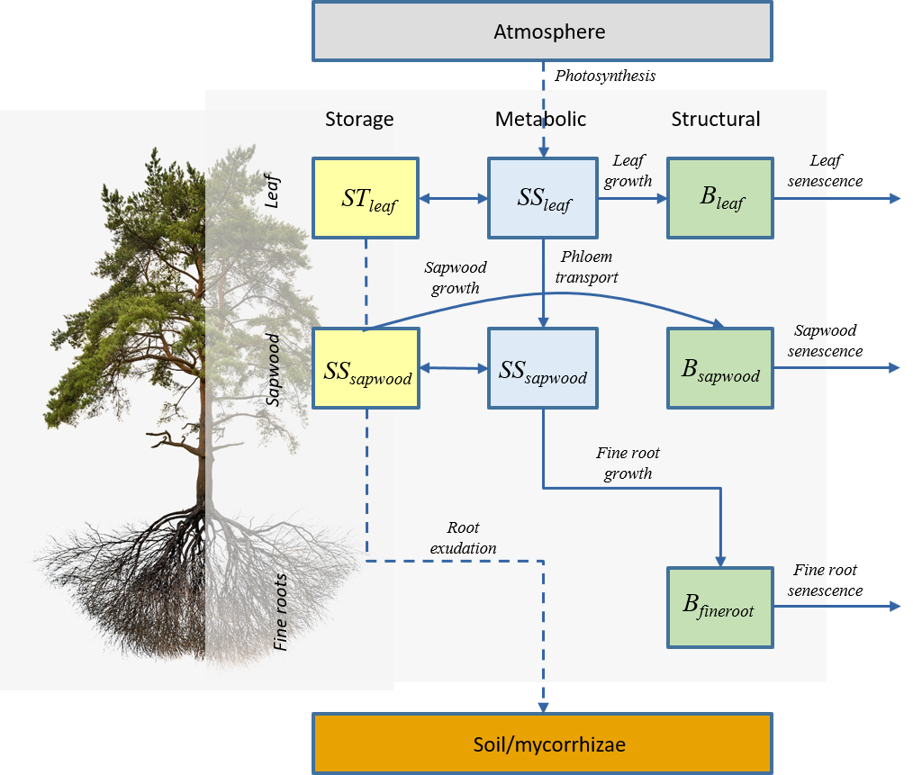
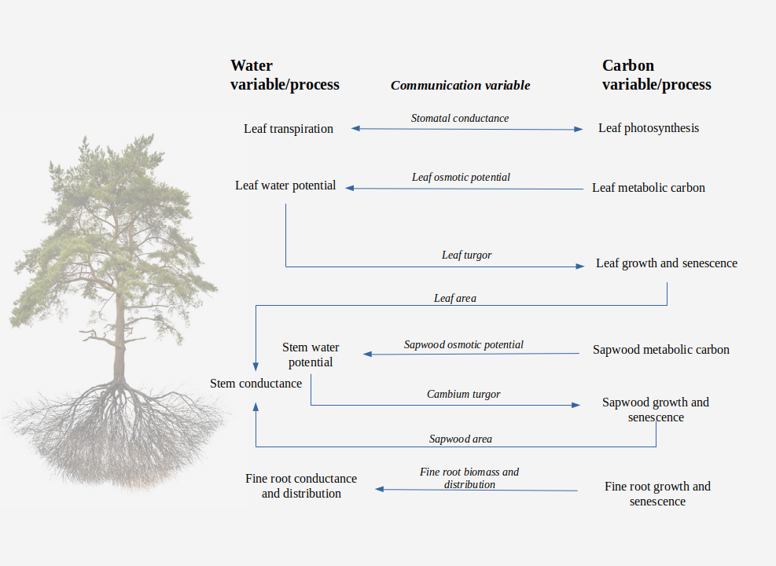

# (PART) Forest growth modelling {-}

# Forest growth model {#growthmodelling}

This chapter provides an overview of a forest growth model, which builds on the previous two models and allows simulating carbon and water balance on a daily step basis for a given forest stand and for the period corresponding to input weather data. The model is run using function `growth()`, for a set of days, or function `growth_day()`, for a single day. 

Since it builds on water balance models, the forest growth model can be run in two different levels of complexity of the water balance submodel (basic and advanced, corresponding to chapters \@ref(basicwaterbalance) and \@ref(advancedwaterbalance)). In this and the following chapters, we indicate those design and formulation elements where the forest growth model based on the basic water balance differs from that based on the advanced one.

The information provided in this chapter should be enough to understand what the growth model does and when it can be useful, but the reading previous chapters and the following ones should provide a more detailed understanding on how the different processes are formulated.

## Design principles

Like in the preceding models, the physical structure of the stand is represented in one (vertical) dimension (i.e. the coordinates of plants are not explicit). The model is cohort-based, meaning that similar plant individuals are represented using a single entity with average characteristics (e.g. tree height and diameter at breast height) and a density variable is used to scale from individual level to the cohort level. Processes are implemented either at the cohort-level (water balance and photosynthesis) or at the individual level (carbon balance,  growth and senescence). Water fluxes, soil water balance and plant photosynthesis processes follow the design of the soil water balance model and this part of the model design will not be repeated here (see chapters \@ref(basicwaterbalance) and \@ref(advancedwaterbalance)). The growth model tries to reproduce the physiological processes that modulate leaf area changes, sapwood area changes and in fine root area changes (this last only under the advanced water balance submodel), while accounting for both source and sink limitations to tissue growth. Formation of new sapwood leads to diameter and height increases, so that physiological processes involve structural changes. Since the model does not implement all processes and drivers (such as nutrient availability) potentially affecting growth, user input parameters are used to empirically constrain growth rates and plant size, i.e. maximum relative sapwood area growth rates, maximum plant height and diameter-height ratios. Simulations with the forest growth model can eventually lead to the death of some plant cohorts, either because of exhaustion of carbon reserves (i.e. plant starvation) or dehydration of plant tissues (i.e. plant desiccation).

### Carbon compartments, transport and carbon balance

Three carbon compartments are differentiated in the model: **leaves**, **sapwood** (including stem, branches and coarse roots) and **fine roots**. Compartments include carbon pools in different forms. Carbon pools are differentiated between **structural** and **labile**. In turn, labile carbon involves **metabolic** and **storage** [@Richardson2013; @Dietze2014], with a conversion rate regulated by the need to maintain, as much as possible, a minimum amount of metabolic carbon to sustain cell metabolism and for osmotic purposes. Details of the carbon pools in different compartments are as follows (Fig. \@ref(fig:carbonpools)):

 + **Structural carbon** corresponds carbon forming cell membranes, cell walls and the cytosolic machinery (in the case of living cells). The amount of structural carbon in a given compartment is used to determine *maintenance respiration* costs, and the structural carbon per tissue unit determines *growth respiration* costs. Structural carbon occurs in the three compartments, *leaves*, *sapwood* and *fine roots*, which however have different maintenance and growth costs. Structural carbon is lost via senescence (in the case of sapwood due to conversion to heartwood).
 + **Metabolic carbon** is a labile carbon form assumed to correspond to sugars (e.g., glucose or fructose) that are used to sustain cell functioning (i.e. provide carbon for maintenance and growth). Moreover, changes metabolic carbon are coupled to variations in osmotic potential. Metabolic carbon occurs in leaves and sapwood compartments only. *Leaf metabolic carbon* is generated from photosynthesis and used in different functions, including export to sapwood via phloem transport. An excess of leaf metabolic carbon can inhibit photosynthesis. Sugar concentration in the phloem is assumed to be (passively) in equilibrium with leaf metabolic sugar concentration. *Sapwood metabolic carbon* comes from phloem transport and is used to directly sustain maintenance respiration of sapwood and fine roots as well as the growth of new fine roots. 
+ **Storage carbon** is a labile carbon form assumed to correspond to starch. *Leaf storage carbon* is intended to represent short-term storage (mainly starch in chloroplasts) and its inclusion in the model follows the need to buffer daily variations in leaf metabolic carbon as well as the corresponding leaf osmotic potential. *Sapwood storage carbon* sapwood (branches, stems and coarse roots) conforms a much larger pool and is intended to serve as long-term (seasonal and inter-annual) storage. Unlike leaf and fine root growth, the carbon used for sapwood growth is taken directly from sapwood storage carbon (remember that the sapwood compartment includes coarse roots).


```{r carbonpools, out.width='100%', fig.align="center", fig.cap="Schematic representation of carbon compartments, carbon pools and carbon balance components (maintenance respiration not included)", echo=FALSE}


```

Photosynthesis estimates come from the water balance submodel. Growth and maintenance respiration are calculated at the individual level, by estimating the respiration of leaves, sapwood and fine root compartments. Maintenance respiration of leaves and sapwood depends on both structural and metabolic carbon, whereas only structural carbon counts for fine roots because they lack a metabolic carbon pool. Sapwood maintenance and growth respiration depends on sapwood area, stem height and coarse root length. Carbon balance of leaf labile (metabolic and storage) carbon is performed by considering photosynthesis, sugar-starch conversion and phloem transport. Surplus in leaf or sapwood storage carbon is diverted towards root exudation. Hence, root exudation is not a process competing for metabolic carbon, but only a consequence of plant C storage capacity being surpassed [@Prescott2020]. 

Further design details and formulation regarding the estimation of carbon pool sizes and carbon balance components are given in chapter \@ref(carbonpoolsbalance). 


### Growth, senescence and mortality

The forest growth model allows simulating variation leaf area, sapwood area and fine root area via the following processes:

 i. **Leaf area** of each plant cohort is divided between live and dead (standing dead leaves). Whereas in the water balance models expanded leaf area corresponded to the portion of live leaf area that was unfolded (see \@ref(leafphenology)), in the growth model live leaf area and expanded leaf area are conceptually the same, but leaf phenology still controls budburst, leaf development  and senescence. Leaf area growth occurs during *leaf unfolding* periods only, whereas *bud formation* periods are required to update the target leaf area (in accordance to an allocation strategy, see below). Leaf senescence (and the corresponding increases in dead leaf area) can occur due to *aging* in evergreen species, due to *programmed leaf senescence* in deciduous species, due to a *leaf negative carbon balance* or due to a *drought impacts*. 
 ii. Formation of **sapwood area** can only occur if unfolded leaves are present, assuming that hormonal signals controlling cambium division are mainly synthesized within leaves. Sapwood formation is modelled as a radial file of vessels issued from cell divisions in cambium and which progressively undergo enlargement and maturation [@Friend2019]. Losses in sapwood area (i.e. conversion to heartwood) occur via tissue *aging* (i.e. assuming a daily rate of conversion), although stem cavitation reduces the area of sapwood that is effectively functional for water transport. Similarly to 3-PG [@Landsberg1997] we assume that the relative turnover rate of sapwood is smallest for young plants, and it increases up to a maximum value.
 iii. **Fine root area** dynamics also arises from the interplay of fine root growth and senescence. Fine root growth can in principle occur any time of the year (i.e. the model does not explicitly consider root phenology), but since fine root biomass targets depend on leaf area, seasonal fine root area patterns can arise in drought- or winter-deciduous species. Fine root senescence occurs via *aging* with a turnover rate depending on soil temperature. 

Formation of new leaf, sapwood and fine root tissues is determined taking into account both source (i.e. carbon availability) and sink (i.e. biophysical constraints on plant tissue expansion) limitations [@Fatichi2014; @Guillemot2015; @Korner2015]. Sink limitations are implemented following @Cabon2019 and @Cabon2020, although these authors developed their approach for tracheid production and enlargement, whereas we apply it to different kinds of tissues. While leaf and fine root source limitations are set by available metabolic carbon, stem growth is assumed to be limited by the availability of storage (i.e. starch) in the stem (Fig. 15.1). This is done to create a preferential allocation of recently assimilated carbon into leaf and fine root tissues over stem growth, as long as leaf and fine root areas are below the respective targets set by allocation rules. 

Two options are possible regarding the allocation to leaves vs sapwood:

  1. *Stable Huber value*: In this strategy, growth of leaf area and sapwood area need are coordinated so that the ratio of leaf area to sapwood area (i.e. Huber value) is dynamically in equilibrium with its initial value. To this aim, increases in leaf area are scheduled whenever Huber value is larger than the target (i.e. there is an excess of sapwood area). This is similar to the LPG model [@Sitch2003], where different turnover rates are applied for different tissues, but then tries to satisfy the pipe model [@Shinozaki1964] by allocating C where it is more limiting. Note that in this strategy the whole-plant conductance will progressively decrease with the increase in plant height. 
  2. *Stable whole-plant conductance*: Ratios of leaf area to sapwood area (i.e. Huber values) can vary within species, due to environmental conditions [@Mencuccini1995]. In this allocation strategy, growth of leaf area, sapwood area and height needs to be coordinated so that whole-plant conductance (i.e. from roots to leaves) is dynamically in equilibrium with its initial value. Increases in leaf area are scheduled whenever the current whole-plant conductance is above target value.  

Pursuing a stable Huber value is the only strategy available when running the growth model along with the basic water balance, but the two strategies are possible when simulation growth with the advance water balance. Fine root area growth is only modelled when simulating growth with advance water balance. Fine root area growth is coordinated with the formation of the other tissues via the need to ensure an *average resistance fraction in the rhizosphere*, which is used to define the fine root area target and, hence, the allocation to fine roots. 

The growth rates in all three compartments are modulated by parameters specifying maximum daily growth rates relative to the amount of sapwood area. However, since leaf and fine root area targets are constrained by the amount of sapwood area via allocation rules, the relative growth rate for sapwood area indirectly determines the growth rates of leaves and fine roots at seasonal and annual scales. 

Plant cohorts ultimately can die from either *starvation* (if metabolic carbon is exhausted) or *dessication* (tissue dehydration) [@McDowell2008; @McDowell2011]. Note that individuals within plant cohorts are assumed to be functionally equal, so that mortality applies to the whole cohort.

Further details and formulation of growth, senescence, allocation and plant mortality are given in chapter \@ref(growthsenescencemortality).

### Tree diameter, tree height and shrub cover updates

Update of stand structure is conducted once every simulated year. Tree diameter increment follows the creation of sapwood area, whereas sapwood area decreases do not affect diameter, as they imply conversion to heartwood. Tree height increments are estimated from diameter increments following diameter-height ratios that are modulated by the proportion of light available to the plant cohort, as frequently done in forest gap models [@Lindner1997]. Tree crown ratios are updated using static allometric relationships, whereas shrub height and cover are estimated from new leaf area values by inverting static leaf biomass allometries. 

Further details and formulation of structural update are given in chapter \@ref(structuralupdate).


### Links between plant hydraulics and carbon balance {#carbonwaterlinks}

When using the advanced water balance submodel, the growth model allows coordinating several aspects of carbon and water balances through different state variables (Fig. \@ref(fig:carbonwaterlinks)):

 a. Transpiration and photosynthesis are coordinated via the *stomatal regulation* submodel (see chapter \@ref(plantphotosynthesis)).
 b. Leaf water potential of symplastic tissues determines the turgor pressure necessary for growth (\@ref(leafgrowth)), while sugar concentration in the leaf tissues determines changes in osmotic potential at full turgor and hence, the relative water content of symplasmic tissue.
 c. Analogously, water potential of stem symplastic tissues determines the turgor in the cambium and the sapwood formation rate (\@ref(sapwoodgrowth)), while the sugar concentration in the sapwood determines the osmotic potential at full turgor of stem symplastic tissues.
 d. Leaf growth and senescence influence hydraulic conductances of several tissues (fine roots, coarse root sapwood and stem sapwood), which they are defined on a leaf area basis (\@ref(updateplanttraits)).
 e. Sapwood growth and senescence influence hydraulic conductance of stems via changes in sapwood area, and indirectly those of coarse roots and the rhizosphere (\@ref(updateplanttraits)).
 f. Fine root biomass dynamics determines fine root distribution and rhizosphere conductance across soil layers (\@ref(updateplanttraits)).

```{r carbonwaterlinks, out.width='100%', fig.align="center", fig.cap="Schematic representation of relationships between plant hydraulics (advanced water balance) and carbon balance", echo=FALSE}

```


## State variables

Many state variables are inherited by the corresponding water balance model and depend on its level of complexity (see  \@ref(statevariablesbasic) and \@ref(statevariablesadvanced)). Several *cohort-level state variables* were treated as fixed parameters in the water balance models. For each plant cohort $i$:

 + Leaf area index of live leaves, $LAI^{live}_i$.
 + Diameter at breast height for trees, $DBH_i$ (cohort average).
 + Percent cover of shrubs, $Cover_i$.
 + Plant height, $H_i$ (cohort average).
 + Crown ratio, $CR_i$.
 + The proportion of fine roots, $FRP_{i,s}$, in each soil layer $s$.
 + The radial length of coarse roots $L_{radial, i,s}$ in each soil layer $s$.
 
Additional *individual-level state variables* are needed in growth model simulations:
 
 + Sapwood area, $SA_i$ ($cm^2$).
 + Leaf area, $LA_i$ ($m^2$).
 + Fine root biomass $B_{fineroot,i,s}$ ($g\,dry$) in each soil layer $s$.
 + Sugar storage in leaves, $SS_{leaf,i}$ ($mol\,gluc \cdot L^{-1}$).
 + Starch storage in leaves, $ST_{leaf,i}$ ($mol\,gluc \cdot L^{-1}$).
 + Sugar storage in sapwood (stem, branches and coarse roots), $SS_{sapwood,i}$ ($mol\,gluc \cdot L^{-1}$).
 + Starch storage in sapwood (stem, branches and coarse roots), $ST_{sapwood,i}$ ($mol\,gluc \cdot L^{-1}$).
 
Note that $LA_i$ is the same state variable as $LAI^{live}_i$, but expressed at the individual level, because the density of individuals in the cohort does not change during the simulation. Other functional variables can be derived from the previous state variables and, hence, hence do not need to be treated as state variables themselves:

 + Leaf biomass ($B_{leaf,i}$;$g\,dry$) from $LA_i$.
 + Sapwood biomass ($B_{sapwood,i}$; in $g\,dry$) from $SA_i$, $H_i$ and $FRP_{i,s}$ and $L_{radial,i,s}$.
 + Leaf storage volume ($V_{storage, leaf,i}$; in $L$) from $B_{leaf,i}$.
 + Sapwood storage volume ($V_{storage, sapwood,i}$; in $L$) from $SA_i$, $H_i$ and $FRP_{i,s}$ and $L_{radial,i,s}$.
 + Fine root area ($FRA_{i,s}$; in $m^2$) in each soil layer $s$, from $B_{fineroot,i,s}$.

Belowground variables (fine root biomass, fine root distribution and radial length of coarse roots) are only considered dynamic when simulating growth with advance water balance.
 
## Carbon balance

Since the growth model builds on soil and plant water balances models, the water and energy balances explained in sections \@ref(soilwaterbalance) or \@ref(waterenergybalances) (depending on `transpirationMode`) also hold for this model.

The model performs daily carbon balance in leaves and sapwood (stem, branches and coarse roots) for each plant cohort. In each of these two compartments carbon balance is performed for the two storage forms, dissolved sugars and starch. At the leaf level, the carbon balance equations for dissolved sugars and starch are ($i$ subscripts omitted):

\begin{eqnarray}
\Delta{SS_{leaf}} &=& A - R_{leaf} - F_{phloem} - G_{leaf} - SC_{leaf}\\
\Delta{ST_{leaf}} &=& SC_{leaf} - RE_{leaf}
(\#eq:leafcarbonbalanceequations)
\end{eqnarray}
where $A$ is (gross) photosynthesis, $R_{leaf}$ is leaf maintenance respiration, $F_{phloem}$ is the sugar flow via phloem towards the stem and roots, $G_{leaf}$ is the carbon lost via new leaf growth, $SC_{leaf}$ is the conversion from leaf sugar to leaf starch and $RE_{leaf}$ is the root exudation of leaf carbon. 

The corresponding carbon balance equations for sapwood dissolved sugars and starch are:
\begin{eqnarray}
\Delta{SS_{sapwood}} &=& F_{phloem} - R_{sapwood} - R_{fineroots} - G_{sapwood} - G_{fineroots} - SC_{sapwood} \\
\Delta{ST_{sapwood}} &=& SC_{sapwood} - RE_{sapwood}
(\#eq:sapwoodcarbonbalanceequations)
\end{eqnarray}
where $F_{phloem}$ is the sugar inflow via phloem transport, $R_{sapwood}$ is the sum of maintenance respiration of branches, stem and coarse roots, $R_{fineroots}$ is the maintenance respiration of fine roots, $G_{sapwood}$ and $G_{fineroots}$ are the carbon expenses of growth of new sapwood tissue or fine roots (respectively), $SC_{sapwood}$ is the conversion of sapwood sugar to sapwood starch and $RE_{sapwood}$ is the root exudation of sapwood carbon. 

REVISE (currently false): Leaf senescence has no impact on dissolved sugar and starch compartments of leaves (but it affects leaf biomass, volume and leaf area) as it is assumed that these non-structural carbon sources are recycled before necrosis. Analogously to leave senescence, when sapwood is converted into heartwood, non-structural carbon in the protoplasm of parenchyma cells is assumed to be absorbed by neighboring living cells.

At the plant level, carbon balance becomes:
\begin{equation}
\Delta{S_{plant}} = A_{leaf} - R - G - RE
\end{equation}
where $R = R_{leaf} + R_{sapwood} + R_{fineroot}$,  $G = G_{leaf} + G_{sapwood} + G_{fineroot}$ and $RE = RE_{leaf} + RE_{sapwood}$.

## Process scheduling

Growth simulations are conducted in **daily** time steps. Depending on the transpiration mode (`Granier` or `Sperry`) the actual steps conducted are different.

### Basic scheduling
For every day to be simulated, the model performs the following steps:

1. Performs soil water balance, transpiration and photosynthesis calculations by calling the basic water balance model (\@ref(basicwaterbalancescheduling)).
2. Determine the current amount of live structural biomass (in leaves, sapwood and fine root compartments), storage volume (in leaves and sapwood) and storage capacity (\@ref(estimationcarbonpools)). 
3. If phenology indicates bud formation, update the leaf area target (\@ref(updateallocationtargets)).
4. Calculate gross photosynthesis per individual ($A$), maintenance respiration costs for leaves ($R_{leaf}$), sapwood ($R_{sapwood}$) and fine roots ($R_{fineroot}$) (\@ref(carbonbalancecomponents)).
5. If phenology indicates leaf unfolding, evaluate temperature and turgor sink limitations for growth of leaves, estimate growth costs ($G_{leaf}$) and record leaf area increases (\@ref(leafgrowth)). 
6. If sapwood growth is permitted, evaluate temperature and turgor sink limitations for growth of sapwood, estimate growth costs ($G_{sapwood}$) and record sapwood area increases (\@ref(sapwoodgrowth)). 
6. Apply transfer from leaf metabolic to sapwood metabolic carbon (via phloem) and conversions between storage and metabolic carbon. Record surplus in storage carbon as root exudation. This completes the carbon balance of $SS_{leaf}$ \@ref(eq:leafcarbonbalanceequations) and $SS_{sapwood}$ \@ref(eq:sapwoodcarbonbalanceequations) for the daily time step.
7. Determine leaf area senescence, including aging, starvation and embolism effects (\@ref(leafsenescence)).
8. Determine sapwood area senescence, including aging and embolism effects (\@ref(sapwoodsenescence)).
9. Update derived variables (e.g., leaf area index and Huber value) (\@ref(updateplanttraits)) and determine if death by starvation or desiccation occurred (\@ref(plantmortality)).

### Advanced scheduling
For every day to be simulated, the model performs the following steps:

1. Performs soil water balance, energy balance, transpiration and photosynthesis calculations in subdaily times steps, by calling the advanced water balance model (\@ref(advancedwaterbalancescheduling)).
2. Determine the current amount of live structural biomass (in leaves, sapwood and fine root compartments), storage volume (in leaves and sapwood) and storage capacity (\@ref(estimationcarbonpools)). 
3. For every **subdaily** step perform carbon balance as follows:
    a. Calculate gross photosynthesis per individual ($A$) and maintenance respiration costs for leaves ($R_{leaf}$), sapwood ($R_{sapwood}$) and fine roots ($R_{fineroot}$), taking into account both live structural biomass and labile sugar biomass (see \@ref(carbonbalancecomponents)).
    b. If phenology indicates leaf unfolding, evaluate temperature and turgor sink limitations for growth of leaves, estimate growth costs ($G_{leaf}$) and record leaf area increases (\@ref(leafgrowth)). 
    c. If sapwood growth is permitted, evaluate temperature and turgor sink limitations for growth of sapwood, estimate growth costs ($G_{sapwood}$) and record sapwood area increases (\@ref(sapwoodgrowth)). 
    d. Evaluate temperature and turgor sink limitations for growth of fine roots, estimate growth costs ($G_{fineroot}$) and record fine root biomass increases (\@ref(finerootgrowth)). 
    d. Update $SS_{leaf}$ and $SS_{sapwood}$ taking into account photosynthesis, maintenance respiration and growth respiration.
    e. Evaluate phloem transport ($F_{phloem}$) and sugar-starch dynamics in the leaf and sapwood compartments **at 1s time steps** (\@ref(phloemtransport)), including diversion towards root exudation if maximum starch capacity is attained. This completes the carbon balance of $SS_{leaf}$ \@ref(eq:leafcarbonbalanceequations) and $SS_{sapwood}$ \@ref(eq:sapwoodcarbonbalanceequations) for the subdaily time step.
  
4. If the balance of $SS_{leaf}$ is negative, apply leaf senescence as the exceeding leaf area according to respiration costs. Otherwise, a constant leaf senescence rate is applied according to leaf lifespan (\@ref(leafsenescence)). 
5. Apply a constant rate of sapwood senescence (conversion to heartwood), which does not affect sapwood C storage (\@ref(sapwoodsenescence)).
6. Update sapwood area ($SA$) and leaf area ($LAI^{live}$), Huber values, hydraulic conductance of stems, roots and rhizosphere according to current sapwood and leaf area values (\@ref(updateplanttraits)).
7. Update the fine root biomass target, according to the hydraulic conductance in the rhizosphere (\@ref(updateallocationtargets)).
8. Update osmotic potential at full turgor of leaves and sapwood according to current sugar concentrations (a constant concentration of salts is assumed) and potential non-stomatal photosynthesis limitations (\@ref(updateplanttraits)).
9. Determine if death by starvation or desiccation occurred (\@ref(plantmortality)).


### Structural update

At the end of each year (or at the end of the simulated period) the model translates cumulative sapwood area growth into structural variables (i.e., plant height, tree DBH, tree crown ratio and shrub cover), as explained in chapter \@ref(structuralupdate). 


## Inputs and outputs

### Soil, vegetation and meteorology

**Soil**

Soil input requirements are the same as for the basic water balance model and were fully described in section \@ref(soilinput). @Genuchten1980 water retention curves are forced for this model, because rhizosphere conductance is modelled using van Genuchten hydraulic equations (see subsection \@ref(vulnerabilitycurves)).

**Vegetation**

Vegetation input requirements were fully described in section \@ref(vegetationinput). Trees and shrubs do not need to be characterized with different variables in soil water balance calculations, since both kinds of cohort have a $LAI$ value. In most cases, users only need to estimate the leaf area index corresponding to live leaves, i.e. $LAI^{live}$, because one can assume no dead leaves in the canopy (i.e., $LAI^{dead} = 0$). Note that vegetation characteristics are modified by simulations in this model.

**Metereological input**

Weather input data must include variables calculated at the **daily** scale. The variables required by function `growth()` depend on the transpiration mode, similarly to function `spwb()`. We recommend meteorological input to be generated using package **meteoland** [@DeCaceres2018].

### Vegetation functional parameters

Vegetation in the stand is described using a set of plant cohorts, described in an object of class `growthInput`. This function assembles all parameters needed for the simulation of a given stand in a single list. Model parameters are grouped by category.  Regarding physical aboveground description of the stand, each plant cohort is defined by its species identity ($SP$; with R name [`SP`]). In addition, each cohort needs to be defined regarding the following state variables:

+ $N$ [`N`]: The density of individuals (in $ind · ha^{-1}$).
+ $DBH$ [`DBH`]: Tree diameter at breast height (in cm).
+ $Cover$ [`Cover`]: Shrub percent cover (in %).
+ $H$ [`H`]: Total tree or shrub height (in cm).}
+ $CR$ [`CR`]: Crown ratio (i.e. the ratio between crown length and total height).}
+ $LAI^{live}$ [`LAI_live`]: Live leaf area index (one-side live leaf area of plants in the cohort per surface area of the stand) (in m$^2$·m$^{-2}$).}
+ $LAI^{\phi}$ [`LAI_expanded`]: Expanded leaf area index (one-side expanded leaf area of plants in the cohort per surface area of the stand) (in m$^2$·m$^{-2}$).}
+ $LAI^{dead}$ [`LAI_dead`]: Dead leaf area index (one-side dead leaf area of plants in the cohort per surface area of the stand) (in m$^2$·m$^{-2}$).}
+ $LAI^{predrought}$ [`LAI_predrought`]: Live leaf area index before the current drought started (one-side dead leaf area of plants in the cohort per surface area of the stand) (in m$^2$·m$^{-2}$).}
+ $SA$ [`SA`]: Area of functional sapwood per individual (in cm$^2$·ind$^{-1}$).}
+ $C_{fast}$ [`fastCstorage`]: Amount of C in the fast carbon storage pool (in g C·ind$^{-1}$).}
+ $C_{slow}$ [`slowCstorage`]: Amount of C in the slow carbon storage pool (in g C·ind$^{-1}$).}

Excepting $SP$ (species identity) and $N$ (density), the remaining aboveground state variables are modified during growth simulations. Belowground parameters are the following:

+ $Z$ [`Z`]: The rooting depth (in cm).}
+ $V$ [`V`]: A matrix with the proportion of fine roots in each soil layer.}

Additional belowground variables are included if `transpirationMode = "Sperry"`. These, and the parameters needed for water balance calculations are described in vignette '\textbf{Soil description and root system architecture}'. 

The following physiological parameters are needed for growth calculations:

+ $SLA$ [`SLA`]: Specific leaf area (m$^2$·kg$^{-1}$).
+ $Hv$ [`Al2As`]: Huber value. Leaf area to sapwood area ratio (in m$^2$·m$^{-2}$).}
+ $W_{dens}$ [`WoodDens`]: Wood density (at 0\% humidity) (in g·cm$^{-3}$).}
+ $W_{C}$ [`WoodC`]: Wood carbon content in relation to dry weight (in g·g$^{-1}$).}
+ $C_{p,\max}$ [`Cstoragepmax`]: Maximum storage capacity, expressed as C per total respiratory C (in gC·gC$^{-1}$).
+ $RGR_{\max}$ [`RGRmax`]: Maximum daily relative growth rate (in sapwood area basis) (in cm$^2$·cm$^{-2}$).

Another set of parameters is needed to transform changes in sapwood area and leaf area to changes in the structural variables such as tree height, tree crown ratio or shrub cover:

+ $H_{\max}$ [`Hmax`]: Maximum plant height (in cm).
+ $f_{HD,\min}$, $f_{HD,\max}$ [`fHDmin}, `fHDmax`]: Minimum and maximum values of the height-diameter ratio (in cm·cm$^{-1}$).
+ $Z_{\max}$ [`Zmax`]: Maximum rooting depth (in mm).
+ $a_{ash}$ [`Aash`]: Regression coefficient for the quadratic relationship between shrub height and shrub area.
+ $a_{bsh}$, $b_{bsh}$ [`Absh`, `Bbsh`]: Allometric coefficients relating crown phytovolume with dry weight of shrub individuals.
+ $CR$ [`cr`]: Ratio between crown length and total height (constant value for shrubs).
+ $r_{6.35}$ [`r635`]: Ratio between the dry weight of leaves plus branches and the dry weight of leaves alone for branches of 6.35 mm of diameter.
+ $a_{cr}$, $b_{1cr}$, $b_{2cr}$, $b_{3cr}$, $c_{1cr}$, $c_{2cr}$ [`B1cr`, `B2cr`, `B3cr`, `C1cr`, `C2cr`]: Regression coefficients used to update the crown ratio of trees.
+ $a_{cw}$, $b_{cw}$ [`Acw`, `Bcw`]: Regression coefficients used to calculate the crown width of trees (as intermediary step to obtain the crown ratio).

### Control parameters

Control parameters modulate the overall behaviour of growth simulations (see section \@ref(controlparameters)). Parameters controlling water balance have been already described in sections \@ref(basicwaterbalancecontrol) and \@ref(basicwaterbalancecontrol). Here we only mention those control parameters specific to the `growth()` function:

+ `allocationStrategy  [="Plant_kmax"]` defines the allocation strategy (investment in leaf area vs. sapwood area) of the growth model. If `allocationStrategy = "Plant_kmax"` then the target leaf area is set to maintain the input whole-plant maximum conductance. If `allocationStrategy = "Al2As"` then the target leaf area is set to maintain the input Huber value.
+ `nonStomatalPhotosynthesisLimitation  [=TRUE]`: A flag to apply limitations of photosynthesis when leaf sugar levels become too high (only for `transpirationMode = "Sperry"`).
+ `phloemConductanceFactor [= 0.2]`: Factor to transform stem xylem conductance to phloem conductance (only for `transpirationMode = "Sperry"`).
+ `nonSugarConcentration [=0.3]`: A constant specifying non-sugar (inorganic) solute concentration ($mol \cdot L^{-1}$) in cells.
+ `equilibriumOsmoticConcentration [= c(leaf = 0.8, sapwood = 0.6)]`: Equilibrium osmotic concentrations ($mol \cdot L^{-1}$) for leaf and sapwood cells. 
+ `minimumSugarForGrowth [= c(leaf = 0.25, sapwood=0.25, fineroot = 0.25)]`:  Minimum concentration of sugars ($mol \cdot L^{-1}$) for growth to occur in different tissues (in the case of sapwood, the threshold applies to starch concentrations). 
+ `respirationRates [= c(leaf = 0.00260274, sapwood = 6.849315e-05, fineroot = 0.002054795)]`: Maintenance respiration rates for different tissues (in $g\,gluc \cdot g\, dry^{-1} · day^{-1}$).
+ `turnoverRates [= c(sapwood = 0.0001261398, fineroot = 0.001897231)]`: Relative turnover rates ($day^{-1}$) for sapwood and fine roots. Default are equivalent to 4.5% and 50% annual turnover for sapwood and fine roots, respectively. Leaf turnover rates depend on leaf lifespan (i.e. leaf duration) for evergreen species.
+ `constructionCosts [= c(leaf = 1.5, sapwood = 1.47, fineroot = 1.30)]`: Construction costs, including respiration and structural carbon, per dry weight of new tissue ($g\,gluc \cdot g\,dry^{-1}$).
+ `maximumRelativeGrowthRates [= c(leaf = 0.01, sapwood = 0.001, fineroot = 0.1)]`: Maximum leaf growth rate relative to sapwood area ($m^{2}\cdot cm^{-2} \cdot day^{-1}$), maximum sapwood relative growth rate ($cm^{2}\cdot cm^{-2} \cdot day^{-1}$) and maximum fine root growth rate relative to sapwood area ($g\,dry \cdot g\,dry^{-1} \cdot day^{-1}$). Values for leaves and fine roots are used for all species, whereas the value for sapwood is the default used when relative growth rate is not specified via `SpParams`.

### Model output {#forestgrowthoutput}

#### Daily and annual output

Function `growth` returns a list object with the following elements (many of them equal to the output of function `spwb`, see sections \@ref(basicwaterbalanceoutput) and \@ref(advancedwaterbalanceoutput)):

| Element | Description                                                |
|---------|------------------------------------------------------------|
| `WaterBalance`| Climatic input and water balance flows (i.e. net precipitation, infiltration, runoff, transpiration...). All of them in $mm = L \cdot m^{-2}$. |
| `EnergyBalance` | Energy balance components (instantaneous values) for the soil and the canopy |
| `Temperature` | Minimum and maximum temperature values for topsoil, canopy and atmosphere |
| `Soil`| Soil variables for each soil layer: Moisture relative to field capacity ($W_s$), water potential ($\Psi_s$) and volumetric water content ($V_s$). |
| `Stand`| Stand-level variables, such as $LAI^{\phi}_{stand} = LAI^{live}_{stand}$, $LAI^{dead}_{stand}$, the water retention capacity of the canopy ($S_{canopy}$) or the fraction of light reaching the ground ($L^{PAR}_{ground}$ and $L^{SWR}_{ground}$).|
| `Plants`| Plant-level variables, such as $LAI^{phi}_i$, plant transpiration, plant water potential, etc. |
| `SunlitLeaves` | Leaf-level output variables for sunlit leaves (`transpirationMode = "Sperry"`). |
| `ShadeLeaves` | Leaf-level output variables for shade leaves (`transpirationMode = "Sperry"`). |
| `PlantCarbonBalance`| A list with the daily results of carbon balance components (photosynthesis and respiration) and carbon pools. |
| `PlantGrowth`| A list with daily results of leaf area, sapwood area, fine root area and the corresponding daily growth rates. |
| `StandStructures`| A list with the aboveground structure of the stand at the beginning of the simulation and after each simulated year. |
| `StandSummary`| Stand-level summaries (leaf area index, tree basal area, tree density, shrub cover, etc.) at the beginning of the simulation and after each simulated year. |

The following table describes the child elements of `PlantCarbonBalance`, each of them a data frame with dates in rows and plant cohorts in columns:

| Element | Symbol | Units | Description                               |
|---------|--------|-------|-------------------------------------------|
| `GrossPhotosynthesis`|$A_{i}/B_{i}$ | $g\,gluc \cdot g\,dry^{-1} \cdot day^{-1}$ | Gross photosynthesis rate per dry weight of living biomass. |
| `MaintentanceRespiration`|$R_{i}/B_{i}$ | $g\,gluc \cdot g\,dry^{-1} \cdot day^{-1}$ | Maintenance respiration rate (including leaves, sapwood and fine roots) per dry weight of living biomass. |
| `GrowthRespiration`|$G_{i}/B_{i}$ | $g\,gluc \cdot g\,dry^{-1} \cdot day^{-1}$ | Growth respiration rate  (including leaves, sapwood and fine roots) per dry weight of living biomass. |
| `CarbonBalance`|$\Delta S_{i}/B_{i}$ | $g\,gluc \cdot g\,dry^{-1}$ | Daily plant carbon balance (difference of photosynthesis - respiration) per dry weight of living biomass. |
| `SugarLeaf`|$SS_{leaf,i}$ | $mol\,gluc \cdot L^{-1}$ | Sugar concentration in leaves. |
| `StarchLeaf`|$ST_{leaf,i}$ | $mol\,gluc \cdot L^{-1}$ | Starch concentration in leaves. |
| `SugarSapwood`|$SS_{sapwood,i}$ | $mol\,gluc \cdot L^{-1}$ | Sugar concentration in sapwood. |
| `StarchSapwood`|$ST_{sapwood,i}$ | $mol\,gluc \cdot L^{-1}$ | Starch concentration in sapwood. |
| `RootExudation`|$RE_{i}$ | $g\,gluc \cdot g\,dry^{-1} \cdot day^{-1}$ | Daily root exudation per dry weight of living biomass. |

The following table describes the child elements of `PlantGrowth`, again each of them a data frame with dates in rows and plant cohorts in columns:

| Element | Symbol | Units | Description                               |
|---------|--------|-------|-------------------------------------------|
| `LeafArea`|$LA_{i}$ | $m^{2}$ | Daily amount of leaf area for an average individual. |
| `SapwoodArea`|$SA_{i}$ | $cm^{2}$ | Daily amount of sapwood area for an average individual. |
| `FineRootArea`|$FRA_{i}$ | $m^{2}$ | Daily amount of fine root area for an average individual. |
| `LAgrowth`|$\Delta LA_{i}/SA_i$ | $m^{2}\cdot cm^{-2} \cdot day^{-1}$ | Leaf area growth relative to sapwood area for an average individual. |
| `SAgrowth`|$\Delta SA_{i}/SA_i$ | $cm^{2}\cdot cm^{-2} \cdot day^{-1}$ | Leaf area growth relative to sapwood area for an average individual. |
| `FRAgrowth`|$\Delta FRA_{i}/SA_i$ | $m^{2}\cdot cm^{-2} \cdot day^{-1}$ | Fine root area growth relative to sapwood area for an average individual. |

#### Subdaily output

As with function `spwb()`, subdaily output can also be generated with function `growth()`. This is done via setting  `subdailyResults = TRUE` in the control parameter list. In that case, the output list of `growth()` will include an element `subdaily`, whose subelements correspond to the results of `growth_day()` for each date simulated. Refer to the documentation of functions `growth_day()` for details of subdaily output.

## Applications

We believe the model is suited to study variations of plant growth derived from environmental conditions and competition for light and water.