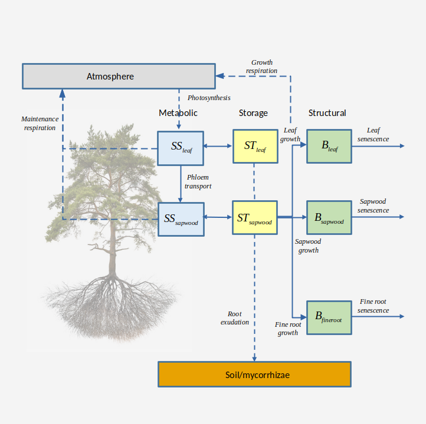

# (PART) Forest growth modelling {-}

# Forest growth model {#growthmodelling}

This chapter provides an overview of a forest growth model, which builds on the previous two models and allows simulating carbon and water balance as well as growth and mortality on a daily step basis for a given forest stand and for the period corresponding to input weather data. The model is run using function `growth()`, for a set of days, or function `growth_day()`, for a single day. 

The forest growth model can be run in two different levels of complexity, depending on the water balance submodel employed (basic and advanced, corresponding to chapters \@ref(basicwaterbalance) and \@ref(advancedwaterbalance)). In this and the following chapters, we indicate those design and formulation elements where the forest growth model building on the basic water balance differs from that building on the advanced one.

The information provided in the current chapter should be enough to understand what the growth model does, but the reading previous chapters and the following ones should provide a more detailed understanding on how the different processes are designed and formulated.

## Design principles

### Overview

Like in the preceding models, the physical structure of the stand is represented in one (vertical) dimension (i.e. the horizontal coordinates of plants are not explicit). The model is *cohort-based*, meaning that similar plant individuals are represented using a single entity with average characteristics (e.g. tree height and diameter at breast height) and a density variable is used to scale from individual level to the cohort level. Processes are perfomed either at the cohort level (water balance, photosynthesis, or plant mortality) or at the "average" individual level (carbon balance, tissue growth and senescence). Water fluxes, soil water balance and plant photosynthesis processes follow the design of the soil water balance model and will not be repeated here (see chapters \@ref(basicwaterbalance) and \@ref(advancedwaterbalance)). The growth model tries to reproduce the physiological processes that modulate leaf area changes, sapwood area changes and fine root area changes (the latter only under the advanced water balance submodel), while accounting for both source and sink limitations to tissue growth. Formation of new sapwood leads to diameter and height increases, so that physiological processes involve structural changes. Since the model does not implement all processes and drivers (such as nutrient availability) potentially affecting growth, user input parameters are used to empirically constrain growth rates and plant size, i.e. maximum relative sapwood area growth rates, maximum plant height and diameter-height ratios. The forest growth model also implements tree mortality, which reduces cohort density. A baseline mortality rate is incremented either because of exhaustion of carbon reserves (i.e. plant starvation) or dehydration of plant tissues (i.e. plant desiccation).

### Carbon compartments, transport and carbon balance

Three different *carbon compartments* are considered: **leaves**, **sapwood** (including stem, branches and coarse roots) and **fine roots**. Compartments include *carbon pools* in different forms. Carbon pools are differentiated between **structural** and **labile**. In turn, labile carbon involves **metabolic** and **storage** [@Richardson2013; @Dietze2014], with a conversion rate regulated by the need to maintain, as much as possible, an equilibrium in the amount of metabolic carbon to sustain cell metabolism and for osmotic purposes. Details of the carbon pools in different compartments are as follows (Fig. \@ref(fig:carbonpools)):

 + **Structural carbon** corresponds carbon forming cell membranes, cell walls and the cytosolic machinery (in the case of living cells). The amount of structural carbon in a given compartment is used to determine *maintenance respiration* costs (together with labile carbon), and the structural carbon per tissue unit determines *growth respiration* costs. Structural carbon occurs in the three compartments, *leaves*, *sapwood* and *fine roots*, which however have different maintenance and growth costs. Sapwood carbon includes branches, stem and coarse roots. Only live (parenchymatic) sapwood cells, accounting for between 5 and 40% of sapwood volume [@Plavcova2015], contribute to estimate sapwood maintenance respiration costs. Structural carbon is lost via tissue senescence (in the case of sapwood due to conversion to heartwood).
 + **Metabolic carbon** is a labile carbon form assumed to correspond to **sugars** (e.g., glucose or fructose) used to sustain cell functioning (i.e. provide carbon for maintenance respiration). Moreover, changes in metabolic carbon are coupled to variations in osmotic potential. Metabolic carbon occurs in leaves and sapwood compartments only. *Leaf metabolic carbon* is generated from photosynthesis or leaf starch degradation and used in different functions, including leaf maintenance respiration and export to sapwood via phloem transport. An excess of leaf metabolic carbon can inhibit photosynthesis. Sugar concentration in the phloem is assumed to be (passively) in equilibrium with leaf metabolic sugar concentration. *Sapwood metabolic carbon* comes from phloem transport, or sapwood starch degradation, and is used to directly sustain maintenance respiration of sapwood and fine roots. 
+ **Storage carbon** is a labile carbon form assumed to loosely correspond to **starch**. *Leaf storage carbon* is intended to represent short-term storage (mainly starch within chloroplasts) and its inclusion in the model follows the need to buffer daily variations in leaf metabolic carbon as well as in the corresponding leaf osmotic potential. *Sapwood storage carbon* in parenchymatic tissues of branches, stems and coarse roots conforms a much larger carbon pool and is intended to serve as carbon source for growth and long-term (seasonal and inter-annual) storage [@Plavcova2015].


```{r carbonpools, out.width='100%', fig.align="center", fig.cap="Schematic representation of carbon compartments, carbon pools and carbon balance components (translocation of reserves during senescence not included)", echo=FALSE}


```

Photosynthesis estimates come from the water balance submodel. Growth and maintenance respiration rates are calculated at the individual level, by estimating the respiration of leaves, sapwood and fine root compartments. Maintenance respiration of leaves and sapwood depends on both structural and metabolic carbon, whereas only structural carbon counts for fine root maintenance respiration because they lack labile carbon pools. Sapwood maintenance and growth respiration costs depend on sapwood area, stem height and coarse root length. Carbon balance of leaf labile (metabolic and storage) carbon is performed by considering photosynthesis, sugar-starch conversion and phloem transport. Any surplus in leaf or sapwood storage carbon is assumed to be diverted towards **root exudation**. Hence, root exudation is not a process competing for metabolic carbon, but only a consequence of plant C storage capacity being surpassed [@Prescott2020]. During leaf senescence it is assumed that non-structural carbon sources (i.e. labile carbon pools) are recycled and relocated to sapwood storage. Analogously, when sapwood is converted into heartwood, labile carbon in the protoplasm of parenchyma cells is assumed to be re-absorbed by neighboring living cells as storage.

Further design details and formulation regarding the estimation of carbon pool sizes and carbon balance components are given in chapter \@ref(carbonpoolsbalance). 


### Tissue growth, senescence and allocation

The forest growth model allows simulating the variation of leaf area, sapwood area and fine root area via the following processes:

 i. **Leaf growth**: Whereas in the water balance models expanded leaf area corresponded to the portion of live leaf area that was unfolded according to the phenological status (see \@ref(leafphenology)), in the growth model expanded leaf area results from explicit simulation of growth. However, leaf phenology submodel still controls the duration of phenophases corresponding budburst, leaf development and senescence. Leaf area growth occurs during *leaf unfolding* periods only, whereas *bud formation* periods are required to update the target leaf area (in accordance to an allocation strategy, see below). 
 ii. **Leaf senescence**: Leaf senescence (and the corresponding increases in dead leaf area) can occur in the model due to *leaf aging* in evergreen species, due to *programmed leaf senescence* in deciduous species, due to a *negative leaf metabolic carbon balance* or due to *leaf dessication* (i.e. low leaf relative water content). 
 iii. **Sapwood growth**: Formation of sapwood area can only occur if unfolded leaves are present, assuming that hormonal signals controlling cambium division are mainly synthesized within leaves. Sapwood formation is modelled as a radial file of cells issued from cambium cell divisions and which progressively undergo enlargement and maturation [@Friend2019]. Volume increases of cells in the radial file are translated into ring area increases and, after comparing them to maximum ring area increases, are ultimately translated into sapwood area increases. 
 iv. **Sapwood senescence**:  Losses in sapwood area (i.e. conversion to heartwood) can occur via tissue *aging* (i.e. assuming a daily rate of conversion) or stem *cavitation*, which also reduces the area of sapwood that is effectively functional for water transport. Similarly to 3-PG [@Landsberg1997] we assume that the relative turnover rate of sapwood is smallest for young plants, and it increases up to a maximum value. However, recent reviews indicate that heartwood formation should be viewed as an active developmental program during which a conductive but vulnerable sapwood is transformed in a non-conductive but durable heartwood [@Spicer2005].
 v. **Fine root growth**: Fine root growth can in principle occur any time of the year (i.e. the model does not explicitly consider root phenology), but since fine root biomass targets depend on leaf area, seasonal fine root area patterns will follow phenological changes in leaf area. 
 vi. **Fine root senescence**: Fine root senescence occurs via *aging* with a turnover rate depending on soil temperature. 

Formation of new leaf, sapwood and fine root tissues is determined taking into account both source (i.e. sapwood storage carbon availability) and sink (i.e. biophysical constraints on plant tissue expansion) limitations [@Fatichi2014; @Guillemot2015; @Korner2015]. Temperature and turgor sink limitations are implemented following @Cabon2019 and @Cabon2020. These authors developed their approach for tracheid production and enlargement only, whereas we apply it to different kinds of tissues. Growth controls include also the effect of detecting low levels of metabolic carbon in the stem (by default 50\% of equilibrium concentration), which allows stopping growth to use available carbon for maintenance respiration. 

Two options are possible regarding the **allocation** to leaves vs sapwood:

  1. *Stable Huber value*: In this strategy, growth of leaf area and sapwood area need are coordinated so that the ratio of leaf area to sapwood area (i.e. Huber value) is  in dynamic equilibrium around its initial value. To this aim, increases in leaf area are scheduled whenever the current Huber value is larger than the target (i.e. there is an excess of sapwood area). This approach is similar to the LPG model [@Sitch2003], where different turnover rates are applied for different tissues, but then the model tries to satisfy the pipe model [@Shinozaki1964] by allocating C where it is more limiting. Note that in this strategy the whole-plant conductance will progressively decrease with the increase in plant height, because of the increase in the length of stem xylem pathway. 
  2. *Stable whole-plant conductance*: Ratios of leaf area to sapwood area (i.e. Huber values) can vary within species, due to environmental conditions [@Mencuccini1995]. In this allocation strategy, growth of leaf area, sapwood area and height needs to be coordinated so that whole-plant conductance (i.e. from roots to leaves) is in dynamic equilibrium around its initial value. Increases in leaf area are scheduled whenever the current whole-plant conductance is above the target value. In this strategy, the Huber value will tend to increase with the increase in plant height, therefore increasing the sapwood respiratory demands. 

Pursuing a stable Huber value is the only strategy available when running the growth model along with the basic water balance submodel, but the two strategies are possible when simulating growth along with the advance water balance. Fine root area growth is only modelled when simulating growth with advance water balance. Fine root area growth is coordinated with the formation of the other tissues via the need to ensure an *average resistance fraction in the rhizosphere*, which is used to define the fine root area target and, hence, the allocation to fine roots. 

The growth rates in all three compartments are modulated by parameters specifying *maximum daily growth rates relative to the amount of sapwood area*. However, since leaf and fine root area targets are constrained by the amount of sapwood area via allocation rules, the relative growth rate for sapwood area also indirectly determines the growth rates of leaves and fine roots at seasonal and annual scales, hence determining the whole-plant growth rate. 

Further details and formulation of growth, senescence and allocation are given in chapter \@ref(growthsenescencemortality).

### Coordination between water and carbon balances {#carbonwaterlinks}

When using the advanced water balance submodel, the growth model allows coordinating several aspects of carbon and water balances through different state variables (Fig. \@ref(fig:carbonwaterlinks)):

 a. Transpiration and photosynthesis are coordinated via the *stomatal regulation* submodel (see chapter \@ref(plantphotosynthesis)).
 b. Leaf water potential of symplastic tissues determines the turgor pressure necessary for growth (\@ref(leafgrowth)), while (metabolic) sugar concentration in the leaf tissues determines changes in osmotic potential at full turgor and hence, the relative water content of symplasmic tissue.
 c. Analogously, water potential of stem symplastic tissues determines the turgor in the cambium and the sapwood formation rate (\@ref(sapwoodgrowth)), while the sugar concentration in the sapwood determines the osmotic potential at full turgor of stem symplastic tissues.
 d. Leaf growth and senescence influence hydraulic conductances of several tissues (fine roots, coarse root sapwood and stem sapwood), as they are defined on a leaf area basis (\@ref(updateplanttraits)).
 e. Sapwood growth and senescence influence hydraulic conductance of stems via changes in sapwood area, and indirectly those of coarse roots and the rhizosphere (\@ref(updateplanttraits)).
 f. Fine root biomass dynamics determines fine root distribution and rhizosphere conductance across soil layers (\@ref(updateplanttraits)).

```{r carbonwaterlinks, out.width='100%', fig.align="center", fig.cap="Schematic representation of relationships between water balance (advanced model) and carbon balance. Relationships within water or carbon balances have been omitted", echo=FALSE}
knitr::include_graphics("hydraulics_carbon_relations.png")
```


### Plant mortality

Multiple mechanisms determine plant survival or mortality under drought [@McDowell2008]. However, hydraulic failure is widely recognized as one of the key mechanisms of drought-induced mortality in woody plants. Lethal water potential have been defined as a critical threshold beyond which trees are unable to recover from drought, even after rewatering. Experimental work by @Urli2013 determined that irreversible damage in angiosperm saplings occurred only after 88\% losses in stem hydraulic conductance. Similarly, @Hammond2019 found probability of mortality to strongly increase beyond 80\% of loss in hydraulic conductivity in saplings a gymnosperm species. In a multi-species synthesis, @Adams2017 assessed found that all studied species showed at least 60\% or higher loss of xylem hydraulic conductivity, whereas evidence for carbon starvation was more common for gymnosperms. While loss of hydraulic function seems ubiquitous in drought-related mortality, not all researchers agree that hydraulic failure be the primary cause of mortality. @Korner2019 argued that hydraulic failure often correlates with a critical degree of tree dehydration and that the disruption of capillary continuum from soil to the root because of soil dehydration is more important because it forces trees to drop their leaves and rely on their own water reserves. Trees will die when the symplast surpasses its dehydration tolerance, and @Korner2019 considers xylem embolism as a byproduct rather than the cause of critical tree dehydration under severe drought, so that mechanistic models should focus on the dehydration process. Other authors have stressed the importance of the interplay between water reserves and water loss rates through cuticule after stomatal closure [@Blackman2016; @Martin-StPaul2017]. Regardless of causality, loss of hydraulic function could still be a good indicator of mortality likelihood. However, recently @Martinez-Vilalta2019 suggested use the relative water content as an indicator of mortality risk, as it integrates several aspects related to hydraulics, stomatal responses and carbon economy during drought.

Dynamic vegetation models implement mortality processes in very different ways, from purely-empirical to process-based [@Hawkes2000; @Keane2001; @Bugmann2019]. The fact that proximal causes of mortality are complex, co-occurring, interrelated and variable has prompted the question of whether a mechanistic approach will improve prediction ability [@Adams2013]. In medfate, woody plants are assumed to die at a constant basal rate due to processes not included in the model (e.g. biotic attacks). Importantly, mortality rates are assumed to increase whenever physiological thresholds presumed to lead to plant mortality are surpassed [@Hawkes2000]. The model allows plants to die from either *starvation* (if metabolic carbon is exhausted) or *dessication* (tissue dehydration) [@McDowell2008; @McDowell2011]. Allowing for starvation is important to simulate death due to shading by other plant cohorts, whereas plant dessication is important to deal with drought impacts. 

Following @Martinez-Vilalta2019, we use the relative water content (RWC) in the stem symplastic tissues as the stress variable increasing mortality likelihood under drought. Whereas the stem symplastic pressure-volume curve is always used to determine RWC from the stem water potential, in the basic water balance model the latter is assumed to be equal to the estimated plant water potential (i.e. $\Psi_{sym, stem} = \Psi_{plant}$; see \@ref(dailystressbasicwater)). Moreover, in the advanced water balance model there is no distinction between stem apoplastic and symplastic (i.e. parenchymatic) water potentials (i.e. $\Psi_{sym, stem} = \Psi_{apo, stem}$) unless plant water compartments are explicitly simulated. The critical threshold is specified in the control variable `mortalityRWCThreshold`, set to 30\% by default. Note that most studies focus on leaf RWC, for which @Kursar2009 indicate ranges between 16\% and 61\%, and @Korner2019 advocates for values around 50\%. 

We use the amount of metabolic sugar in the stem as indicator of starvation. @Martinez-Vilalta2016 found that plants can have very distinct amounts of non-structural carbon concentration but minimum seasonal values are around 46\% of maximum values. Accordingly, we define the indicator of starvation in relative terms (see control variable `mortalityRelativeSugarThreshold`, set to 30\% by default) with respect to the stem equilibrium sugar concentration. 

With respect to intra-cohort variability, the model can be run assuming that all individuals within plant cohorts are functionally equal, so that mortality applies to the entire plant cohort. Alternatively, mortality can be applied to a fraction of the plant cohort, in proportion to the mortality likelihood, which implicitly acknowledges intra-cohort differences. As common in other models, mortality process can be simulated in a deterministic or stochastic fashion.

Details of the implementation of plant mortality are given in chapter \@ref(growthsenescencemortality).

### Tree diameter, tree height and shrub cover updates

Update of stand structure is conducted once every simulated year. Tree diameter increment follows the creation of sapwood area, whereas sapwood area decreases do not affect diameter, as they imply conversion to heartwood. Tree height increments are estimated from diameter increments following diameter-height ratios that are modulated by the proportion of light available to the plant cohort, as frequently done in forest gap models [@Lindner1997]. Tree crown ratios are updated using static allometric relationships, whereas shrub height and cover are estimated from new leaf area values by inverting static leaf biomass allometries. 

Further details and formulation of structural update are given in chapter \@ref(structuralupdate).


## State variables

Many state variables are inherited by the corresponding water balance model and depend on its level of complexity (see  \@ref(statevariablesbasic) and \@ref(statevariablesadvanced)). Several *cohort-level state variables* were treated as fixed parameters in the water balance models. For each plant cohort $i$:

 + Leaf area index of live leaves, $LAI^{live}_i$.
 + Diameter at breast height for trees, $DBH_i$ (cohort average).
 + Percent cover of shrubs, $Cover_i$.
 + Plant height, $H_i$ (cohort average).
 + Crown ratio, $CR_i$.
 + The proportion of fine roots, $FRP_{i,s}$, in each soil layer $s$.
 + The radial length of coarse roots $L_{radial, i,s}$ in each soil layer $s$.
 
Additional *individual-level state variables* are needed in growth model simulations:
 
 + Sapwood area, $SA_i$ ($cm^2$).
 + Leaf area, $LA_i$ ($m^2$).
 + Fine root biomass $B_{fineroot,i,s}$ ($g\,dry$) in each soil layer $s$.
 + Sugar concentration in leaves, $SS_{leaf,i}$ ($mol\,gluc \cdot L^{-1}$).
 + Starch concentration in leaves, $ST_{leaf,i}$ ($mol\,gluc \cdot L^{-1}$).
 + Sugar concentration in sapwood (stem, branches and coarse roots), $SS_{sapwood,i}$ ($mol\,gluc \cdot L^{-1}$).
 + Starch concentration in sapwood (stem, branches and coarse roots), $ST_{sapwood,i}$ ($mol\,gluc \cdot L^{-1}$).
 
Note that $LA_i$ is the same state variable as $LAI^{live}_i$, but expressed at the individual level, because the density of individuals in the cohort does not change during the simulation. Other functional variables can be derived from the previous state variables and, hence, hence do not need to be treated as state variables themselves:

 + Leaf biomass ($B_{leaf,i}$;in $g\,dry$) from $LA_i$.
 + Sapwood biomass ($B_{sapwood,i}$; in $g\,dry$) from $SA_i$, $H_i$ and $FRP_{i,s}$ and $L_{radial,i,s}$.
 + Leaf storage volume ($V_{storage, leaf,i}$; in $L$) from $B_{leaf,i}$.
 + Sapwood storage volume ($V_{storage, sapwood,i}$; in $L$) from $SA_i$, $H_i$ and $FRP_{i,s}$ and $L_{radial,i,s}$.
 + Fine root area ($FRA_{i,s}$; in $m^2$) in each soil layer $s$, from $B_{fineroot,i,s}$.

Belowground variables (fine root biomass, fine root distribution and radial length of coarse roots) are only considered dynamic when simulating growth with advance water balance.
 
## Carbon balance

Since the growth model builds on soil and plant water balances models, the water and energy balances explained in sections \@ref(soilwaterbalance) or \@ref(waterenergybalances) (depending on `transpirationMode`) also hold for this model.

The model performs daily carbon balance of *labile carbon* in leaves and sapwood (stem, branches and coarse roots) for each plant cohort. In each of these two compartments carbon balance is performed for the two labile carbon forms, dissolved sugars (i.e. *metabolic carbon*) and starch (i.e. *storage carbon*). In the following all carbon flows (i.e. the components of right hand side of equations) are assumed to be in units of $g\,gluc \cdot day^{-1}$. At the leaf level, the carbon balance equations for dissolved sugars and starch are ($i$ subscripts omitted):

\begin{eqnarray}
\Delta{SS_{leaf}} \cdot V_{storage,leaf} &=& A - M_{leaf} - F_{phloem} - SC_{leaf} - TS_{leaf}\\
\Delta{ST_{leaf}} \cdot V_{storage,leaf} &=& SC_{leaf} - TT_{leaf} - RE_{leaf}
(\#eq:leafcarbonbalanceequations)
\end{eqnarray}
where $A$ is (gross) photosynthesis, $M_{leaf}$ is leaf maintenance respiration, $F_{phloem}$ is the sugar flow via phloem towards the stem and roots,  $SC_{leaf}$ is the conversion from leaf sugar to leaf starch, $TS_{leaf}$ and $TT_{leaf}$ are the translocation of leaf sugars and starch into sapwood storage, respectively, during leaf senescence (see \@ref(eq:sapwoodcarbonbalanceequations) below) and $RE_{leaf}$ is the root exudation of leaf carbon. 

The corresponding carbon balance equations for sapwood dissolved sugars and starch are:
\begin{eqnarray}
\Delta{SS_{sapwood}} \cdot V_{storage,sapwood} &=& F_{phloem} - M_{sapwood} - M_{fineroot}  - G_{leaf} - G_{fineroot} \\
& & - SC_{sapwood}  - TS_{sapwood} \\
\Delta{ST_{sapwood}} \cdot V_{storage,sapwood} &=& SC_{sapwood} + TS_{leaf} + TT_{leaf} + TS_{sapwood} \\
& & - G_{sapwood} - RE_{sapwood}
(\#eq:sapwoodcarbonbalanceequations)
\end{eqnarray}
where $F_{phloem}$ is the sugar inflow via phloem transport, $M_{sapwood}$ is the sum of maintenance respiration of branches, stem and coarse roots, $M_{fineroot}$ is the maintenance respiration of fine roots, $G_{leaf}$, $G_{sapwood}$ and $G_{fineroot}$ are the carbon costs of forming new leaves, sapwood or fine roots (respectively), $SC_{sapwood}$ is the conversion of sapwood sugar to sapwood starch, $TS_{sapwood}$ is the translocation of sapwood sugars into starch during leaf senescence and $RE_{sapwood}$ is the root exudation of sapwood carbon. 


If we define $S_{plant}$ as the total amount of labile carbon in the plant (in $g\,gluc$):
\begin{equation}
S_{plant} = (SS_{leaf} + ST_{leaf}) \cdot V_{storage,leaf} + (SS_{sapwood} + ST_{sapwood}) \cdot V_{storage,sapwood}
\end{equation}
then carbon balance at the plant level reduces to:
\begin{equation}
\Delta{S_{plant}} = A - M - G - RE
(\#eq:plantcarbonbalanceequation)
\end{equation}
where $M = M_{leaf} + M_{sapwood} + M_{fineroot}$ is plant-level maintenance respiration,  $G = G_{leaf} + G_{sapwood} + G_{fineroot}$ is plant-level growth costs and $RE = RE_{leaf} + RE_{sapwood}$ is plant-level root exudation.

## Process scheduling

Growth simulations are conducted in **daily** time steps. Depending on the transpiration mode (`Granier` or `Sperry`) the actual steps conducted are different (see subsections below). At the end of each year (or at the end of the simulated period) the model translates cumulative sapwood area growth into structural variables (i.e., plant height, tree DBH, tree crown ratio and shrub cover), as explained in chapter \@ref(structuralupdate). 

### Basic scheduling
For every day to be simulated, first executes soil water balance, transpiration and photosynthesis calculations by calling the basic water balance model (\@ref(basicwaterbalancescheduling)). After that, the model performs the following steps for each plant cohort:

1. Determine the amount of live structural biomass (in leaves, sapwood and fine root compartments), storage volume (in leaves and sapwood) and storage capacity (\@ref(estimationcarbonpools)). 
2. Calculate gross photosynthesis per individual ($A$), maintenance respiration for leaves ($M_{leaf}$), sapwood ($M_{sapwood}$) and fine roots ($M_{fineroot}$) (\@ref(carbonbalancecomponents)).
3. If phenology indicates leaf unfolding, evaluate leaf temperature and turgor sink limitations, growth costs ($G_{leaf}$) and leaf area increase (\@ref(leafgrowth)). 
4. If sapwood growth is permitted, evaluate sapwood temperature and turgor sink limitations, growth costs ($G_{sapwood}$) and sapwood area increase (\@ref(sapwoodgrowth)). 
5. Update changes in sugar and starch compartments due to photosynthesis, maintenance respiration and growth. Apply transfer from leaf metabolic to sapwood metabolic carbon (\@ref(phloemtransport)) and conversions between storage and metabolic carbon (\@ref(sugarstarchdynamics)).  
6. Determine leaf senescence due to carbon starvation (\@ref(leafsenescence)).
7. Determine leaf senescence due to aging or cavitation effects (\@ref(leafsenescence)). 
8. Determine sapwood area senescence by aging (\@ref(sapwoodsenescence)).
9. Evaluate labile carbon translocation due to senescence ($TS_{leaf}$, $TT_{leaf}$ and $TS_{sapwood}$), adding the resulting carbon to the starch sapwood pool.
10. Move any surplus in storage carbon to root exudation ($RE_{leaf}$ and $RE_{sapwood}$). This completes the daily carbon balance for leaf labile pools \@ref(eq:leafcarbonbalanceequations), sapwood labile pools \@ref(eq:sapwoodcarbonbalanceequations), and plant-level labile carbon \@ref(eq:plantcarbonbalanceequation).
11. Update leaf area, sapwood area, storage volumes and the concentration of labile pools. 
12. Determine if plant death by starvation or desiccation occurred (\@ref(plantmortality)).
13. Update derived variables (e.g., leaf area index and Huber value) (\@ref(updateplanttraits)).
14. If phenology indicates bud formation, update the leaf area target (\@ref(updateallocationtargets)).

### Advanced scheduling
For every day to be simulated, the model first executes soil water balance, energy balance, transpiration and photosynthesis calculations in subdaily times steps, by calling the advanced water balance model (\@ref(advancedwaterbalancescheduling)).After that, the model performs the following steps for each plant cohort:

1. Determine the amount of live structural biomass (in leaves, sapwood and fine root compartments), storage volume (in leaves and sapwood) and storage capacity (\@ref(estimationcarbonpools)). 
2. For every **subdaily** step, perform carbon balance as follows:
    a. Calculate gross photosynthesis per individual ($A$) and maintenance respiration for leaves ($M_{leaf}$), sapwood ($M_{sapwood}$) and fine roots ($M_{fineroot}$), taking into account both live structural biomass and labile sugar biomass (see \@ref(carbonbalancecomponents)).
    b. If phenology indicates leaf unfolding, evaluate temperature and turgor sink limitations for growth of leaves, estimate growth costs ($G_{leaf}$) and record leaf area increases (\@ref(leafgrowth)). 
    c. If sapwood growth is permitted, evaluate temperature and turgor sink limitations for growth of sapwood, estimate growth costs ($G_{sapwood}$) and record sapwood area increases (\@ref(sapwoodgrowth)). 
    d. Evaluate temperature and turgor sink limitations for growth of fine roots, estimate growth costs ($G_{fineroot}$) and record fine root biomass increases (\@ref(finerootgrowth)). 
    e. Evaluate phloem transport ($F_{phloem}$) and sugar-starch dynamics in the leaf and sapwood compartments **at 1s time steps** (\@ref(phloemtransport)), including photosynthesis, maintenance respiration and growth respiration as well as diversion towards root exudation if maximum leaf or sapwood starch capacity is attained ($RE_{leaf}$ and $RE_{sapwood}$). 
    f. Determine leaf senescence due to negative carbon balance (\@ref(leafsenescence)). This completes the sub-daily carbon balance for plant-level labile carbon \@ref(eq:plantcarbonbalanceequation).
4. Determine leaf senescence due to aging or cavitation effects (\@ref(leafsenescence)). 
5. Determine sapwood area senescence by aging (\@ref(sapwoodsenescence)).
6. Evaluate labile carbon translocation due to senescence ($TS_{leaf}$, $TT_{leaf}$ and $TS_{sapwood}$), adding the resulting carbon to the starch sapwood pool. This completes the daily carbon balance for leaf labile pools \@ref(eq:leafcarbonbalanceequations), sapwood labile pools \@ref(eq:sapwoodcarbonbalanceequations).
7. Apply fine root biomass growth and senescence (\@ref(finerootsenescence)).
8. Update leaf area, sapwood area, storage volumes and the concentration of labile pools. 
9. Determine if plant death by starvation or desiccation occurred (\@ref(plantmortality)).
10. Update derived variables (e.g., leaf area index, Huber values, hydraulic conductance of stems, roots and rhizosphere, osmotic potential at full turgor of leaves and sapwood) (\@ref(updateplanttraits)).
11. If phenology indicates bud formation, update the leaf area target (\@ref(updateallocationtargets)).
12. Update the fine root biomass target, according to the hydraulic conductance in the rhizosphere (\@ref(updateallocationtargets)).


## Inputs and outputs

### Soil, vegetation and meteorology

**Soil**

Soil input requirements are the same as for the basic water balance model and were fully described in section \@ref(soilinput). @Genuchten1980 water retention curves are forced for this model, because rhizosphere conductance is modelled using van Genuchten hydraulic equations (see subsection \@ref(vulnerabilitycurves)).

**Vegetation**

Vegetation input requirements were fully described in section \@ref(vegetationinput). Trees and shrubs do not need to be characterized with different variables in soil water balance calculations, since both kinds of cohort have a $LAI$ value. In most cases, users only need to estimate the leaf area index corresponding to live leaves, i.e. $LAI^{live}$, because one can assume no dead leaves in the canopy (i.e., $LAI^{dead} = 0$). Note that vegetation characteristics are modified by simulations in this model.

**Metereological input**

Weather input data must include variables calculated at the **daily** scale. The variables required by function `growth()` depend on the transpiration mode, similarly to function `spwb()`. We recommend meteorological input to be generated using package **meteoland** [@DeCaceres2018].

### Vegetation functional parameters

The growth model requires many functional parameters to be specified for plant cohorts. Some of them depend on whether the basic or advanced water balance is adopted. Here we report functional parameters needed in addition to those necessary for the water balance submodel.

A first set of parameters refers to anatomical features (`paramsAnatomy`):

| Symbol | Units | R  | Description                                  | 
|--------|-------|----| ---------------------------------------------|
| $H_{max,i}$  | $cm$ | `Hmax` | Maximum plant height |
| $H_{med,i}$  | $cm$ | `Hmed` | Median plant height |
| $1/H_{v,i}$  | $m^2 \cdot m^{-2}$ | `Al2As` | Leaf area to sapwood area ratio |
| $SLA_i$  | $m^2 \cdot kg^{-1}$ | `SLA` | Specific leaf area |
| $LW_i$   | $cm$  | `LeafWidth` | Leaf width |
| $\rho_{leaf,i}$ | $g \cdot cm^{-3}$ | `LeafDensity` | Leaf tissue density |
| $\rho_{wood,i}$ | $g \cdot cm^{-3}$ | `WoodDensity` | Wood tissue density |
| $\rho_{fineroot,i}$ | $g \cdot cm^{-3}$ | `FineRootDensity` | Fine root tissue density |
| $f_{conduits}$ | [0-1] | `conduit2sapwood` | Proportion of sapwood corresponding to xylem conduits (the remaining corresponds to parenchymatic tissues) |
| $SRL$ | $cm \cdot g^{-1}$ | `SRL` | Specific root length |
| $RLD$ | $cm \cdot cm^{-3}$ | `RLD` | Fine root length density (i.e. density of root length per soil volume) |
| $r_{6.35}$ | | `r635` | Ratio between the weight of leaves plus branches and the weight of leaves alone for branches of 6.35 mm |

A second set of parameters refers to allometric coefficients needed for structural updates (`paramsAllometries`).

| Symbol       | Units | R param       | Description                      |
|--------------|-------|---------------|----------------------------------|
| $a_{ash}$ | | `Aash` | Coefficient relating the square of shrub height with shrub area |
| $a_{bsh}$, $b_{bsh}$ | |`Absh`, `Bbsh` | Coefficients relating crown volume with dry weight of shrub individuals |
| $a_{cr}$, $b_{1cr}$, $b_{2cr}$, $b_{3cr}$, $c_{1cr}$, $c_{2cr}$ | | `B1cr`, `B2cr`, `B3cr`, `C1cr`, `C2cr` | Coefficients to calculate crown ratio of trees |
| $a_{cw}$, $b_{cw}$ | | `Acw`, `Bcw` | Regression coefficients used to calculate the crown width of trees (as intermediary step to obtain the crown ratio).|

A third set of parameters refers to growth parameters (`paramsGrowth`).

| Symbol       | Units | R param       | Description                      |
|--------------|-------|---------------|----------------------------------|
| $MR_{leaf}$ | $g\,gluc\cdot g\,dry^{-1}\cdot day^{-1}$ | `RERleaf` | Leaf respiration rate at 20 ºC |
| $MR_{sapwood}$ | $g\,gluc\cdot g\,dry^{-1}\cdot day^{-1}$ | `RERsapwood` | Living sapwood (parenchymatic tissue) respiration rate at 20 ºC |
| $MR_{fineroot}$ | $g\,gluc\cdot g\,dry^{-1}\cdot day^{-1}$ | `RERfineroot` | Fine root respiration rate at 20 ºC |
| $RGR_{leaf, max}$ | $m^2 \cdot cm^{-2} \cdot day^{-1}$| `RGRleafmax` | Maximum leaf area daily growth rate, relative to sapwood area |
| $RGR_{sapwood, max}$ | $cm^2 \cdot cm^{-2} \cdot day^{-1}$| `RGRsapwoodmax` | Maximum daily sapwood relative growth rate (in sapwood area basis) |
| $RGR_{fineroot, max}$ | $g\,dry \cdot g\,dry^{-1} \cdot day^{-1}$| `RGRfinerootmax` | Maximum daily fine root relative growth rate |
| $f_{HD,min}$ | $cm \cdot cm^{-1}$ | `fHDmin` | Minimum height-to-diameter ratio |
| $f_{HD,max}$ | $cm \cdot cm^{-1}$ | `fHDmax` | Maximum height-to-diameter ratio |

Vegetation functional attributes are normally filled for each cohort by function `growthInput()` or `forest2growthInput()` from species identity. However, different parameters can be specified for different cohorts of the same species if desired (see section \@ref(functionaltraits)). 

### Control parameters {#forestgrowthcontrol}

Control parameters modulate the overall behaviour of growth simulations (see section \@ref(controlparameters)). Parameters controlling water balance have been already described in sections \@ref(basicwaterbalancecontrol) and \@ref(advancedwaterbalancecontrol). Here we only mention those control parameters specific to the `growth()` function. 

First, there are flags that regulate the application of processes:

+ `allowDessication [=TRUE]`: Boolean flag to indicate that mortality by dessication is allowed.
+ `allowStarvation [=TRUE]`: Boolean flag to indicate that mortality by starvation is allowed.
+ `allowDefoliation [=TRUE]`: Boolean flag to indicate that complete drought-driven defoliation is allowed.
+ `sinkLimitation [=TRUE]`: Boolean flag to indicate that temperature and turgor limitations to growth are applied.
+ `shrubDynamics [= FALSE]`: Boolean flag to allow the application of demographic processes to shrubs.
+ `nonStomatalPhotosynthesisLimitation  [=TRUE]`: A flag to apply limitations of photosynthesis when leaf sugar levels become too high (only for `transpirationMode = "Sperry"`).

An important parameter concerns the allocation strategy: 

+ `allocationStrategy  [="Plant_kmax"]` defines the allocation strategy (investment in leaf area vs. sapwood area) of the growth model. If `allocationStrategy = "Plant_kmax"` then the target leaf area is set to maintain the input whole-plant maximum conductance. If `allocationStrategy = "Al2As"` then the target leaf area is set to maintain the input Huber value.

A number of control parameters regulate carbon balance:

+ `phloemConductanceFactor [= 0.2]`: Factor to transform stem xylem conductance to phloem conductance (only for `transpirationMode = "Sperry"`).
+ `nonSugarConcentration [=0.25]`: A constant specifying non-sugar (inorganic) solute concentration ($mol \cdot L^{-1}$) in cells.
+ `equilibriumOsmoticConcentration [= c(leaf = 0.8, sapwood = 0.6)]`: Equilibrium osmotic concentrations ($mol \cdot L^{-1}$) for leaf and sapwood cells. The difference between leaf and sapwood values helps maintaining phloem transport. The equilibrium sugar concentration is found using `equilibriumOsmoticConcentration - nonSugarConcentration` and defaults to `[= c(leaf = 0.55, sapwood = 0.35)]`.
+ `minimumRelativeSugarForGrowth [= 0.25]`: Minimum concentration of metabolic sugar relative to equilibrium sugar concentration for growth to occur in different tissues. This value (by default 50\%) should always be larger than `mortalityRelativeSugarThreshold [= 0.3]`, so that growth stops before starvation, and smaller than 1 (i.e. 100\%), so that growth occurs under normal metabolic status. 
+ `respirationRates [= c(leaf = 0.00260274, sapwood = 6.849315e-05, fineroot = 0.002054795)]`: Maintenance respiration rates for different tissues (in $g\,gluc \cdot g\, dry^{-1} · day^{-1}$). These are default values used when maintenance respiration rates are not specified via species-specific `SpParams`.
+ `turnoverRates [= c(sapwood = 0.0001261398, fineroot = 0.001897231)]`: Relative turnover rates ($day^{-1}$) for sapwood and fine roots. Default are equivalent to 4.5% and 50% annual turnover for sapwood and fine roots, respectively. Leaf turnover rates depend on leaf lifespan (i.e. leaf duration) for evergreen species.
+ `constructionCosts [= c(leaf = 1.5, sapwood = 1.47, fineroot = 1.30)]`: Construction costs, including respiration and structural carbon, per dry weight of new tissue ($g\,gluc \cdot g\,dry^{-1}$).
+ `maximumRelativeGrowthRates [= c(leaf = 0.01, sapwood = 0.001, fineroot = 0.1)]`: Maximum leaf growth rate relative to sapwood area ($m^{2}\cdot cm^{-2} \cdot day^{-1}$), maximum sapwood relative growth rate ($cm^{2}\cdot cm^{-2} \cdot day^{-1}$) and maximum fine root growth rate relative to sapwood area ($g\,dry \cdot g\,dry^{-1} \cdot day^{-1}$). These are default values used when relative growth rates are not specified via species-specific `SpParams`.

Finally, we have the following options regarding mortality:

+ `mortalityMode [= "density/deterministic"]`: String describing how mortality is applied. Current accepted values are combinations of `"cohort"` vs `"density"` (for whole-cohort mortality vs reduction of stem density) and `"deterministic"` vs. `"stochastic"`.
+ `mortalityBaselineRate [= 0.01]`: Deterministic proportion or probability specifying the baseline reduction of cohort's density occurring in a year (for `mortalityMode = "density/deterministic"` or `"density/stochastic"`).
+ `mortalityRelativeSugarThreshold [= 0.3]`: Threshold of stem sugar concentration relative to equilibrium values (by default 30\%), resulting in an increased mortality rate/probability whenever levels are below.
+ `mortalityRWCThreshold [= 0.3]`: Threshold of stem relative water content resulting in increased mortality rate/probability whenever levels are below.


### Model output {#forestgrowthoutput}

#### Daily output

Function `growth` returns a list object with the following elements:

| Element | Description                                                |
|---------|------------------------------------------------------------|
| `WaterBalance`| Climatic input and water balance flows (i.e. net precipitation, infiltration, runoff, transpiration...). All of them in $mm = L \cdot m^{-2}$. |
| `EnergyBalance` | Energy balance components (instantaneous values) for the soil and the canopy |
| `Temperature` | Minimum and maximum temperature values for topsoil, canopy and atmosphere |
| `Soil`| Soil variables for each soil layer: Moisture relative to field capacity ($W_s$), water potential ($\Psi_s$) and volumetric water content ($V_s$). |
| `Stand`| Stand-level variables, such as $LAI^{\phi}_{stand} = LAI^{live}_{stand}$, $LAI^{dead}_{stand}$, the water retention capacity of the canopy ($S_{canopy}$) or the fraction of light reaching the ground ($L^{PAR}_{ground}$ and $L^{SWR}_{ground}$).|
| `Plants`| Plant-level variables, such as $LAI^{phi}_i$, plant transpiration, plant water potential, etc. |
| `SunlitLeaves` | Leaf-level output variables for sunlit leaves (`transpirationMode = "Sperry"`). |
| `ShadeLeaves` | Leaf-level output variables for shade leaves (`transpirationMode = "Sperry"`). |
| `PlantCarbonBalance`| A list with the daily results of carbon balance components and carbon pools. |
| `PlantStructure`| A list with daily results of plant compartment sizes, in terms of area and biomass. |
| `PlantGrowth`| A list with daily results of growth rates for leaf, sapwood and fine roots. |


Elements `WaterBalance` to `ShadeLeaves` are equal to the output of function `spwb` and were described in previous chapters (see \@ref(basicwaterbalanceoutput) and \@ref(advancedwaterbalanceoutput)). 

The following table describes the child elements of `PlantCarbonBalance`, each of them a data frame with dates in rows and plant cohorts in columns:

| Element | Symbol | Units | Description                               |
|---------|--------|-------|-------------------------------------------|
| `GrossPhotosynthesis`|$A_{i}/B_{i}$ | $g\,gluc \cdot g\,dry^{-1} \cdot day^{-1}$ | Daily gross photosynthesis per dry weight of living biomass. |
| `MaintentanceRespiration`|$M_{i}/B_{i}$ | $g\,gluc \cdot g\,dry^{-1} \cdot day^{-1}$ | Daily maintenance respiration (including leaves, sapwood and fine roots) per dry weight of living biomass. |
| `GrowthCosts`|$G_{i}/B_{i}$ | $g\,gluc \cdot g\,dry^{-1} \cdot day^{-1}$ | Daily growth costs  (including leaves, sapwood and fine roots) per dry weight of living biomass. |
| `RootExudation`|$RE_{i}$ | $g\,gluc \cdot g\,dry^{-1} \cdot day^{-1}$ | Daily root exudation per dry weight of living biomass. |
| `CarbonBalance`|$\Delta S_{i}/B_{i}$ | $g\,gluc \cdot g\,dry^{-1}$ | Daily plant carbon balance (eq. \@ref(eq:plantcarbonbalanceequation)) per dry weight of living biomass. |
| `SugarLeaf`|$SS_{leaf,i}$ | $mol\,gluc \cdot L^{-1}$ | Sugar concentration in leaves. |
| `StarchLeaf`|$ST_{leaf,i}$ | $mol\,gluc \cdot L^{-1}$ | Starch concentration in leaves. |
| `SugarSapwood`|$SS_{sapwood,i}$ | $mol\,gluc \cdot L^{-1}$ | Sugar concentration in sapwood. |
| `StarchSapwood`|$ST_{sapwood,i}$ | $mol\,gluc \cdot L^{-1}$ | Starch concentration in sapwood. |
| `SugarTransport`| $F_{phloem}$| $mol\,gluc \cdot s^{-1}$ | Average instantaneous rate of carbon transferred between leaves and stem compartments via phloem. |
| `LeafPI0`|$\pi_{0,leaf,i}$ | $MPa$ | Osmotic potential at full turgor of symplastic leaf tissue. |
| `StemPI0`|$\pi_{0,stem,i}$ | $MPa$ | Osmotic potential at full turgor of symplastic stem tissue. |


The following table describes the child elements of `PlantStructure`, again each of them a data frame with dates in rows and plant cohorts in columns:

| Element | Symbol | Units | Description                               |
|---------|--------|-------|-------------------------------------------|
| `LeafArea`|$LA_{i}$ | $m^{2}$ | Daily amount of leaf area for an average individual. |
| `SapwoodArea`|$SA_{i}$ | $cm^{2}$ | Daily amount of sapwood area for an average individual. |
| `FineRootArea`|$FRA_{i}$ | $m^{2}$ | Daily amount of fine root area for an average individual. |
| `LeafBiomass`|$B_{leaf,i}$ | $g\,dry \cdot ind^{-1}$ | Daily leaf biomass for an average individual. |
| `SapwoodBiomass`|$B_{sapwood, i}$ | $g\,dry \cdot ind^{-1}$ | Daily sapwood biomass for an average individual. |
| `FineRootBiomass`|$B_{fineroot,i}$ | $g\,dry \cdot ind^{-1}$ | Daily fine root biomass for an average individual. |
| `LabileBiomass`|$B_{sugar,i}+B_{starch,i}$ | $g\,dry \cdot ind^{-1}$ | Daily labile carbon biomass for an average individual. |
| `TotalLivingBiomass`|$B_{total,i}$ | $g\,dry \cdot ind^{-1}$ | Daily total living biomass for an average individual. |


The following table describes the child elements of `PlantGrowth`, again each of them a data frame with dates in rows and plant cohorts in columns:

| Element | Symbol | Units | Description                               |
|---------|--------|-------|-------------------------------------------|
| `LAgrowth`|$\Delta LA_{i}/SA_i$ | $m^{2}\cdot cm^{-2} \cdot day^{-1}$ | Leaf area growth relative to sapwood area for an average individual. |
| `SAgrowth`|$\Delta SA_{i}/SA_i$ | $cm^{2}\cdot cm^{-2} \cdot day^{-1}$ | Leaf area growth relative to sapwood area for an average individual. |
| `FRAgrowth`|$\Delta FRA_{i}/SA_i$ | $m^{2}\cdot cm^{-2} \cdot day^{-1}$ | Fine root area growth relative to sapwood area for an average individual (only for `transpirationMode = "Sperry"`). |

#### Subdaily output

As with function `spwb()`, subdaily output can also be generated with function `growth()`. This is done via setting  `subdailyResults = TRUE` in the control parameter list. In that case, the output list of `growth()` will include an element `subdaily`, whose subelements correspond to the results of `growth_day()` for each date simulated. Refer to the documentation of functions `growth_day()` for details of subdaily output.

## Applications

We believe the model is suited to study variations of plant growth derived from environmental conditions and competition for light and water.