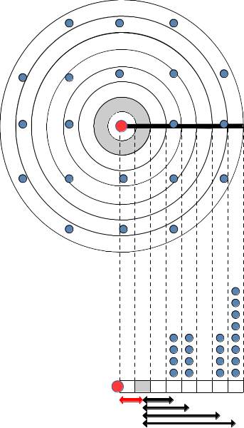

# Seed dispersal {#seeddispersal}

This chapter describes the seed dispersal sub-model implemented in functions `fordyn_scenario()` and `fordyn_land()` of package **medfateland** (Fig. \@ref(fig:designmedfateland)). 

## Design principles

Given their sessile lifestyle, dispersal is the only process through which plants can spread in a landscape. Different parts of plants can be dispersed (seeds, fruits, branches or even the entire plant), but here it is assumed that seeds are the dispersed elements. Mathematically, dispersal can be addressed via process-based models (e.g. @nathan_field_2001). However, it is more commonly addressed via empirical dispersal kernels, which describe the statistical distribution of dispersal distances in a population [@clobert_dispersal_2012]. More specifically, the dispersal kernel is a probability density function describing the distribution of post-dispersal locations relative to a source point. While many different equations can be used and compared to describe dispersal [@clobert_dispersal_2012], here we focus on the exponential power kernel proposed by Clark et al. [-@clark_stages_1998], which has shown a good performance compared to other kernels [@bullock_synthesis_2017] and has been used for other dynamic vegetation models [@snell_simulating_2014].

When implementing a dispersal kernel in a dynamic forest simulation model, an important issue to overcome is the fact that forest stands in the target landscape are often separated by distances that are larger (e.g. 500 m, 1 km or even more) than the average area that they represent (normally forest plots have a radius between 10 and 25 m). This entails that there is a uncertainty in the model regarding the presence of seed sources from forest stands at distances between the two scales. In other words, the model does not know whether there are forest patches that can act as seed sources, between a given target forest stand and its nearest neighbors (Fig. \@ref(fig:seeddispersal)). Ignoring this fact can lead to underestimating colonization. We address this issue by considering that seed sources from unavailable forest stands can be estimated from the set of stands that are represented in the data set, using weights inverse to their distance to the location of the unavailable stand. This is illustrated in Fig. \@ref(fig:seeddispersal) below with the area with unavailable stands in grey and distances represented using red and black arrows:

```{r seeddispersal, out.width='50%', fig.align="center", fig.cap="Example of sparse forest stand distribution and how to deal with dispersal in this situation. The target stand where seed rain is to be determined is represented using a red dot. Blue dots are the remaining forest stands. The upper figure shows the spatial distribution of stands, whereas the figure below represents the number of stands per distance classes. In both cases, grey is used to identify an area with unavailable data.", echo=FALSE}


```

## Process scheduling

Seed dispersal is considered once a year. Process scheduling in the dispersal sub-model is rather straightforward:

1. Mortality of seeds in first performed for all stands (see \@ref(seedbankdynamics)).
2. Seed production is simulated in all stands with woody vegetation (see \@ref(seedbankdynamics)).
3. For each target forest stand, seed dispersal (including local seed rain) is simulated, leading to a replenishment of its seed bank (see next section).

## Process details

The exponential power kernel depends on species-specific parameters $Disp_{dist}$ and $Disp_{shape}$ and is calculated for a given distance $r$ using [@clark_stages_1998]:
\begin{equation}
f(r) = \frac{1}{N} \cdot \exp \left[ - \left( \frac{r}{Disp_{dist}} \right)^{Disp_{shape}} \right]
\end{equation}
where $N$ is the normalizing constant:
\begin{equation}
N = \frac{2\cdot \pi  \cdot Disp_{dist}^2 \cdot \Gamma(2/Disp_{shape})}{Disp_{shape}}
\end{equation}
and $\Gamma()$ is the Gamma function.